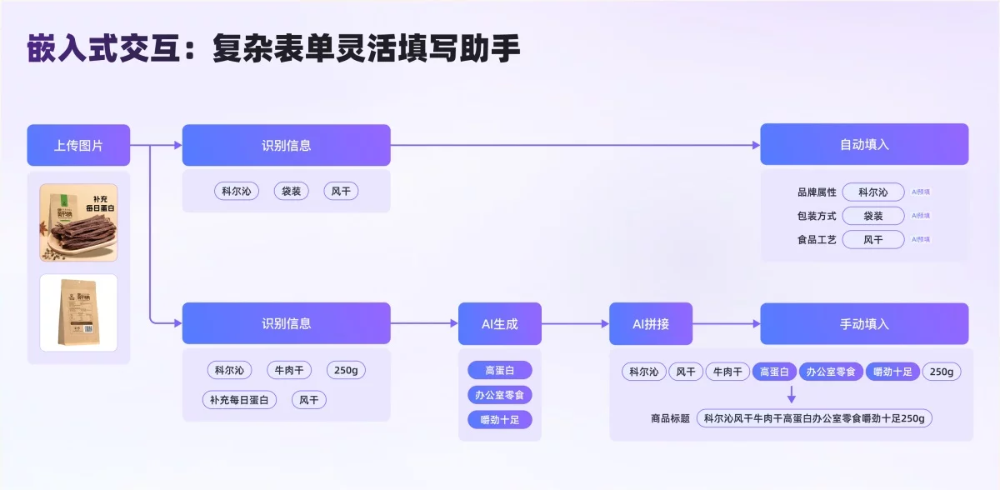

**1. 嵌入式交互：复杂表单灵活填写助手**

1. 填充识别类：这类信息规则明确，AI 通过识别提取关键信息可输出稳定可靠的标准答案。这种情况我们采用系统自动填入，并配合“AI 预填”标签提示状态。例如商品属性字段，AI 通过商家上传的商品包装图识别出“风干”“盒装”信息自动填入食品工艺/包装方式模块 ，同时展示标签提示商家检查确认。这种设计通过自动化替代商家手动录入，最大化缩短填写时间。
2. 推荐优化类：这类信息需要在现有素材基础上借助 AI 能力让其更加有购买吸引力，例如商品主图、商品标题。因为此类信息有 AI 创造的内容，担心不符合商家预期，所以流程上我们主动提供结果但不预先填入，支持商家调优结果，最终符合意愿时商家可手动填入。这种较为灵活的[交互设计](https://www.uisdc.com/tag/%e4%ba%a4%e4%ba%92%e8%ae%be%e8%ae%a1)能满足不同商家需求，同时降低人工审核时长。