## B端体验深耕-洞察用户诉求，打造心有灵犀的使用体验

京东体验设计中心 2024年11月28日 08:45 北京

以下文章来源于JDTDA，作者Digital Efficacy

## JDTDA

京东科技设计联盟，我们会不定期的发布一些在工作中的经验沉淀、产品体验设计、视...

## 洞察用户需求打造「心有灵犀」的使用体验

B端体验深耕 | DEDC 出品

## 前言

我们常以“心有灵犀”来形容与合作伙伴的默契配合，若我们的产品能与用户达到同样的默契，将极大地提升用户在任务旅程中的流畅体验。

在B端体验设计领域，我们深知用户对我们产品的期待——快速完成任务、即用即走。然而，随着业务需求和产品功能的不断扩展，流程复杂化、功能冗余、信息过载和引导不足等问题逐渐浮现，这不仅增加了新用户的学习成本，也使得老用户丧失了使用产品时的专注和效率。

为应对这些挑战，在早期版本升级时我们提出了“高效、亲和”的设计理念（《京东行云3.0 | B端产研协作工具体验升级的思考与实践》），并致力于通过设计手段减少用户在使用产品时的学习成本和操作负担，旨在打造一个流畅、愉悦的体验环境，让用户每次使用都能保持轻松愉悦的工作状态。

同时，我们也积极践行集团倡导的“简单、顺滑、激发”产品设计理念，通过在交互设计、业务组件等多个层面进行来深入优化和改进，以达到产品与用户之间的"心有灵犀"，让用户在使用过程中更加的得心应手、更加快速高效的触达并完成任务。

## 一 探索顺滑、高效的交互模式

通常来说一个顺滑的交互对产品的体验提升的是非常大的，它允许用户以直观的方式理解产品的操作含义，在不依赖帮助文档的情况下，也能轻松完成各项任务。这种设计理念不仅提升了用户体验，也确保了产品的高效率和便捷性，能够使用户迅速投入并快速完成工作，实现了真正的“即用即走”。

## (1) 数字键盘，让数据录入更简单、更高效

相信很多产品设计人员都清楚选择录入的优势远大于手动录入。在此之前，我们的工时填报页面，由于可输入信息精确到小数点后两位，所以我们常用的计步器、选择器、滑动输入等组件都无法在这里使用。对用户而言，手动逐项录入数据的操作成本非常高。

在业务改版时，我们的体验设计师了解到旧版页面信息录入成本过高的问题，于是提出了数字键盘录入数据的方案「用户在原本手动录入数据的基础上，增加选择录入数据的能力，以此降低用户录入数据的操作负担」。

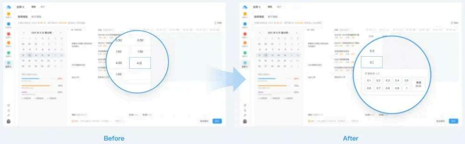

作为数据录入的组件，数字键盘适用于简短且整数的特殊场景下，如：数字录入、百分比录入。备选的数据信息以宫格布局呈现，用户可以快速点击数字键盘中需要填入的数字。相比下拉菜单和上下箭头数字输入框相比，更直观，易用性更强。

对于擅长键盘盲打的研发工程师类角色来说，仍然可以通过物理键盘录入数据；而对于不太熟练操作键盘的大多数用户来说，可以通过直观的数字键盘点选录入数据。数字键盘组件甚至还能帮助用户自动计算已填数据，实现一键补全。

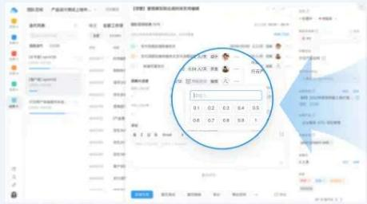

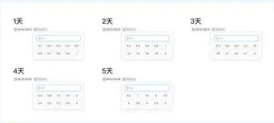

键盘组件增加手动输入能力，以及备选选项也可以根据用户输入的前置条件进行自动换算

- 数字键盘作为一种兼具选择录入便捷性和手动输入灵活性的数据录入组件，为不同类型的用户提供了高效、准确的数据录入体验，不仅提升了数据输入的便捷性和准确性，而且通过适应不同用户的操作习惯，增强了产品的普适性和用户满意度。继而我们也将数字键盘组件在其他使用场景进行了拓展，比如，其他场景下数字键盘上集成了手动录入的输入框，备选数据可以根据用户设置的起止日期进行自动计算，不仅帮助用户减轻了操作难度也极大节省了用户的时间成本。

数字键盘经过不断的拓展与优化，已经成为用户在多种场景下进行数据录入的利器。在未来，我们将持续关注并探索数据录入交互方式的优化与改进，致力于进一步优化信息录入的体验，如当下火爆的AI，来实现更加智能和自动化的输入解决方案，从而最大程度上让用户与产品交互默契、事半功倍。

## (2) 在关键节点设置任务提示卡，给予用户即时指引

很多大型B端产品的详情页在成熟期后都会面临信息内容多、分类复杂的问题，这导致用户需要滚动多屏或者切换tab页签去查找信息，即便产品设计团队已经花了不少心血将信息布局做了优化和重组，但也难以避免有些用户查找关键信息费时费力，不清楚应该在页面哪一块进行哪些操作。虽然IM、邮件等工具可以一定程度上解决信息的触达，但用户从其他平台点击网址链接跳转到产品详情页后依然会面临缺少明确的指引问题。

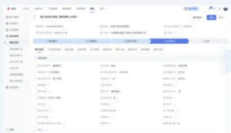

Before

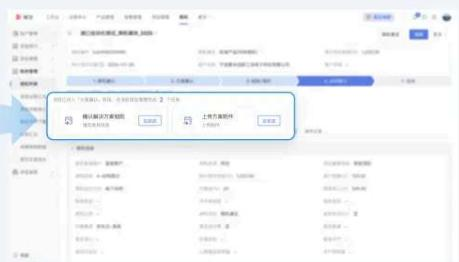

After

针对以上用户使用中的痛点，我们在页面中关键区域设置了一系列操作指引性的任务提示卡片，并在卡片上设置明确的引导文案及操作按钮，以减少用户因不熟悉产品功能或者页面信息过多而找不到操作入口的问题；引导用户点击“去完成”、“去操作”等操作按钮直接跳转至应该操作内容模块或相应页面去完成应该完成的操作，这样就使得不同用户在不同环节完成相应的任务，保证流程顺畅的走下去。

我们将传统的卡片视图优化为列表视图，并支持多个操作项，实现了用户所见即所得的直观体验。

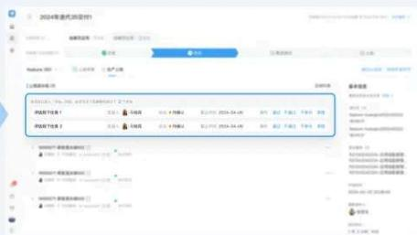

任务提示卡作为一类高效的即时指引工具，已在多个用户使用场景下发挥了关键作用，不仅帮助用户提升了完成任务的效率，也在一定程度上缓解了用户的焦虑。该组件的设计初衷是为了解决当用户面对复杂或不熟悉的操作时，为了用户提供即时的指引。在不同系统平台的适配过程中，我们特别注重交互模式的灵活性和适应性，以适应不同的适用场景。例如，我们将传统的卡片视图优化为列表视图，并支持多个操作项，实现了用户所见即所得的直观体验。

经过在多种场景下的实践验证，任务提示卡已成为缓解用户焦虑的一种手段。我们也认识到，用户焦虑直接影响到产品的可用性和用户满意度。因此，我们会持续关注用户焦虑产生的根源，不断调整和优化我们的设计策略，有目的有效率的降低用户焦虑水平。

## (3) 巧用浮层卡片，减少非必要的页面跳转

提到「链路」，相信很设计师都能想到缩短流程、简化操作步骤等手段。然而，随着业务的复杂度提升，我们的很多使用流程变得越来越长，用户仅仅查看或者编辑一个简单的信息也需要打开新页面，这无疑增加了用户的操作成本。

在诸多项目实践中，我们发现浮层卡片是一个非常灵活的组件，它可以在用户需要时通过鼠标悬停即可展开，用户可以不用跳转或打开新页面就可以在浮层卡片中完成一些关键信息的查看或者编辑。这种交互模式不仅可以减少用户的操作步骤，还减少了产品链路和开发成本，在提升体验的同时也更好的效能业务。

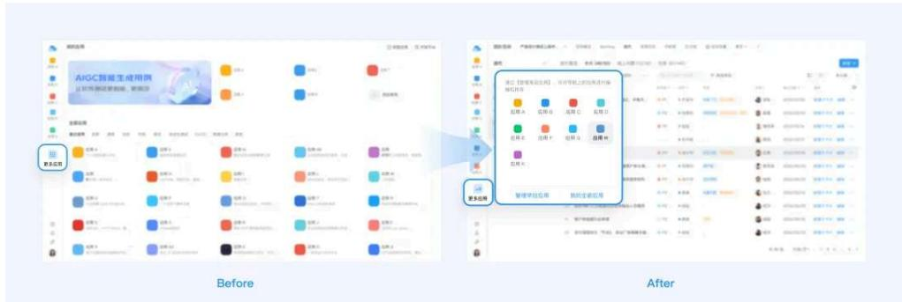

在我们的平台上，一些用户虽然可以将自己经常使用的应用常驻到菜单栏上，但是受限于屏幕尺寸左侧的菜单栏不能显示太多常驻应用。

- 当用户在切换一个常驻但因为屏幕尺寸而没有展示在菜单栏上的应用时，需要先点击更多【应用图标】进入更多页面。

■ 再定位到需要切换的应用图标上进行点击才能完成整个【切换】的流程。

- 当我们洞察到用户使用菜单栏的痛点后，在后续的迭代优化时。在更多应用的图标上增加一个悬浮事件。

■ 鼠标悬浮时，它就像一个传送门一样将用户需要切换的应用呈现在浮层卡片上，用户点击所需的应用即可完成应用的切换。

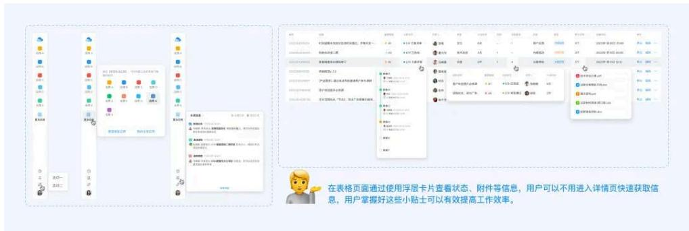

【浮层卡片】作为一种灵活、高效的交互模式，在业务侧得到能够有效降低用户重复操作的验证后，我们把它拓展到了很多的相似场景里。

■ 比如，在消息通知面板交互上我们也采用了【浮层卡片】的交互模式，用户既可以点击去查看全部消息也可通过鼠标悬浮快捷唤出【浮层卡片】查看最新消息。

■ 在表格页面通过使用【浮层卡片】查看状态、附件等信息，用户可以不用进入详情页快速获取信息，用户掌握好这些小贴士可以有效提高工作效率。

经过多场景的实践，我们团队已将浮层卡片精炼为一种有效缩短用户使用流程的交互模式，显著提升了用户操作效率。也被我们拓展到更多场景，以实现在更广泛的应用维度上为用户提效。

## 二 创新业务组件设计，提升复杂场景下的数据可视化体验

随着业务的不断下钻，不免会遇到一些复杂的使用场景，基础的交互和组件已不能有效的解决用户在使用中的问题。在一些既需要关注结构化的概览数据又要方便查看详细数据的场景中，以及在一些数据关联、任务串联等场景中，设计侧通过可视化、结构化等设计手段探索出了一些新的业务组件，解决了数据概览、数据关联不清晰等问题，为用户构建了直观、易懂的使用体验。

## (1) 信息概览与Tab标签页相遇，概览&详情均可兼得

在一些管理场景下会涉及到既需要查看各阶段下不同状态的概览数据，又需要查看详细数据的场景。按照以往的交互，用户可以用筛选器筛选出各阶段下不同状态数据再进行查看对比，虽然筛选器可以筛选出这些多阶段、多状态的数据，但存在着筛选步骤繁琐、多阶段&多状态的数据呈现都是棘手问题。

我们最初使用了数据可视化的看板来呈现各阶段下不同状态的概览信息，但这只解决了数据概览的问题，用户还是需要点击“详情”才能跳转至相应的页面。

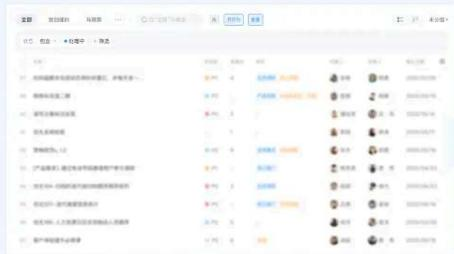

Before

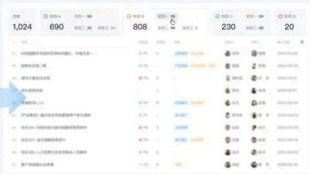

After

■ 体验设计师在一些项目中尝试了将数据可视化看板与Tab标签页的融合，这就形成了具有Tab切换功能的数据看板，用户在查看概览数据的同时也可以通过点击切换查看各阶段/状态下的详细数据。

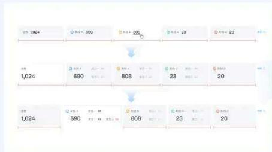

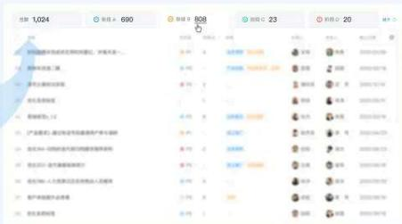

■ 在经过用户反馈和不同业务场景下的适配后，我们又针对小屏增加了折叠功能、折叠后状态数据隐藏、宽度不够时状态数据隐藏等优化。

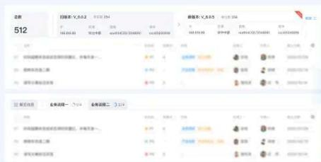

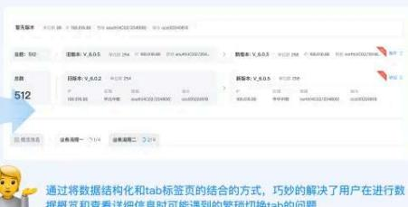

通过将数据结构化和tab标签页的结合的方式，巧妙的解决了用户在进行数据概览和查看详细信息时可能遇到的繁琐切换tab的问题

- 以上数据看板与tab页签融合的方案，一方面解决了数据可视化的问题，另一方面也解决了切换查看详情数据的繁琐操作。在明确了以上组件的价值点后，将其进行延展并应用到了一些具有共性的使用场景中。

通过将数据结构化和tab标签页的结合的方式，巧妙的解决了用户在进行数据概览和查看详细信息时可能遇到的繁琐操作问题。这种模式不仅让页面信息结构更加清晰，用户无需跳转，即可在当前页面内，快速的查看概览及详情页信息。

## (2) 树形连接线新范式，数据关系呈现简单明了

针对CICD等技术类产品中的存在的诸多数据关联、任务串联等复杂数据关系的难点，设计侧巧妙的使用树形连接线的可视化手段解决数据关联不清晰的问题，让信息结构更易懂，方便用户理解和操作。

在我们的版本管理模块中，用户在需求规划阶段需要将交付的需求和开发分支进行关联，一个需求不仅可以与多个开发分支进行关联、多个需求也可以与多个应用进行关联。这里的不仅要解决复杂的关联关系，还要解决需求与开发分支可增删的操作难点。

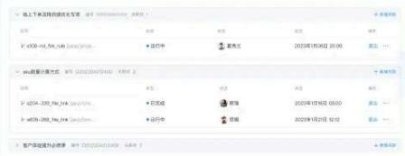

Before

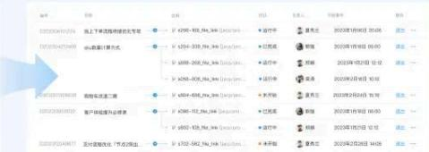

After

针对这样的复杂多维使用场景，我们在设计时借鉴了树形连接线来解决需求与开发分支的复杂关联关系，通过树形连接线将需求与开发分支进行串联，让复杂的关联关系一目了然。在解决了复杂的关联的同时，在连接线上增加了「新增」及在表格操作列增加了「操作列」的操作来解决编辑等扩展问题。

树形连接线作为一种解决数据可视化的手段有效解决了业务中的难点，同样设计团队也将其拓展到了更多适用场景，帮助用户提升信息查看和操作效率。

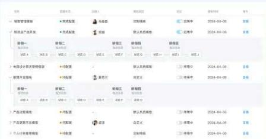

树形连接线作为解决数据可视化的手段有效解决了业务中的难点，例如在嵌套表格、OKR等场景下，树形连接线可以让用户更直观的获取信息

■ 在处理嵌套表格时，树形连接线的使用极大增强了单元格与嵌套层之间的视觉关联。

在OKR系统中，树形连接线的应用使目标和任务之间的从属关系更加明晰。此外，还为卡片在折叠状态下提供了展开后可查看更多信息的视觉引导。

通过以上创新应用，树形连接线已成为提升数据可视化和用户交互效率的重要设计元素。设计团队将继续探索其在不同业务场景下的应用潜力，以进一步优化用户的信息读取和决策过程。

以上两组业务组件的设计思路充分体现了设计师对用户诉求的深入洞察，并在设计上做出了突破。设计师在对用户场景深入分析后，巧妙地将现有组件的优势与用户场景相结合，创造出了一系列新的业务组件，这些业务组件不仅解决了一系列共性问题，也为未来的业务组件设计提供了新的可能性。

## 三 制定可持续的体验改进策略

以上几个是我们通过洞察用户诉求，依靠设计手段改善用户体验的典型案例。想要持续而又高效的提升产品的用户体验，仅凭零星的创意是不够的，还需制定一套有效的设计策略，这套策略旨在培养设计团队成员的创新意识和体验思维能力，使设计团队能够持续产出高质量的用户体验解决方案。

## (1) 培养宏观视角

设计师理解需求时需从全局视角审视业务需求、产品目标和用户诉求，深入洞察产品体验旅程中的所有关键触点，避免陷入只见树木不见森林的误区。通过多元的视角辅助我们了解用户行为背后的真实动机，从而提出更有效的解决方案。

## (2) 鼓励尝试更多可能

在项目中，我们鼓励设计师在满足产品和业务需求的基础上，打开思维的边界去探索更多可能性。无论是对用户的理解还是设计方向的探索，我们支持设计师不断自问，给予他们尝试更多可能性的资源支持，以促使设计师们产出无懈可击的解决方案。

## (3) 理解用户对变化的抗拒心理

在B端产品中，用户对比较大的变化会产生抵触心理，从心理学上来讲：大家更喜欢保持现有的、已熟悉的行为模式和习惯。如果出现一些改进比较大的优化方案上线后，用户并不一定都是照单全收，极端情形下还会出现用户要求代码回滚的情况。因此，我们在设计时不仅要解决业务需求，还要考虑用户的学习成本和对变化的接受程度。必要时，需通过强化运营和落地最佳实践，让用户意识到改变后的优势和收益来提升心理上的接受度。

## (4) 沉淀与复用优秀设计方案

我们会定期复盘并将在项目实践中已经被验证的优秀、通用性高的方案（包括但不限于交互、视觉、业务组件等）定期汇总到设计组件库以及模板库中。通过评估这些方案的价值点和适用场景，设计师可以将这些经过验证的方案作为备选，复用和延展到未来的项目中，为更多业务、更多产品赋能。

## 四 写在最后

落地简单、顺滑、激发的产品设计理念，我们不求一蹴而就，而是有意识的去关注用户的问题，持续不断的优化和改进，用心对待每次微小的改进，积少成多，最终会实现产品与用户之间的“心有灵犀”。希望以上分享能给从事在B端体验设计伙伴们带来一些新思路、新思考。优化、改进的途径有很多种，我们愿意将此次分享称为抛砖引玉，更多还是需要我们深入到业务中，与产研同学协作一起产出更优秀的解决方案。

伸出你可爱的手指给我们点个赞和在看呗

如果能分享就更好了