# 以商家意图为中心的AI千牛设计探索

原创 商家AI设计 淘宝设计 2026年1月29日 15:52 浙江

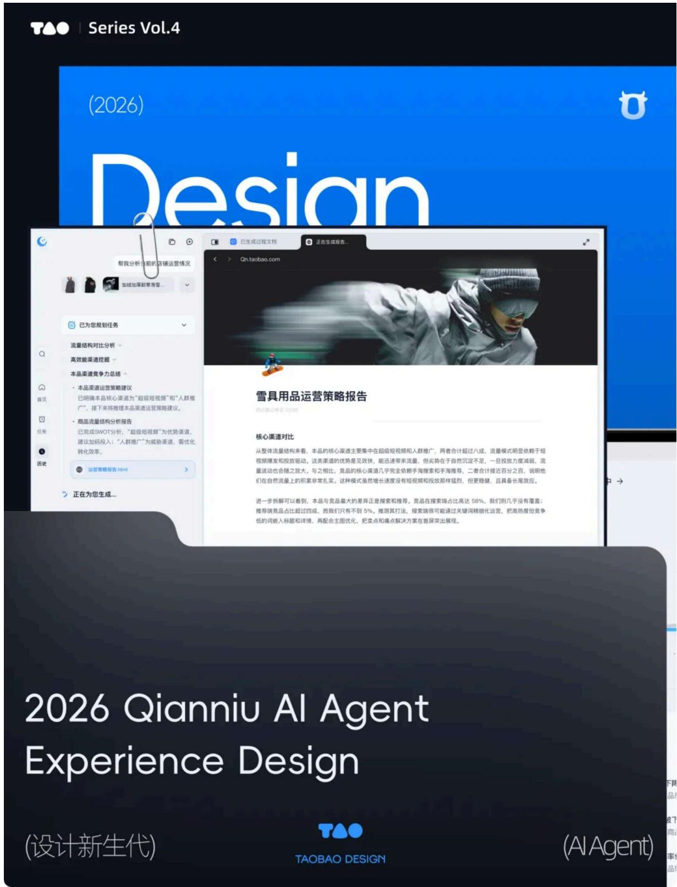

# 引言

传统经营困局

面对千牛这样庞大成熟的系统，商家往往需要花费大量时间去学习；而一旦版本更新，又不得不重新适应。

在过去很长一段时间里，我们习惯用清晰的功能分区和标准化流程来引导用户：“要选品去 A 入口，要推广去 B 入口”。这导致了一个长期被忽视的痛点：“经营意图的翻译成本”。

究其根源，商家的真实意图往往是模糊且复杂的，而系统提供的却是既定的、线性的流程。商家只能主动适应系统，将经营意图人工拆解为'找入口'和'填表单'等一系列可被执行的机械操作，经营的节奏被反复打断。

我们开始思考：系统是否应该继续要求商家去适应既定的功能结构？流程是否只能是预先定义好的固定路径？

# 让经营回归“意图”本身

Agent 技术的成熟，为重构人机关系提供了契机。它实现了从“人操纵工具”到“AI 编排工作流”的跨越。不再是被动等待指令，而是能直接理解模糊的经营目标，自动拆解并协同调用工具。

# 商家AI工具发展

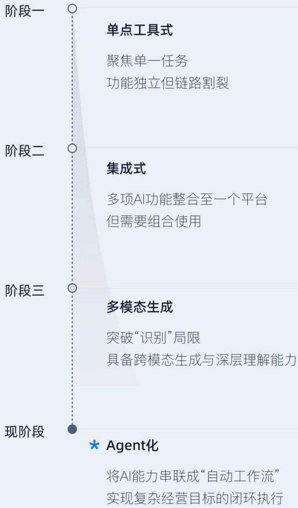

DESIGN 

INTRODUCTION 引言

这种技术上的转变，让商家工具设计得以从“功能入口”转向“经营意图”，让系统主动适应人。

以千牛现有的功能架构与商家核心经营动作为切入点，我们对线上经营流程进行梳理，归纳出三个主动意图：分析决策类、任务执行类、创意生成类；以及一种被动意图：系统触发类(预警/推

# Intents

# 核心意图

典型主动意图

被动意图

<table><tr><td>20%</td><td>50%</td><td>15%</td><td>15%</td></tr><tr><td>分析决策类“本月哪款女装销量最高?”</td><td></td><td>创意生成类“帮我生成一组春夏主图”</td><td></td></tr><tr><td></td><td>执行任务类“一键上新10款商品”</td><td></td><td>系统触发类“建议补充商品主图视频”</td></tr></table>

DESIGN 

INTRODUCTION 引言

围绕商家经营意图，我们从'需求输入'到'结果输出'，重新设计了商家工具的交互形态。

# 输入体系设计

# 从“功能入口”到“意图输入”

我们将 AI Agent 的输入体系拆解为两个部分：

意图发散：由Agent基于经营情况主动触发，向商家分发经营建议。

意图表达：由商家发起，表达明确需求。

# 意图发散：基于不同经营角色的动态首页工作流

在传统的B端设计中，首页被设计为静态的“功能货架”，只负责罗列入口，所有职能的经营者都被导向同一个页面。信息庞杂，商家常面临决策瓶颈：不知该看什么、从何下手。我们针对不同的经营角色，设计了差异化的首页框架，将其作为意图分发的核心阵地。

# 经营Agent首页：

在店铺经营场景，决策通常由数据驱动：先理解数据、分析归因，再优化调整。我们将这一经营流程，映射为“感知-诊断-行动”的界面框架，用于指导首页中意图的组织与分发。

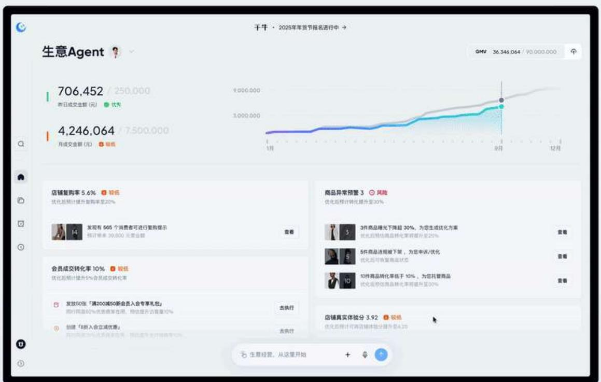

# 经营Agent首页

将经营问题转化为待办事项

页面头部聚焦核心指标，帮助商家快速把握整体经营动向。下方区域由Agent根据实时店铺数据智能归因，生成策略卡片，将隐性的经营问题转化为可被执行的待办事项。

# 素材Agent首页：

B 端素材生产具有极强的时效性与规范化特征。商家的核心痛点在于“什么时候该做什么”（经营节奏）以及“不知道怎么开始”（创意冷启动）。

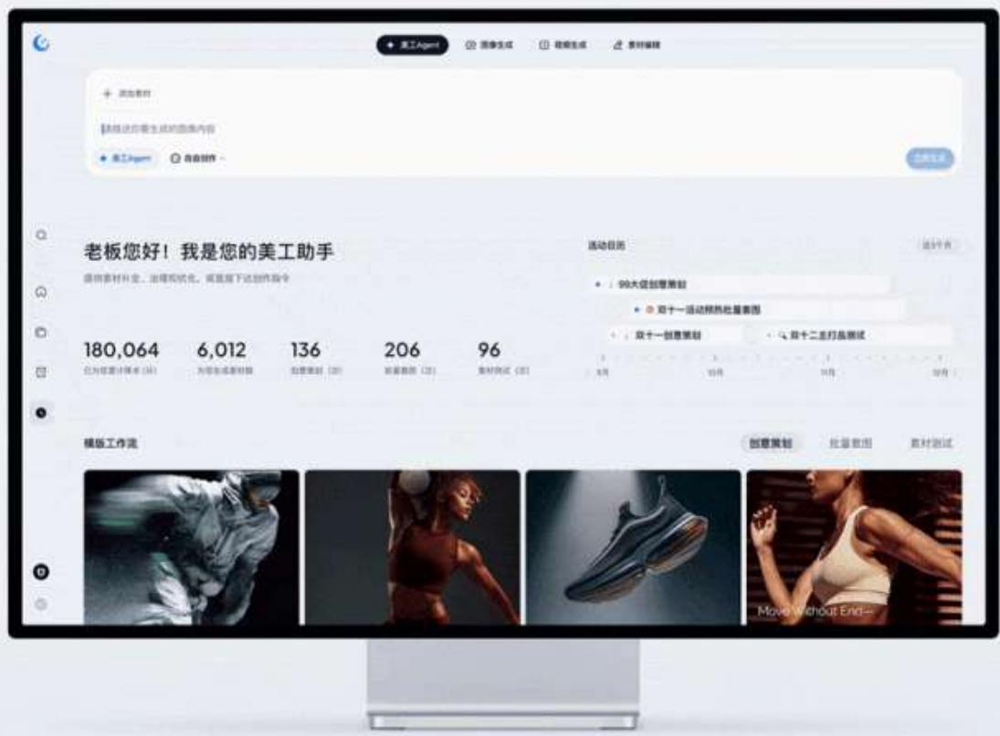

# 素材Agent首页→

# 解决商品素材的冷启难题

将“营销日历”置于首屏核心位置，依据行业活动节点，分发对应的策划任务。帮助商家有序完成各个节点的素材储备。我们设计了“模版工作流”，承接了创意策划、批量套图等完整业务场景。通过 Agent 编排好的自动化生产链路，大幅降低了专业创意的准入门槛。

# 意图表达：基于商家意图的输入框设计

市面上的通用 AI 产品常以自然语言输入作为主要的意图承接手段，优势在于低门槛与高自由度。而在 B 端经营场景中，输入不只是“表达想法”，更是触发业务结果的关键节点。

模糊的输入难以承载复杂的业务参数，也无法为高风险的经营动作提供足够的约束。输入的设计必须在“低门槛表达”与“高精确度”之间取得平衡。在保持“统一输入口”心智的基础上，我们针对三类核心经营意图，构建了能根据意图动态适配的复合输入框。

# Decision Analysis

「分析决策」
自然语言输入

# Task Execution

「任务执行」
结构化表单

# Asset Generation

「内容生成」
图文融合输入

# 1. 自然语言输入：

在分析与决策类场景中，商家的意图往往是模糊且非结构化的。在该场景下，我们以自然语言作为主要的输入方式，允许商家“先提问、再收敛结论”。

与通用 AI 产品不同，B 端经营场景的商家的身份与当前任务都是“已知”。基于这种明确的业务上下文，我们设计了主动引导：通过“场景化 Query 推荐”与“实时语义联想”，将高门槛的“语言组织”转化为直觉的“选择与补全”，让商家无需掌握专业术语，也能轻松完成意图表达。

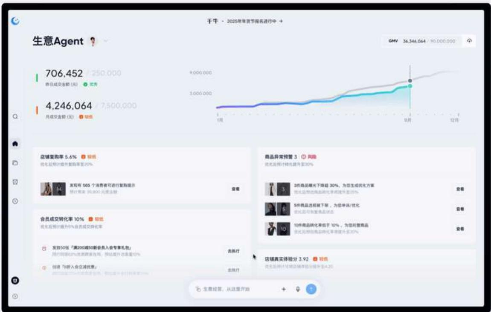

# 自然语言输入

用简单语言，表达经营意图

# 2. 结构化表单输入：

经营任务的执行往往会对真实经营结果产生不可逆影响，模糊表达会带来经营风险。因此，在明确的任务执行意图场景，我们将输入框扩展为结构化表单，确保价格、库存等核心参数的准确与可控。

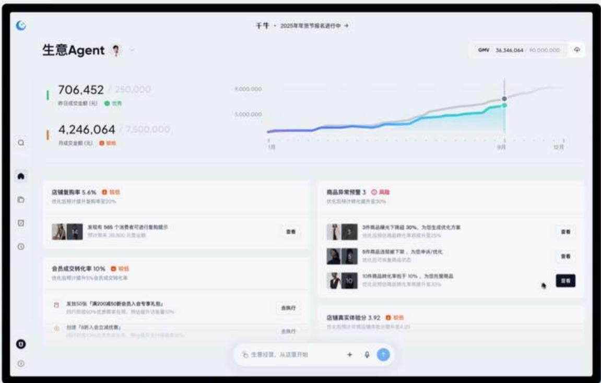

# 结构化表单输入

保障经营任务执行的准确与可控

# 3. 图文结合输入:

在内容生成类场景中，商家的意图具有高度的视觉化特征。对于“生成一组商品海报”或“模特换装”这类需求，若单纯依赖文字描述（Prompt），往往会陷入反复调试提示词、结果“开盲盒”的低效循环。

我们引入图文多模态的输入方式，将专业的提示词拆解为可视化的配置项（如模特选择、场景风格、图片比例）。减少商家对专业设计语言的依赖，降低描述不清、反复试错的沟通成本。

# 图文结合输入→

# 可视化高效还原商家意图

# 动态输出设计

# 从“固定流程”转向“意图驱动”

在新的输出框架中，我们从传统“固定流程、固定结果”的呈现方式，升级为识别商家意图后自动规划流程的动态结果交付，Agent将商家的原始意图转译为可执行的系统指令，并根据意图类型动态生成最匹配的交互形态。围绕商家主要的3个主动意图，我们将输出划分为三种框架：

# Decision Analysis

「分析决策」

文本+可视化

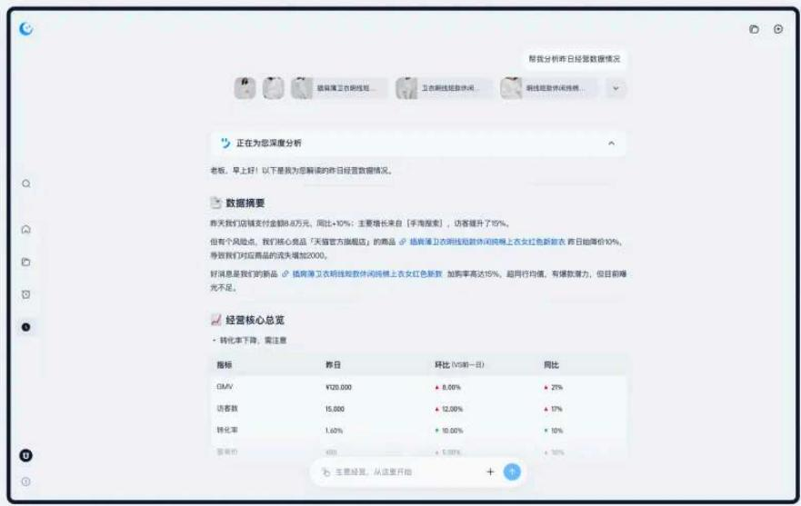

# Task Execution

「任务执行」

文件视窗

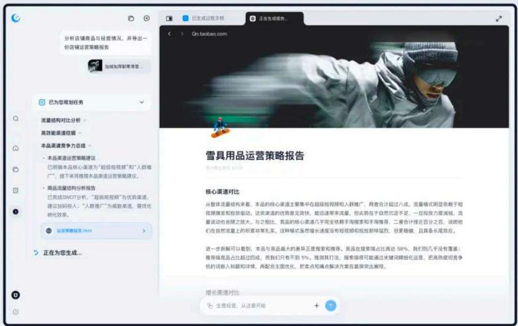

Asset Generation 

「内容生成」

好的，我们将根据规划的任务路径，逐步开展3个任务。

Task1/4贴外热门素材搜索

Task2/4站内同类目竞品查询

Task3/4创意KV设计策略

· 色彩标准：高饱和自然色与留白的博弈

海报色彩应平衡户外环境的质感与白色单品的高
级感，确保视觉上的清凉与纯净。

- 文案聚焦：基于“场域”与“情绪”的价值转化

包含核心 slogan、功能性副标题及行动号召的文本分析报告。

创意KV设计简要.html

Tech4/4生成结果

7. 创意生

(No text) 

a b q a b → o 

Q 

A 

口

回

0 

回

① 

Agent）创意策划 详细信息

⑥ 生意经营，从这里开始

# 1. 分析决策类

在分析决策场景下，商家的诉求聚焦于两点：“发生了什么”与“该怎么做”。

发生了什么（结构化洞察）：AI 生成内容的随机性，意味着设计师无法再像过去一样穷举所有的界面组合。设计需要从“绘制静态页面转向”设计内容组织规则”。利用 Markdown 的层级规则来约束发散的文本，同时用标准化的图表组件来锚定关键数据。从而规整 AI 的动态输出，确保交付内容的可读性。

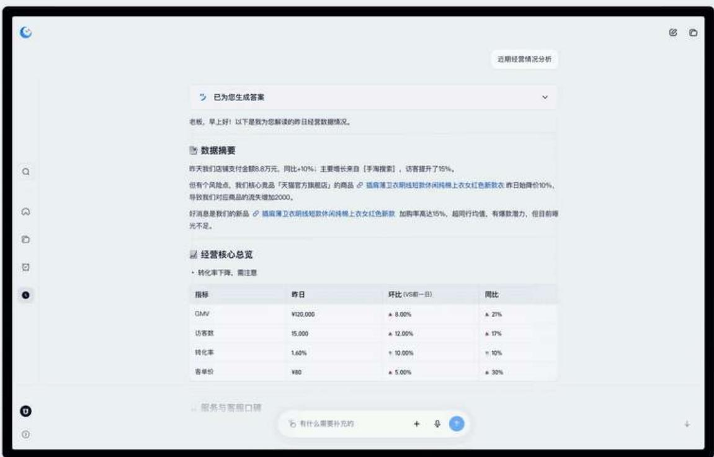

# 分析决策·Markdown →

# 规整动态输出，内容清晰可读

该怎么做（决策闭环）：为了为商家提供实际可落地的解决方案，在AI交付文本的基础上，增加了可执行策略卡片。但考虑到现阶段的 AI 产出实际仍属于‘高保真草稿’，直接交付存在经营风险。我们引入了“方案预览 Canvas”，支持商家对方案的关键参数进行表单编辑。以低成本的“人工微调”确保方案在安全可控的前提下快速落地。

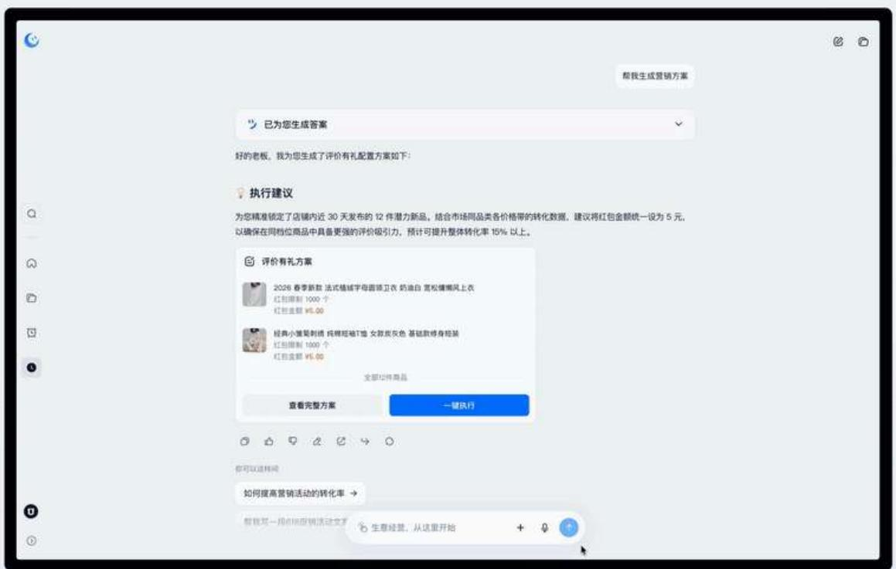

# 分析决策·策略卡片

从 “AI 建议” 到 “执行动作”

# 2. 任务执行类

针对多环节的复杂任务（如店铺装修、商品巡检），过程产物的精度会直接影响后续结果。通用的AI会话框架难以满足商家对执行链路的精准控制。

为此，我们设计了带有标签页的Canvas，用于并列展示与调整存在逻辑依赖的多个中间产物。让原本黑盒化的执行过程变得透明、联动且可逆，支持商家对过程的持续追踪和实时调整。

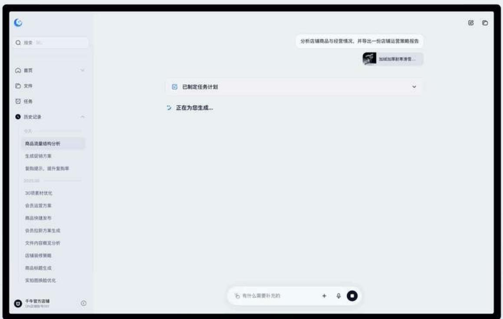

# 任务执行·文件视窗

任务流程可控，产出可编辑

# 3. 素材生成类

在商品图片、视频的创意生成场景，商家的核心诉求并非只是“精修一张图”，而是通过在批量生产的素材结果中，筛选出高点击潜力的素材。通用AI的线性对话流导致新旧内容从时间维度被分割开来，迫使商家在冗长的会话流中反复翻找对比素材，将直观的“比稿”变成了低效的“记忆游戏”。

我们引入无限画布打破时序限制，支持图片、视频等多模态素材在同一空间内的平铺对比与二次微调。让商家从“翻找历史”回归到“商业决策”本身。

# 素材生成·无限画布→

打破线性时序，创意一目了然

# 千牛AI组件规范

我们同步搭建了千牛 AI 组件库，定义了基础规范、业务组件与输入输出规范。确保在各b端agent场景，商家都能获得一致的浏览与操作体验。

# Design Library.

# 01. 基础规范

Color. 色彩

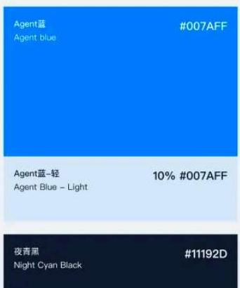

# 02. 业务组件

Input box. 文本输入

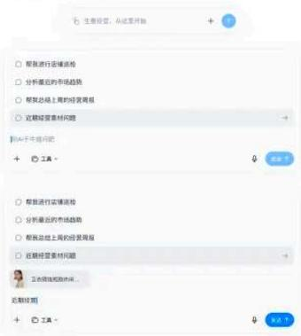

# 03. 输出规范

CUI. 会话组件

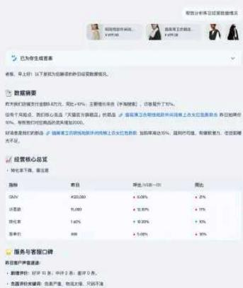

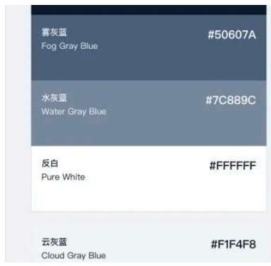

Input box. 词槽填空

Input box. 表单输入

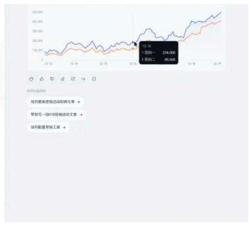

# 结语

作为 B 端设计新人，面对千牛这样庞大且成熟的系统，最初的压力是巨大的。在梳理错综复杂的业务逻辑时，我们也曾一度陷入迷茫。

但在 AI Agent 的设计探索中，我们找到了答案：千牛不该只是被动等待指令的工具，而是能分担任务的经营助手。

在快节奏的经营环境里，能通过设计让系统主动“多想一步”，让商家“少做一步”，这正是这份工作最大的意义所在。希望我们的努力，能让千牛AI成为商家生意路上那个值得信任的伙伴。

# / / / / / / END / / / / /

淘宝设计，一个服务于全球亿万消费者体验的设计团队，致力于让设计触动人心，让商业美而简单。我们有小红书啦，关注「蟠淘会TAOBAO DESIGN」，看更多设计团队的生活日记！

