# 干货！揭秘POS机的软硬件交互原则

原创 客如云设计组 淘宝闪购设计 2023年8月31日 12:00

# #01

# 背景

# 1. POS收银机是什么?

POS（Point of Sale）是指在餐厅、商场、超市、酒店等消费场所中，用于结算和支付的一种设备。传统意义上或我们印象中的POS机可能是刷卡机或集成式收银机，但随着餐饮行业数字化的深入，POS机也在不断变化，功能上不仅可以结账收银，还可以点餐叫号，系统操作上也不再被受限于硬件，硬件形态也是更加灵活多变。

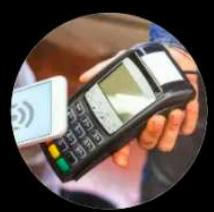

刷卡机

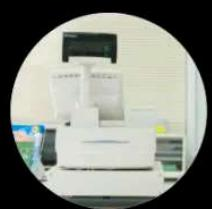

集成式收银机

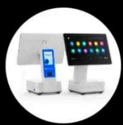

智能收银系统

▲ POS收银机的发展变化

在我们的日常生活中，POS收银机已随处可见，它可以是台式一体机、称重收银秤、电脑、平板和移动手持终端。所以，我们现在称呼的“POS机”或“POS收银机”都已经不再是指一种具体的设备，而是一套操作系统，它会以多种形态出现在商家的线下门店中。

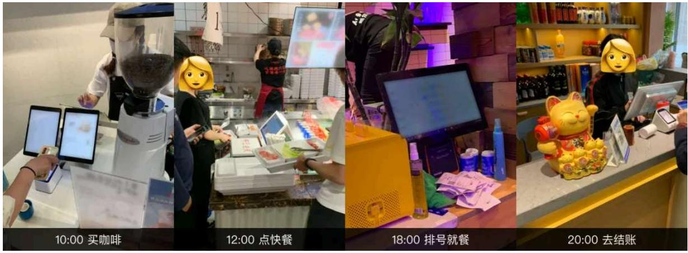

▲ 就餐场景中的POS收银机

在客如云的业务中，我们也在不断地去适配兼容更多硬件设备，商户签约客如云餐饮SaaS系统后，可以选择购买客如云的硬件设备，也可以使用自己已有的硬件设备。

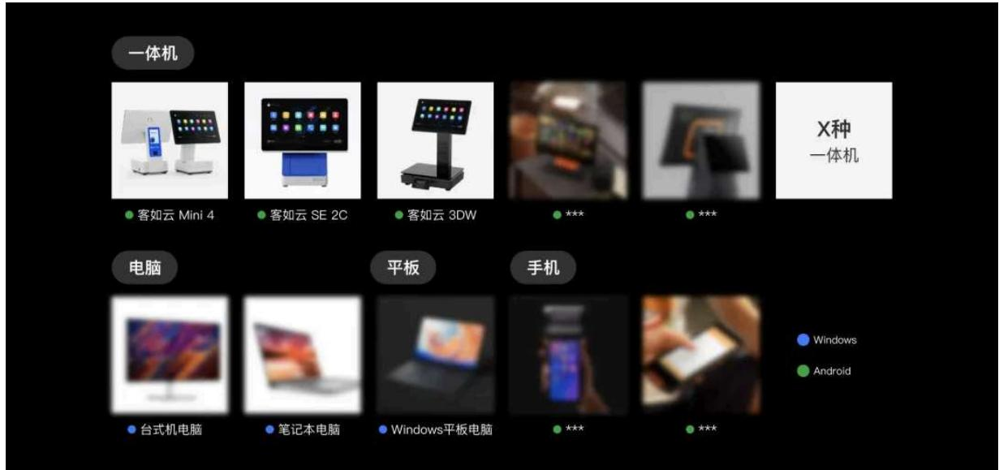

▲ 客如云的POS形态

# 2. 为什么需要设计原则？

尽管商户的POS硬件存在差异，但我们提供的是同一套系统，里面的功能非常丰富的，交互体验会直接影响到商户的日常经营。那么，在面向POS机进行产品设计时，我们是如何设计的？

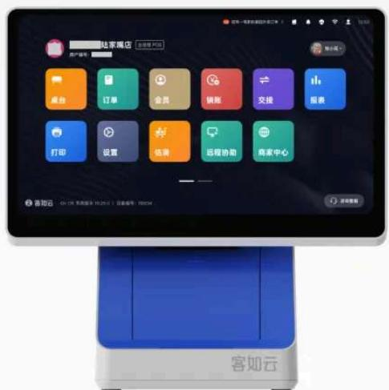

# 客如云餐饮系统·智享版

会员登录 叫号取餐 打印 点餐 排队叫号 估清 打印效期贴

现金结账 开台 在线收款 预订 合单 备注 交班

转台 联台 按菜搜桌 称重 订单 退单 打折 反结账

扫码 设置 团购核销 点套餐 下单 外卖接单

其实，设计师也面临着困惑，POS端的设计什么样是好的，什么样是不好的，目前缺少一套设计评判标准。我们通过调研，发现目前市面上在餐饮POS收银领域的设计研究甚少，无法找到现成的答案。

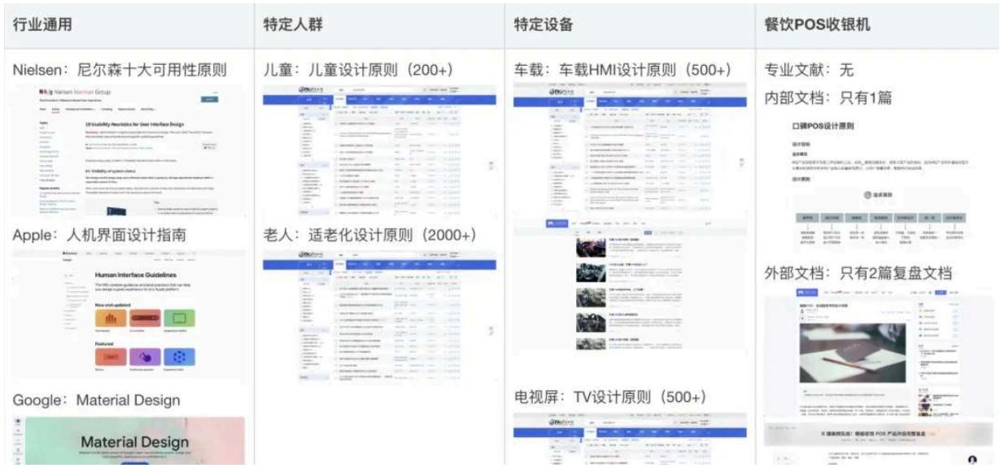

▲ 调研情况

2023年5月，从“人民数据研究院”发布的数据来看，中国餐饮行业经营主体超过600万家，从业人员超过2000万人。每家门店至少需要1台POS机，由此可推测使用人数约在千万左右，而他们的体验不该被我们所忽视。

# 3. 设计原则的意义是什么？

通过对POS机进行全面的人因研究，提出对应的设计指导原则，为用户/产品/行业带来价值。

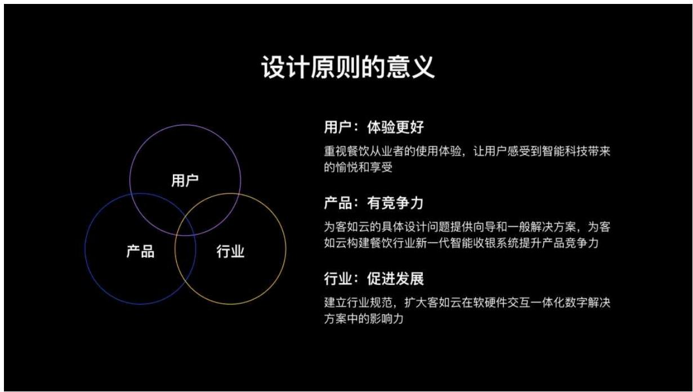

▲ 设计原则的意义

# #02

# 了解用户

首先，我们需要了解一下使用POS的用户是谁。我们对50余家商户从用户、设备、环境三要素进行完整的人因研究，去洞察用户现状和需求，并对发现的设计问题进行剖析，开展相应的实验。

# 1. 使用POS收银机的用户有三类

一方面，我们发现使用POS的用户有三种典型角色。在“正餐”业态中，会严格区分“收银员”和“服务员”，他们都会使用POS机，但工作内容和职责会存在明显的差异；而“点单收银员”则主要出现在“轻快餐/茶饮”业态中，顾名思义，既需要负责点单，也要负责收银结账，有些还需要同时负责商品制作，工作中也会更加追求效率，工作压力也会更大。

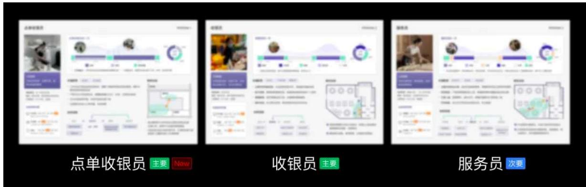

▲ 角色画像

# 2. 用户感觉自己的工作很“累”

另一方面，我们发现所有用户都会在某个时候感觉自己工作很“累”，在每天工作期间和结束后，容易有较强的「疲劳感」，可谓是身心俱疲，原因如下：

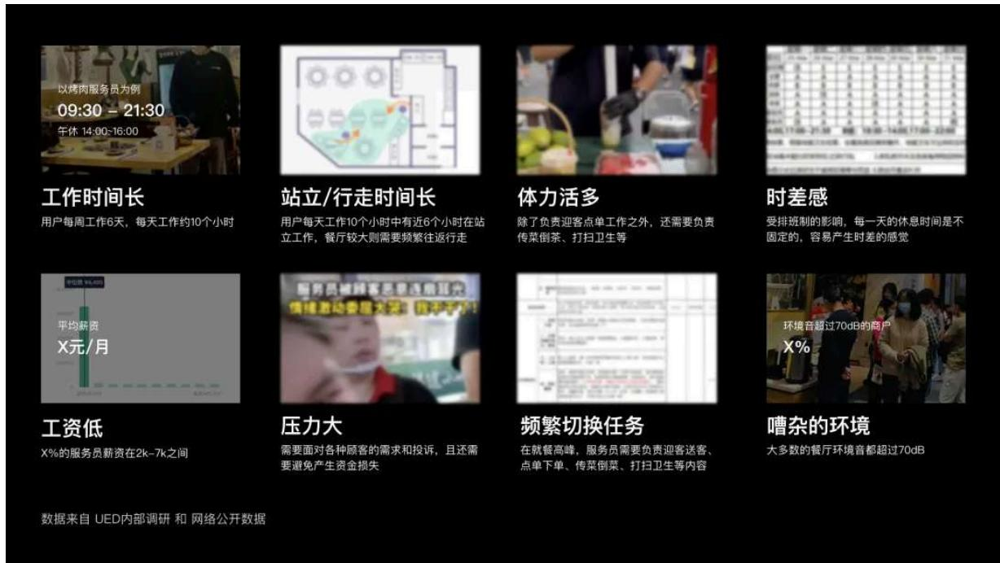

▲ 用户工作劳累的原因

# 3. 重视“低疲劳”需求

用户在日常工作已经很累了，为什么还要额外使用POS机，当然是为了更好地完成工作任务，希望POS机可以帮助到他们的日常工作。作为用户体验从业人员，我们应该重视用户的低疲劳需求，努力降低用户使用POS机乃至整个工作的疲劳度。

# #03

# POS设计原则

我们将疲劳分为以下四个类型，分别进行人因研究，分析该疲劳对用户的影响，并针对性地提出设计原则。

# 从不同的疲劳维度，去建立POS的设计原则

肢体疲劳

01 简化流程

02 大拇指可及

03 易操作性

视听疲劳

04 可读性

05 可听性

认知疲劳

06 简单易懂

07 人性化帮助

08一致性

❤️ 心理疲劳

09 多设备融合

10 积极反馈

▲ 设计原则框架

# #肢体疲劳

# 01.简化流程

通常POS一体机被放在一个柜台上，用户会站着使用触摸屏，较长时间的工作姿势容易损伤颈部、肩膀或手臂。

- 使用者身高与设备摆放的高度差越小，屏幕摆放越“直立”，使用者就需要将手臂高抬进行操作，长时间操作，手臂肌肉越容易酸痛；

- 使用者身高与设备摆放的高度差越大，屏幕摆放越“平”，使用者就需要大角度低头查看屏幕，长时间保持姿势不变，颈椎越容易损伤。

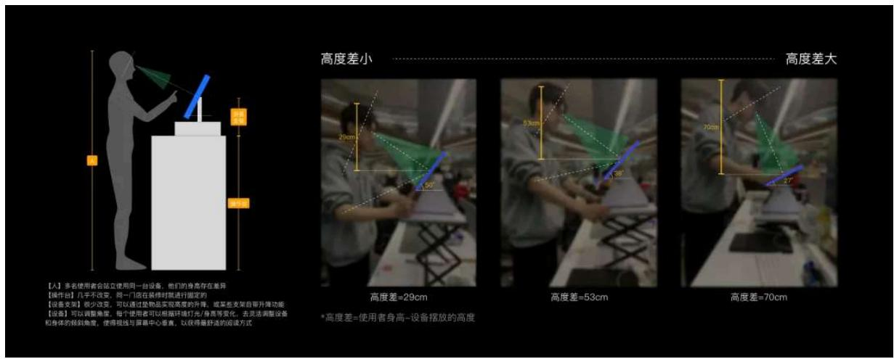

▲ 站立使用POS一体机

用户在使用PC终端设备时，多数是以站立使用为主，这是由于老板都会要求收银员在结账时，站立使用POS机进行收银结账，方便与顾客进行沟通。由于摆放键盘鼠标的桌台高度较小，站立时需要大角度弯曲颈椎和手腕，长时间使用会损伤颈椎和手腕。

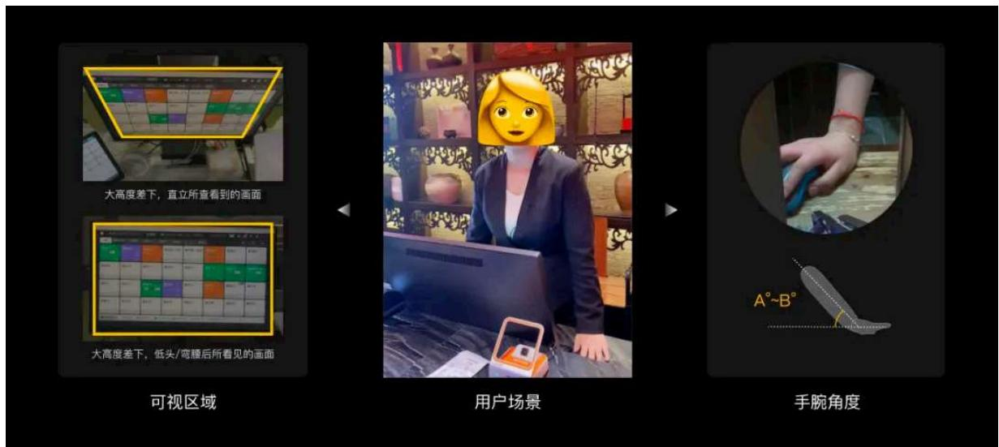

▲ 站立使用PC+键鼠

因此，设计时，应简化操作流程和交互方式，让用户能够使用最少的步骤和努力来完成他们的任务，降低肢体疲劳。

例如，在结账时，顾客告知收银员需要使用现金作为支付方式。简化流程的方式就包括如下：

1）提供默认值，输入框中直接默认当前的订单金额；

2）提供选项，根据订单金额，智能匹配出常见的收款金额作为选项，方便收银员一键进行更改；

3）可快速修改，输入框中默认为选中态，直接平铺展示键盘，需要修改时直接输入即可更换；

4）自动计算找零，按顾客实际多付金额进行找零，收银员直接点击或输入实时金额后，系统自动计算需找零的金额，省去收银员心算和使用计算器的流程，而且还可以减少计算出错。

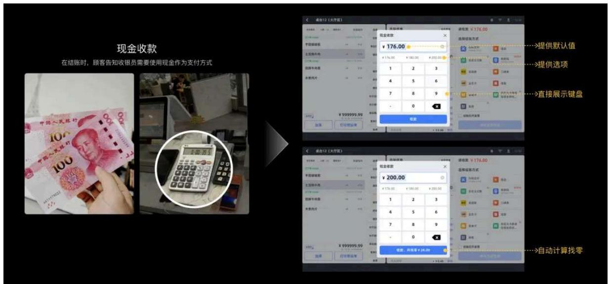

▲ 案例：现金收款

例如，顾客在纸质菜单上勾选菜品后，服务员会对照着已勾选的菜品信息，再到POS上进行逐个搜索与加购，最后再下单给后厨。简化流程的方式就包括如下：

1）键盘不遮挡：搜索时，键盘不遮挡左侧的购物车，在完成点单后也无需收起键盘，可直接进行下单操作；

2）简化输入内容：服务员可输入菜品名称的拼音首字母，如“土豆”的“TD”，即可直接进行搜索；

3）考虑连续操作：在搜索结果中点击目标菜品，会自动清空搜索框中的内容，并保留键盘，以方便服务员进行输入新的菜品信息。

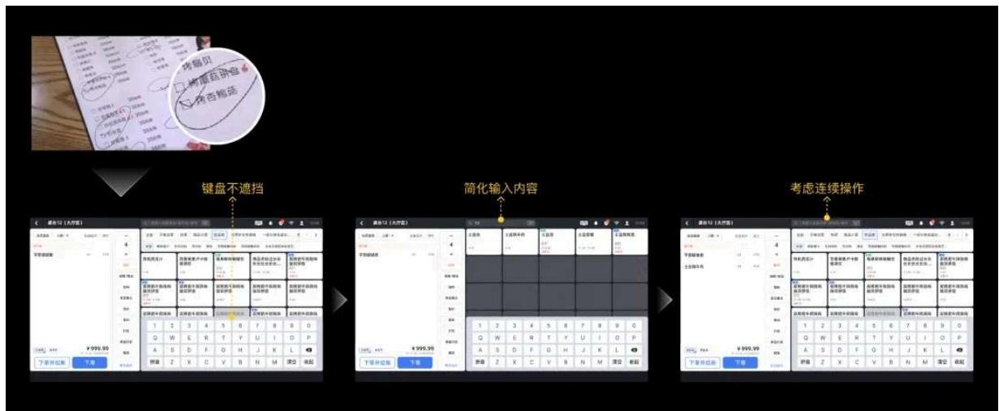

▲ 案例：连续搜索加购

例如，茶饮商户有统一备料，再统一打印效期贴的习惯，且发现每天早上服务员需要一次性打印的物料数量非常多，那么在设计时，就需要提供按“物料分类”的“全选”，让服务员可以进行批量勾选，一次性打印。

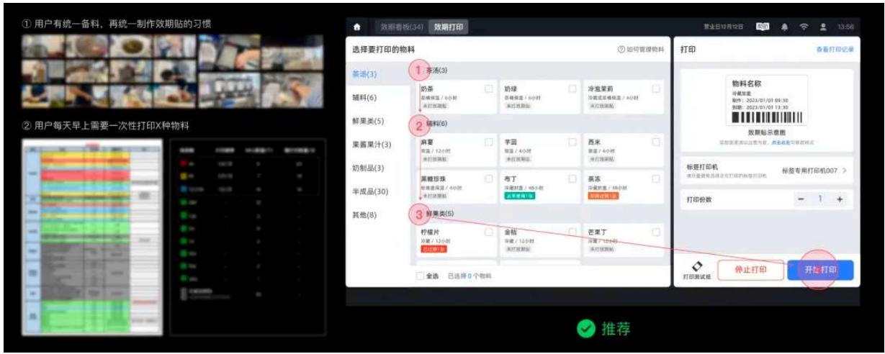

▲ 案例：打印效期贴

# 2. 大拇指可及

用户操作触摸屏的不同区域时，习惯使用的手指会不同，对应易于操作的热区范围也会不同。

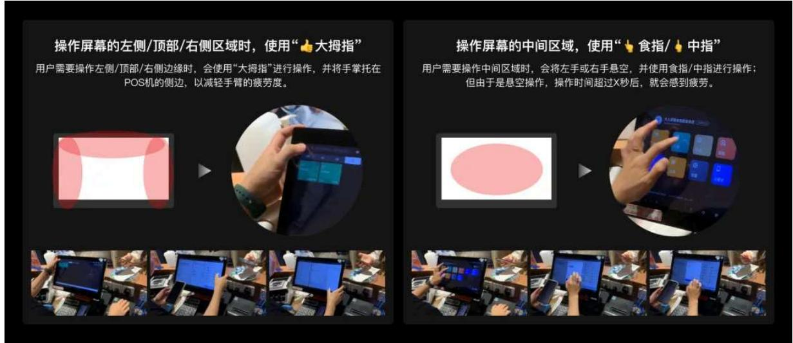

触摸屏操作场景

对多名实验者的大拇指进行多点测量，测量出可操作的舒适距离和最大距离，得到主要尺寸下的热区范围。

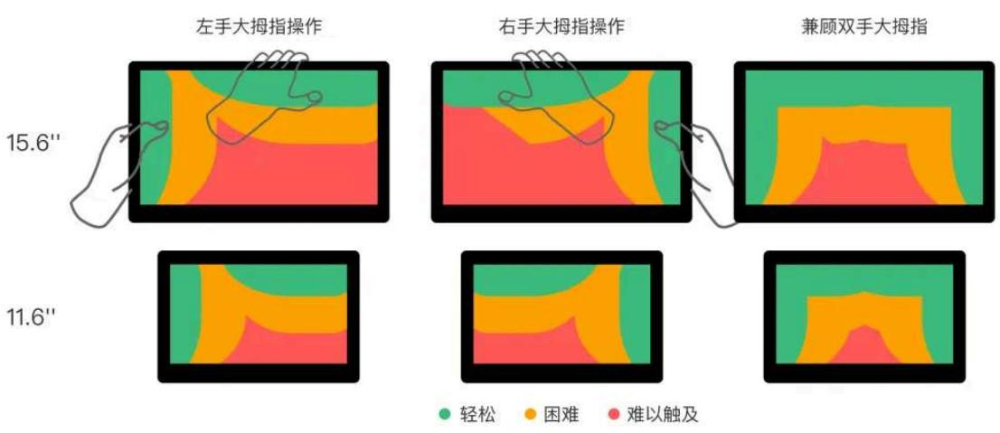

▲ 大拇指操作手势热区

因此，在设计时，需要用户较长时间操作的内容，应该放置在屏幕的左右两侧或顶部，且能够让用户自然触及的区域，方便用户将手掌托在设备的边缘后，使用大拇指进行单手操作，减轻手臂的负

担，提升用户的舒适度。

例如，在结账时，除了常见的现金、扫码支付、团购核销，一般还可能会有储值卡、挂账、各大银行App的活动等，商户为了精准记账，就会分别为每种方式设置一个结账方式。当顾客告知要使用的结账方式后，收银员就可以将手掌托在右侧进行滑动查找，而不是在中间区域手臂悬空进行查找。

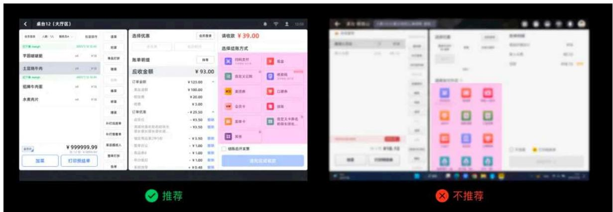

▲ 案例：结账收款

例如，收银员需要去回查某个订金详情时，需要用户长时间去滑动查询的信息，那么就应该采用右侧的抽屉，而非居中的弹窗。

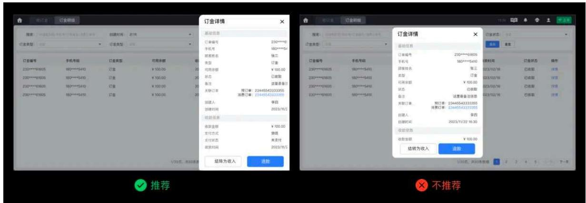

▲ 案例：查看订金详情

# 3. 易操作性

1）触摸屏：用户操作很容易失败，包括同一元素需要重复点击和滑动容易卡顿。

# “触摸屏”很容易操作失败

① 同一元素需要重复点击

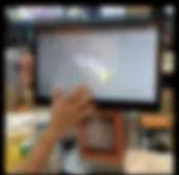

第一次点击

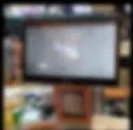

放下手，等待系统反馈

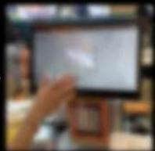

再进行第二次点击

② 滑动卡顿，马上去寻找按钮进行点击操作

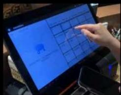

上下滑动：寻找菜品

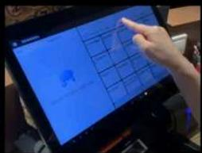

左右滑动：切换菜品分类

# 出错原因1：操作手指的俯视角度较大，视觉误差较大

用户使用位于手指顶部的特征进行视觉瞄准，而触摸设备测量的是手指与设备之间的接触面积，站立操作POS设备时，点的俯视角度一般都超过 $25^{\circ}$ ，视觉误差较大，这种视差导致触摸设备感知到不同的输入点，从而导致输入错误。

原理分析

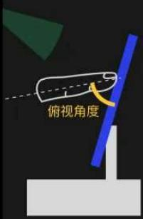

参考: Christian Holz and Patrick Baudish: Understanding Touch, 2011

俯视角度测量

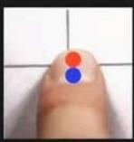

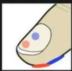

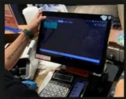

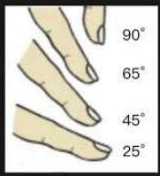

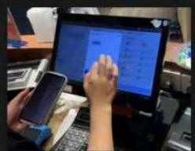

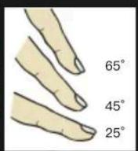

俯视角度超过25°视觉误差较大

实际点到的

用户以为点到的

Tips

如果指甲过长，最先碰到屏幕的就会是“指甲盖”，就更容易操作失败~

# 出错原因2：屏幕有油污，电容未发生变化

部分POS机紧邻制作区，当屏幕或用户手指有油污/水渍，手指按在屏幕上并没有与屏幕底板形成一个有效电容，屏幕底板的电量没有发生变化，设备就无法根据电量变化的位置来推测出点击的位置，就会导致输入失败。

屏幕或用户手指的油污

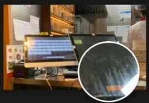

电容屏根据接触面积计算接触点

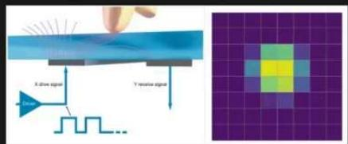

用户预期点的

系统实际识别到的

触摸屏操作遇到的障碍

2）PC+键鼠：在PC电脑的右下角通常会长驻显示输入法或杀毒软件的悬浮窗信息，很容易遮挡住部分应用中的信息，造成用户短暂的视觉或行动障碍，不易于操作。

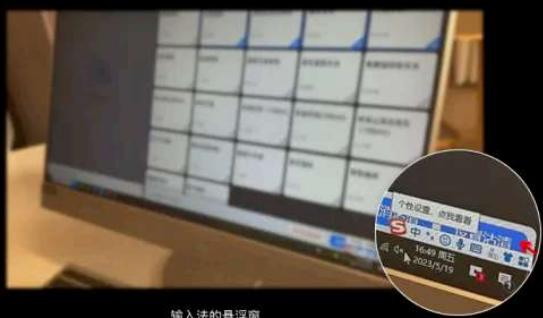

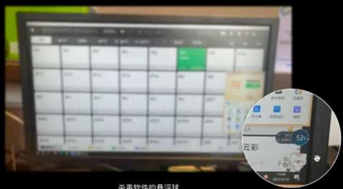

因此，设计需要提供易于识别的点击目标，并采取一系列措施来确保点击目标在不同情况下都可以被准确地点击，以提高用户操作的效率和准确性。

例如，在弹窗中，底部的行动按钮需要更大，采用“充满容器”的布局方式，而非“固定尺寸+右对齐”，让实际的点击区域变得更大。在页面中，图标按钮的可点击热区需要根据情况进行扩大，让点击更容易。

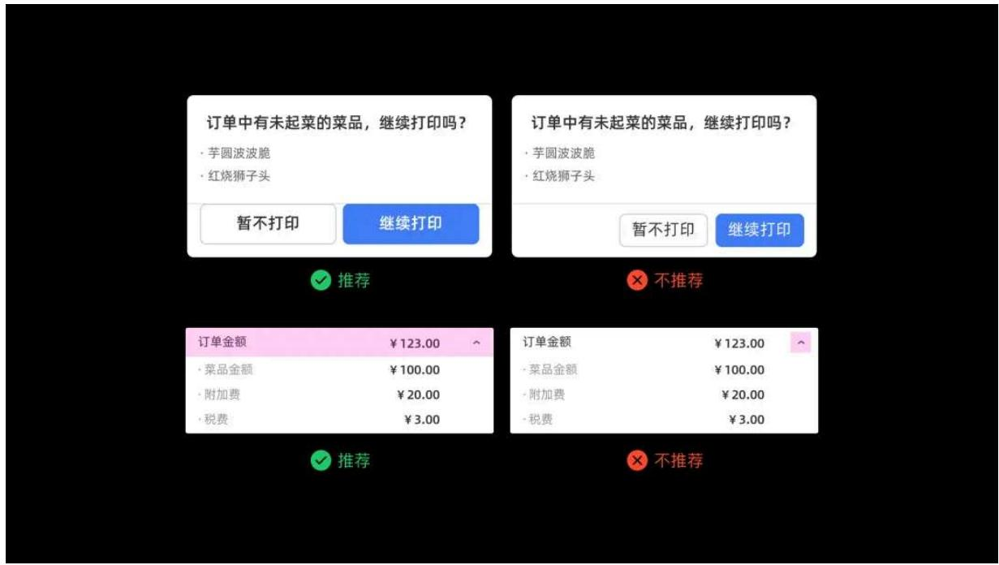

▲ 案例：弹窗按钮和图标按钮

例如，在加购套餐时，行动按钮的位置需要避免在右下角被完全遮挡，可以采用位置左移或尺寸增大的方式，让用户使用鼠标点击更加方便容易。

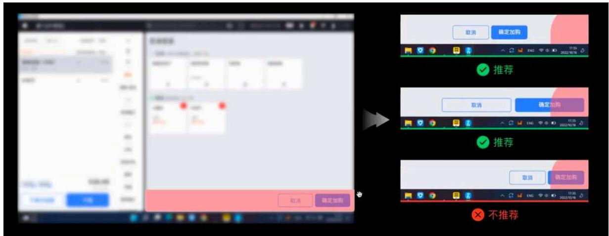

▲ 案例：加购弹窗的按钮

# #视听疲劳

# 4.可读性

对不同业态下的20多家商户，使用「光谱照度计」分别对店内的POS收银机从屏幕四角进行光数据的测量，得到以下环境光数据。

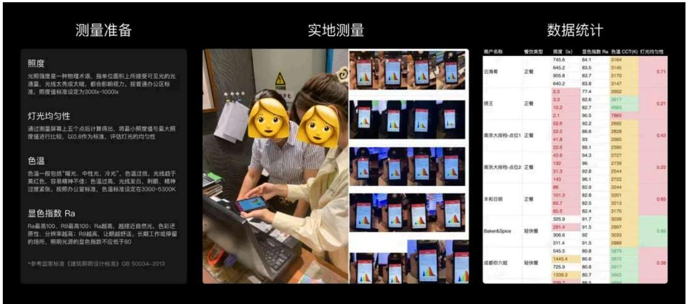

环境光测量

对数据进行分析，参考国家标准《建筑照明设计标准》GB 50034-2013，得出以下环境光的结论。

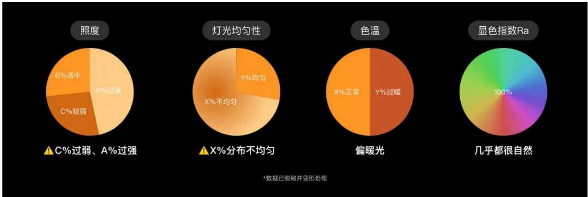

环境光测量结论

1）环境光照度过弱/过强对用户的影响：在不同的环境光下，用户分别手动调整屏幕亮度，以达到基础的“能看”水平，但由于大部分的环境都处于过强或过弱的极端光环境，用户很容易无法看清对比度较低的信息。

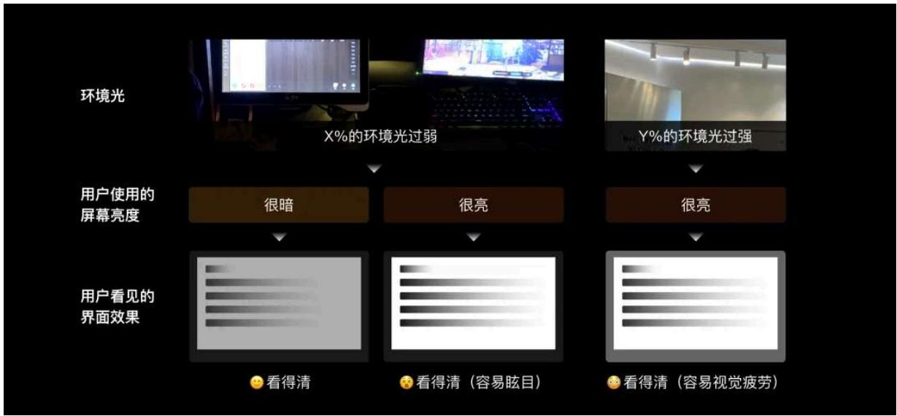

▲ “照度过弱/过强” 对用户的影响

2）环境光分布不均匀对用户的影响：由于环境光线普遍不均匀，再加上安卓一体机通常采用高清的多点触摸电容屏，无论使用设备倾斜为任何角度，屏幕中都会出现局部反光或局部无光线的情

况，用户很容易无法看清楚低对比度的信息。

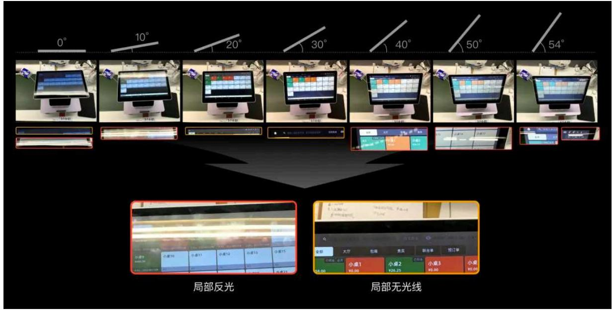

▲ “光线分布不均匀” 对用户的影响

因此，设计时，需遵循色彩规范，注重内容的可读性，需要确保界面元素之间有足够的对比度（符合WCAG的AAA级标准），以使其在高亮度和低亮度的环境下都能清晰可见，同时也要避免使用大面积的强对比色，使用户在高亮度的环境下产生视觉疲劳。

例如，在订单模块的顶部导航栏会分Tab去展示来自不同渠道的订单，为了确保在不同亮度的环境下都能够清晰可见，Tab的文本与背景色对比度就需要至少大于7:1，而非4.5:1。

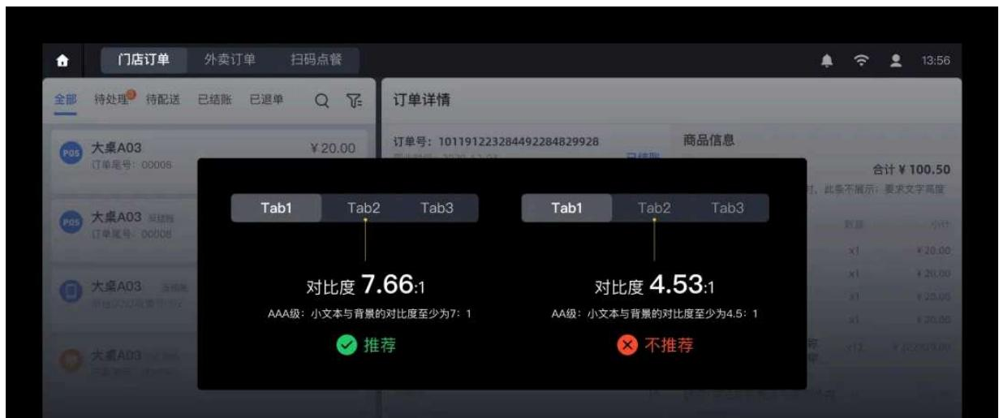

▲ 案例：Tab标签栏

例如，在弹窗内采用灰色背景+白色信息，既可以增强信息对比度，同时也去避免使用大面积的纯白色，带来持续性的视觉疲劳。

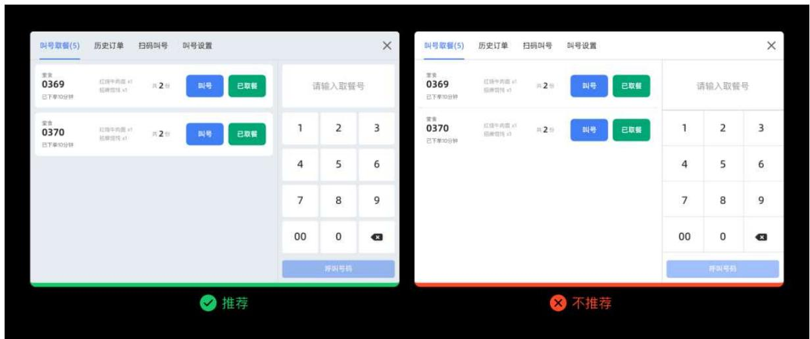

▲ 案例：叫号取餐

# 5. 可听性

对多家餐厅在营业高峰时段进行实地噪声值测量，发现中式餐厅的噪音普遍高于70dB，显得比较嘈杂。用户长时间（大约10分钟~5小时）处在噪音环境下，容易感到不舒服产生听觉疲劳，更严重会直接影响身体健康，损伤神经细胞，导致听力损伤。环境音普遍偏高，在排队叫号、取餐叫号等场景下使用的交互类音效需超过环境音才能被用户所听见，却会容易带来新的噪音。

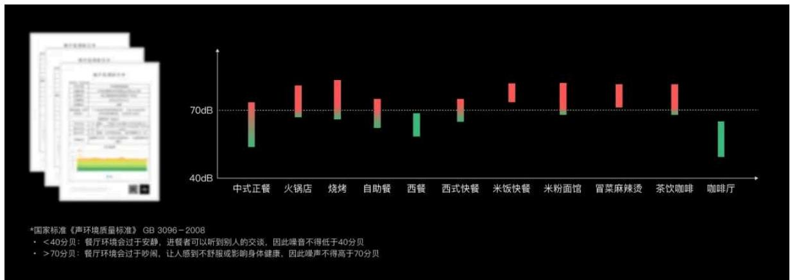

环境音测量

因此，设计需建立声音标准，并根据不同的业务特征，给予不同的声音建议，让声音在使用时能够精准传递有效信息，同时保持自然流畅和调性统一，减轻用户在听取内容时的疲劳。

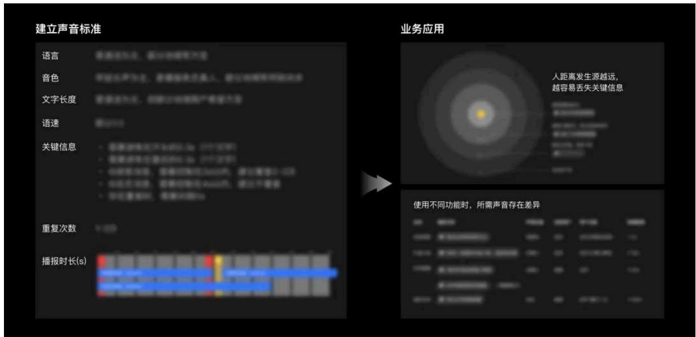

环境音使用标准与应用

# #认知疲劳

用户容易因为以下四类原因产生认知疲劳，会直接导致用户在使用POS时记忆力变差、操作错误增加、作业效率降低。因此需要遵循一定的原则去降低用户的认知负荷。

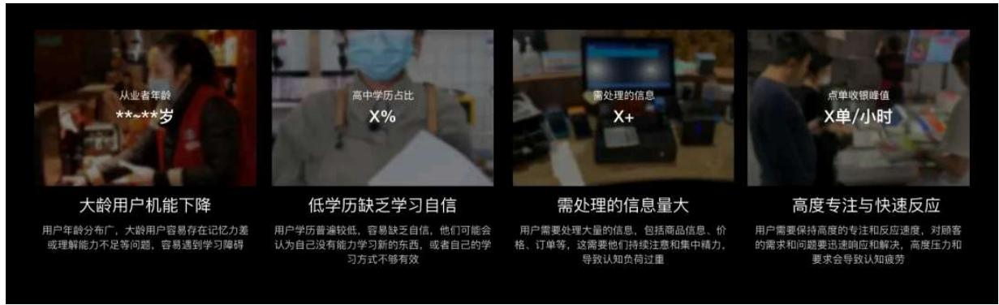

▲ 用户认知疲劳的原因

# 6.简单易懂

设计应该尽可能地简单明了，包括界面布局清晰有序、使用用户熟悉的语言或图形、配置所见即所得等方式，让用户应该能够快速理解并上手使用。

例如，在收银结账时，当收银员想要给顾客打9折时，可以直接选择“9折”或输入“9”，这更符合现实场景中的“打几折”，而不是“90%”；在酒水寄存场景中，往往需要针对已有酒的刻度进行判断并记录在系统中，服务员只能通过目测预估，无法做到非常精确，系统通过图形化和“半瓶、大半瓶、小半瓶”这样通俗文案就会更易于用户选择。

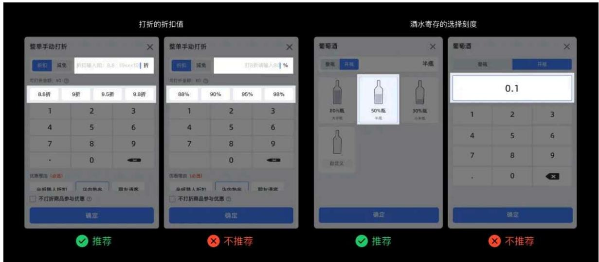

▲ 案例：打折、酒水寄存

例如，用户添加打印需要选择打印机类型时，需要将用户容易分辨的接口差异图形进行凸显，让用户更易于选择，而不使用纯文本进行长串的文本解释，使得用户困惑难懂。

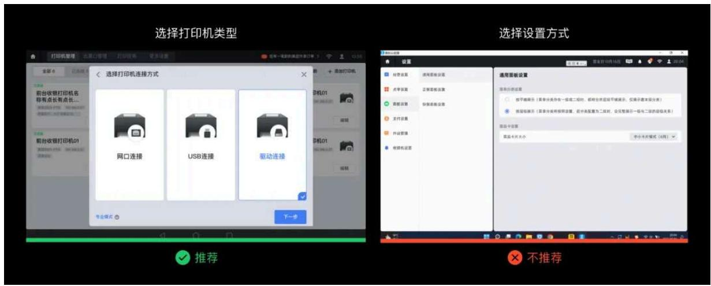

▲ 案例：选择打印机类型

例如，在需要用户配置快速结账方式时，当用户对某个结账方式进行开启、关闭或排序操作后，需要让用户在界面上可以直观地看到自己所做的更改和调整，所见即所得，帮助用户快速地理解并完成操作，而不是去使用静态的样例图。

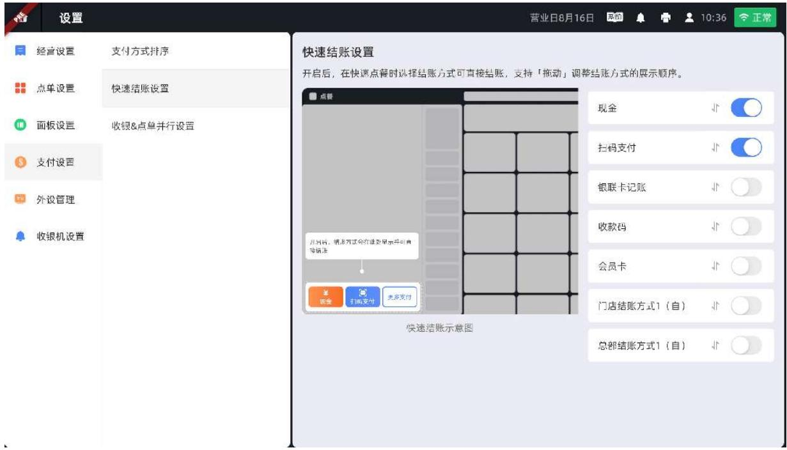

▲ 案例：配置快速结账方式

# 7. 人性化帮助

设计易于访问的帮助文档、用户手册、在线客服支持等，让用户在遇到问题或困惑时能够及时获得帮助，这能够减轻用户的焦虑和压力，增强用户对产品的信心。

例如，在为用户提供「帮助文档」时，入口在顶部导航栏进行长驻，让用户随时能够找得到；在查看时，在POS上只展示了标题和摘要，文章的详情则引导用户手机扫码到App中查看，让用户可以一边查看，一边在POS设备上进行操作，可以边学边用。

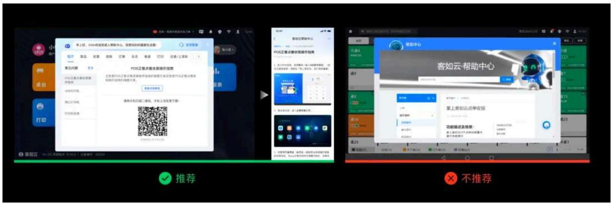

▲ 案例：帮助中心

# 8.一致性

设计需要保持界面和操作的一致性，使用户在不同的功能之间都能够快速适应和操作，避免产生额外的认知负荷。

例如，制定几种典型的框架布局和通用的模态交互，来满足各个场景的使用需求，包括全页内容平铺、父子级布局、三栏布局等。

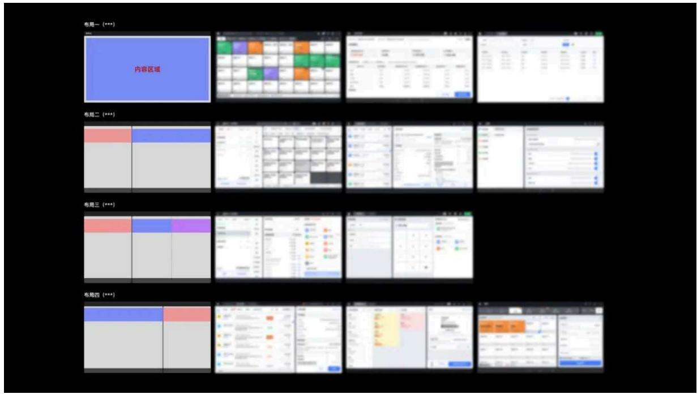

▲ 案例：布局规范

# #心理疲劳

# 9. 多设备融合

POS机允许与10余种外设连接，实时交互来完成工作任务，部分功能还会非常依赖外设，一旦外设出现故障可能会导致功能完全不可用，造成流程堵塞，容易引发顾客抱怨，进而直接增大用户的工作压力。

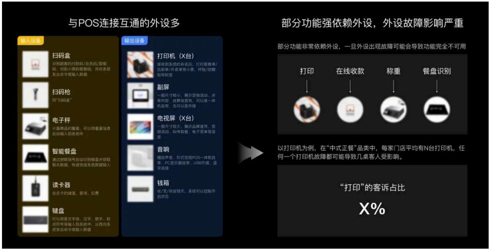

▲ POS的外设情况

因此，在设计中，应该将不同的设备和技术进行融合，以提供更加全面和一体化的使用体验。

例如，在绑定智能餐盘时，可以通过图形化智能餐盘和动效引导等方式来降低商户的理解成本，让商户知道如何配置智能餐盘，当前设备处于何种的状态，避免因设备故障导致商户经营中断，进而引发顾客抱怨。

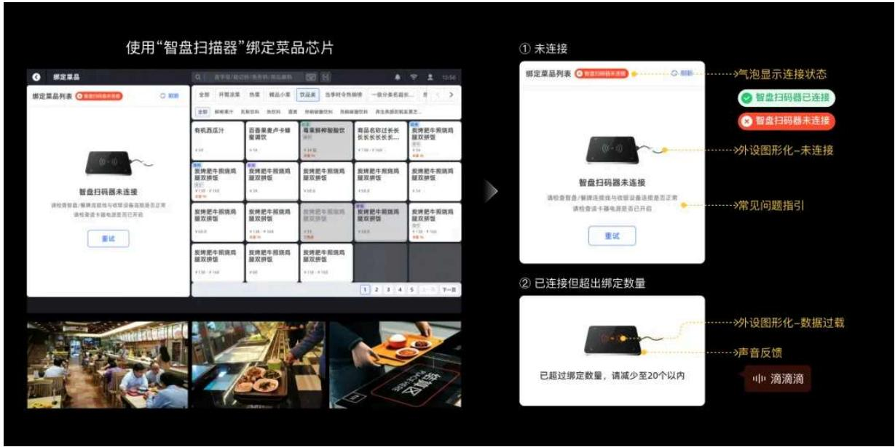

▲ 案例：智能餐盘扫描器

例如，其他外接设备在使用中也会存在不稳定性，那么就需要实时展示连接状态，出现异常应该及时反馈，避免在高峰作业时流程阻断，造成顾客抱怨，进而增加收银员的心理压力。

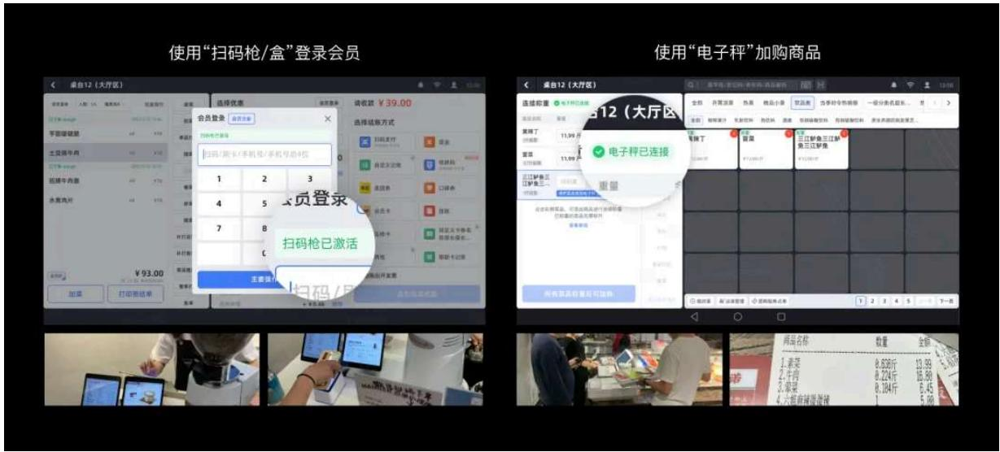

▲ 案例：扫码枪&电子秤

例如，POS机自带副屏和扫码窗口，那么在副屏设计时就不可重复展示扫码窗口，避免让顾客误以为上面是扫描窗口，放错手机的位置，从而增加收银员的解释成本。

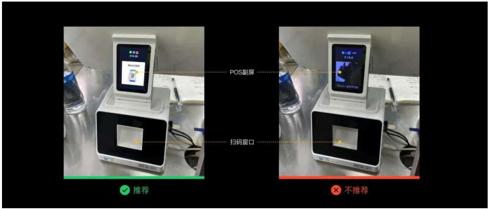

▲ 案例：顾客展示付款码支付

例如，在顾客扫收银员进行付款时，会检测当前商家的硬件设备是否有副屏，并进行差异化的信息展示和交互引导，比如有副屏则提示顾客扫副屏的收款码，无副屏则提示打印收款码让顾客扫。

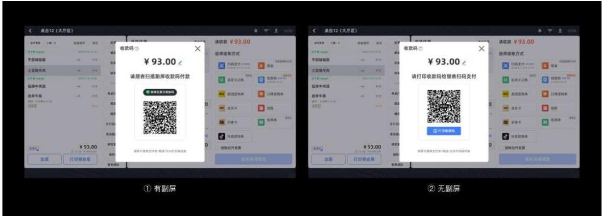

▲ 案例：顾客扫码支付

# 10.积极反馈

从用户的反馈来看，工作的核心内容不足以给用户带来价值，用户反而需要一些情绪上的支持。

店里面有时候稍微忙点也挺好的，起码说明生意还不错，工作可以更稳定些

并不觉得自己是在做一个有成就感的事情，只是按照公司规定去制作产品或回应客人的需求，在做得好的时候，是这些流程设计得好，产品研发得厉害，而不是自己做得漂亮。

当客人说声谢谢，会觉得一天的工作都是非常值得的了

▲ 用户说

因此，在设计中，用肯定的语言表达、鼓励性图标或动画等方式，给予积极正向的反馈，增强用户的成就感和积极情绪，减轻心理压力。

例如，让用户在日常经营中更容易察觉到「网络状态」，若当前的网络是安全稳定的，就需要使用更明显的安全色去表达，给用户营造出系统稳定安全的感受。

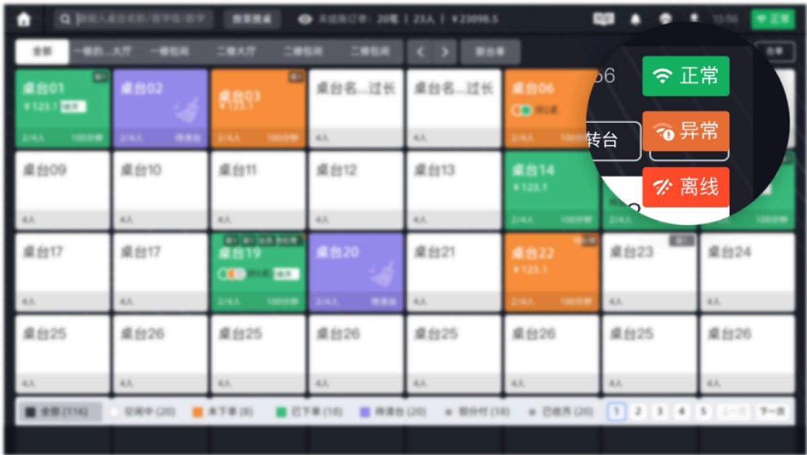

▲ 案例：网络状态

例如，当过期的「效期贴」被清理后，在界面中展示的反馈信息需要使用积极的图形和肯定鼓励的语言；当用户经过多个步骤完成打印机的连接，需要使用肯定的图形和鼓励性的语言给到用户，让用户觉得是自己的努力所带来的成功。

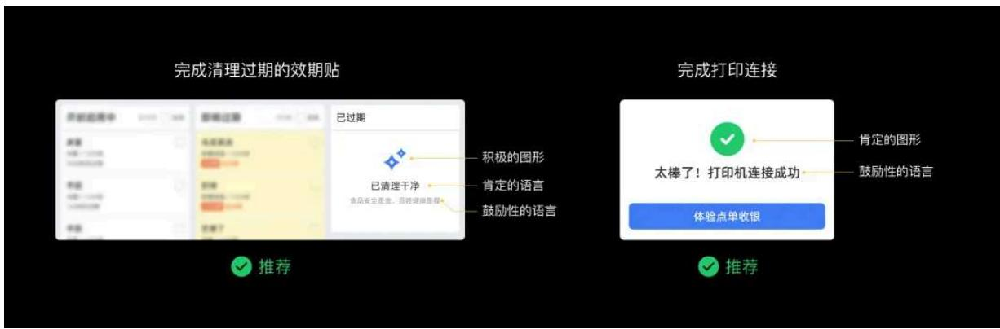

例如，根据线下餐饮文化和风俗习惯，对商户经营能够带来积极心理的是店内生意兴隆，那么在用户查看桌台时，就需要避免使用一些视为不吉利的图案：

1）在没有顾客，桌台都处于空状态时，应该避免使用大面积的黑/白/灰色；

2）在顾客人山人海，桌台都处于就餐状态时，应该避免使用大面积的绿色。

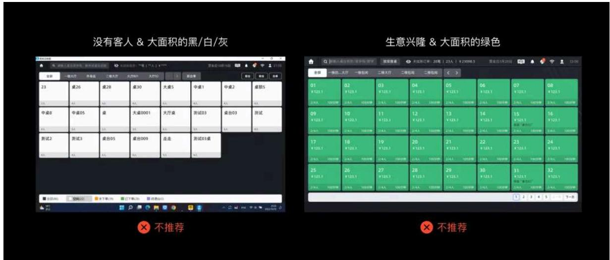

▲ 案例：空桌台与满桌台

# #04

# 总结

以上就是客如云在POS收银机探索出的设计原则，后续还会不断完善迭代，通过将人因研究和业务实践相结合，去不断降低用户的工作疲劳感，减少用户在使用过程中的肢体、视听疲劳和认知负荷，以提高用户的工作效率和舒适度。

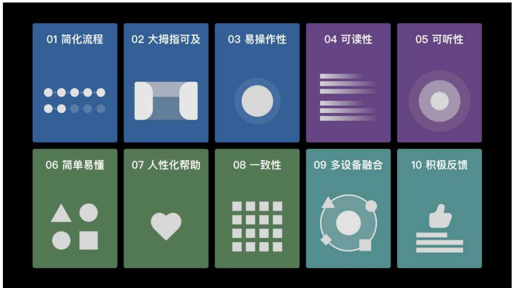

▲ 10条POS设计原则

本期作者：阿新、曾成、尚怡、福橘

O 