# 工业品的专业化探索—爱采购商品详情页升级

原创 百度MEUX 百度MEUX 2025年2月12日 18:30 北京

# 前言

爱采购作为百度旗下B2B工业品采销平台，经过多年行业积累及AI的强大加持，为产品设计带来了诸多新机遇。其中，商品详情页作为传递商品价值的关键场景，能够有力地帮助买家更好了解和认识商品价值。本文以商详页升级实战案例为例，针对工业品买家在采购链路中的差异化需求，围绕商品专业表达、店铺优势扩充、恰当开口引导三个方面，升级买家采购体验的同时助力业务转化效率提升。

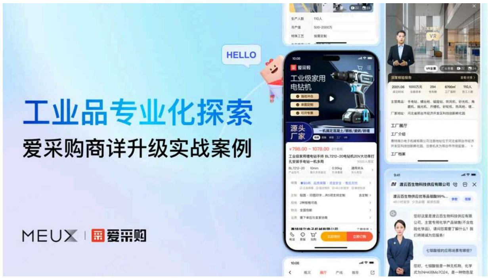

# 一、项目背景

# 1. 产品现状分析

爱采购商品详情页在初建之时，整体结构沿用了市场上已培育的商详心智结构，包括主图、价格、保障、规格、店铺、详情等，以满足B2B工业品买家的基本诉求。随着业务的不断深耕，爱采购的定位从“买卖好货源，做出好生意”升级为“定制、批发、找工厂就来爱采购”，逐步扩展了更契合B2B工业品买家的采购决策信息，如商品定制、拿样、工厂等，而线上商品详情页的商品信息堆砌浏览效率低、店铺优势表达弱难以区分、咨询洽谈沟通效率低等问题日益凸显，影响工业品买家的采购体验。

爱采购商品详情页现状

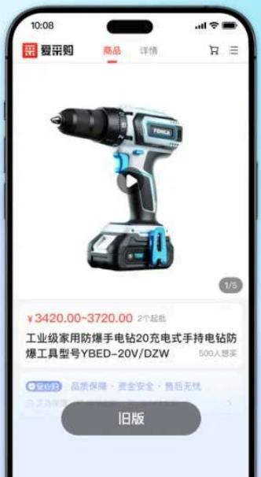

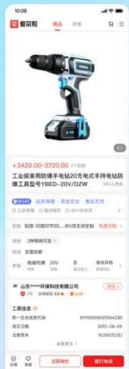

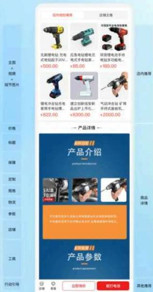

# 2.品类差异分析

作为B2B工业品采购平台，工业品采购与日常C端消费品购买在品类定位、采购人群、购买用途等方面均存在较大差异：

- 品类定位差异：日常消费品主要为个人或家庭满足生活需求，工业品主要是指购买后用于生产加工和企业经营的产品，包含机械设备、化工能源、农林牧渔、五金机电等行业。

- 采购人群用途：工业品按照购买目的分为中间型工业品、最终工业品，对应买家也分为两类，一类是终端用户，采购后用于企业经营与生产；另一类是流通商，采购后用于销售。

这两类买家在商详页浏览信息过程中，对于选商品、选店铺、去洽谈三个核心环节存在较强的差异化诉求：

- 商品信息：消费品外观展示较多、功能易懂、用户评价聚焦体验；工业品专业性强，重视商品技术参数、规格等，质量认证严格、应用场景明确。

- 店铺信息：消费品关注品牌、强调好评率、促销活动较多；工业品重视工厂实力，包含生产能力、企业资质。

- 咨询沟通：消费品关注基础信息，沟通过程较为简单；工业品洽谈过程复杂，对效率要求高，涉及采买数量、多轮报价、成本分析谈判等。

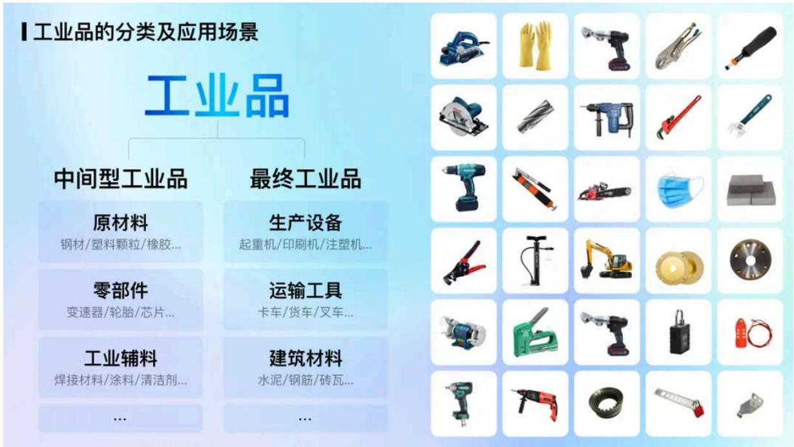

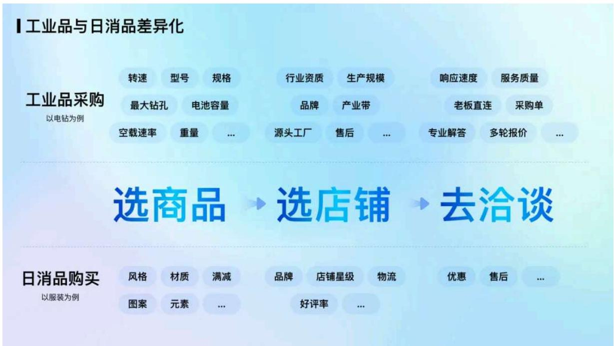

# 二、设计策略

结合产品发展阶段、品类信息差异化诉求及百度AI能力的强大加持，爱采购商详页作为买卖双方连接的核心场景，在商品信息、店铺信息及咨询沟通三大场景中均具有显著优化潜力，我们秉持高效、专业、智能的设计理念，围绕商品专业表达、店铺优势扩充、恰当开口引导三个方面，逐步升级B2B买家工业品专业采购体验。

# 爱采购工业品商详升级

设计目标

围绕B2B工业品买家采购差异化信息诉求，升级商详页采购体验，提升满意度及转化效率

采购动线

选商品

选店铺

去洽谈

设计打法

商品专业表达
高效呈现

店铺优势扩充信心加固

恰当开口引导加速决策

设计举措

重塑商品首屏信息

构建详情行业模板

丰富店铺优势信息

打造沉浸逛厂体验

渐进式开口引导

创新数字人智能接待

# 三、具体举措

# 1. 商品专业表达，高效呈现

# 1）重塑商品首屏信息

商品详情首屏停留时长有限，如何在有限的空间和时间内快速获取有效信息？我们引入了AIDA模型，该模型用于描述消费者从接触营销信息直至完成购买行为的全过程，分为注意(Attention)、兴趣(Interest)、欲望(Desire)、行动(Action)四大模块，将商详页首屏信息丰富、整合、优化。

# 重塑商品首屏信息

商品参数

商品型号

是否定制

是否可拿样

保障

买家采购环节兴趣焦点

优势卖点

起批量

公司实力

物流

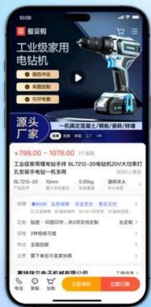

商品信息结构

初步匹配

主图、视频、细节...

Attention 

注意

价值吸引

价格、标题、参数..

Interest 

兴趣

信任加强

保障、规格、物流...

Desire 

欲望

服务转化

Action 

行动

注意(Attention)初步匹配：商品图片区域升级为通顶沉浸容器，打造商品主图行业模板，不同于消费品主图以展示细节、促销为主，工业品商品主图多数品类图片传递信息较少，通常会结合商品名称、店铺信息、优势亮点等信息进行展示，一般主图元素包含背景、商品、前景三部分。

通过大量行业特征的设计洞察，提炼商品主图的字体、材质、背景、色彩、构图等视觉特征，字体以硬朗稳重风格为主，材质强调产品特性、背景多以轻微纹理或行业场景为主，色彩多以低饱和度为主，构图多搭配挂载元素且较为规整对称，整体体现工业品的专业、可靠、稳重。

整体元素的色彩配比，以7:2:1或6:3:1的“主色:相似色:高亮点缀色”来拉大信息层级表达，我们设计了100+主图行业模板，通过B端的商品智能主图工具，引导商家在商品发布时选择使用，更好地满足商家不同的商品信息表达。

重塑商品首屏信息·主图行业模板

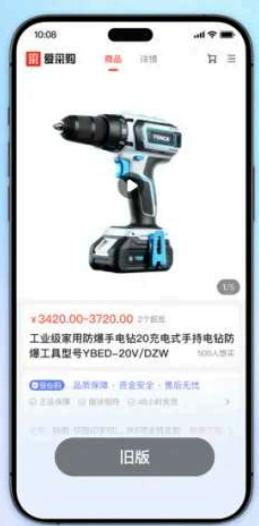

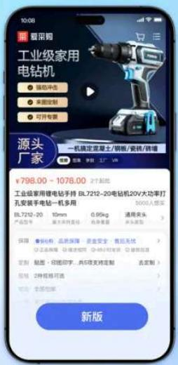

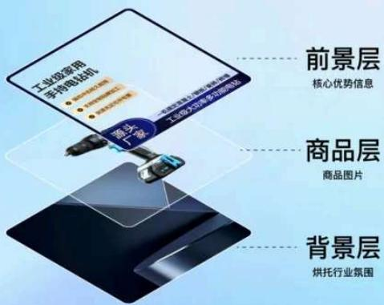

前景层

核心优势信息

商品层

商品图片

背景层

烘托行业氛围

重塑商品首屏信息·主图行业特征提炼

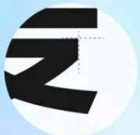

字体

硬朗稳重

材质

突出商品材质

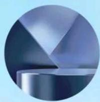

背景

强调行业属性

7:2:1 

6:3:1 

色彩

以低饱和度为主

构图

规整对称

# 重塑商品首屏信息·主图行业模板

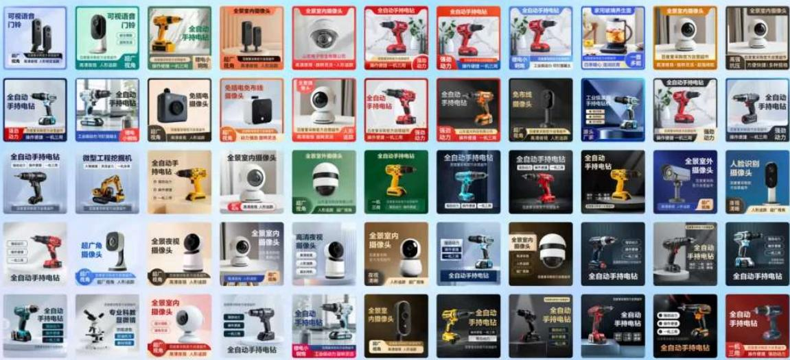

除主图行业模板，我们还扩展主图区域多模态容器承载优势信息，包括参数、工厂、VR等，参数卡采用列表结构化展示商品核心参数信息，提升浏览效率，工厂卡扩充工厂成立时间、面积、员工人数、注册资本等，VR卡通过3D VR还原工厂线下真实形态，融合真人数字人讲解，实现买家沉浸式逛厂。

# 重塑商品首屏信息·多模态扩展

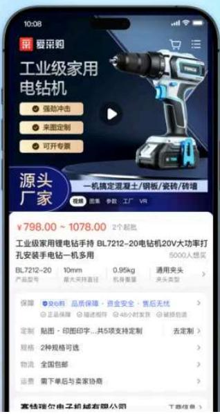

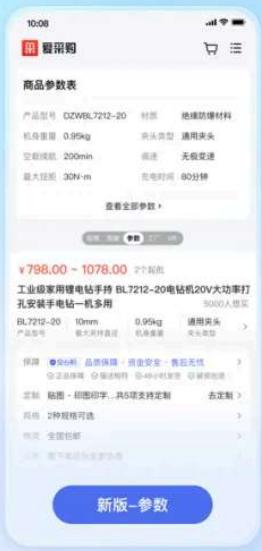

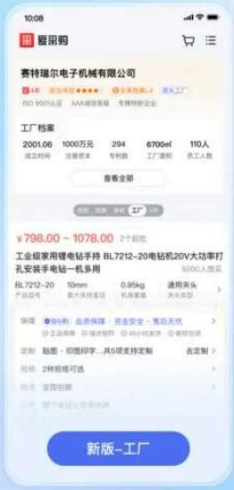

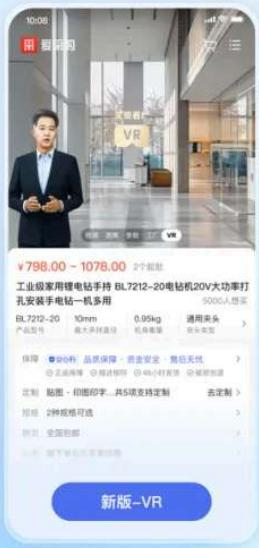

兴趣(Interest)价值吸引：依据工业品商品参数化找品的诉求，我们把核心参数信息上移至标题下方，并强化多决策信息，价格、营销、服务等，服务类突出源厂定制、包邮拿样等服务特色，激发买家兴趣。

欲望(Desire)信任加强：将商品的基础信息保障、定制、规格、物流、运费等进行整合，减少分割感，同时强化百度保障、安心购等标签样式及信息优势来加强保障信任，刺激买家决策。

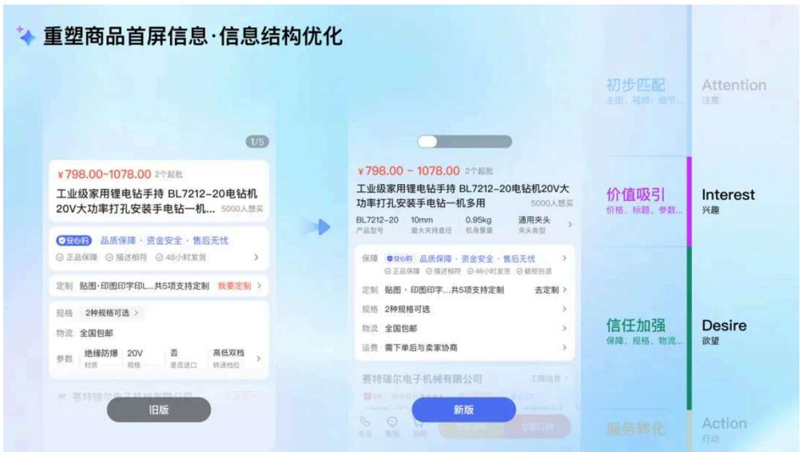

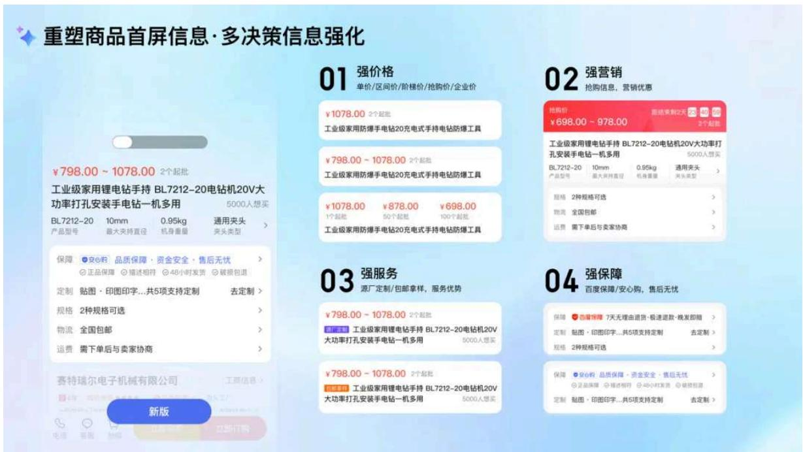

行动(Action)服务转化：依据工业品商品特性，有些品类偏向在线下单，有些品类则偏向线上沟通线下交易，我们个性化打造交易和非交易两种服务框架，交易商品凸显拿样、订购、加购等采购行动点，非交易商品凸显客服、询价、电话等沟通行动点。

重塑商品首屏信息·个性化服务框架

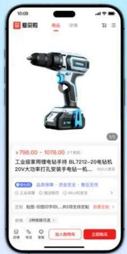

沟通行动

客服

询价

电话

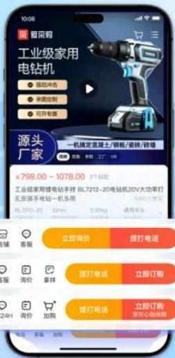

采购行动

拿样

订购

加购

# 2）构建详情行业模板

除首屏外，商品详情能够帮助买家全方位了解产品，从而促进决策。我们分析了多个典型行业，如机械设备、化工能源等，构建商品详情行业模板，从商品、商家、服务、交易等维度对产品进行分析，提炼信息共性，拆解概况、参数、细节、应用领域、厂家实力等10+模块，设计60+详情组件，AI创辅2000+物料，打造多套多色详情模板。通过B端商品智能详情工具，引导商家提供对应的行业化详情内容选择个性模板，以更好地满足买家挑品决策的需要。

构建详情行业模板·商品详情信息共性分析

行业

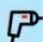

机械设备

包装印刷

电子仪表

化工能源

汽配汽用

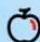

农资产品

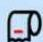

办公文教

... 

维度

商品

名称/型号/核心参数/用途/卖点...

商家

工厂/规模/认证/资质/品牌...

服务

定制/拿样/响应速度/履约...

交易

起批量/交易方式/售后...

详情

商品概况

· 商品名称

· 商品型号

· 核心参数

· 优势卖点

... 

商品参数

·尺寸规格

·重量

·材质

·精度等级

... 

商品细节

·商品特写

· 结构图

·尺寸图

·包装图

• ... 

商品优势

·性能

·工艺

·材料

· 专利/认证

... 

应用领域

·应用行业

· 应用场景

· 配套使用

... 

$\therefore m = \frac{3}{11}$ 

使用说明

·安装步骤

·注意事项

· 操作方法

· 使用规范

... 

商家实力

·源头工厂

·生产规模

·公司实拍

·认证/专利

… 

服务说明

· 定制服务

·拿样服务

·售后服务

· 质保说明

• ... 

购物须知

价格说明

交易方式

- 退换货政策

... 

# 商品详情行业模块

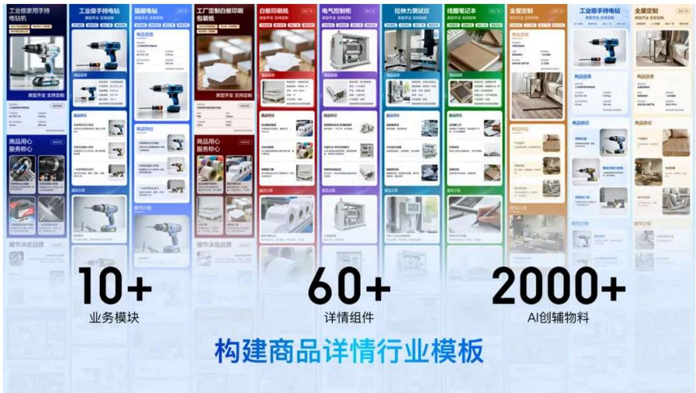

# 2.店铺优势扩充，信心加固

# 1）丰富店铺优势信息

新版店铺卡升级为基础信息、多媒体、转化三个区域，提升信息承载力，同时挖掘高价值信息，扩充更加具有店铺差异化的标签，如企业类型、生产模式、认证品牌、知识产权等，并定义展示优先级，辅助买家采购决策。针对工厂类实力店铺，全方位强化实力信息，如工厂规模、生产能力、专利资质、合作方式、认证信息等多维呈现，提升买家对工厂的实力感知。

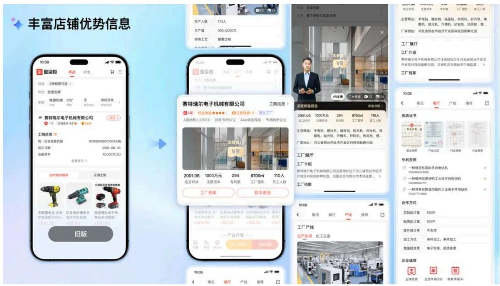

# 2）打造沉浸逛厂体验

工厂类店铺，通过对线下物理空间进行1:1完整复刻，打造高度沉浸的3D VR体验，内置工厂2D/3D视图，让工厂实力更加生动、直观呈现，买家更加身临其境。VR内置丰富的商品/视频等信息展示方式，提供多维的信息获取途径。同时，为了能让工厂关键角色出镜，传递真实、专业、可靠的感知，拉近生意人之间的距离，我们探索1:1还原工厂厂长数字人分身，支持老板带看工厂、语音讲解、知识解答、7x24H在线，提高信息传递的效率和效果。

# 打造沉浸逛厂体验

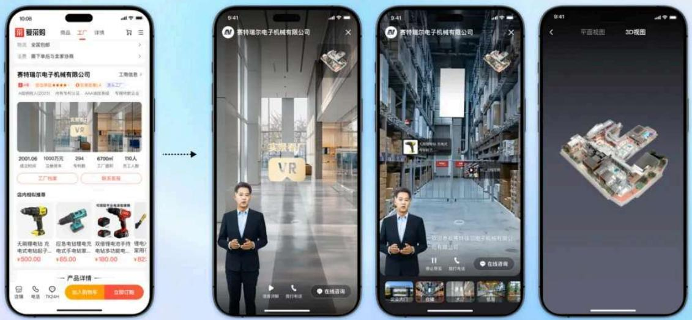

# 3. 恰当开口引导，加速决策

# 1）渐进式开口引导

工业品的采购洽谈周期复杂而漫长，能否谈成一笔生意，往往取决于交谈的效果。我们跟随买家的浏览动线，采用渐进式问答前置引导，页面首屏在图片区域增加问题引导，页面中部则深度融合了商品的个性化引导支持展示多个引导入口，页面底部通过模块化整合多个问答信息强化引导，提升买家开口效率。

# 渐进式开口引导

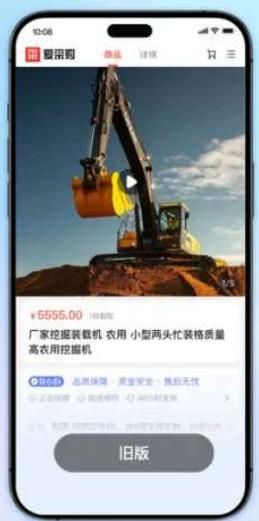

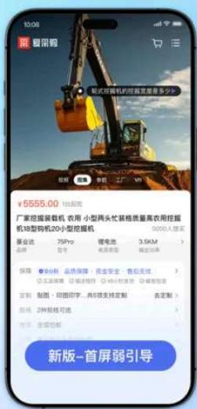

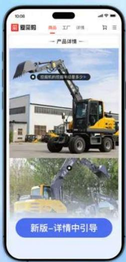

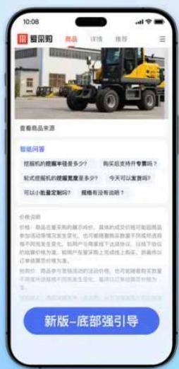

# 2）创新数字人智能接待

在对咨询服务需求高的商品品类下，我们引入真人客服形象的数字人进行1V1服务。商品主图区域创新融合数字人外露，前置智能体优势信息，如产品讲解、使用指导、24H在线等。同时，将传统的IM升级为数字人智能体承接，细分买家开口、咨询、留资、挽留四个阶段，主动进行意图识别理解、需求澄清激发、专业知识解答，数字人个性语音讲解为买家打造智能化、沉浸式的多模交互体验。

创新数字人智能接待·真人数字人形象

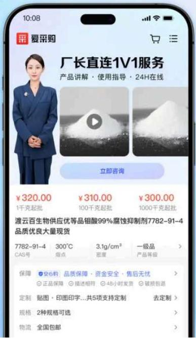

创新数字人智能接待·商家智能体框架承接

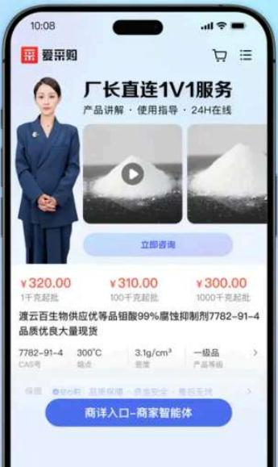

商家智能体主界面

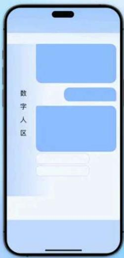

商家智能体框架结构

# 商家区

# 对话区

- 意图识别理解
- 需求澄清激发
- 专业知识解答
- 个性语音交互

# 输入区

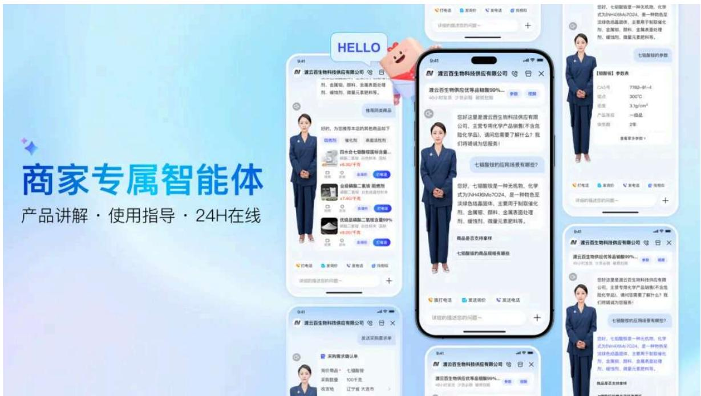

# 写在最后

爱采购B2B工业品的专业化表达探索，围绕商详页的商品专业表达、店铺优势扩充、恰当开口引导，经过持续一年的迭代验证，买家的咨询开口率及留资转化率显著增长。但这仅仅是探索工业品信息表达的起步，未来我们将持续探索B2B工业品采销领域的精细化体验。我们相信通过不断的体验升级与技术创新，爱采购将引领行业向更加专业化、智能化的方向发展，为买卖双方创造更大的价值。

感谢阅读，以上内容均由百度MEUX团队原创设计，以及百度MEUX版权所有，转载请注明出处，违者必究，谢谢您的合作。申请转载授权后台回复【转载】。

也欢迎加入MEUX,交互/视觉/用研

可投简历至meux-talent@baidu.com

(注明信息获取来源如：公众号)

以下文章，你可能也感兴趣

MEUX 「一月」 AI设计观察

寻找国宝计划—探寻传统文化与数字艺术的文化创新

百度APP评论场景AI角色设计实践

百度APP“捏一下看早晚报”，最新资讯轻松掌握

MEUX 「十二月」 AI设计观察