# 小桔有车租买车业务体验设计升级

车服设计 CDX设计部 2020年12月11日 14:54

# 一.背景

小桔租车1.0上线一段时间了，过程中很多功能点时间紧、迭代快，点状的设计迭代满足了租车前期的业务发展，接下来随着业务模式变化，需要整体性的思考，什么样的体验更符合现有业务模式？特此，设计和产品同学一起，以现有业务为基础，从全新的视野出发，以产品设计比赛的形式，从业务模式、产品框架到信息结构、设计语言全部进行了重构与升级，并推进产研开发落地，拿到结果。

# 二.调研分析及设计目标

# 1. 用户分析

从有车的流量来看，大多数都是来自于滴滴出行端，从出行端用户的特性可细分为需求明确型、纠结对比型、闲逛型、商家（车企、销售）4种类型。每种类型的用户需求是不同的，因此我们需要从不同维度设计以解决不同问题。

<table><tr><td>人群细分</td><td>人群属性</td><td>设计方向</td><td>设计方案</td></tr><tr><td>需求明确型</td><td>用车场景、价格预算、品牌偏好、用车方案等</td><td>快速触达</td><td>搜索、筛选工具</td></tr><tr><td>纠结对比型</td><td>明确1-N个诉求,对比细化其他诉求</td><td>对比效率</td><td>搜索、对比、推荐</td></tr><tr><td>闲逛型</td><td>用户不了解小桔有车是干嘛的</td><td>心智透传</td><td>业务透传、服务优势、推荐</td></tr><tr><td>商家(车企/销售)</td><td>更多的曝光入口/更多的优质新鲜的线索</td><td>差异化表达</td><td>搜索、筛选工具</td></tr></table>

# 2. 线上问题

业务探索调整前我们的业务以租车为主，业务发生调整后，模式由纯租到租买灵活，原有主流程和页面已经不能很好的支撑当前业务了，同时之前也存在一些体验问题：

# (1) 业务心智模糊

用户无法第一时间分别车辆是租是买，服务定位模糊，平台信任感薄弱；

# (2) 导购效率低

原首页只能以逛的形式看车，没有快速找车入口，也没有筛选功能，首屏入口数据点击差，流量无法转化；

# (3) 信息结构混乱

车辆卡片浏览动线混乱；同类信息用多种表达结构，增加理解成本；详情页方案沟通冗长，不分层次；

# （4）看车形式单一

大量文本阅读，缺少图片展示，决策成本高；列表页全侧车型图展示，车辆识别度低。

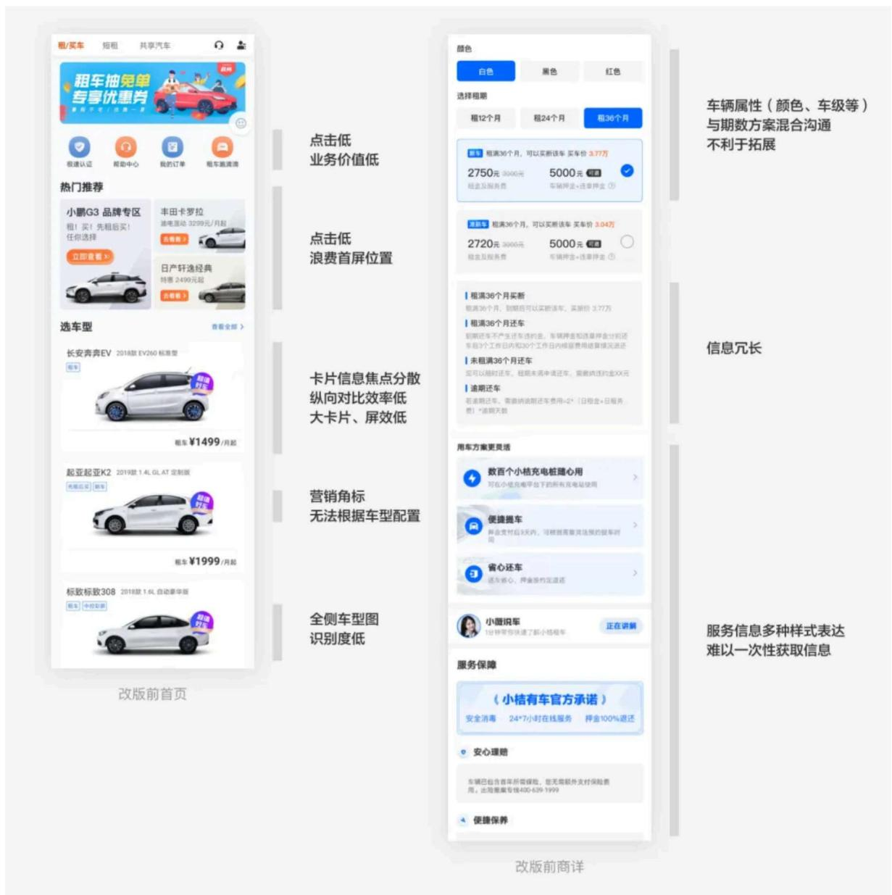

# 3. 设计目标

基于不同用户群体的差异化需求及线上发现的问题，提炼此次改版的3大设计目标：

（1）导购效率提升（2）决策牵引强化（3）看车体验升级

# 导购效率提升

差异化满足需求

# 决策牵引强化

高频率透传信息

# 看车体验升级

多维度展示车型

# 三. 聚焦重要信息，提升导购效率

为了评估目前导购效率，从数据维度对首页各个模块的点击率以及首页到商详的转化率进行了统计分析。通过首页点击率分布，可以看到排布在上面的banner、金刚区功能icon，瓷片区运营位点击数据都很差，首屏流量占比非常低。首页到商详的转化率低，导购效率不好。结合数据，我们从业务诉求、用户需求、人体工学、营销透传4个维度进行了信息结构的优化。

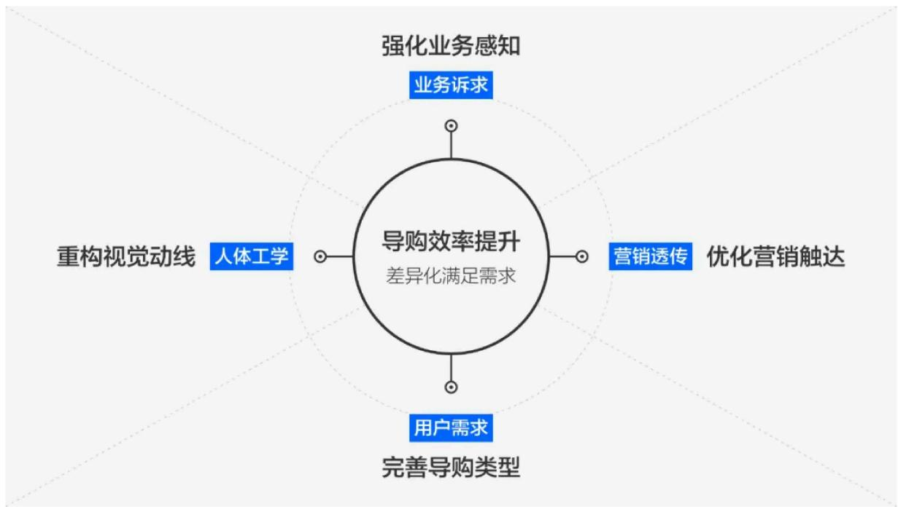

# 1. 强化业务感知

因为车型有3种不同的租售模式（租、买、先租后买），所以在首页feed流和商详都增加了模式tab，透出所以模式价格。除了方便定位不同模式，也强化了平台一直推行的业务模式的感知：先选车，再选用车方式；同时在banner下面增加了平台定位的品宣，传达“一站式租售平台”的业务属性，让用户了解平台、信任平台。

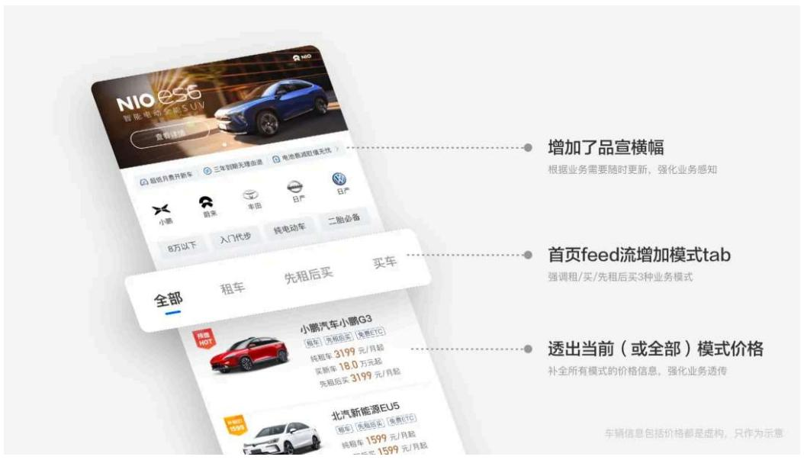

# 2. 完善导购类型

在保持原有列表浏览结构（闲逛型）的前提下，分别针对不同人群增加了品牌筛选（纠结对比型）、快速定位（需求明确型）、定向导购（需求明确型）三种导购方式，以此满足不同用户在平台上的需求，帮助业务转化。

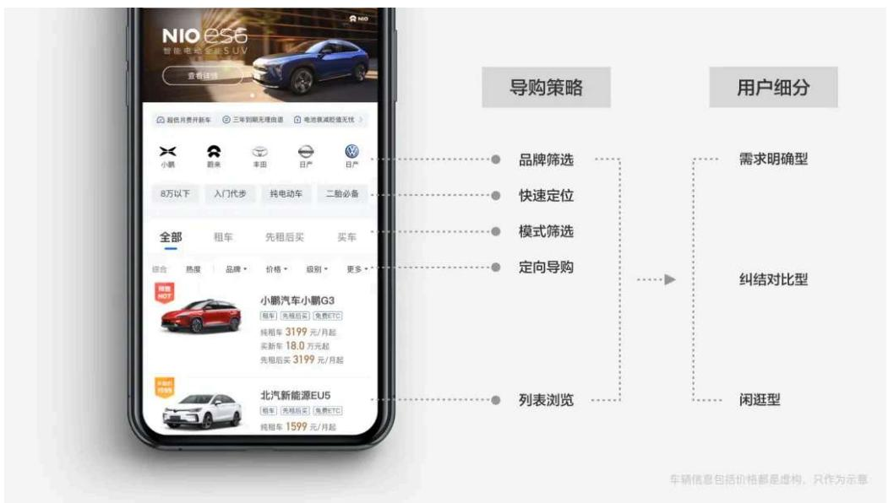

# 3. 重构视觉动线

原有车型卡片的排版信息分散，浏览动线都是点状、分散的，在信息获取方面无法聚焦。优化后，一致的左图右文结构，符合用户从左到右阅读的视觉动向，同时易于滑动浏览，提高纵向对比效率；因为业务的扩张，大量高端车型入住，所以在车型图上也进行了调整，将车型视角调整为 $45^{\circ}$ 角，提高车型识别度。将原有车型卡片高度压缩，在有效信息更合理聚焦的同时，大大提高屏效。

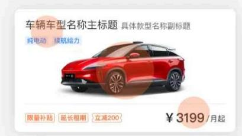

改版前浏览动线

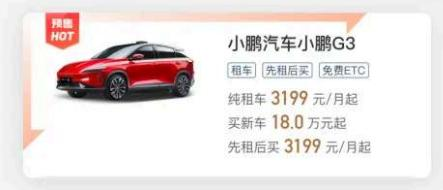

改版后浏览动线

车辆信息包括价格都是虚构，只作为示意

# 4. 优化营销触达

原有运营位在首屏列表之上，点击率很低，影响首屏列表流量转化。改版后将运营位穿插在列表中，提升了首屏屏效，而且差异化视觉表达更能吸引点击；针对界面颜色丰富饱和度高，各类标签样式不同、位置不同，分散视觉注意的问题。新设计在视觉层级上将非营销版块颜色降级，让用户在浏览feed流的过程中，视觉焦点更聚焦在左侧车型图及营销标签上。

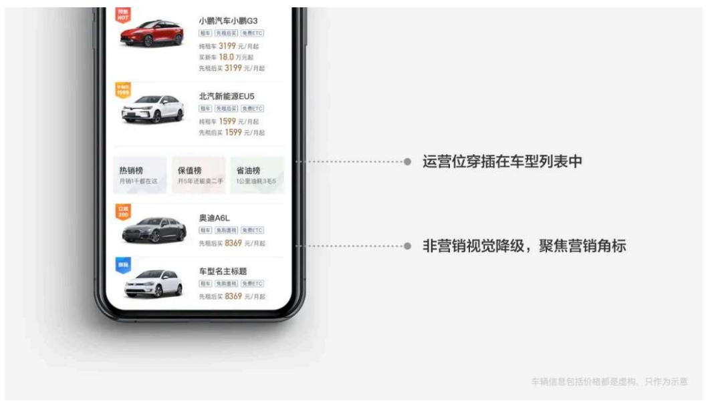

# 四. 强化决策牵引，提升用户转化

一切信息的准备都是为了最后的转化，而商详页作为车辆信息、方案详情、平台信息的承载页，在决策牵引转化的链路中起到关键作用，商详页的设计好坏决定了转化的好坏。重新设计从吸引决策、降低顾虑、辅助决策、挽留决策4个层次构建，层层递进，打动用户。

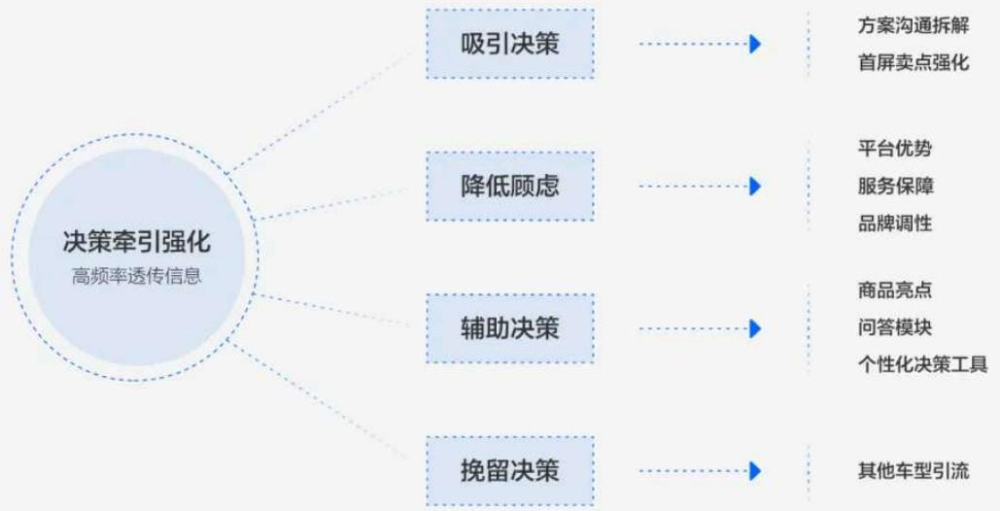

# 吸引决策

首屏用商品图片结合核心卖点、营销活动、用车方案详情来吸引用户，给用户留下美好的第一印象；

# 降低顾虑

用平台优势和服务保障来打消顾虑，透传一价全包、免费换车、无忧取消等服务承诺；因为买车业务重线下体验，基本上都会去线下进行体验后再下单，所以在线上透传实体门店照片，来打造线上线下一体、品牌调性一致的权威感，同时用户去到线下也能形成一种熟悉感；

# 辅助决策

继续浏览会有多维度信息来辅助决策：增加可配置的车型亮点图片，侧滑交互呈现，对比竞品节省3屏高度；常见问题、专业评审等解决共性问题，打消疑虑；增加个性化决策工具，方便多维度比较，辅助用户决策。

# 挽留决策

最后当用户浏览完全部信息也没有打动自己时，会有其他车型的推荐，一方面增加用户在app浏览时长，另一方面为其他车型引流转化。

吸引决策

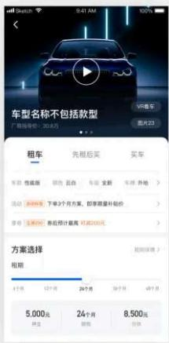

降低顾虑

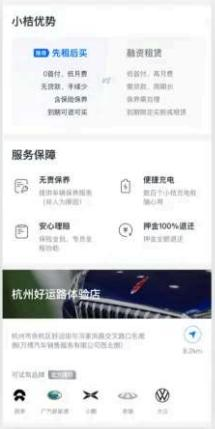

辅助决策

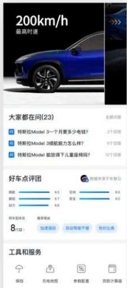

决策挽留

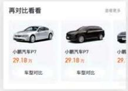

车辆信息包括价格都是虚构，只作为示意

# 1. 方案沟通拆解

租车和买车的方案主要由期数、首付决定。期数越久、首付越高，月租金（或月供，下同）越低。在实际业务中，牌照类型和车级（车辆新旧）也会影响月租金。改版前：同样租期下，有几个车级就展示几个方案卡片；牌照跟租期一样，作为选项，直接影响每个卡片的月租金。考虑到租买结构统一，买车业务中颜色、款型、配饰等可能都会像牌照类型和车级一样影响月租金。按照原有设计样式，这些属性直接作为选项，将大大减低决策效率。所以思考了新的设计解法：

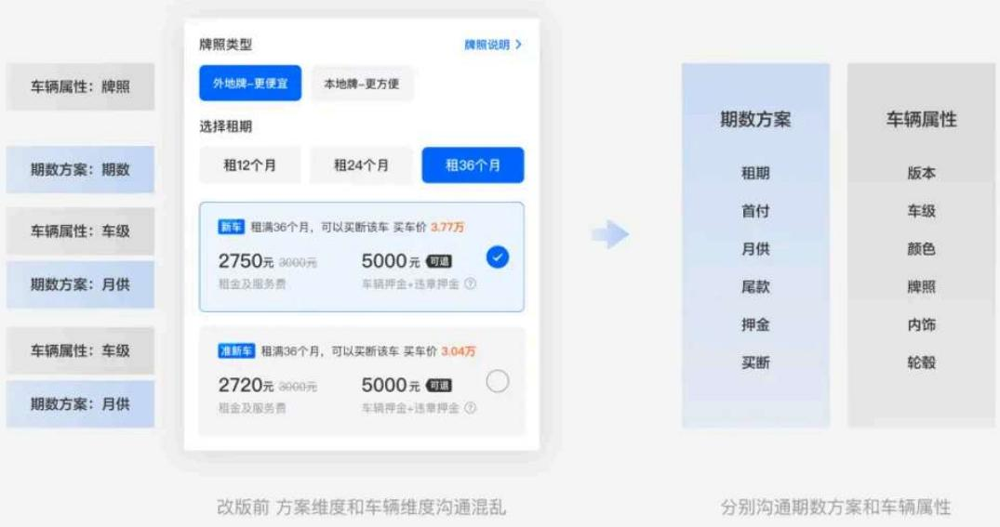

# 解法一：信息拆解

将车辆属性信息（颜色、新旧等）和方案信息（期数、价格等）拆解开，分别沟通，结构化信息的同时，让用户选择更清晰。颜色、新旧、车牌等车辆属性作为商品sku，提供一个默认参数，在默认参数下，月租金的变化就仅仅根据首付、期数等方案层面的参数而改变了，对比方案时自变量更少，便于决策。

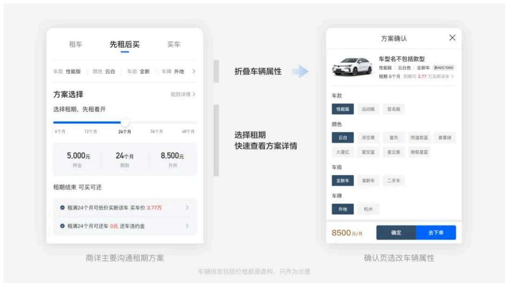

# 解法二：分步操作

在商详只沟通方案信息，选择方案后，分步选择“车型”、“外观”、“内饰”等车辆属性。保证用户聚焦在当前页面。两个解法都进行了信息分级分层，解决了方案沟通混乱的问题，解法一更适合高效决策的租车场景，解法二信息分步展示，决策链长，更适合重决策如买车业务，考虑到目前业务以租车为主，买车不走线上交易流程，所以选择了解法一。

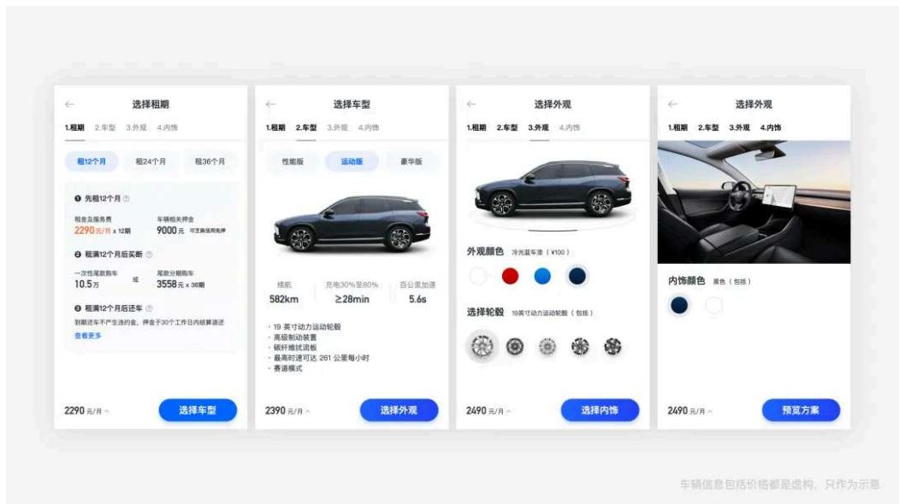

# 2. 首屏决策效率

改版前商详页首屏只展示车辆照片，获取信息维度单一，决策牵引力弱，决策效率低，为此进行了一下2点优化：

# 1. 卖点前置

将营销卖点、商品卖点、服务卖点等在头图位置透传，提高首屏决策效率；

# 2. 增加VR看车功能

用更科技化的手段，提升用户看车感官刺激。

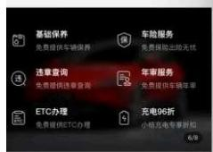

服务卖点

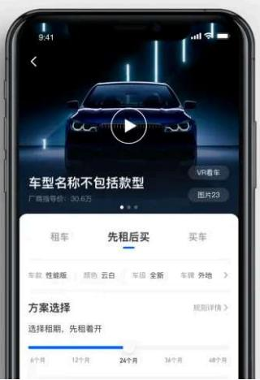

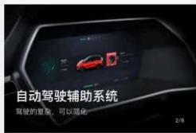

车型卖点

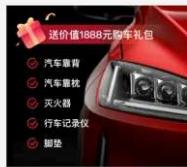

营销卖点

车辆信息包括价格都是虚构，只作为示意

# 五. 看车体验升级，提高看车效果

# 看车体验问题

1. 线上缺乏服务感：“自己看车效率低，没有专属客服解答疑惑”

2. 缺乏信任感：“都是照骗，买家秀和卖家秀的问题”

# 解法：

私人管家1对1线上讲解服务提升看车体验，实时解答用户疑问并真实的用视频直播的形式，给用户看到真实的车辆。

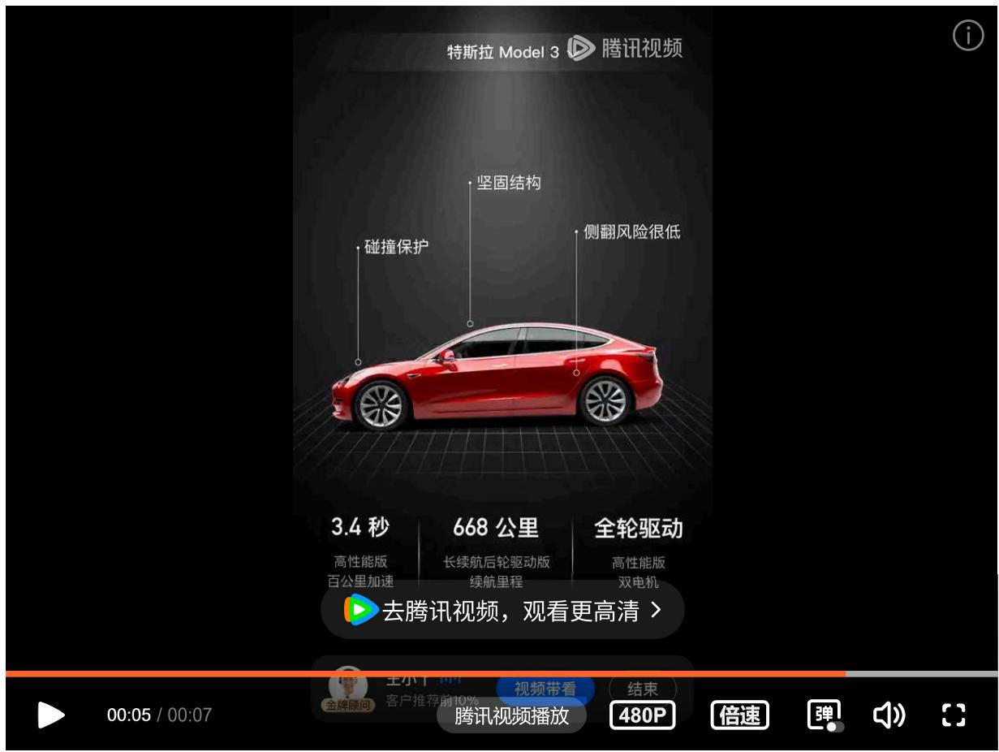

# 六. 设计风格重构，提升科技感和统一性

# 1. 图标重绘

改版前icon风格各异，没有按照使用场景进行分类。改版后，将非行动点icon弱化，降低视觉比重，统一为线状icon，并且在色调上也更靠近冷酷的科技色；

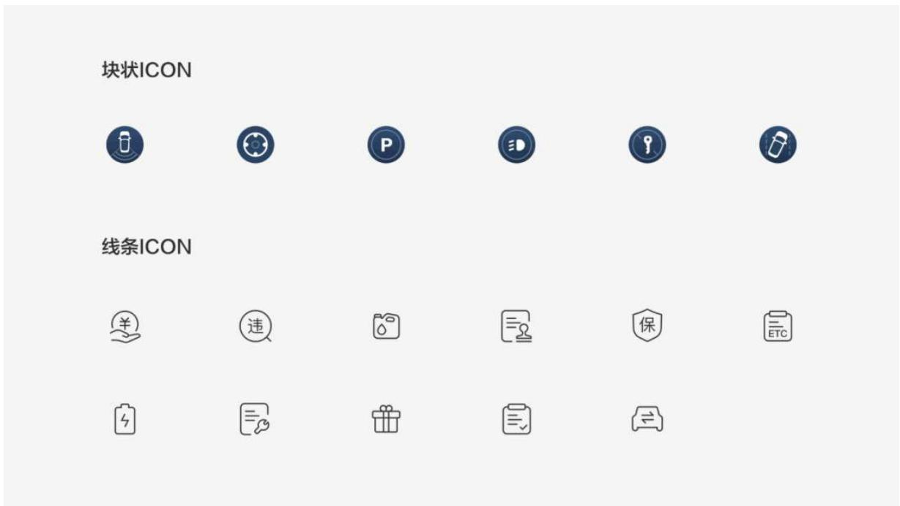

# 2. 设计规范

因为业务一直在快速变化，很多设计规范来不及沉淀，借这次体验升级将字体做了统一规定，拉大了标题和正文的对比，整合了相近字号，比如，剔除了26号字，只保留24号和28号字。除了字号，也优化了其他设计语言，在整体色调和排版形式、设计表达更符合汽车工业的科技感。

# 七. 设计结果

首页停留时长+37.9%

安卓端用户每日平均停留时长在逐渐攀升，首页浏览停留时长比改版前+37.9%。

商详到达率+9.4%

改版后商详到达率提升效果明显。改版后，月到达率均值同比提升 $9.4\%$ 

# 数据表现

37.9% 

改版前后首页停留时长提升改版后导购更丰富、列表更易读

9.4% 

改版前后首页-商详到达率提升多维度导购场景更吸引用户点击

103.2% 

确认方案-去下单UV（对比对照组）商详决策牵引力有提升

# 结论

改版上线后，数据表现稳中有升，特别是因为增加了多种导购方式，首页停留时长和点击转化大幅度提升；商详-下单UV大幅度提升，但是下单成交提升幅度较小，需要持续思考并探索在重决策业务中更多促转化抓手。