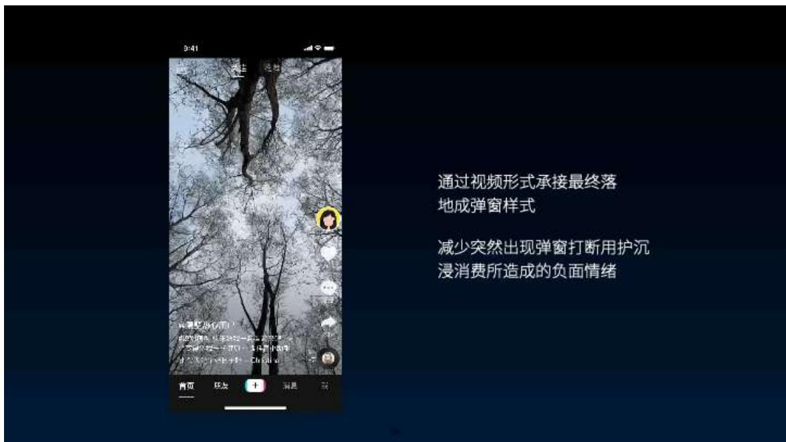
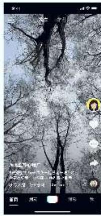
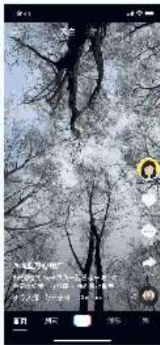
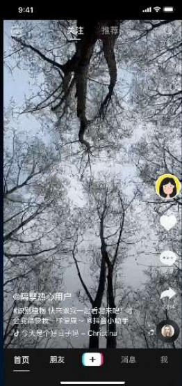

## 抖音「休息提醒」设计探索

抖音设计中心 Douyin Design 2022年4月22日 20:00

## 前言 / FOREWORD

随着网络科技的发展，当今中国已进入全面信息社会，以互联网信息通信技术为先导的智能技术，深刻改变着人们的生产生活。出行、娱乐、购物、新闻等等都已经从现实转换到了互联网。虽然极大地丰富了我们的生活，但也伴随着一些“低头族”“易沉迷”等社会问题的产生。

抖音作为有着一定社会影响的产品，一直致力于承担社会责任，引导用户积极向上的生活方式。所以我们这次在做的抖音休息提醒设计探索，不是让用户不用抖音，而是要引导用户健康地使用抖音。

那我们通过以下几个案例来和大家聊聊，抖音是如何引导用户休息的。

## Part 1 「划不走的语音条」

线上抖音休息提醒视频

相信大家都在线上看到过休息提醒视频，休息提醒视频作为一种提醒方式，用户好感度较高；但同时，用户多次观看后会产生审美疲劳，且视频中由明星来传递提醒信息，容易被用户当成广告快速划走；另一方面休息提醒信息大部分集中在视频尾部，很难让用户快速感知。

所以我们需要解决的关键问题是：如何让休息提醒信息能够被用户持续有效感知并保持良好体验？

最直接有效的做法就是视频播放不满足x秒不能被划走，这样确实会让用户停留并感知到提醒内容，但仅仅做到这样，显然是不够的。作为体验设计师，我们应如何让体验变得更好呢？

## ■ 打破规范，情感化表达

规范

情感化表达

按照规范，我们可以使用通用提示条来提醒用户。虽能满足提示用户的诉求，但会缺少情感，尤其在视频不能划走的情况下，不足以很好地减少用户的阻断感。

所以我们打破常规，在视觉上增加了情感化的表达，将视频内容中的明星/IP和底部的提示条做了融合。在用户滑动时，出现带有明星形象的提示条，结合表情、个性、动作，传递提醒信息，增加真实感和趣味性；

## ■ 多感官维度信息表达

12

除了在视觉上的表达外，我们还增加了听觉维度的表达。结合不同明星/IP，根据其人设，用不同性格的语音来提醒用户，让提醒信息多维度传递给用户，使提醒变得更有温度、有个性、有惊喜。

## 信息内容的情绪递进

划动1次

00:08

划动2次

温和提醒

稍微变强

用户在滑动「划不走的提醒视频」时，滑动一次没有成功，可能会再次操作，随着滑动次数增多，大大降低操作体验。我们根据用户滑动次数的递增，也让小横条上明星的语音、动作、表情都做了情绪上的升级，增强互动感和趣味性。

最终呈现的划不走的语音条方案如下：

Part 2 「蒙层方案」

优化前的蒙层方案，主要问题有：

1、用户在出现蒙层前无明显感知，当出现蒙层后有较强的阻断感；

2、突然出现的蒙层打断用户沉浸消费体验，更容易产生不好的用户体验；

蒙层的提醒方式是能够满足产品诉求且能够承载更多内容的形式，在目前看没有更好的替代形式，因此现阶段不能取消掉蒙层；所以此次优化的重点是，如何减少用户被打断沉浸消费而带来的用户体验问题？

## ■ 视频承接，弹窗落地

结合抖音视频消费的属性，通过视频形式承接最终落地成小窗样式，减少突然出现弹窗打断用户沉浸消费所造成的用户体验问题。

视频到蒙层的承接，是我们本次方案的亮点。其实亮点不仅是这样一个承接方式，更多的是创造了一种内容消费的场景，以及为蒙层赋能了一种承载更多内容的形式。

缩放形式【主推】

引导用户需从沉浸在事物本身到跳脱出来

蒙层形式

那我们为什么选择缩放形式，而非其他形式呢？比如右边的蒙层的形式。

先举个小例子，大家应该都熟悉，就是我们在画素描时，我们一直在不断抠细节，然后老师在后面就会说：“来来来，你出来，站远点自己看看……”其实我们这里要表达的也是一样。

通过缩放造成视角变化，制造距离感。希望引导用户从沉浸在事物本身到跳脱出来，站远一点再看。

有可能看到的是事物的全貌；有可能还是这件事，但环境、场景、角度等其他因素的改变，感受也就不一样了。劝导用户要时不时跳出来，站远一点，可能会有不同的收获。不要沉溺于某一环境之中，沉溺于小小的屏幕之上。

## ■ 蒙层面板，具有可拓展性

我们打造了这样一个消费内容的场景「蒙层面板」，它的优点就是具有较强的可拓展性。目前蒙层面板上都承载哪类内容呢？

基础元素类

设计初衷是通过基础元素的缩放，最终落到蒙层上面成为蒙层的一部分

第一类，也就是我们一开始的想法，承载2d、3d等几何图形或简单视觉元素，通过缩放，最终落在蒙层上面成为其一部分。希望通过简单视觉元素的动效转变，让蒙层的出现更缓和、有趣。

## 视频类

承载公益类（如寻人启事类）、认识自然类等具有社会价值的内容。

助力企业社会责任的承担

第二类，是承载视频内容。这部分目前想法是承载公益类视频内容，如寻人启事类，认识自然类等具有社会价值的内容，助力企业社会责任的承担。

## 插画类

通过插画多方面的角度来刻画主题，营造安静静谧、身心愉悦的放松氛围，让用户能够放松心情，消除负面情绪；

在端内打造品牌透传的阵地，提高品牌价值透传

第三类，是承载插画类内容。一方面能够通过这种情感化的表达，让用户放松心情，消除负面情绪，感知到抖音的提醒和引导；另一方面也在探索更多端内打造品牌透传的阵地，提高品牌价值透传。

## 结语 / END

以上就是抖音休息提醒本次优化的重点方案。「让用户能够健康地使用抖音」是我们不断追求的目标。后续我们会从不同的场景、不同的角度去探索，去优化。也欢迎大家和我们一起共同打造健康、有用的抖音。

## 抖音设计岗位热招中～扫码查看心仪岗位

