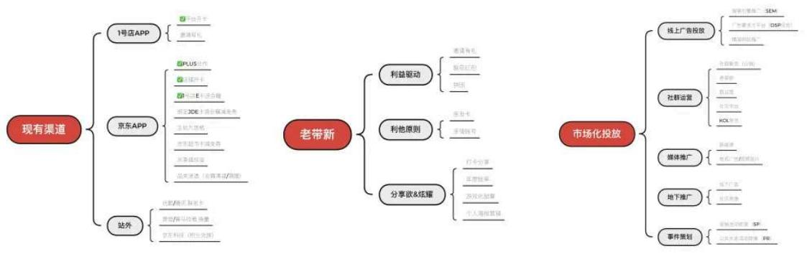
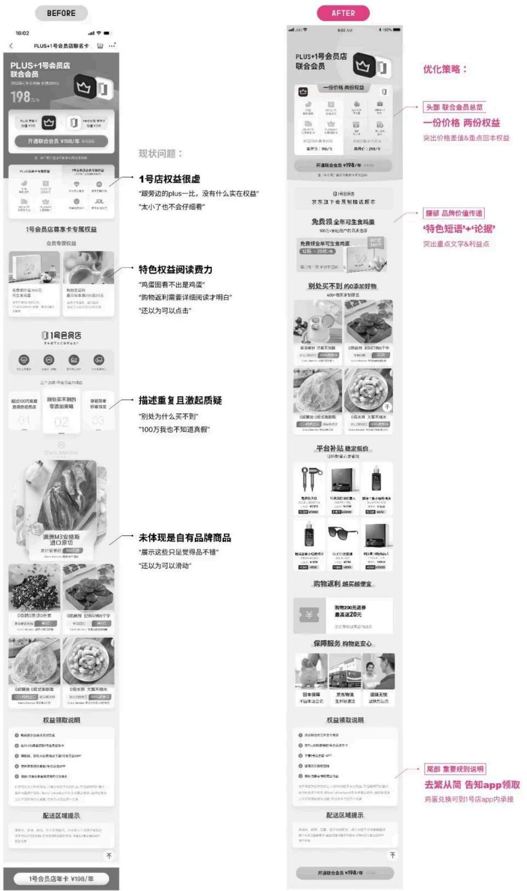
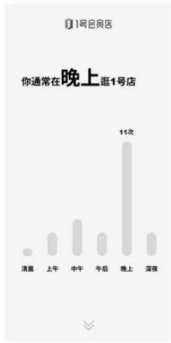
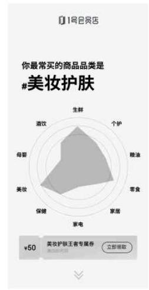
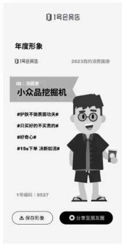
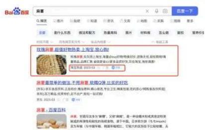
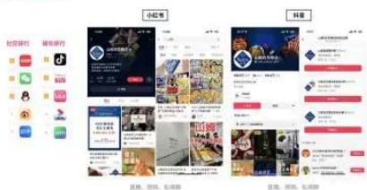
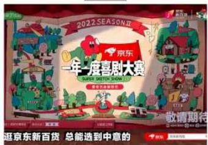

## 浅谈一号会员店如何高质量拉新

原创 白晓丽 京东体验设计中心 2023年7月21日 16:30 北京

用恋爱思维找到与平台匹配的高质量用户

我有什么

谁需要我

去哪找

怎么吸引

## 一、平台有什么能力 / 清晰平台边界及市场定位 /

一号会员店是会员制电商平台，用户开卡后可在平台进行购物消费，以下通过SWOT分析及交叉分析得出平台定位及相应策略思考。

平台的优势（S）是依托于京东的供应链及物流，商品品质&物流送货速度快；在商品上一号店自有品牌One's member更是做到了源头直采，严控质量，为会员精选全球高性价比的品质好物；其次在价格上做到低价稳定，无需用户多处比价，为用户提供省心省钱的简单购物方式。

目前不足之处（W）是入会门槛需预支会费，平台商品的品类宽度及种类不足，用户粘性相关的非核心交易模块不足（如内容、社交属性的模块），用户为会员制平台投资的决策难度较大。

在机会（O）方面，后疫情时代消费者更注重商品低价、性价比，与平台优势具有契合之处，同时一号店有京东用户数据及基础能力，借势京东达到平台快速突破。

面临的市场挑战（T），兴趣电商及内容电商、以及KOL达人带货等新型带货形式的发展，对于市场占有具有侵略性。

因此通过上述分析，在产品的策略上，坚持贯彻稳定低价、全球精选的平台理念，加强产品的基础体验建设，拓展平台内容/互动服务能力，在口碑传播方便不断提升商品&品牌的影响力。当然不是所有平台都要一蹴而就，结合当下业务目标找准市场发力点，并精准命中目标客群，实现业务增长。

S -京东的供应链及物流

-全球甄选高性价比好物

-独家定制好物

- 简单稳定低价

优势

W -需缴纳会费才有购物资格

- 内容/互动等服务体系不完善

- 产品种类sku相对较少

-社交媒体影响力不足

劣势

- 后疫情时代消费者期望低价省心购物

- 拥有京东用户基础及数据能力

机会

T -兴趣/内容新型电商吸引大量用户

-KOL/达人带货经济盛行

威胁

SWOT交叉分析策略思考

## S·O

## 积极策略

贯彻稳定低价、全球精选的平台理念

## W-O

## 改善型策略

平台基础体验建设（商品&服务）

## S·T

## 多元化策略

拓展平台内容/互动服务能力

## W·T

## 防御性策略

口碑传播提升社交媒体影响力

(1.S-O积极型策略：以企业内部优势结合外部机会，创造利益最大化。2.W-O改善型策略：改善内部劣势，可思考将企业发展转向向外部机会。3.S-T多元化策略：善用内部优势克服外部威胁，例如以公司资源发展多角化、差差异化的产品策略或提升品牌价值。4.W-T防御型策略：减少内部劣势，并回避外部威胁，以撤退、风险回避为主的防御型策略。)

## 二、高价值用户有什么特征 / 以高价值用户画像为指导/

## 1、基本属性特征：

1号会员店用户年龄集中在26-55岁，已婚家庭型用户为会员主力占70+%，已孕占比50+%，地域分布集中在广东、北京、上海、江苏、浙江共占50+%。家庭用户居多。在开卡动机刺激上，开卡礼可考虑适合小家庭的商品作为钩子品，宣传语强调“100万家庭用户选择”。在投放城市选择上，优先考虑一线/新一线中产白领家庭更多、消费能力更高的城市。

## 2、消费偏好特征：

在二级类目偏好上，粮油调味、休闲零食、饮料冲调是top3的类目，品牌上也有更具倾向性的偏好。因此可根据用户偏好热门商品/热门品牌，以品寻人精准投放广告，注重在京东购物黄流重点品的合作推广。站内外宣传可将热门爆款商品价差作为宣传点，着重私域运营时的爆品选择。

## 3、会员开卡渠道及动机：

从开卡渠道来看，效果最好的（用户量大aurp值高）用户大都来源于京东app渠道，京东主站店铺&plus合作知名度认可度最高，口碑类传播推广（亲友-测评-kol等）对用户转化效果尚可。根据访谈结论，每月鸡蛋权益、Plus联名、开卡礼吸引是主要的用户开卡的动机原因。

## 三、在哪找到更多这样的用户 / 找到目标客群聚集渠道进行定向拉新/

## 1、现有渠道：

不同渠道的拉新质量与用户arpu值相关，目前拉新渠道主要为三类：1.1号店app站内转化，2.京东主站引流，3.1号店app站外合作。从拉新质量来看，京东主站plus联名&自营店铺转化的用户质量较高，京享值及E卡赠送会籍的形式用户价值偏低。可以看出，以平台商品/内容为引导的拉新方式，客群更加稳定高效，通过赠送会籍吸引来的大都是羊毛用户。

## 2、老带新：

物以类聚，人以群分。老带新的用户增长方式能够触达更多目标客群。从动机类型不同将老带新玩法归位3类：1.利益驱动2.利他原则3.分享欲&炫耀。目前站内老带新玩法以邀请有礼为载体，发邀者更多出于利益驱动，对于消费能力较高的客群吸引力不高，因此被邀者转化效果有限。可以通过尝试亲友卡、亲情账号，从利他角度出发促使用户分享平台，受邀者门槛也相应降低，在控制好权益分配成本分配的前提下，可以一定程度提升GMV。此外，也可尝试年度账单等情感化方式进行口碑裂变，加深品牌私域传播。

## 3、市场化投放：

借鉴同类模式竞品拉新渠道，通过社交媒体诸多途径进行市场化投放，提升平台认知度及口碑影响力。如下图所示罗列出现有渠道、老带新玩法及5类市场化投放的渠道方式。

## 四、什么信息更吸引TA们转化 /平台价值的信息传达/

## 1、平台特色服务信息精准传达：

如上文提到，京东app是目前一号店重要的获客渠道之一，以PLUS&一号会员店联名卡场景方案优化为例，分析如何更加精准的信息表达。在现有方案中（左图）存在4个问题：1.头部权益介绍模糊，仅罗列两个平台的局部权益，价值传递不足；2.一号店两大特色权益以卡片形式展示，仅看图无法快速获知权益内容，容易被忽略。3.平台特色描述无依据可信度低。4.一号店自有品牌的差异化选品仅以5个商品卡片展示，未能传达定制选品的概念，且表达形式让用户以为可以交互。优化后方案（右图）的策略有3个：1.头部为联合会员总览，突出‘一份价格两份权益’价格差值及重点权益的展示。2.腰部一号店品牌价值传递，通过‘特色短语+论据’的形

式，有理有据、总分结构传递平台价值。3.尾部重要规则及开卡步骤的说明，简明扼要，引导完成该场景下开卡转化任务，避免让用户觉得流程繁琐。

## 2、老带新实现自发的口碑裂变：

老用户口碑裂变带动新用户，做好老用户分享环节是吸引新用户的关键性第一步，可以通过用户与平台产生情感/精神共振，使用户（老用户）自发实现平台分享传播意愿，如网易云每年出圈的年度账单，通过趣味沉浸式的报告生成交互过程，回顾过往一年用户在平台上的关键行为及数据回看，最终生成一张可用于分享和传播的图片。年度账单的设计关键有2点：1是关键行为数据要具有代表性；2是最终海报生成要激发用户分享欲（如体现用户独特的生活方式，有一定的荣誉或炫耀心理）。在用户分享的基础上，平台实现精准辐射分享者身边新用户的传播效果。

年度账单

关键行为数据回顾

关键行为数据回顾

结合优惠券投放，促进转化

生成可传播的趣味海报

## 3、多渠道推广增加平台知名度：

除了站内及私域的传播，也需要更多渠道的广告投放和运营提升平台知名度和曝光度，以下几个案例：线上搜索引擎广告投放、内容平台社群运营、新闻媒体软文推广、视频网站电视广告、地下纸媒推广等渠道，都是可以参考的贴近目标用户生活场景的投放渠道。

1. 线上广告投放

2. 社群运用

3. 媒体推广

视频网站 电视广告

4. 地下推广：结合热点事件/IP人物

