# 达达快送9.0升级-设计复盘

原创 达达快送 京东体验设计中心 2023年10月12日 16:31 北京

# 参与成员

宝箱

Brandon_L

Murphy

小王

# 9.0升级目标

DADA×JDDJ's Experience Design Center

# 01 视觉升级

·设计语言升级

# 02 体验升级

- 操作体验升级
- 浏览体验升级

# 03 转化升级

·C端转化  
·B端转化

我们主要围绕着“视觉”、“体验”、“转化”，3个关键词去进行升级

# 一、视觉升级

# 设计语言升级

前期我们对快送竞品进行了一轮调研，并且结合快送用户群。发现普遍集中在新一线二线城市。年轻群体较多。通过以上在用户、行业及行业趋势等多维度的信息搜集后，我们确定了达达快送品牌设计的3个核心关键词：年轻、速度、极简

# 年轻

营造年轻生活

多元的生活方式

# 速度

贴合品牌感知

安全、准时的服务

# 极简

专注产品体验

便捷、流畅的使用

# 1、年轻：营造年轻生活

新IP的融入，以及产品中更鲜明的颜色和更多的圆角卡片，能够为产品营造出更年轻的感受，让内容更聚焦，拉近用户之间的距离。

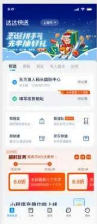

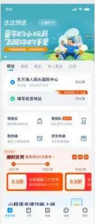

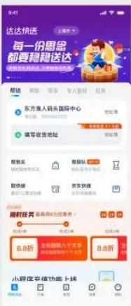

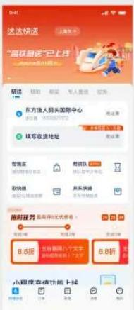

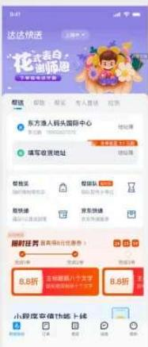

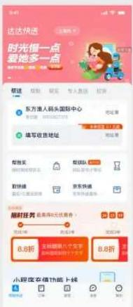

品牌色饱和度提升

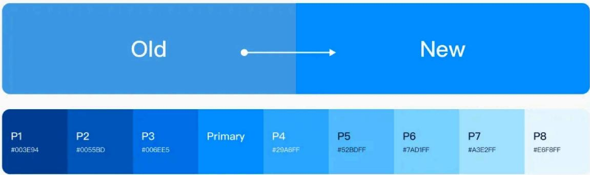

品牌色占比控制

<table><tr><td>品牌色
#008CFF HSB (207, 100, 100)</td><td>70%</td><td>辅助色
#00CB83 HSB (159, 100, 80)</td><td>30%</td></tr></table>

# 2、速度：贴合品牌感知

建立品牌符号，通过具有速度感和安全感的图形表达，让用户感受到快速、安全的同时记住“达达快送”

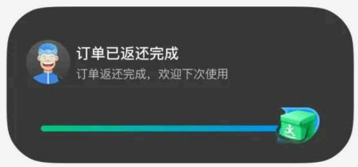

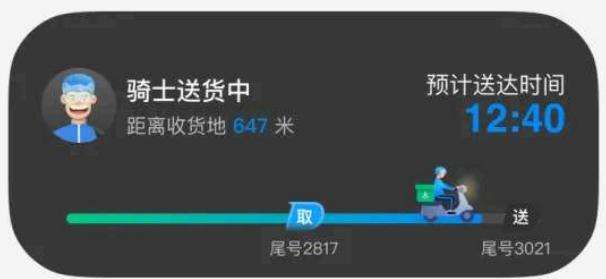

# 3、极简：专注产品体验

简化主流程页面结构和信息层级，规范交互一致性，塑造视觉清爽、交互流畅的产品体验

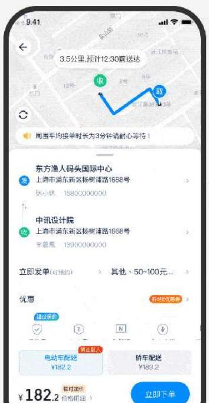

# 二、体验升级

# 1、发单页问题&优化

a、增值服务无法曝光给用户，整体的屏效较低；

b、行动区域较弱，整体布局无结构化；

c、操作区域无规律，用户在使用过程有较多的不便捷的使用成本；

d、信息层级混乱，且无结构化的信息浏览顺序，导致用户的信息获取速度较慢；

e、小程序和app结构不统一，维护成本高、跨端体验不一致；

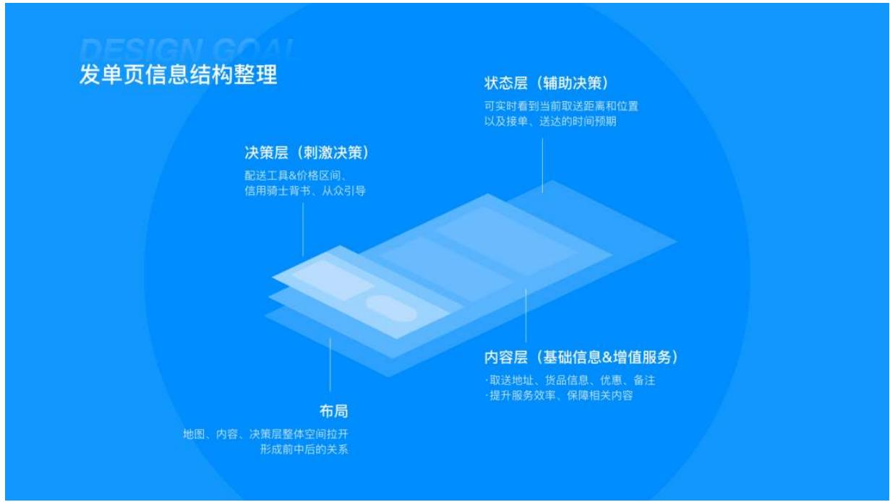

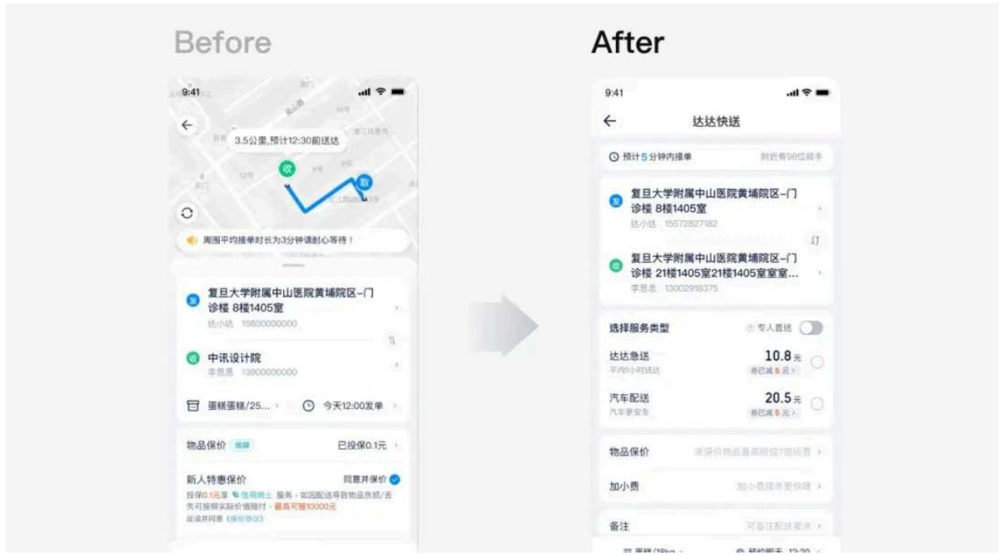

# 2、详情页问题&优化：

a、视觉动线应服务于信息重要性（app骑士信息过于突出等问题），屏效较低；

c、品牌的透传需提升，品牌特征识别性不高；

c、小程序和app结构不统一，维护成本高、跨端体验不一致；

为了多端体验对齐和优化（c端、b端、小程序端），本次进行了竞品调研，调研聚焦在页面结构、页面交互、视觉焦点动线、品牌透传方式、降低取消率策略等，提炼各家通用特征和优势项。

竞品体验调研

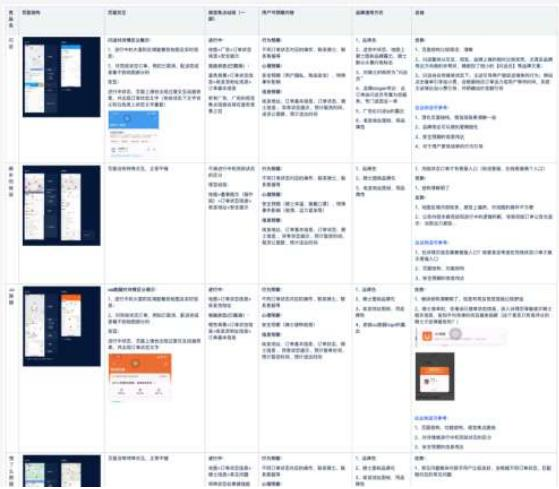

<table><tr><td colspan="4">项目/人姓名/情况及管理事项</td></tr><tr><td>项目/人</td><td>本年计划-摘要</td><td>项目名称、摘要</td><td>是否中-摘要</td></tr><tr><td rowspan="5">报告期</td><td>摘要</td><td>日期：</td><td>日期：</td></tr><tr><td>摘要</td><td>基本（按日期，15-30分计算）：如1-2、2-3、3-4、4-5、5-6、6-7、7-8、8-9、9-10、10-11、12-13、14-15、16-17、18-19、20-21、22-23、24-25、26-27、28-29、30-31、32-33、34-35、36-37、38-39、40-41、42-43、44-45、46-47、48-49、50-51、52-53、54-55、56-57、58-59、60-61、62-63、64-65、66-67、68-69、70-71、72-73、74-75、76-77、78-79、80-81、82-83、84-85、86-87、88-89、90-91、92-93、94-95、96-97、98-99</td><td>若出现时间，需要执行的
摘要：</td></tr><tr><td>摘要</td><td>1. 企业负责人签字/盖章：</td><td>1. 人员姓名及单位公章：</td></tr><tr><td>摘要</td><td>2. 申请部门办理登记手续后签字/盖章：</td><td>2. 申请部门通过法定代表人账户持有时间，须在业务结束时以公告为准。对其他信息负责审核工作。</td></tr><tr><td>摘要</td><td>3. 其他部门办理登记手续后签字/盖章：</td><td>其他部门办理登记手续后，需提交审批文件。</td></tr><tr><td rowspan="3">报告中</td><td>报告期</td><td>1. 未完成登记手续后登记手续后，需提交审批文件。</td><td>1. 联系文件签署后登记或相关文件确认。</td></tr><tr><td>1. 报告日期和委托期限是否签字或确认，不需提交至指定的日期和时间（如日期）签字或确认。</td><td>2. 未完成登记手续后登记手续后，需提交审批文件。</td><td>2. 联系文件签署后登记或相关文件确认。</td></tr><tr><td colspan="3">2. 未完成登记手续后登记摘要，须加盖公章复印件，加盖营业执照复印件。</td></tr><tr><td rowspan="2">报告期</td><td rowspan="2" colspan="2">定期报告期，周一至一并，无需在规定时间内产生以下事项</td><td rowspan="2">日期：</td></tr><tr></tr><tr><td colspan="4">项目/人姓名/情况及管理事项</td></tr><tr><td>项目/人</td><td>本年计划-摘要</td><td>项目名称、摘要</td><td>是否中-摘要</td></tr><tr><td rowspan="2">报告期</td><td>摘要</td><td>日期：</td><td>日期：</td></tr><tr><td>摘要</td><td>基本（按日期，15-30分计算）：如1-2、2-3、3-4、4-5、5-6、6-7、7-8、8-9、9 - 9 - 10 - 11 - 12 - 13 - 14 - 15 - 16 - 17 - 18 - 19 - 20 - 21 - 22 - 23 - 24 - 25 - 26 - 27 - 28 - 29 - 30 - 31 - 32 - 33 - 34 - 35 - 36 - 37 - 38 - 39 - 40 - 41 - 42 - 43 - 44 - 45 - 46 - 47 - 48 - 49 - 50 - 51 - 52 - 53 - 54 - 55 - 56 - 57 - 58 - 59 - 60 - 61 - 62 - 63 - 64 - 65 - 66 - 67 - 68 - 69 - 70 - 71 - 72 - 73 - 74 - 75 - 76 - 77 - 78 - 79 - 80 - 81 - 82 - 83 - 84 - 85 - 86 - 87 - 88 - 89 - 90 - 91 - 92 - 93 - 94 - 95 - 96 - 97 - 98 - 99</td><td></td></tr><tr><td rowspan="3">报告中</td><td>报告期</td><td>更新日期/重要文件内容：</td><td>更新日期/重要文件内容：</td></tr><tr><td>报告期已重新提交至报告期末，未重新提交到的部门或相关部门（如部门）的报告室签字/盖章；</td><td colspan="2"></td></tr><tr><td>报告期是否开始办理披露，须如实向董事会备案，要求尽快备案。</td><td colspan="2"></td></tr><tr><td rowspan="2">报告期</td><td rowspan="2">定期报告期，周一至一并，无需在规定时间内产生以下事项</td><td>日期：</td><td>日期：</td></tr><tr><td>已重新申请，具体一章：</td><td>已重新申请，具体一章：</td></tr></table>

信息结构简化

Before

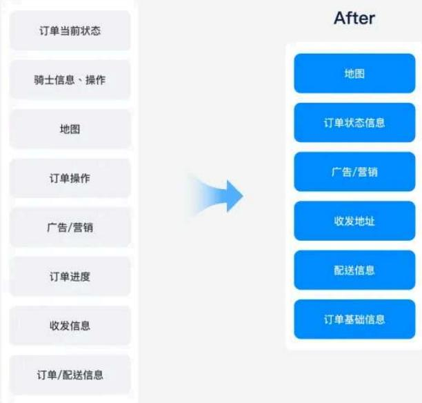

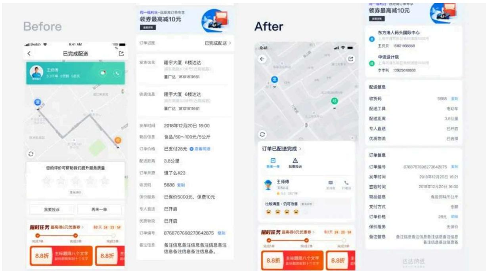

# 三、转化升级

在整个达达快送产品的转化流程中，最重要的指标之一就是“完单率”，在完单率下又有2个关键的过程指标，“下单转化率”和“取消率”。只有当我们“提高下单转化率”或“降低取消率”，完单率才能得到提升。然而目前我们虽然有一个完善的转化链路，但还需要对整个流程进行深挖，探索各个节点下对转化有提升的方案。

# 1、提升转化的核心思路是什么？

转化的本质是“触发行为”，只有在供需匹配的情况下，用户才会“关注”。而“关注”只是“转化”的开始，我们要做的是一步又一步的去触发用户下单的行为。

# 2、怎么触发用户行为？

先来看一下斯坦福行为设计学创始人“福格”的结论，行为=动机*能力*提示

动机：越强的动机行为越容易发生（用户动机）

能力：越强的能力越容易完成行为（用户和产品能力）

提示：没有提示，不会有任何行为（产品提示）

根据这个结论，可以看出我们要做的是在链路中强化用户动机、提升用户和产品能力、以及给出符合场景的提示

福格行为模型

# 3、问题聚焦

在改造前，我们通过问卷以及体验走查的方式收集了大量的反馈，并筛选出与转化有关且能够被设计影响的内容，进行了优先级排序，随后进入方案阶段。

问卷调研+体验走查

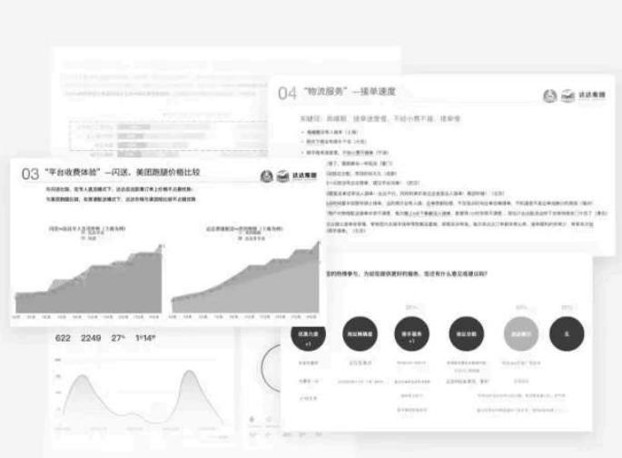

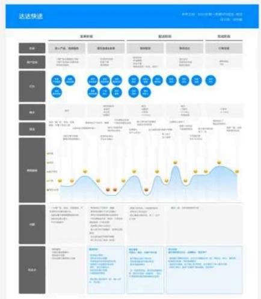

# 4、C端转化-提升下单转化率（首页、物品信息页、发单页）

根据动机、能力、提示3个点来制定设计策略，且以下方案都围绕着这些点进行设计：

a、提高用户下单动机：通过时效信息、安全信息相关的透传，变相的让给用户感知到我们的服务“值”，来强化用户选择我们服务的动机。

b、通过提升分发能力、展示更多丰富的服务，让用户感受到我们有能力满足他的诉求，提升供需匹配的能力。

c、通过个性化的推荐算法设计，提升服务和用户的匹配度，给用户足够的提示，降低用户决策成本。

1、首页：新增细分场景、载具以及时效的前置透出。快速匹配一些需要细分服务，以及长距离和时间较为敏感的用户。提升首页的分发效率，同时也让业务有更多的拓展空间。

Before

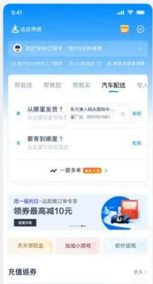

After

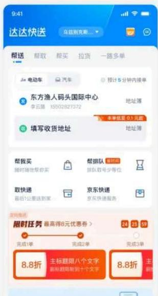

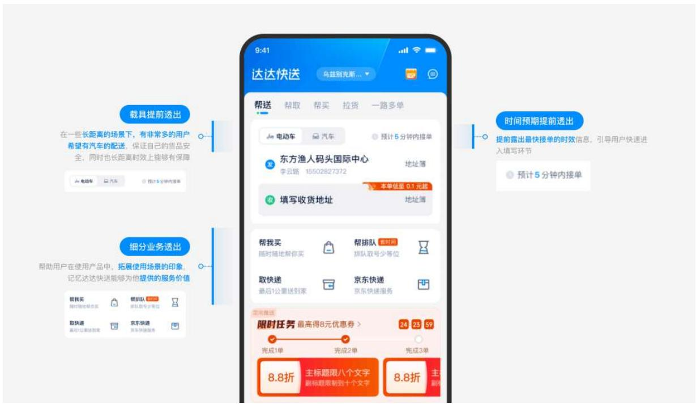

2、物品填写页：新增推荐载具推荐逻辑，根据物品品类的选择，帮助用户可以快速决策在不同场景下最适合的载具，同时增加信息“已有x%的人选用”，利用从众心理引导用户选择。最终帮助用户在不同场景下选择最合适的服务。

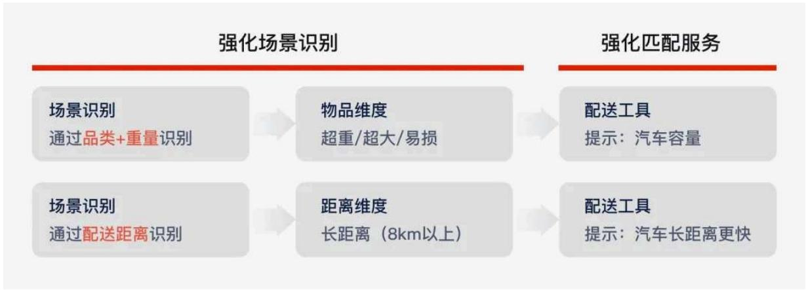

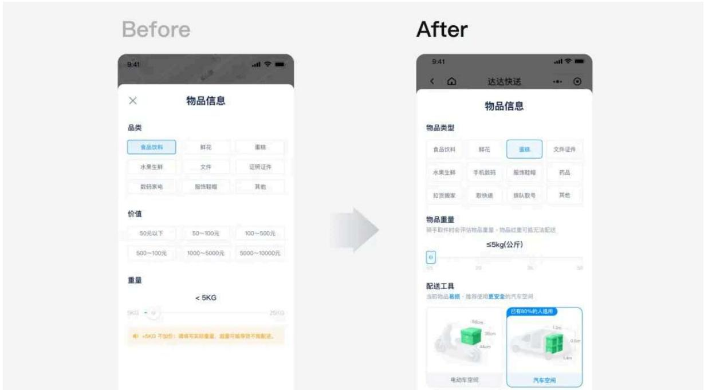

3、发单页：新增接单时效，提升用户下单决策。将服务项平铺展示，露出不同服务的差异和价格，帮助用户可以快速匹配自己需要的服务。同时在安全性上做了强化，让用户可以安心下单。

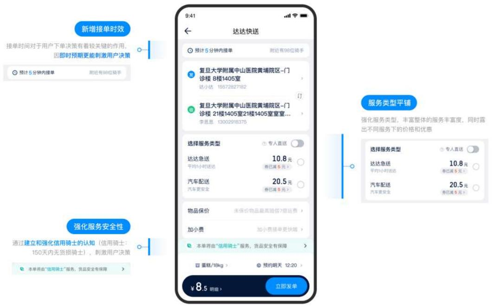

# 5、B端转化-提升下单转化率（首页）

B端首页：

a、原首页管理订单功能占比高，发单功能占比弱，通过填写地址前置、载具能力曝光、时效曝光，增强商户发单信心、缩短发单流程

b、曝光平台众多丰富的服务，更容易匹配多类型商户诉求，提升供需匹配的能力。

Before

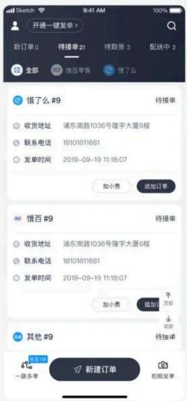

After

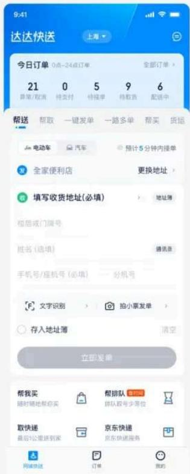

# 6、B、C两端转化-降低取消率（详情页）

详情页：主要围绕降订单取消率策略优化，以未支付、待接单、取货中三种订单状态和用户取消前、取消中、取消后行为阶段来梳理已有和需新增的内容。从用户视角出发，理解客观环境因素和产品所在订单状态不同的心理活动，优化策略。在ab测试中三个方案均有效降低订单取消率。

降取消率策略优化

<table><tr><td></td><td>未支付-策略</td><td>待接单-策略</td><td>取货中-策略</td></tr><tr><td></td><td>常规订单预期:预计接单时间/送达时间,赔付预期,特殊事件影响高价值订单预期:物品安全保障,配送工具安全性,骑士安全性,赔付预期</td><td>接单预期:预计接单时间,特殊事件影响等待场景优先级:运力不足一排队&gt;加小费提示&gt;优先派单&gt;超时等待优惠券</td><td>取货预期:上门时间,特殊事件影响,配送工具,骑士安全性等待场景:1、骑士上门时间过长—催促骑士,骑士态度不好-投诉骑士/更换骑士2、物品超大超重-更换/增加配送工具</td></tr><tr><td></td><td>弹窗挽留(区分发单页和详情未支付):1、有优惠,则提示优惠2、无优惠,则正常提示(发单页已有)</td><td>用户原因:订单信息错误-修改信息,物品超大超重-更换/增加配送工具无人接单:加小费、优先派单/加速接单、后台强制派单</td><td>用户原因:订单信息错误-修改信息,物品超大超重-更换配送工具骑士原因:因为骑士原因-更换骑士</td></tr><tr><td></td><td>重新发单</td><td>用户取消:重新发单系统取消:告知原因,重新发单</td><td>骑士取消:弹窗提示系统自动重新发单,重新等待场景:排队/加小费&gt;优先派单/加速接单&gt;x时间内无人接,则强派单(时间应比正常发单的时间短)用户取消:重新发单系统取消:告知原因,重新发单</td></tr></table>

落地方案

待接单预期管理

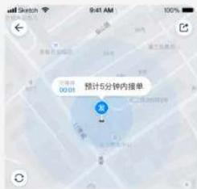

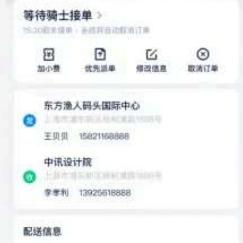

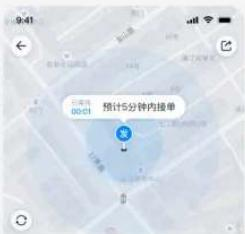

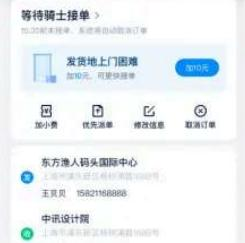

待支付支付优惠

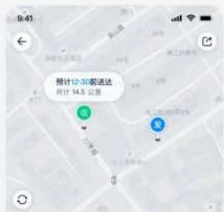

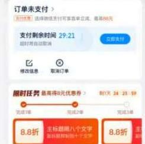

更换骑士

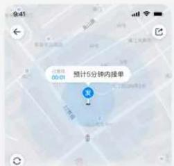

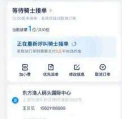

# 四、整体结果

本次9.0升级可以说非常成功，但整个改造过程也是经历了非常多的坎坷，也非一次完成，而是经过多个小版本迭代后上线，在这些小版本中也经过了大量的AB测试，才有了最终符合预期的结果。

<table><tr><td colspan="3">8.0 vs 9.0</td></tr><tr><td>转化情况</td><td>C端询价转化率19%↑</td><td>B端询价转化率20%↑</td></tr><tr><td>体验情况</td><td>C端NPS6.4%↑</td><td></td></tr><tr><td>提效情况</td><td>开发效率提升300%↑</td><td>设计效率提升30%↑</td></tr></table>

以上就是本次9.0升级的全部内容，希望能够为大家提供一些设计思路和以及帮助！