# 5亿人在用的淘宝，如何让AI和电商无缝结合？

> 原文链接：https://www.uisdc.com/taobao-7
> 作者/团队：淘宝设计 团队
> 日期：2025/11/10
> 标签：未提供
> 本地归档说明：为尊重原站版权，此文件不逐字转载全文；保留原文链接、图片引用、筛选理由和关键内容线索，方法沉淀见 ux-method-library。

## 筛选理由

淘宝 AI 电商案例，适合沉淀 AI 与购物决策的融合方式

## 关键内容线索

1. 2025淘宝大促主互动设计实战案例引言 相信对熟悉淘宝的朋友来说，去年双 11 淘金仔向前冲并不陌生，而今年 618，依然在淘金币频道里承接核心互动玩法。
2. 在过去的半年多时间里，我们围绕AI能力在搜索场景中的应用开展了多项业务探索。
3. 坦率地说，目前AI与电商的结合仍处于产品验证与模式迭代的初级阶段，尚未形成成熟路径，但正因如此，蕴藏着巨大的想象空间。
4. 这一探索过程的价值，或许不仅在于具体功能的落地，更在于让我们对用户需求、交互逻辑以及技术边界有了更深入的理解和思考。
5. 一、搜索的边界正在消融 在传统电商搜索体验中，用户将需求转化为关键词组合，系统执行商品库检索并返回货架式的结果给到用户筛选对比，形成"用户输入-系统生产-固定响应"的循环。
6. 这本质上是"以系统为中心"的设计范式，要求用户适应系统规则而非系统理解人类意图。
7. AI搜索产品的出现，正在解构过往的机械体验： Input层革新：从关键词到自然语言 Interaction层进化：从机械操作到动态对话 Output层质变：从固定货架到生成式响应 传统搜索与AI搜索差异分析 在新的交互范式下，用户不再满足于“找得到”，他们期望的是“系统懂我”。
8. 这意味着AI搜索的体验设计，需要从“被动响应”转向“主动理解”。

## 原文图片

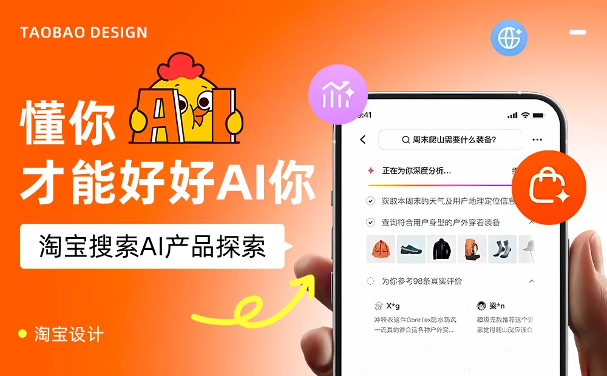

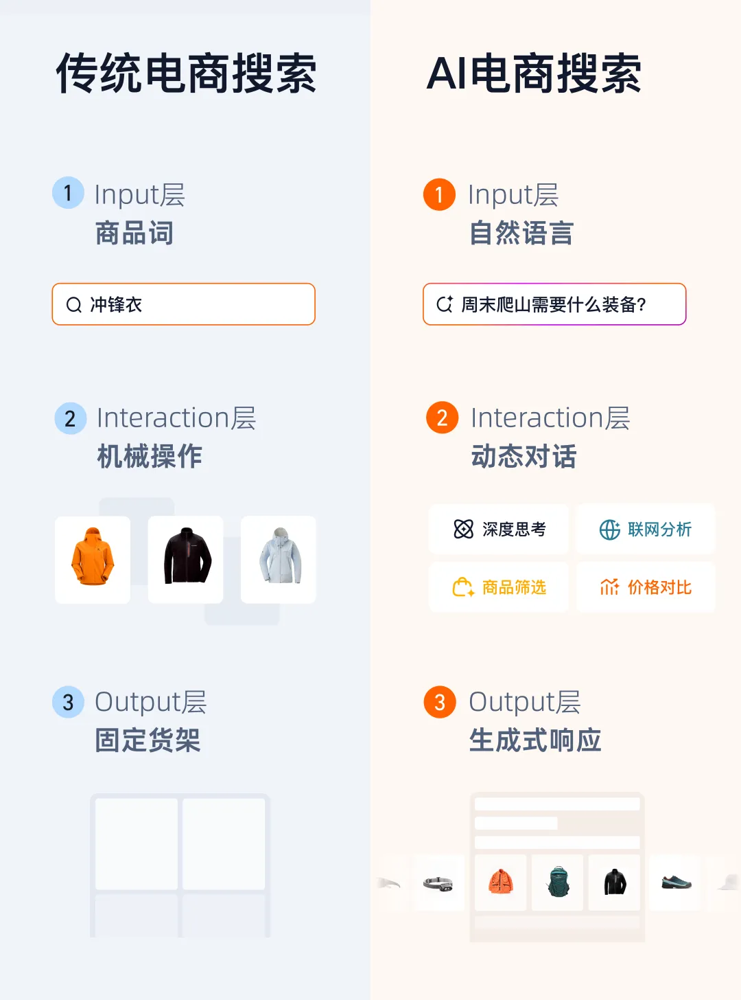

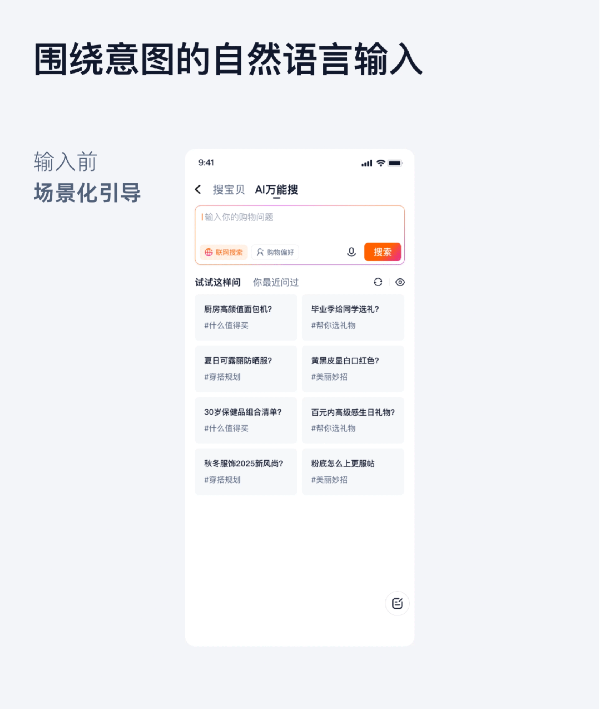

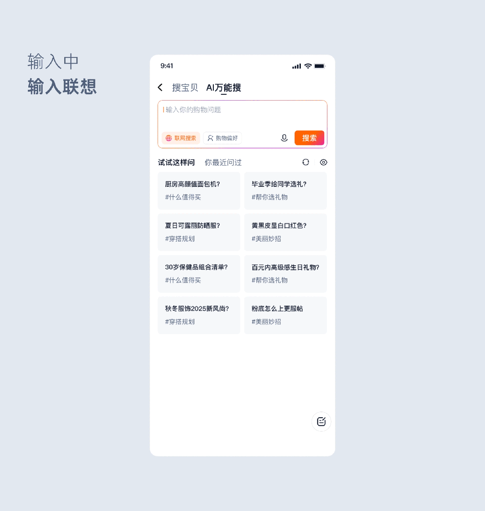

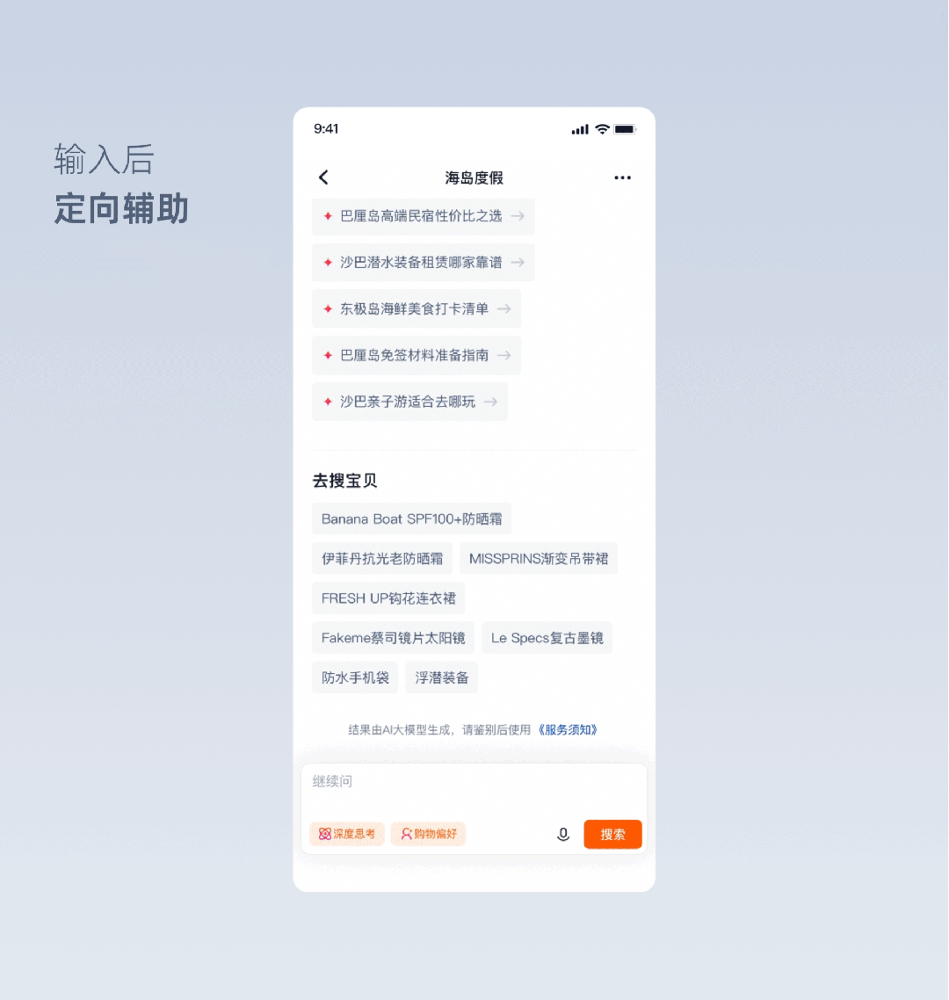

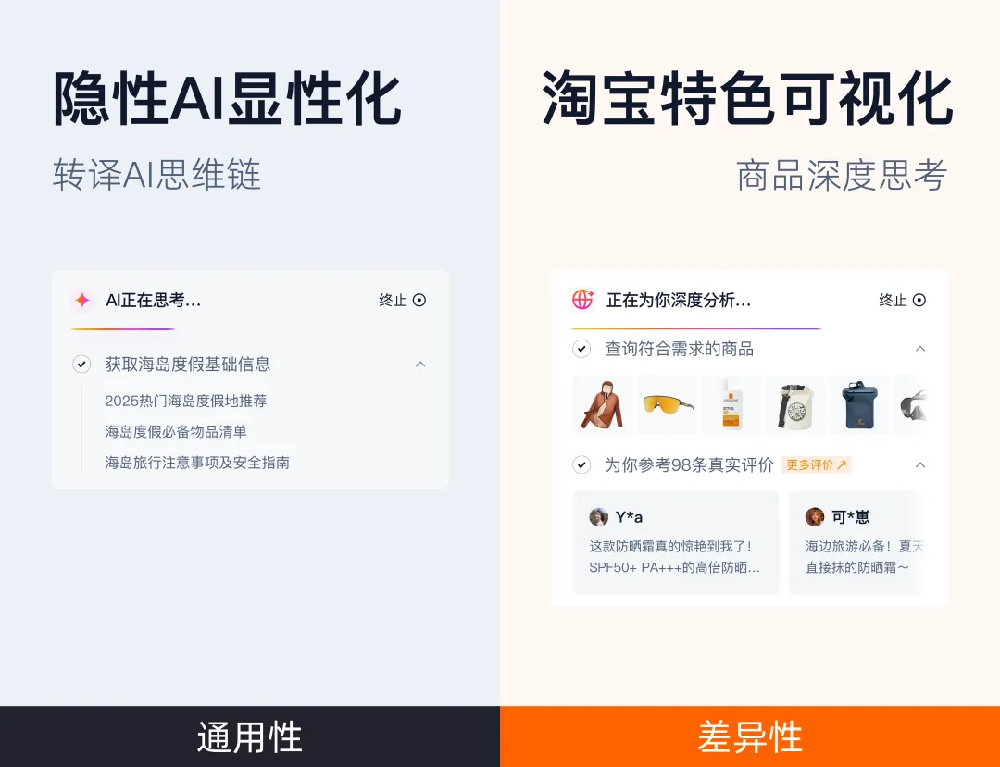

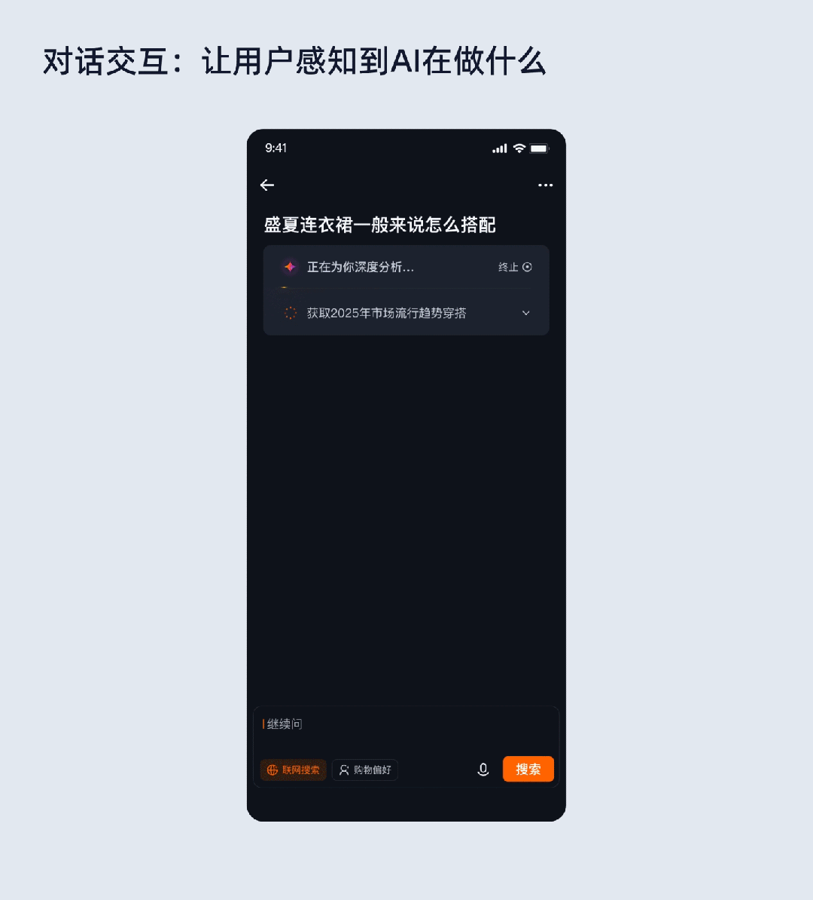

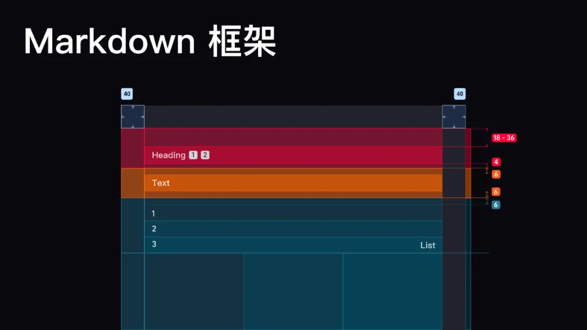

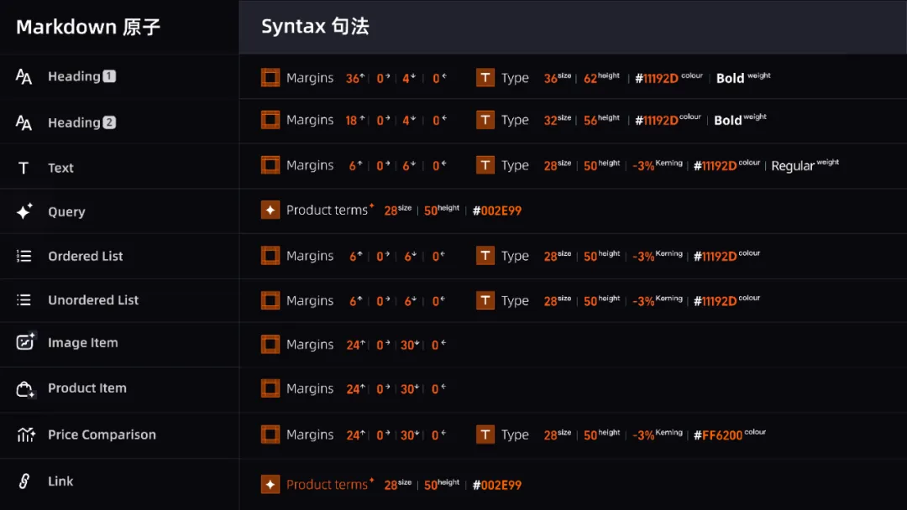

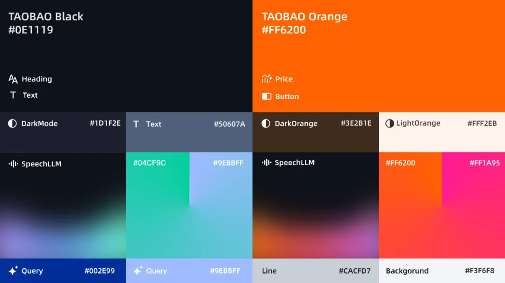

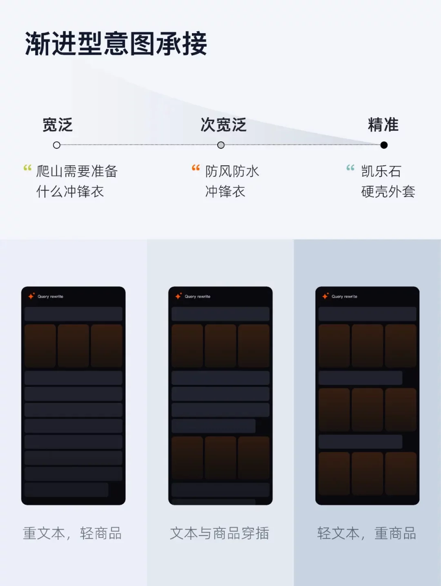

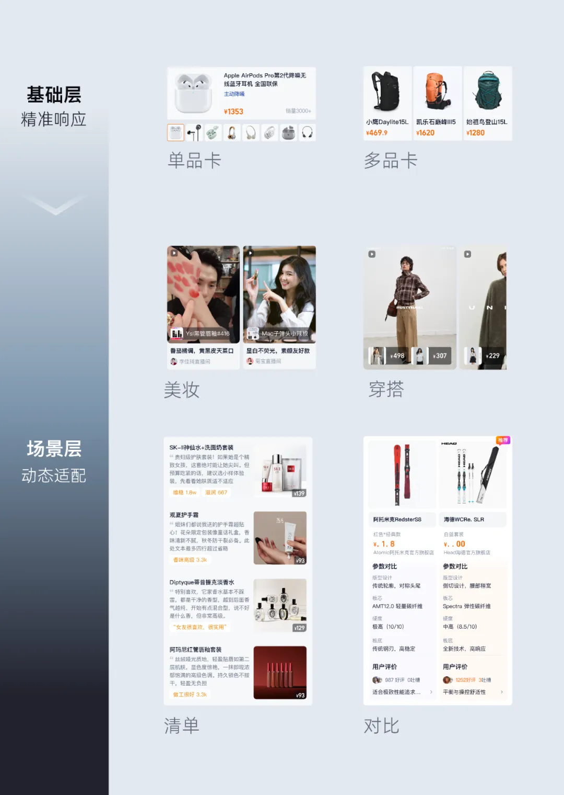

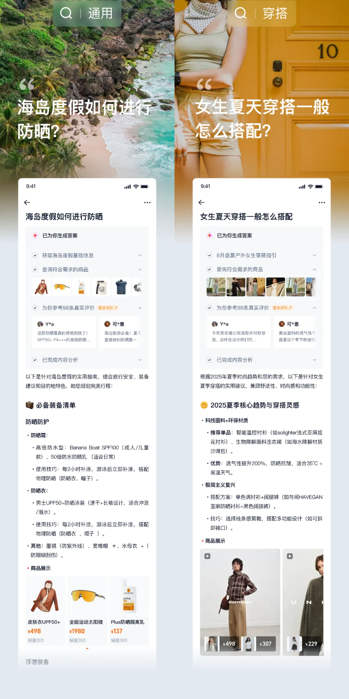

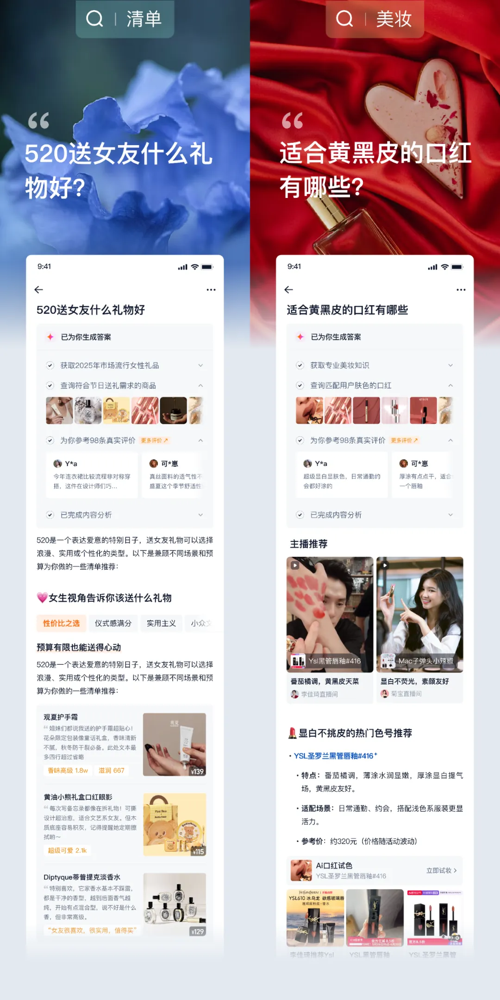

