# AI如何重构就医全流程？深度拆解阿里产品「蚂蚁阿福」

> 原文链接：https://www.uisdc.com/ai-health-reimagined
> 作者/团队：廖尔摩斯丨设计大侦探
> 日期：2026/01/05
> 标签：未提供
> 本地归档说明：为尊重原站版权，此文件不逐字转载全文；保留原文链接、图片引用、筛选理由和关键内容线索，方法沉淀见 ux-method-library。

## 筛选理由

AI 重构复杂就医流程，适合沉淀 C 端服务前中后链路

## 关键内容线索

1. 今天向大家分享一款最近刚推出的蚂蚁旗下的 AI 健康助手——蚂蚁阿福 APP ，希望你能从这篇产品体验分析中有所收获。
2. 如果你觉得我们的文章有价值，欢迎分享给你的朋友！
3. 往期拆解： 超20亿人在用的爱彼迎有哪些设计亮点？
4. 哈啰，大家好，我是廖尔摩斯，欢迎来到设计大侦探 —— 一个以分享深度的产品体验为主的设计媒体，目标是拆解全球 1000 个优秀的产品！
5. 蚂蚁阿福是蚂蚁集团推出的 AI 健康管理应用，由原 AI 健康工具 AQ 升级而来。
6. 产品愿景是成为用户的 AI 医生朋友，提供健康咨询、图片解读（支持报告、病例、处方、药盒）、个人和家庭健康档案管理，以及预约挂号、云陪诊等医疗健康服务。
7. 1. 对话式医疗入口：用 AI 重构交互方式 当你打开蚂蚁阿福 APP的第一刻，你会发现它像 ChatGPT、DeepSeek 一样，只有一个对话框。
8. 这正是 AI-UX 的典型表现形式——把「对话」作为核心入口，弱化传统的多层级导航，让用户用一句话就能触达预约、解读报告、症状咨询等多种服务。

## 原文图片

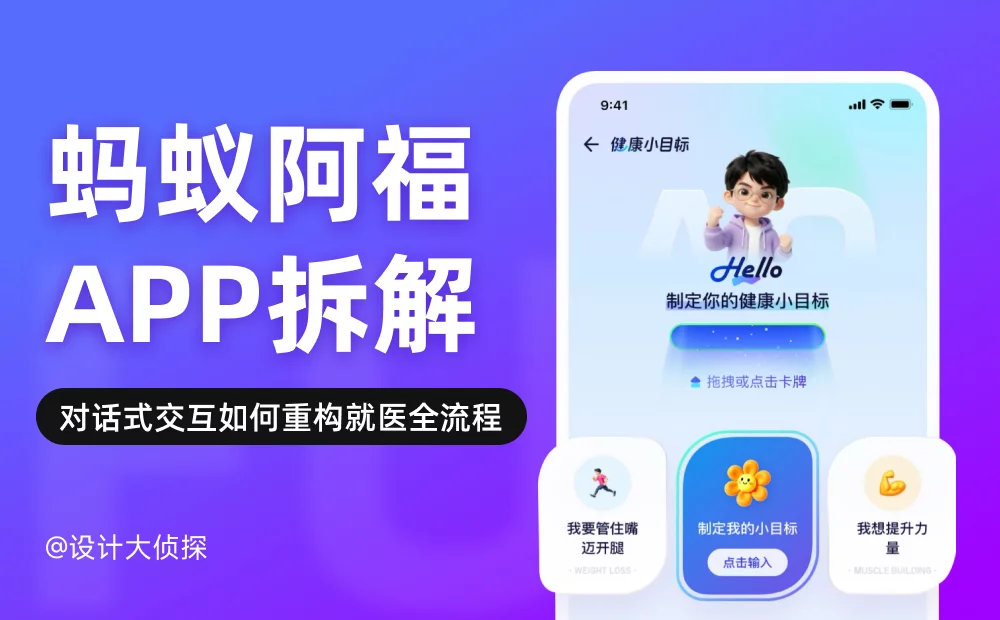

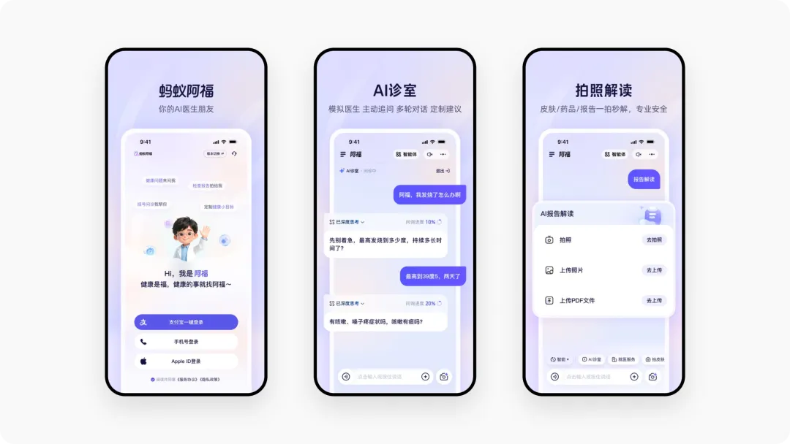

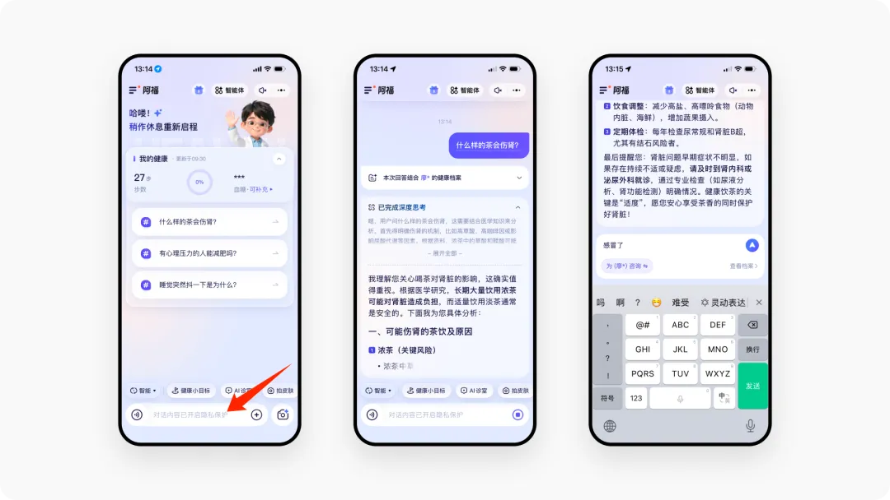

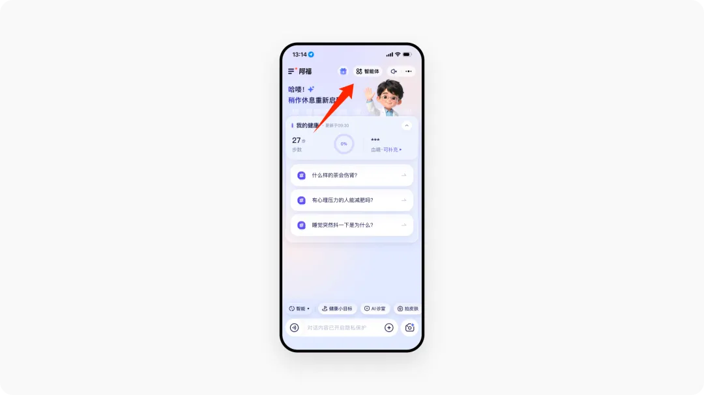

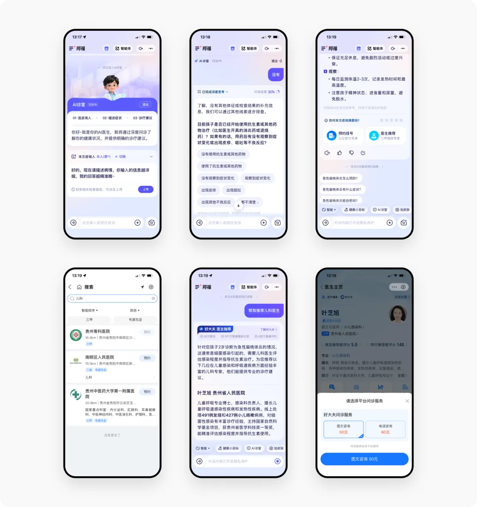

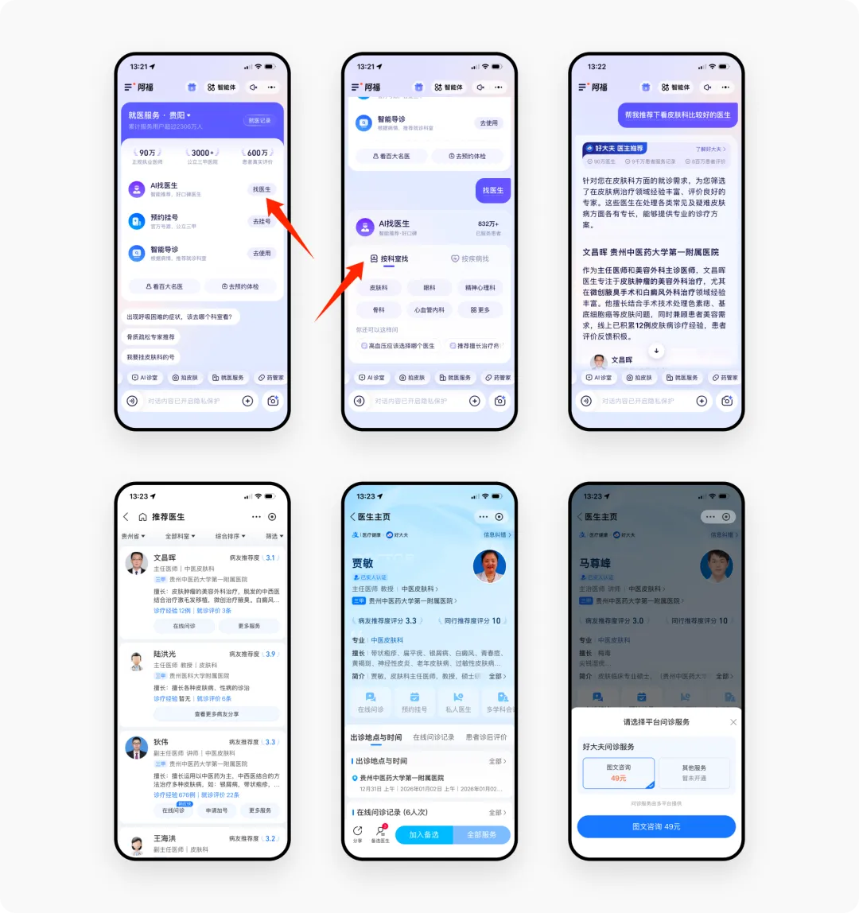

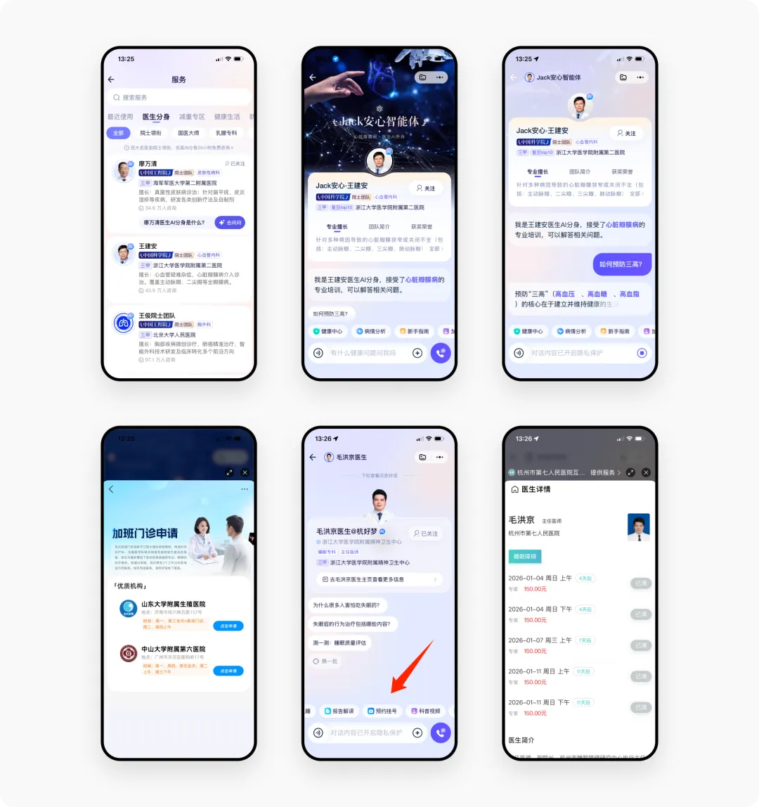

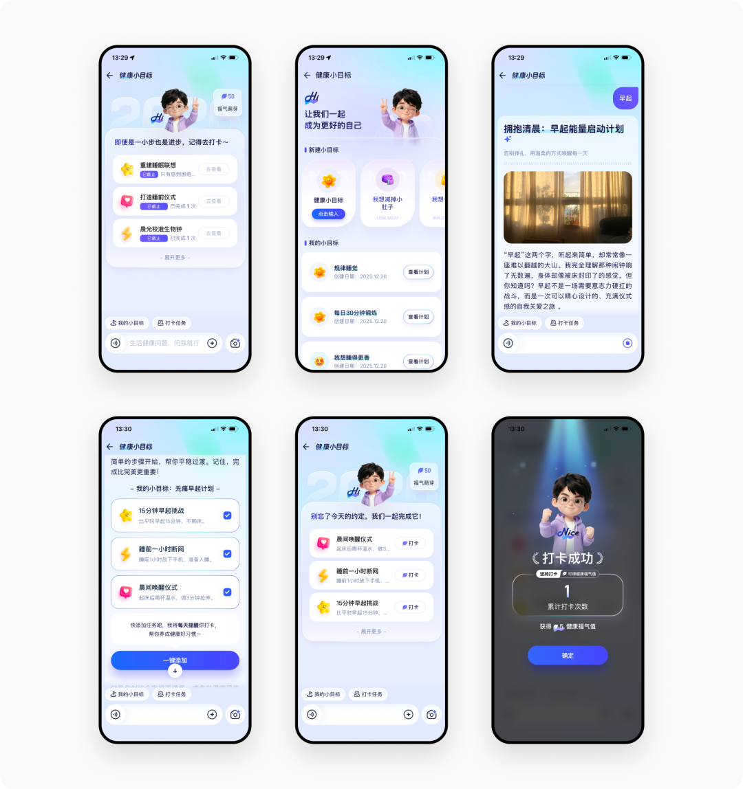

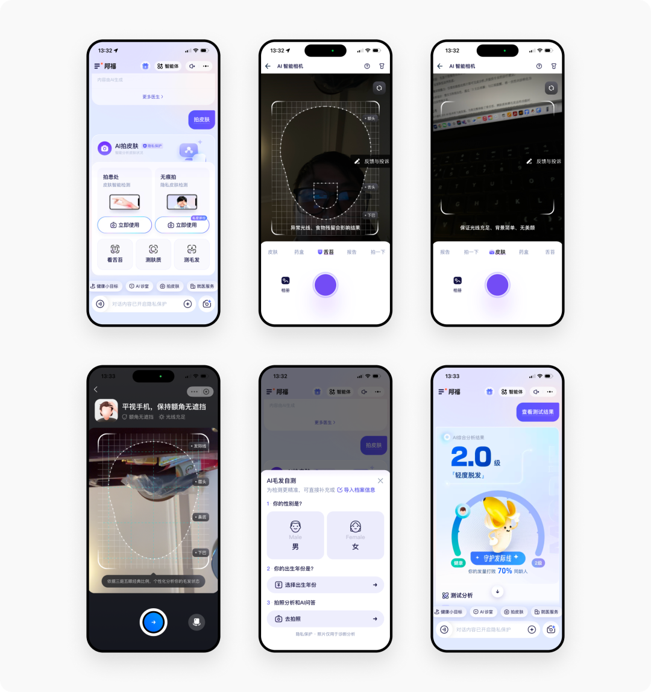

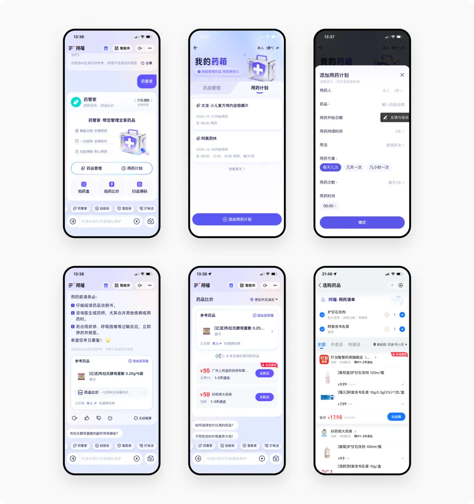

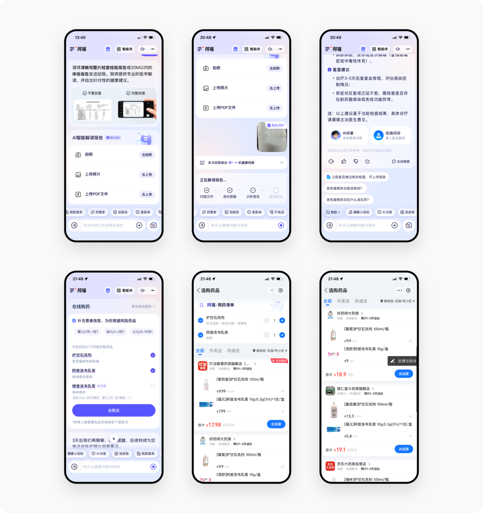

