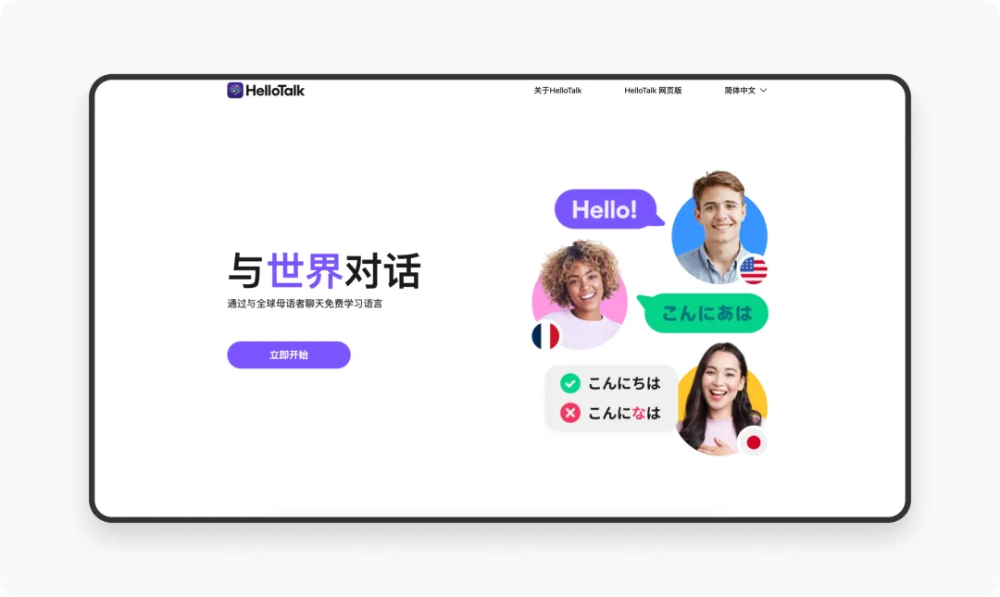
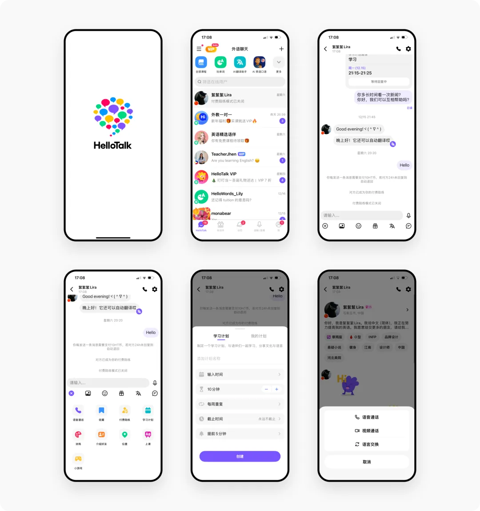
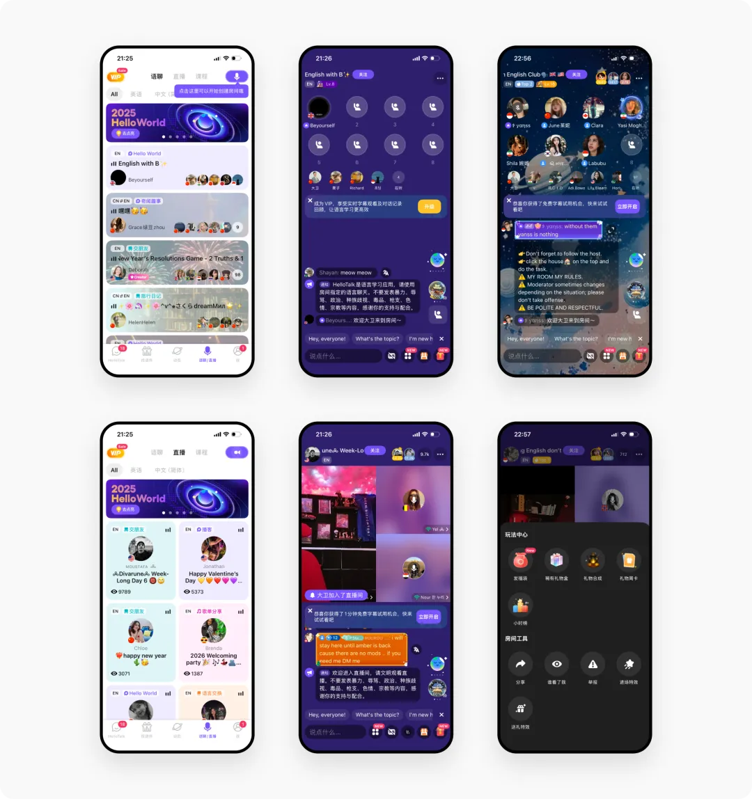
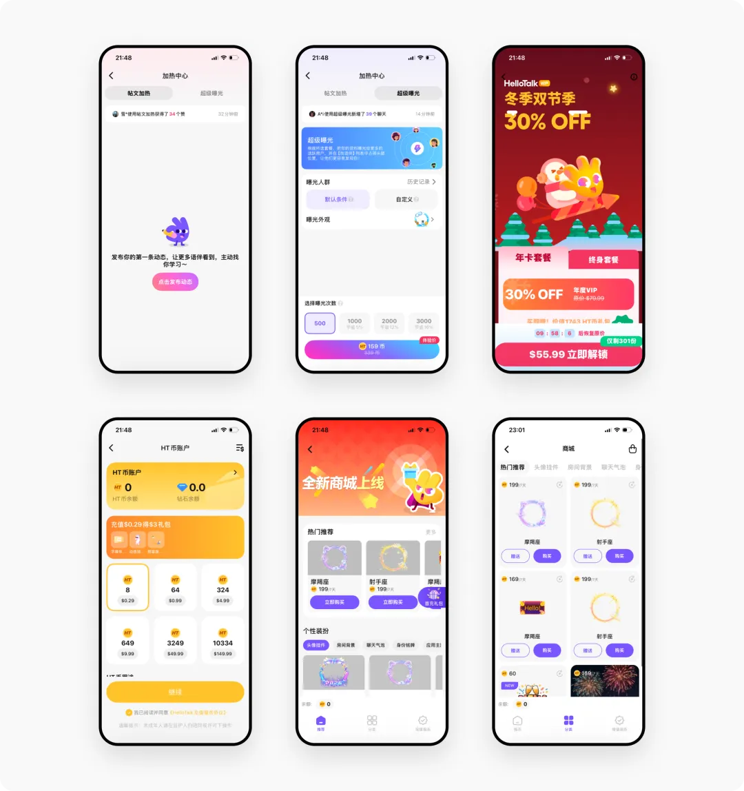

# 像聊天一样学外语！深度拆解5000万用户的HelloTalk产品设计

> 原文链接：https://www.uisdc.com/hellotalk
> 作者/团队：廖尔摩斯丨设计大侦探
> 日期：2026/01/06
> 标签：未提供
> 本地归档说明：为尊重原站版权，此文件不逐字转载全文；保留原文链接、图片引用、筛选理由和关键内容线索，方法沉淀见 ux-method-library。

## 筛选理由

语言社交学习案例，适合社区互动、即时反馈和学习路径

## 关键内容线索

1. 今天想和大家分享我去年创建的《全球多语言学习 APP 竞品分析》中的一篇产品分析——HelloTalk。
2. 深度拆解阿里产品「蚂蚁阿福」哈啰，大家好，我是廖尔摩斯，欢迎来到设计大侦探 —— 一个以分享深度的产品体验为主的设计媒体，目标是拆解全球 1000 个优秀的产品！
3. 1. 产品简介 HelloTalk 是一款全球领先的语言交换社交应用，由深圳心慧科技有限公司于 2012 年推出。
4. 平台采用"以教换学"的互助模式，让用户与母语者一对一交流（语音、文字、视频），在真实对话场景中提升语言能力。
5. 目前已覆盖 180 多个国家和地区，支持超过 150 种语言，注册用户突破 5000 万。
6. HelloTalk 的使命是"构建跨文化爱好者的交流平台"。
7. 平台提供多种实时互动场景——聊天、动态圈、互动直播和语音聊天室，构建真人互动的社区环境。
8. 同时结合 AI 翻译、AI 纠错、真人朗读和语音识别等功能，提供丰富的人机交互体验，并配合系统化课程增强学习效果。

## 原文图片

