# 大厂实战案例！快速提升购买转化的6个实用方法

> 原文链接：https://www.uisdc.com/psychology-driven-leasing
> 作者/团队：58UXD 团队
> 日期：2025/05/30
> 标签：未提供
> 本地归档说明：为尊重原站版权，此文件不逐字转载全文；保留原文链接、图片引用、筛选理由和关键内容线索，方法沉淀见 ux-method-library。

## 筛选理由

购买转化心理策略，可补充 C 端转化设计理论

## 关键内容线索

1. 大厂都在用的LIFT模型6大黄金法则设计方法论是能够不断复用、贴近真理的一般性规律，帮助分析和解决问题即从经验中总结出科学的规律，然后把这个规律用在该条件的具体事项上的过程，学习和应用设计方法论可以提升团队设计效率和专业性、以及团队影响力，全系列一共 12 篇，欢迎持续关注。
2. 人性一：“小钱办大事 通过调研了解到，大部分用户在租房的时候都会有资金的考虑，希望通过最低的价格租到最好的房子，用最小的付出获得最大的权益，这一点相信我们都能理解，无可厚非。
3. 人性二：建立信任难 人性中对于初次遇到的事物、产品都是有防备心的，通常信任是建立在使用一次完整过程的基础上，并且过程符合用户的预期，那么如何让用户在初次使用产品时就降低防备心，选择相信平台呢？
4. 人性三：时间的压迫感 人是一种没有时间感知的动物，感知不到时间的流失，所以才需要用表来衡量时间，当人无法掌控时间的时候，时间流失的压迫感会让用户患得患失，生怕失去可能获得的价值，在患得患失中徘徊和思想斗争。
5. 人性四：贪婪 人都是贪婪的，尤其是面对利益的诱惑，相信大部分是无法抗拒的，贪婪没有不对，这是人性的一个方面，这种特性随着人类的进化刻到基因里的，因为进化过程中的贪婪获得更多的食物，生命才获得了延续。
6. 人性五：害怕失去 人类都害怕自己失去已有的东西，这是一种随着人类进化发展来的。
7. 一项研究证明：同样的 10 元钱，丢失 10 元钱的痛苦比获得 10 元钱带来的喜悦程度更高，通常需要获得更多的钱才可能抵消掉丢失 10 元的痛苦。
8. 人性六：担心被骗 每一个人都担心自己被骗，尤其是涉及到自己金钱。

## 原文图片

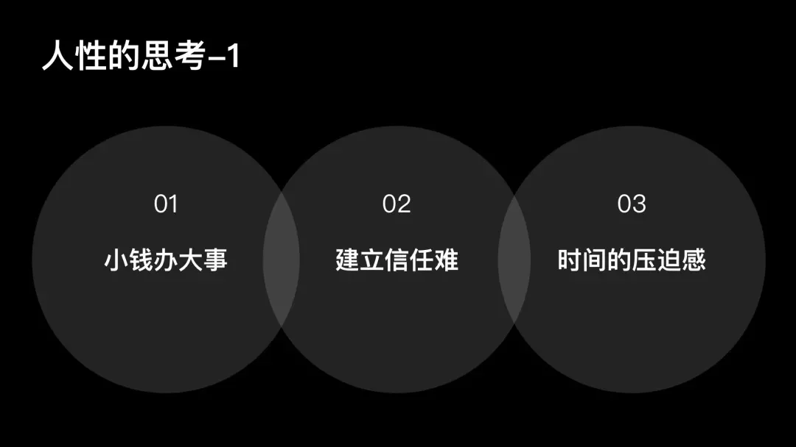

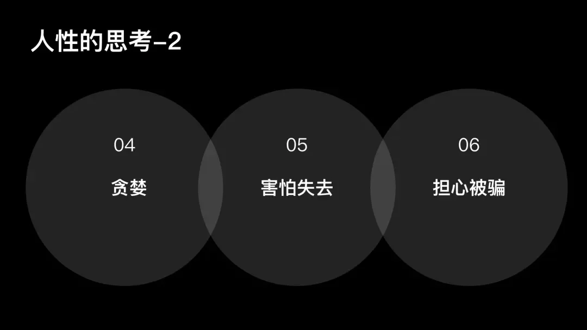

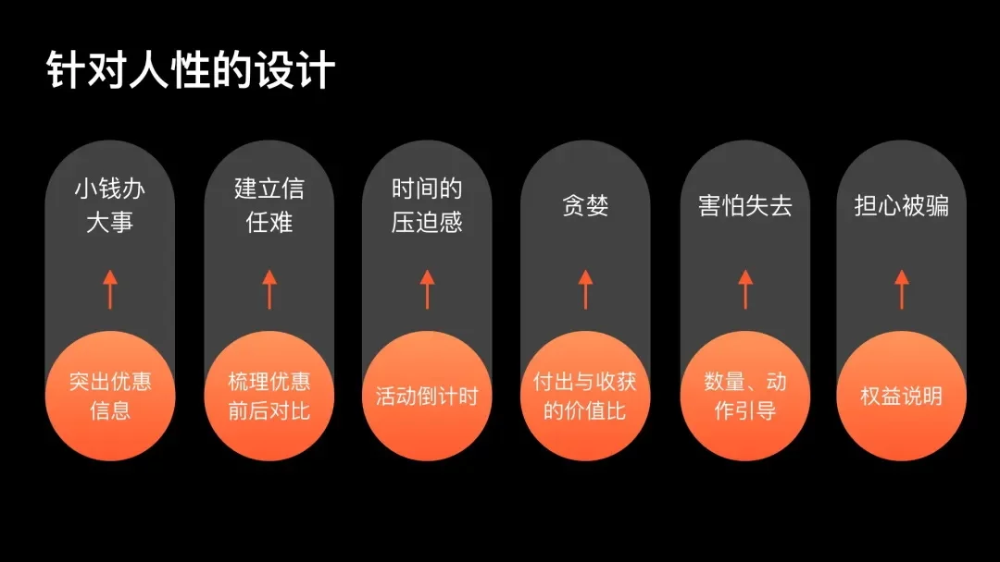

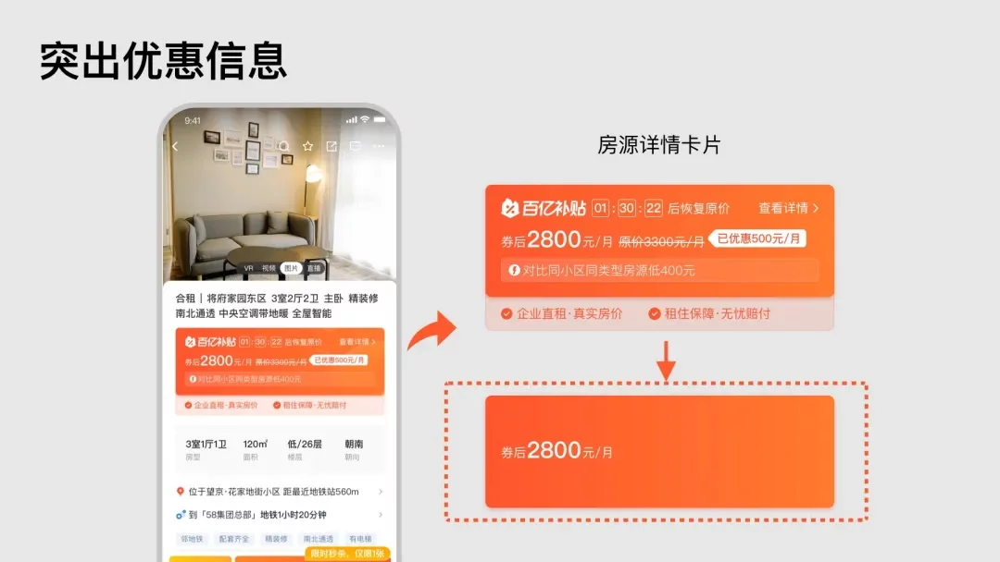

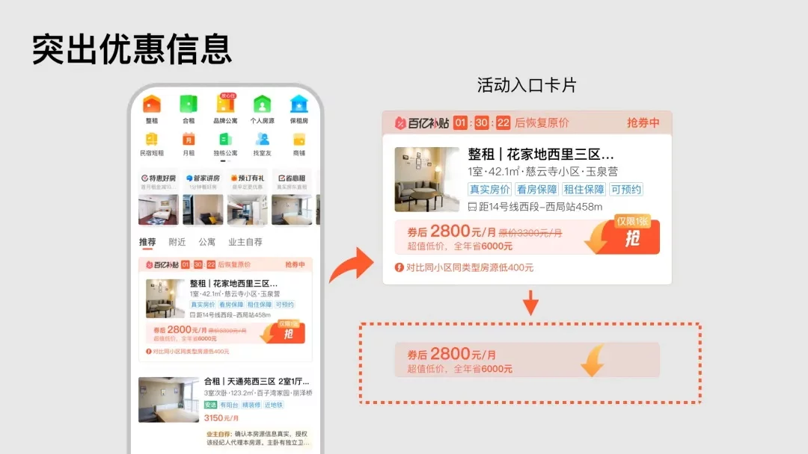

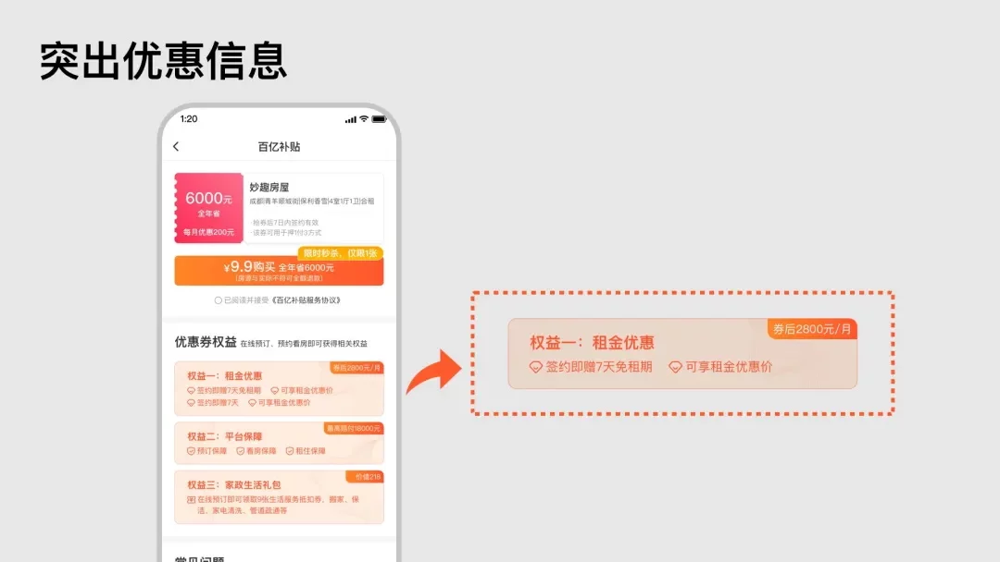

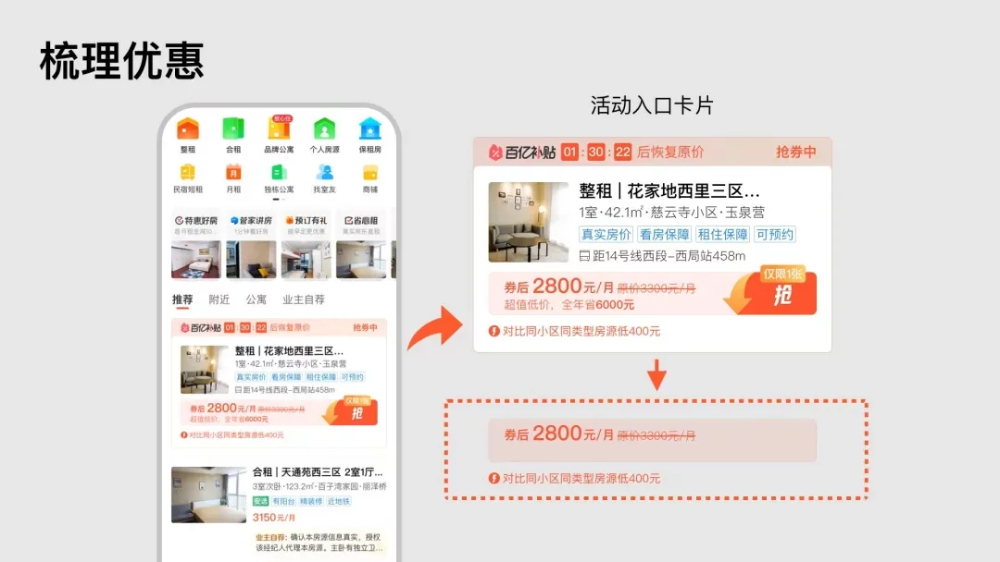

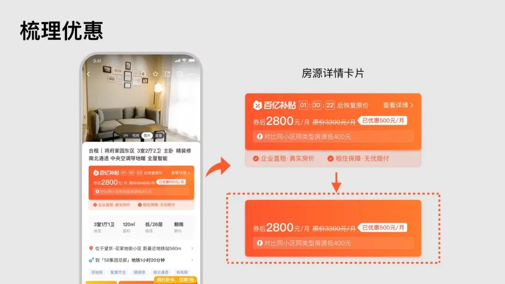

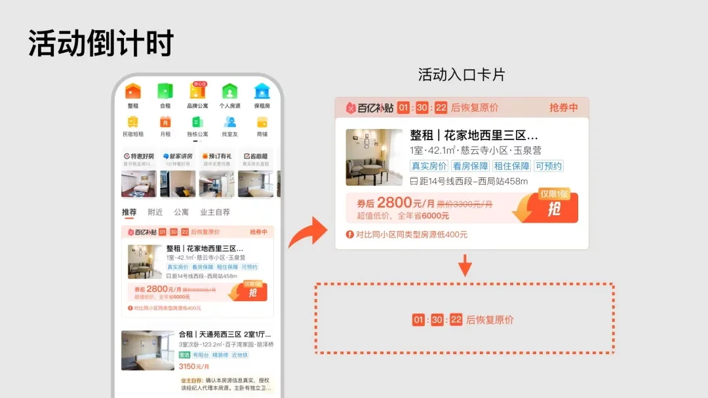

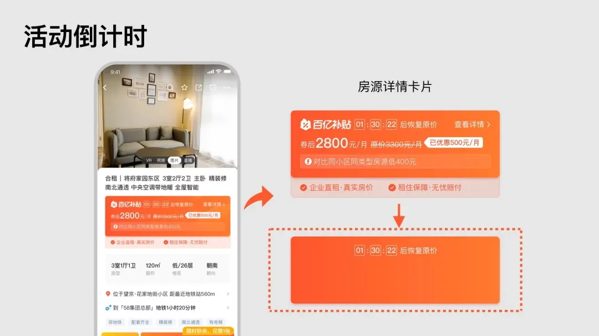

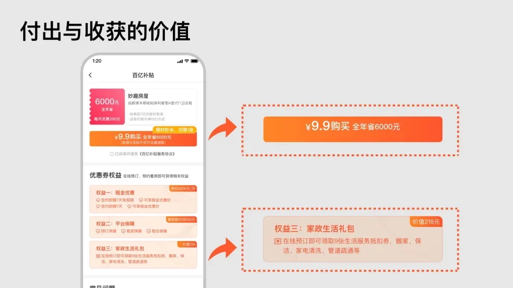

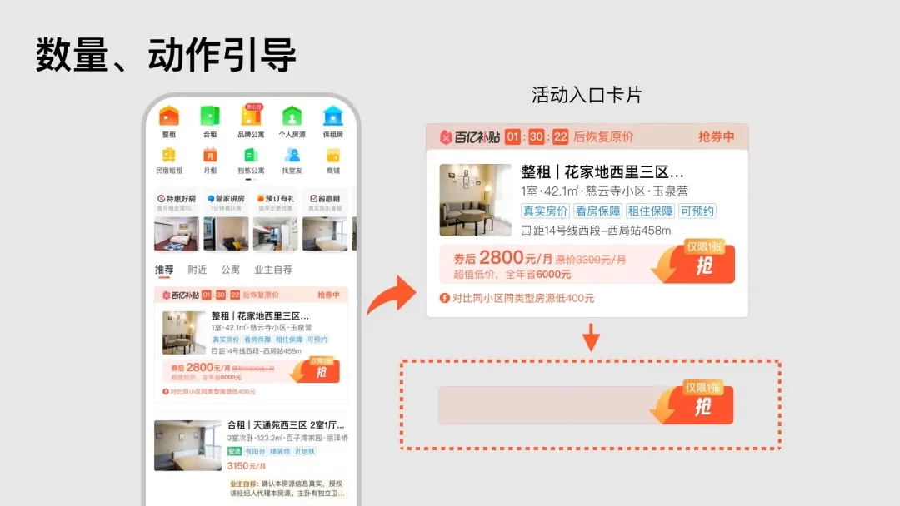

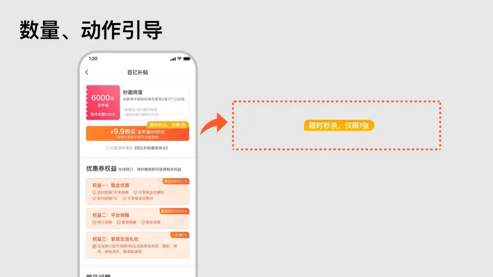

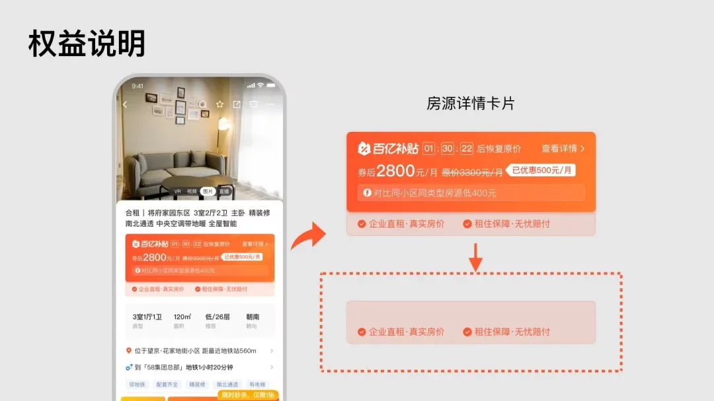

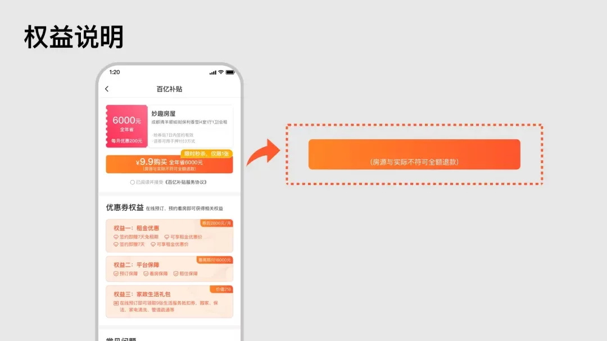

