# 大厂实战案例！淘宝APP购物体验设计优化复盘

> 原文链接：https://www.uisdc.com/taobao
> 作者/团队：淘宝设计 团队
> 日期：2024/07/28
> 标签：未提供
> 本地归档说明：为尊重原站版权，此文件不逐字转载全文；保留原文链接、图片引用、筛选理由和关键内容线索，方法沉淀见 ux-method-library。

## 筛选理由

淘宝购物体验优化复盘，适合下单决策和商品信息结构

## 关键内容线索

1. 和我们在商场里买东西带去收银台付款的简单流程不同，淘宝的购买过程往往伴随着许多主要流程和分支环节，体感上并不简单。
2. 然而“买”就一个字，为什么要确认很多次呢？
3. 因此有必要以用户视角重新审视购买结算的“信息结构”与“浏览动线”。
4. 浅析淘宝重磅新版的体验设计重心最近淘宝又有比较大的版本迭代了，而这次更新在不同社群和平台里引发批判无数。
5. 1. 聚合决策信息，一屏看完想看的 回归购物常识，分场景重新整合信息，将最影响购买决策的信息高效呈现。
6. 这样不仅能让用户快速看到关键信息，同时也能提升展示效率。
7. 案例 1：购物车以商品营销状态作为聚合维度，可以方便用户查看商品和进行大促凑单挑选。
8. 信息框架整合案例：购物车结构优化，图片等信息来自淘宝 案例 2：确认订单页用相同的思路，以核心结算信息作为聚合维度，突出重点内容，优化浏览体验。

## 原文图片

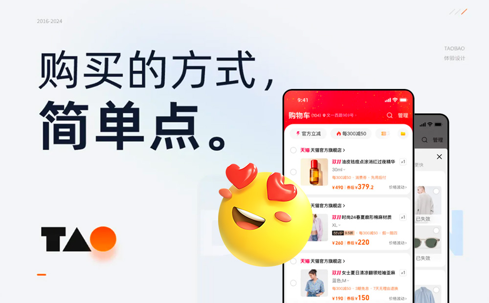

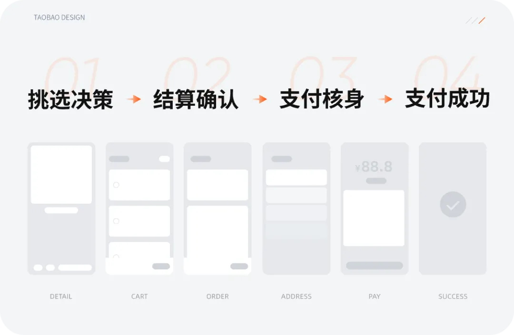

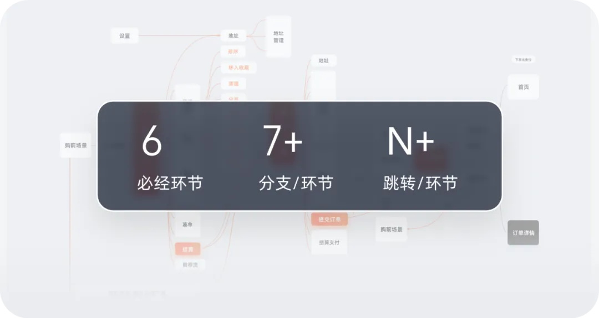

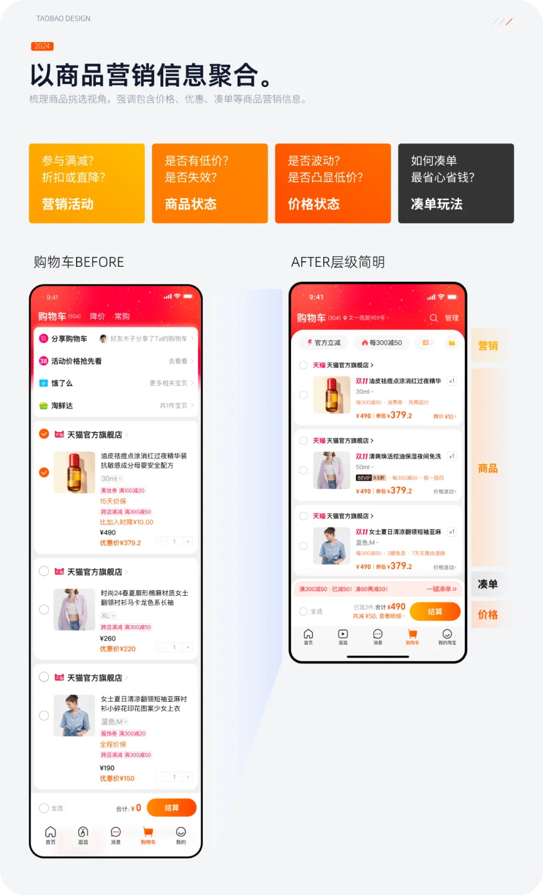

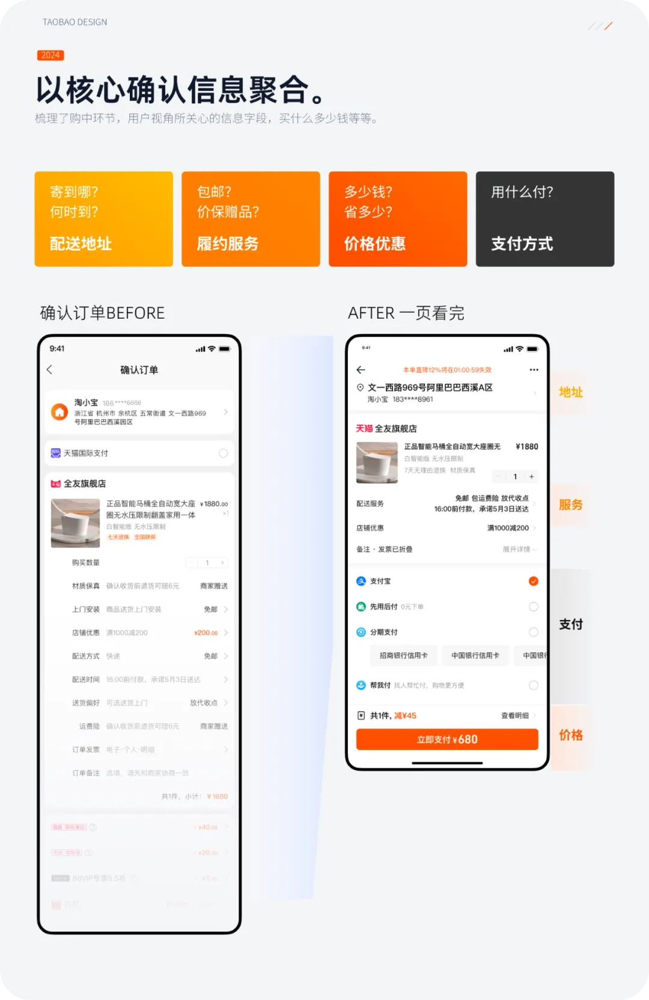

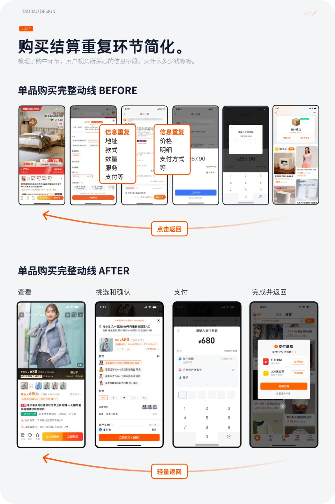

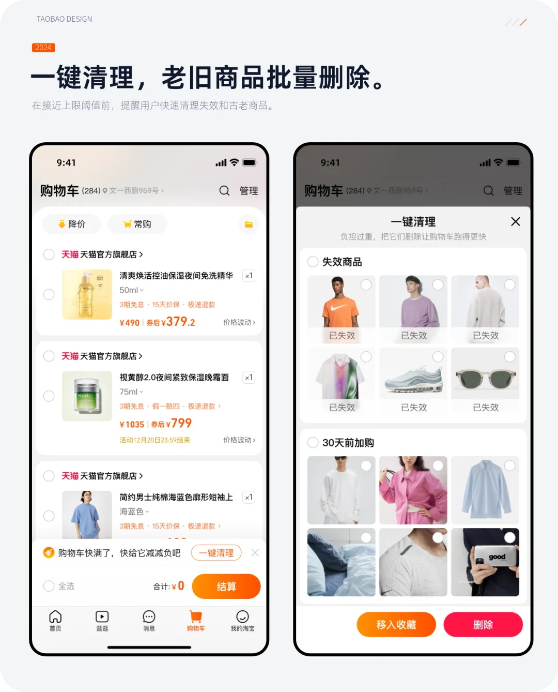

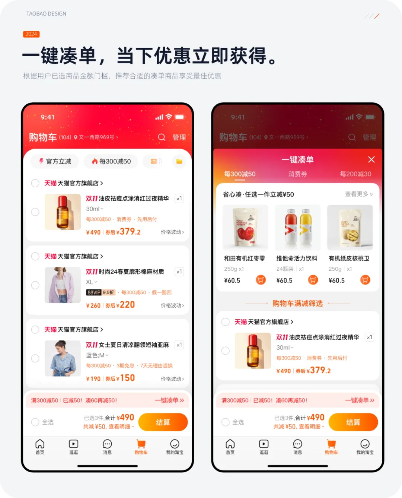

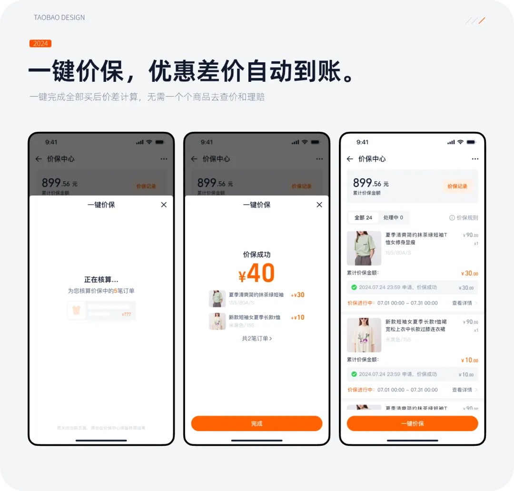

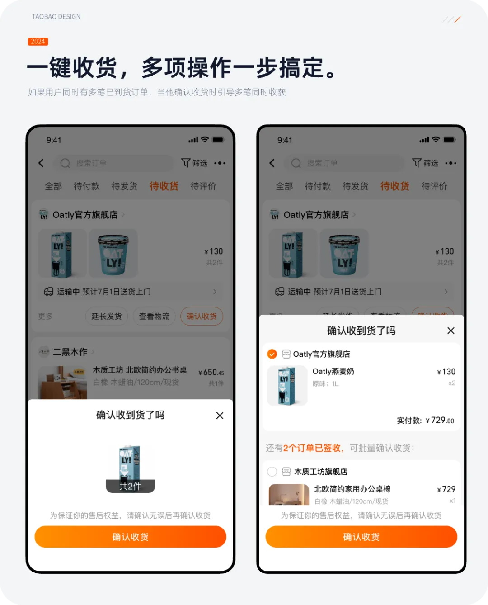

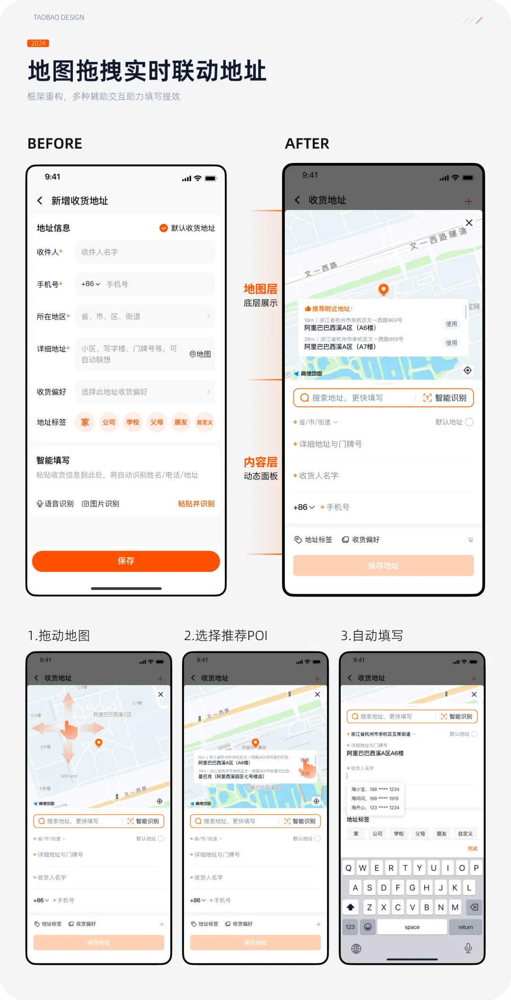

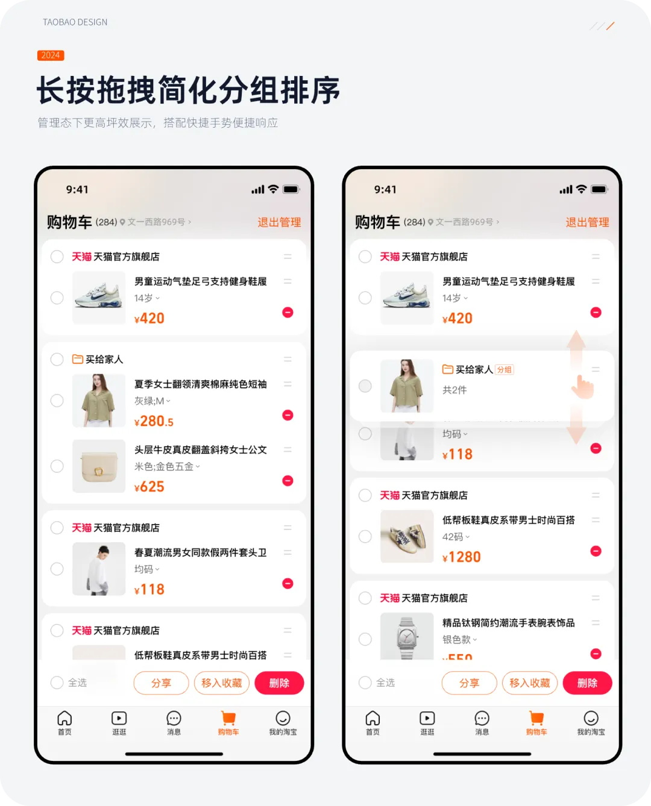

