# 大厂实战案例！设计师如何助力京东快递业务增长？

> 原文链接：https://www.uisdc.com/jd-express
> 作者/团队：京东JellyDesign 团队
> 日期：2024/07/09
> 标签：未提供
> 本地归档说明：为尊重原站版权，此文件不逐字转载全文；保留原文链接、图片引用、筛选理由和关键内容线索，方法沉淀见 ux-method-library。

## 筛选理由

物流私域增长与寄件转化，是 C 端服务增长和触达链路的高价值案例

## 关键内容线索

1. 各个有实力企业会组建专门团队负责利用企业微信的管理能力，用户触达能力搭建自己的私域场，用于长期维护客户，增强业务收入，同时也能更好的提升品牌的影响力和认知度。
2. 对目前的京东快递来说，建立稳定的私域流量，可以持久稳定的带来业务收入，也能够一定意义上解决小哥离职客户流失的问题，并通过日常的群维护触达客户的寄件频率，提升京东快递的品牌寄递心智。
3. 最近大厂都开始用AIGC提高出图效率了，还没有思路的同学，不妨看看这篇文章。
4. 我们将能够自主运营的，可以反复触达、交流，获取反馈的流量统称为私域流量。
5. 典型的产品形态有微信公众号/朋友圈/小程序等。
6. 私域用户相对于平台用户而言，有更可控、更精准、更容易被转化的特性。
7. 2. 私域社群解决的核心问题 除了私域能够带来大量的流量之外，京东快递本身没有用户交流和低成本有效触达的渠道，低中频的客户提频缺乏有效手段，自从 23 年 8 月正式启动社群项目目标是为了把公司资产（用户）集中管理，避免由于小哥离职客户流失的问题，通过每日群内内容触达提升客户寄件频率，提升京东快递品牌寄递心智。
8. 3. 京东快递用户生命周期模型 要实现私域流量的有效增长，首先需要理解 AARRR 模型——海盗模型。

## 原文图片

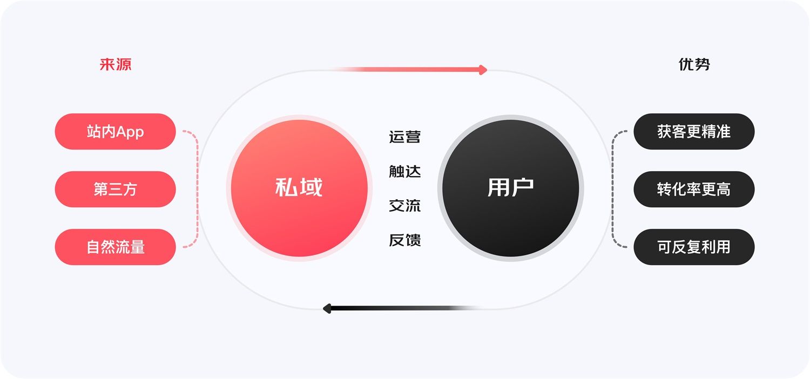

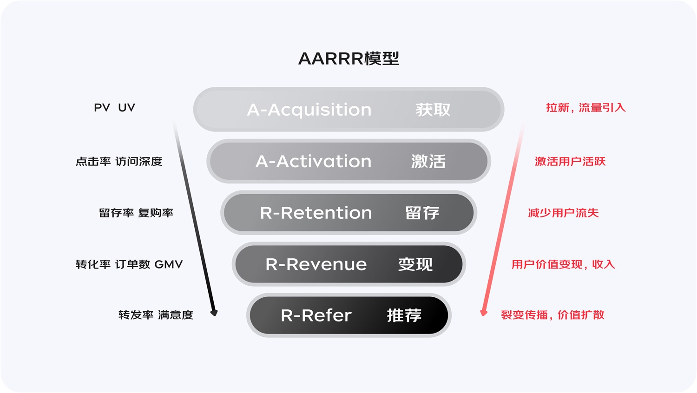

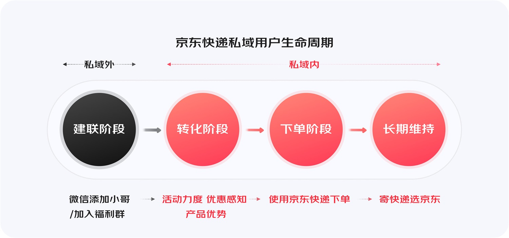

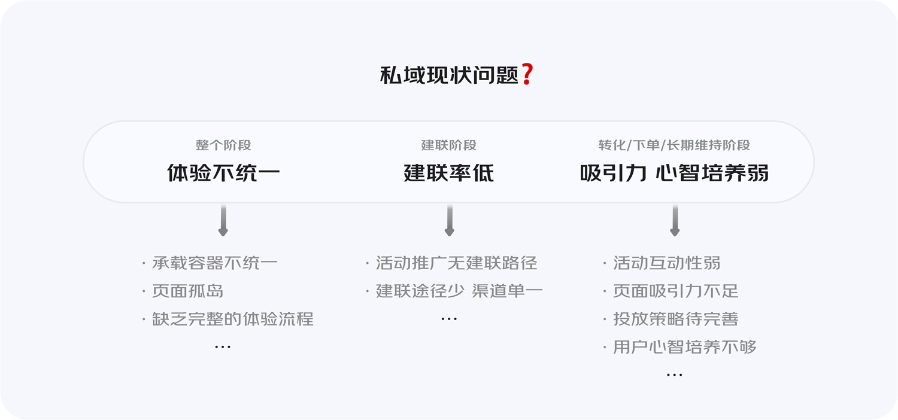

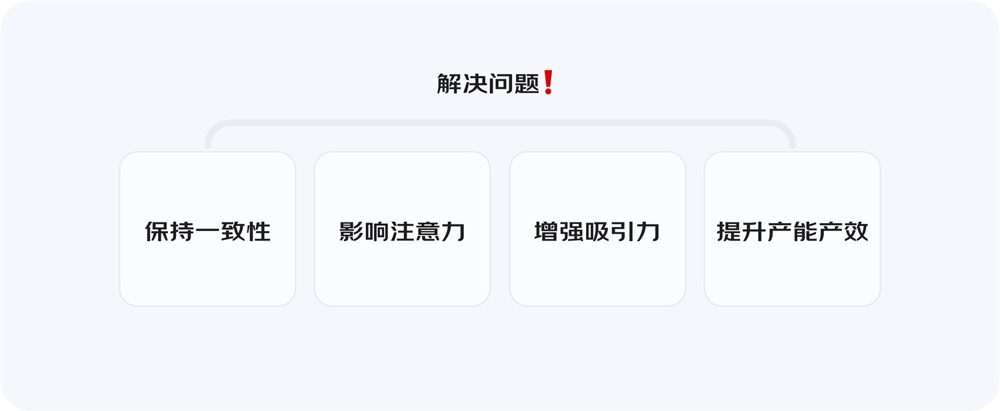

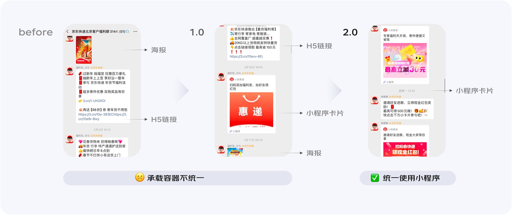

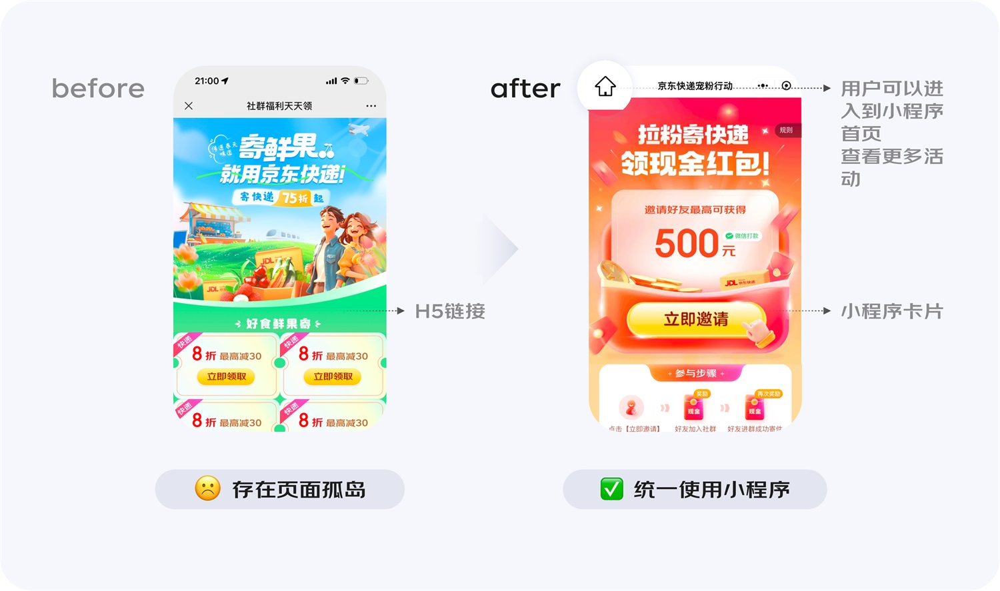

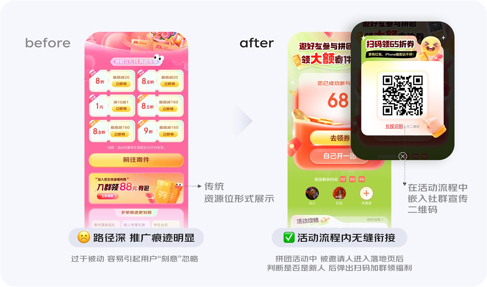

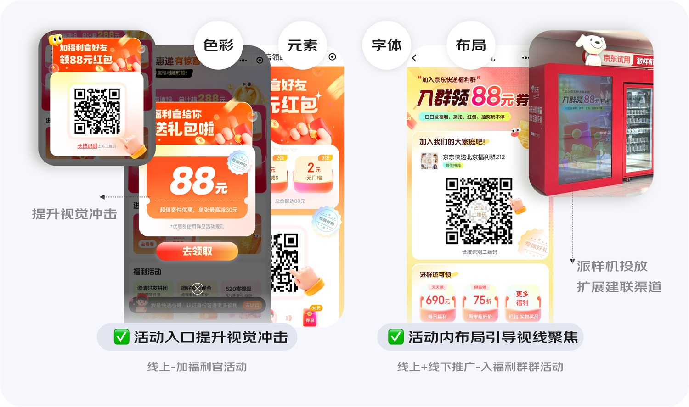

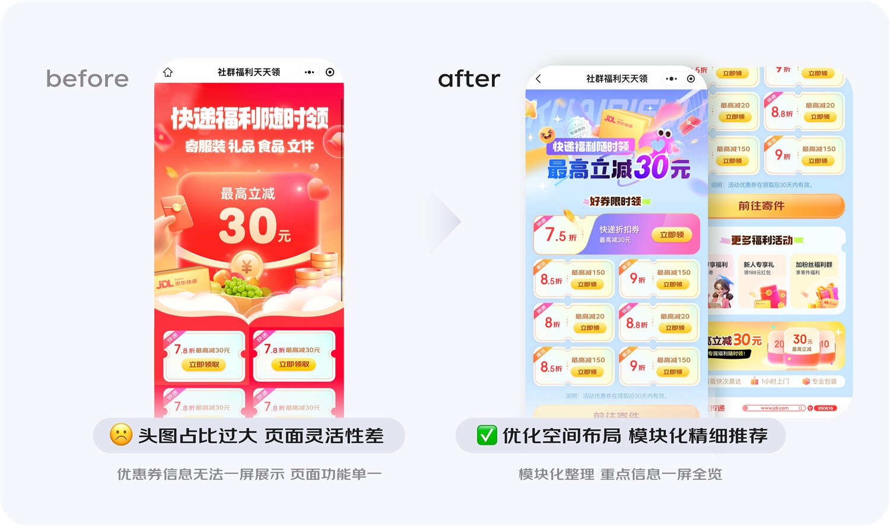

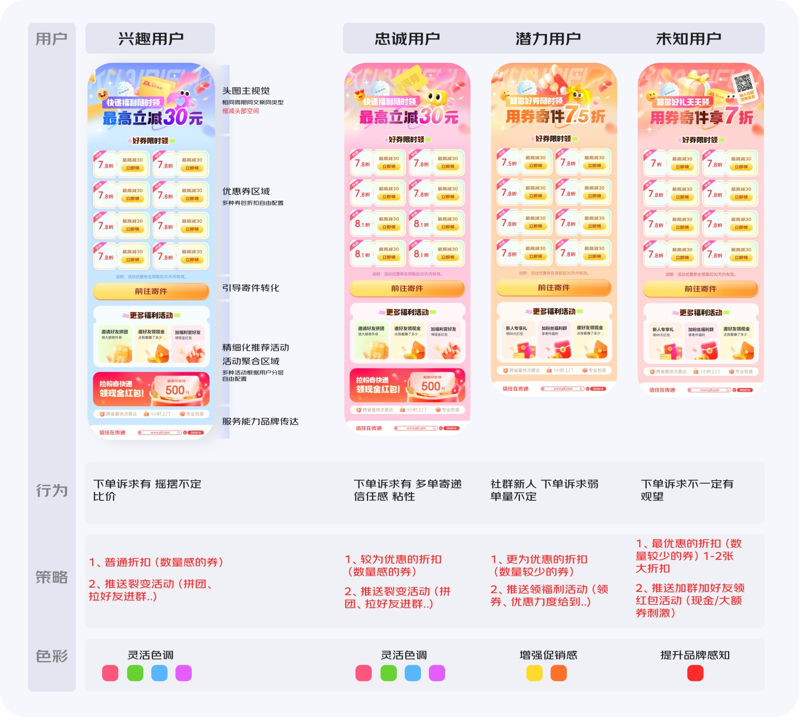

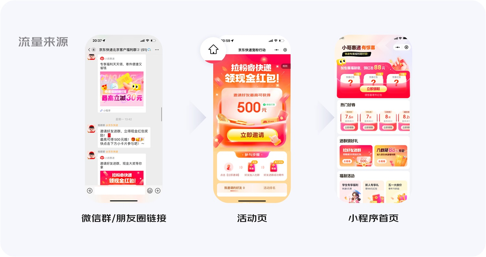

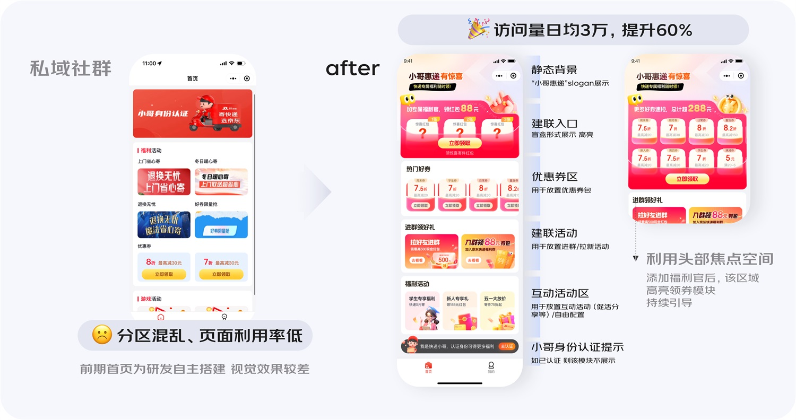

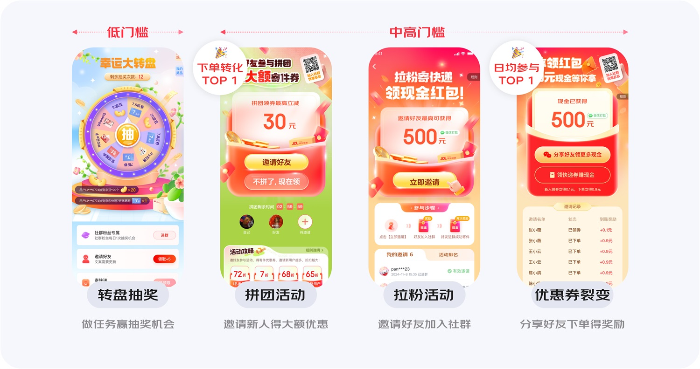

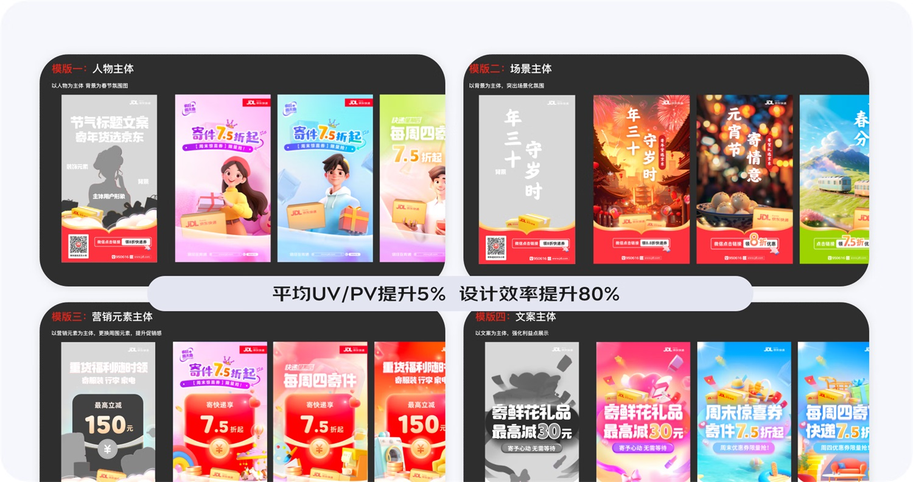

