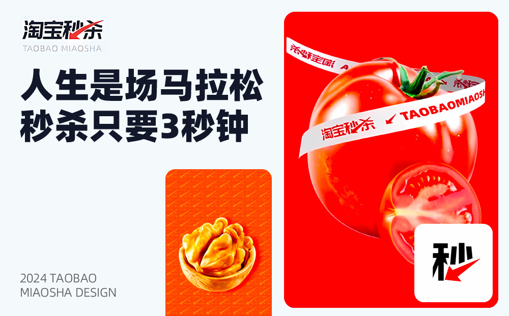
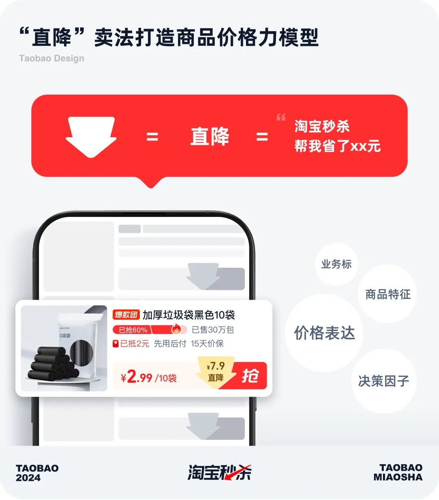
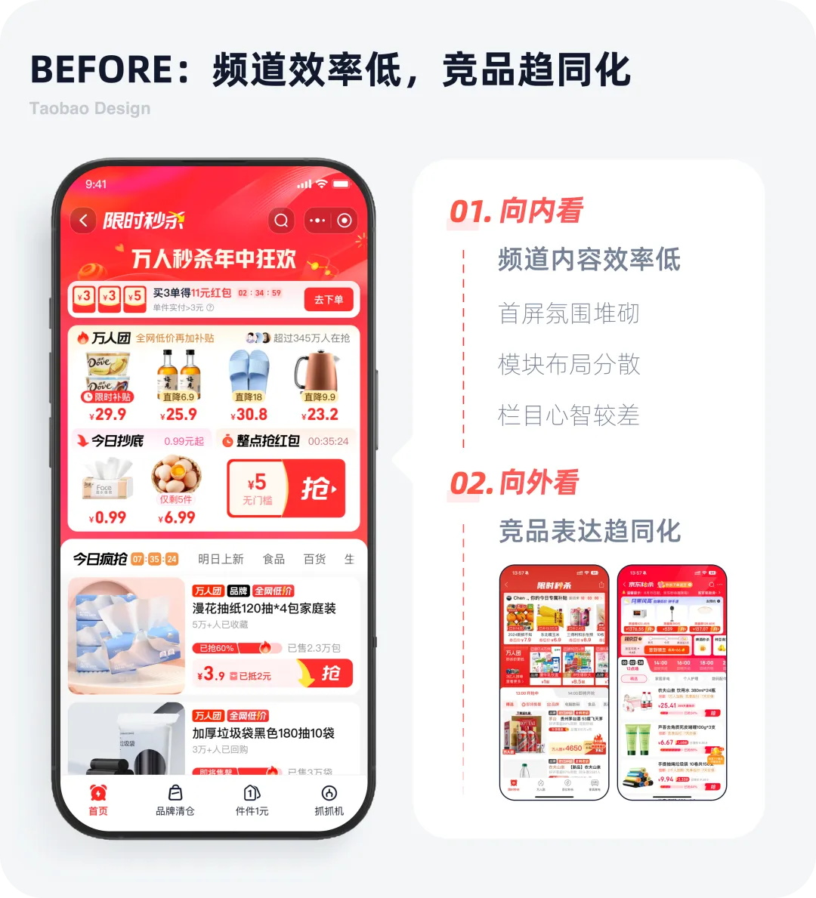
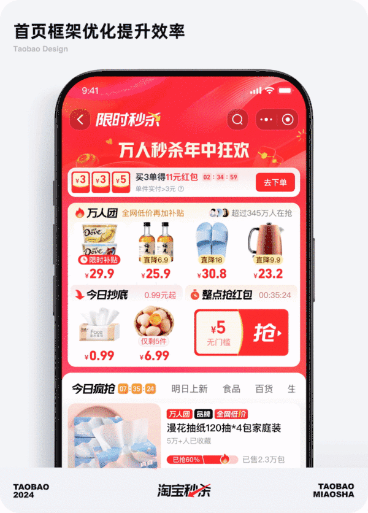
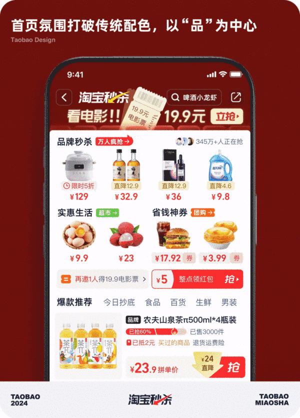
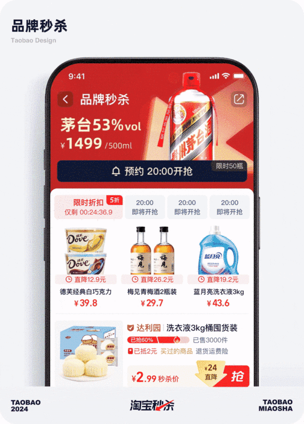
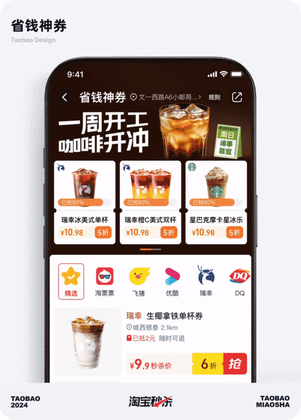
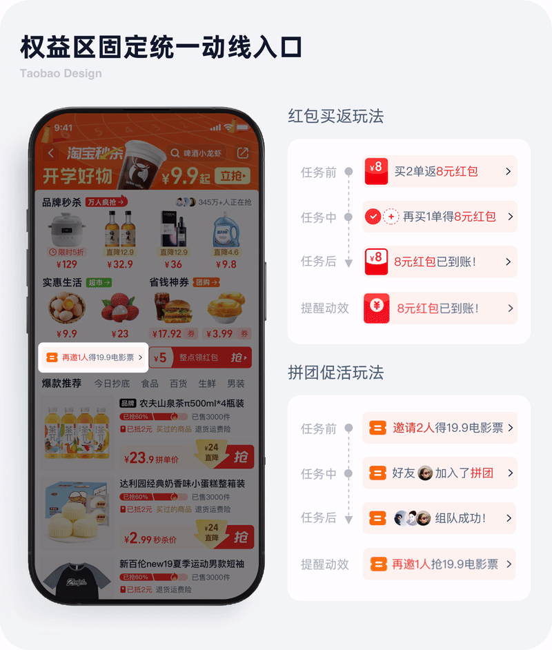
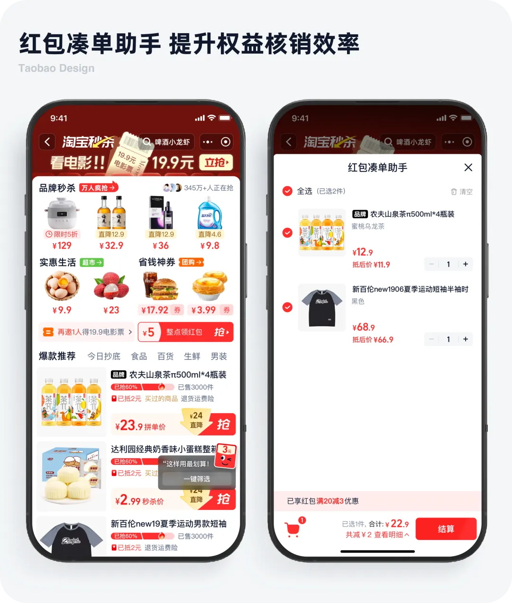
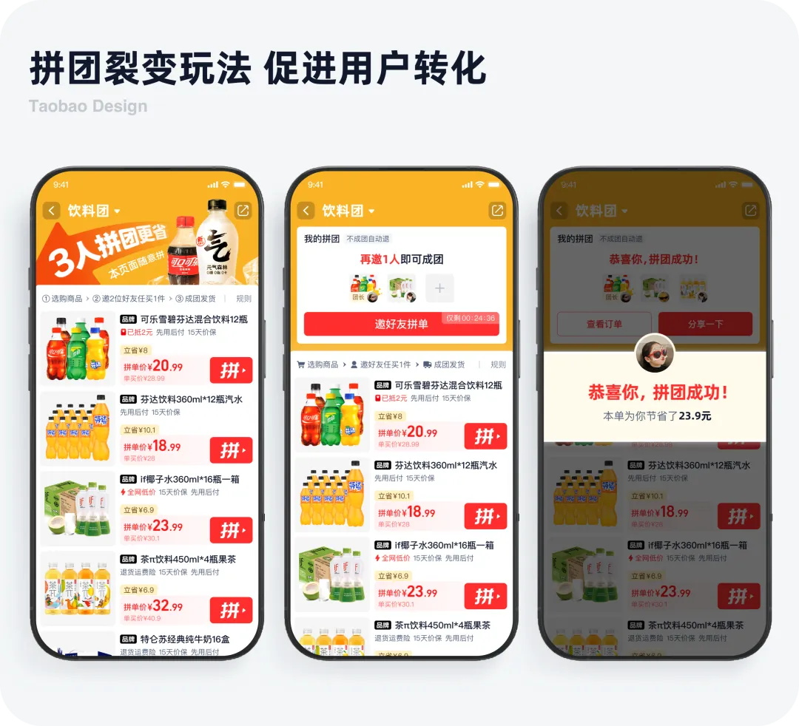

# 快看速买！淘宝秒杀频道设计改版完整复盘

> 原文链接：https://www.uisdc.com/taobao-2
> 作者/团队：淘宝设计 团队
> 日期：2024/12/03
> 标签：未提供
> 本地归档说明：为尊重原站版权，此文件不逐字转载全文；保留原文链接、图片引用、筛选理由和关键内容线索，方法沉淀见 ux-method-library。

## 筛选理由

淘宝秒杀频道改版，适合沉淀高时效转化与紧迫感表达

## 关键内容线索

1. 引言 淘宝双 11 互动玩法已持续多年，从 2018 年《双 11 狂欢之城》到 2023 年《幻想岛总动员》，过去双 11 互动旨在营造一个轻松愉快的“游戏场”，吸引用户持续游玩 - 积累奖励 - 最终开奖，获得权益后去购物，打造先蓄水后爆发的模式。
2. 一、秒杀价格力，体验标准建立 淘宝秒杀价格直降，不需凑单领券。
3. 前台导购通过直降箭头表达价差语义，同时优化商品决策因子强弱。
4. 经过元素级的定量对比测试，沉淀出导购效率最优解，定义秒杀价格力的高效率体验标准。
5. 二、以品为中心的频道体验升级 通过自身问题洞察和竞品分析，我们发现在业务承载、内容效率、品类构成、设计形态等维度都存在着效率不够及表达趋同性的系列问题。
6. 所以我们尝试以直降价格体验模式为基准、重组频道高效框架、以品为核心拓展、更注重年轻化的设计语言，整体来形成秒杀货品一键直达，低价不绕弯路的感知。
7. 频道首页氛围以「品」为中心建立频道第一印象，不依赖传统黄红的浓烈氛围，走出差异化的视觉风格路线。
8. 子栏目在体验框架一致性的基础上，以「品」建立秒杀栏目心智，针对不同货盘品类差异，定制多样化商品增强手段，增强商品的吸引力。

## 原文图片

