# 想做好会员体系设计？来看百度APP的案例复盘！

> 原文链接：https://www.uisdc.com/baidu-vip-2
> 作者/团队：百度MEUX 团队
> 日期：2025/10/27
> 标签：未提供
> 本地归档说明：为尊重原站版权，此文件不逐字转载全文；保留原文链接、图片引用、筛选理由和关键内容线索，方法沉淀见 ux-method-library。

## 筛选理由

百度会员体系案例，适合会员权益、身份感和付费转化

## 关键内容线索

1. 前言 为深化会员服务、契合会员价值与用户需求，本次围绕“转化提效”“权益升级”两大战略变化焕新升级，一方面简化支付链路，让用户便捷感知会员价值、顺畅完成转化；另一方面引入短篇故事等权益，丰富会员体验。
2. 为会员体系的长效运营及业务增长注入新动能。
3. 为了让你用好会员功能，携程设计师操碎了心在用户需求日益多元化的旅游市场中，会员权益的价值不仅在于提供优惠，更在于创造差异化的体验与长期归属感。
4. 以及旧版的 ICON 色彩鲜亮跳脱，带来整体界面的尊享感和品质感缺失，不符合产品泛用户群体的喜好。
5. 二、设计目标：更聚焦、更尊享 基于以上的问题，首先重组结构，聚焦内容：打破原有信息密集、堆叠展示的方式，围绕转化提效和核心权益进行结构重组。
6. 其次，品牌升级，提尊享感：通过视觉系统传递“尊享感、品质感”，提升会员身份的仪式感。
7. 三、更聚焦：重组结构，聚焦内容 1. 首屏结构调整 1）简化操作流程 价格和优惠信息直接展示，减少了用户的操作步骤，简化了决策路径，通过倒计时等设计元素，制造紧迫感。
8. 2）视觉层次调优 核心信息（如价格、按钮）加大位置和大小的对比，引导用户注意力。

## 原文图片

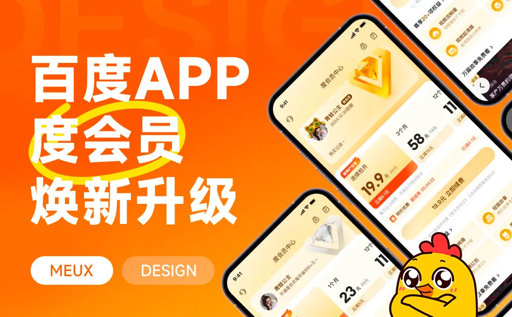

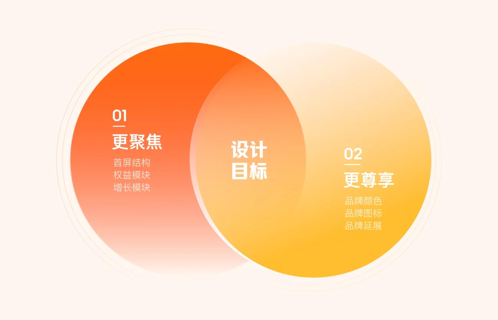

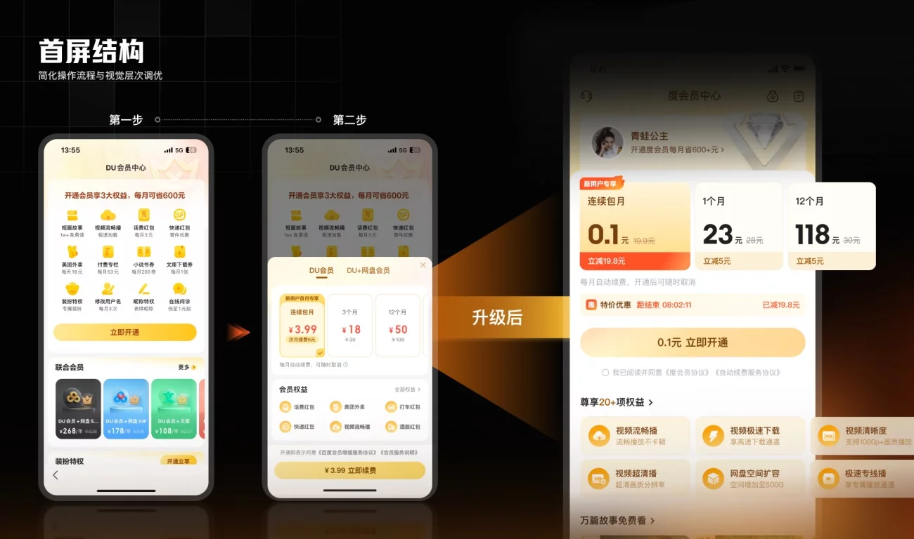

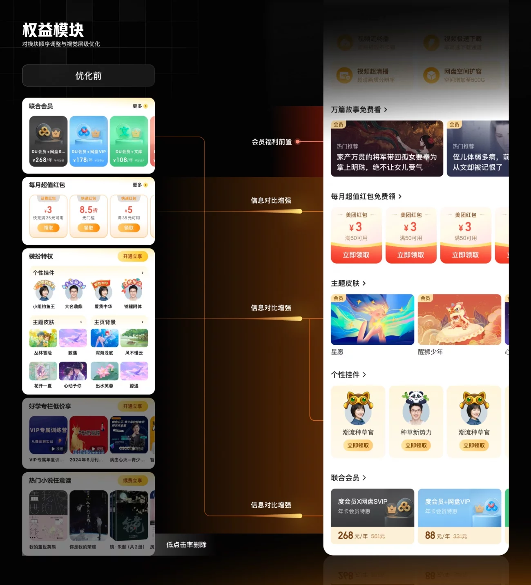

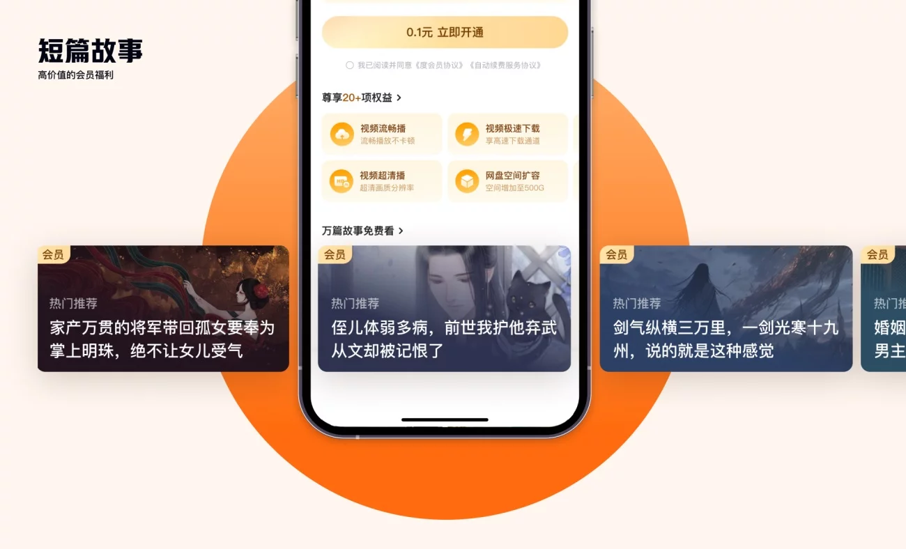

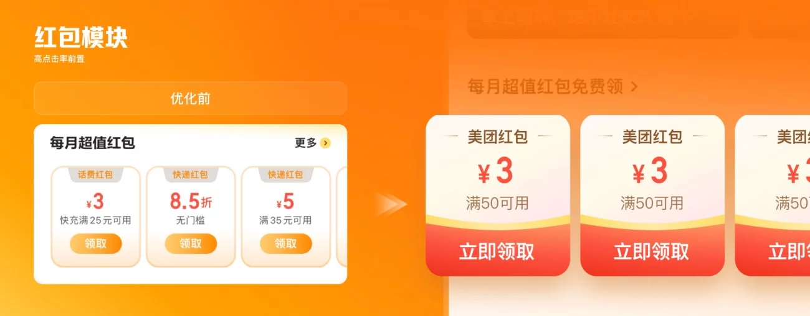

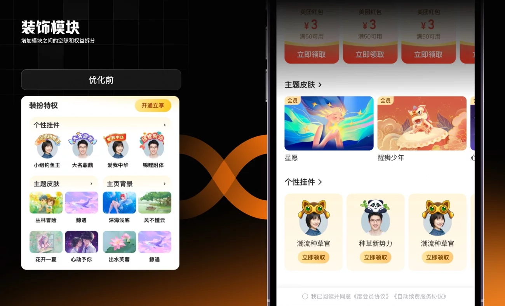

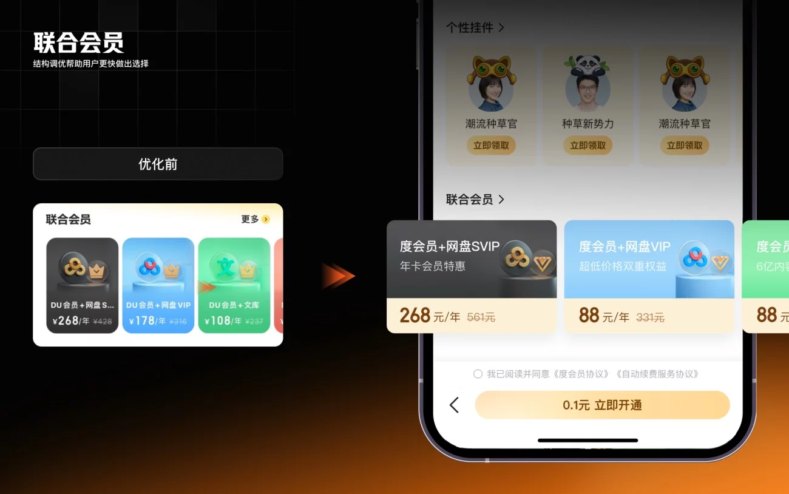

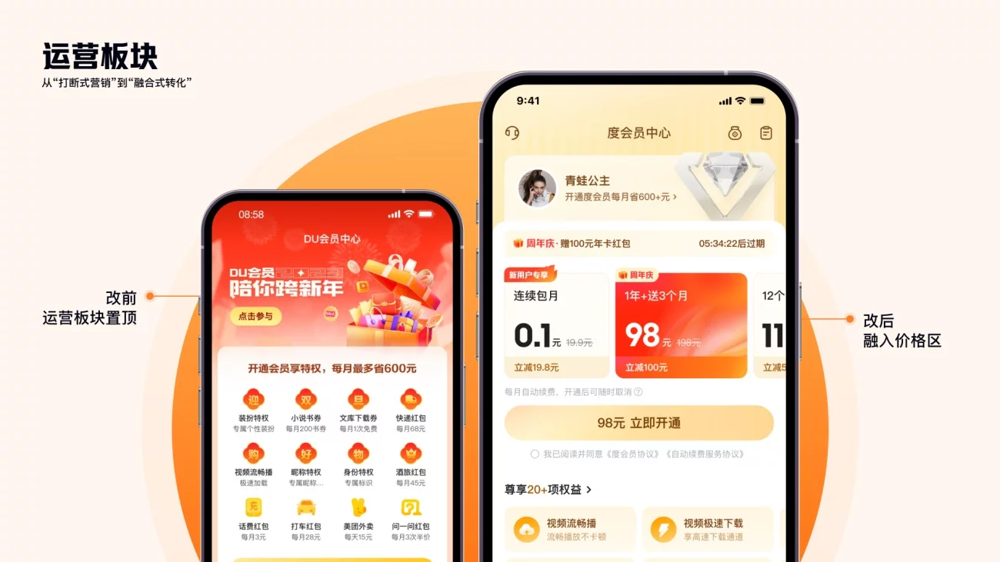

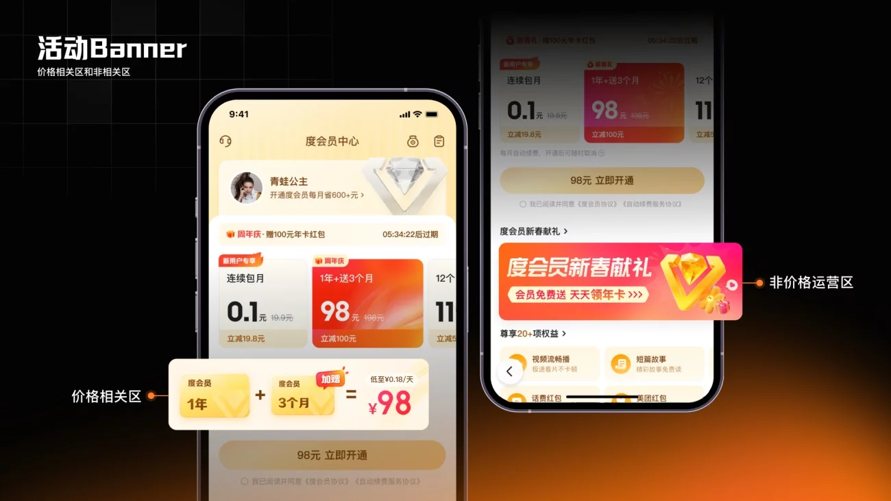

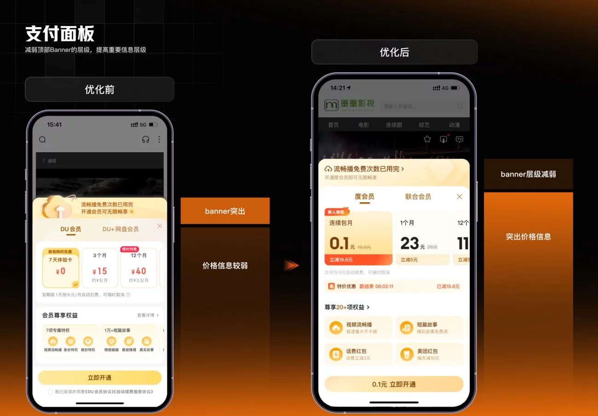

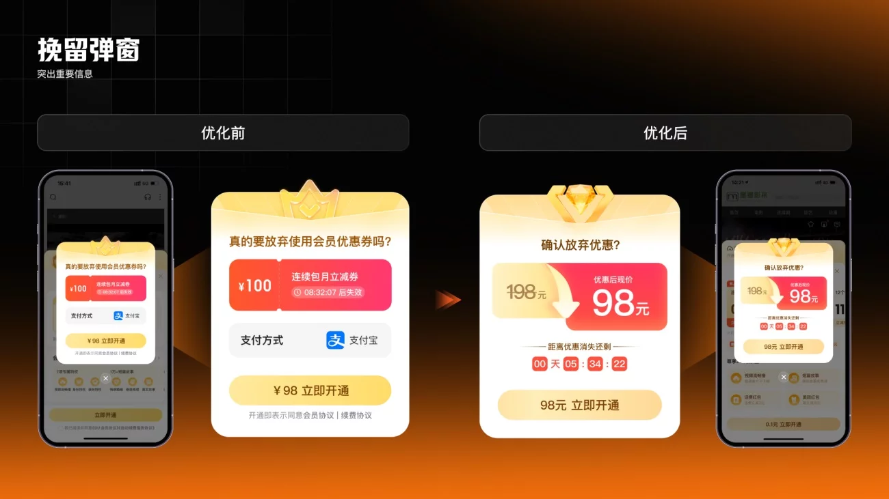

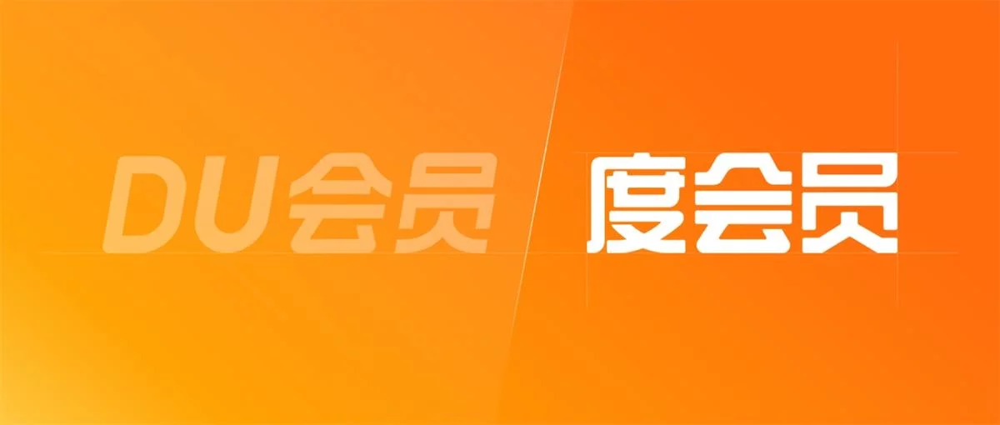

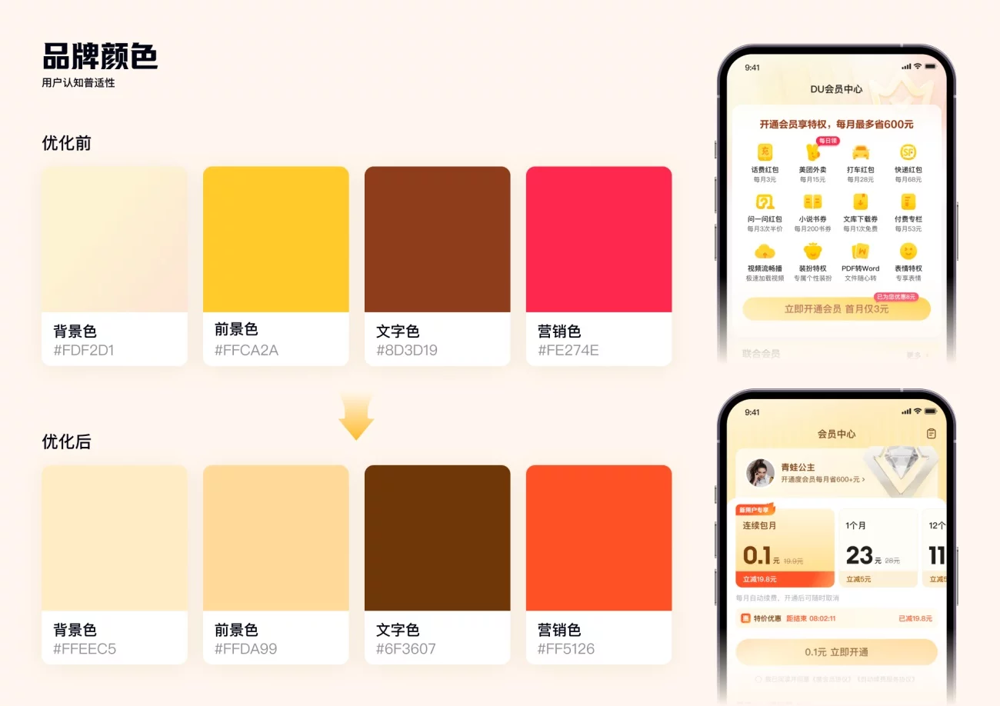

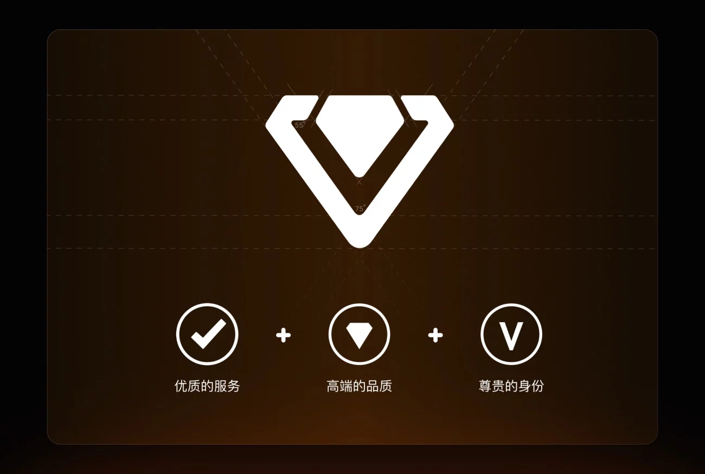

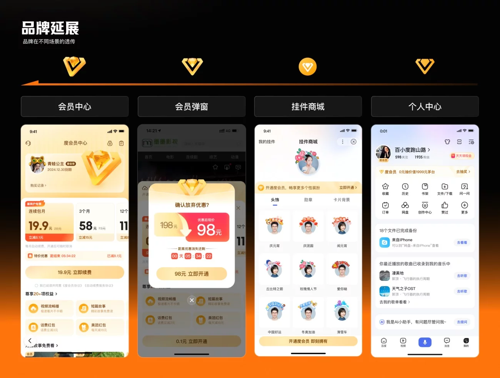

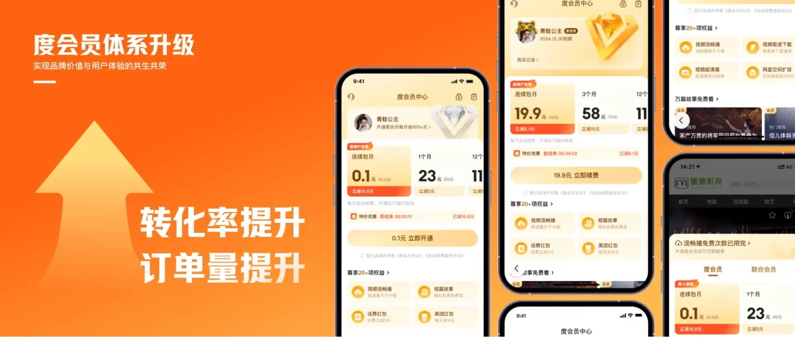

