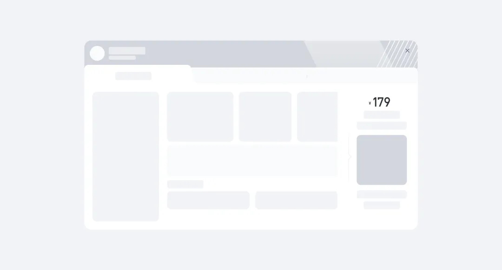
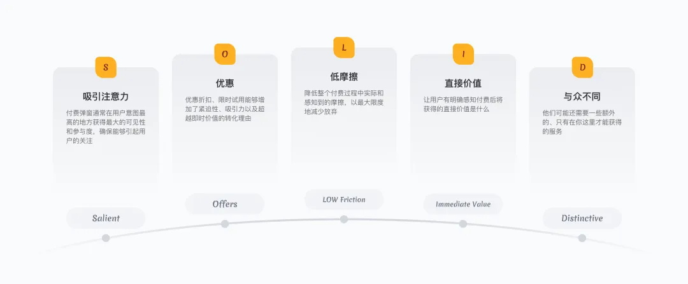
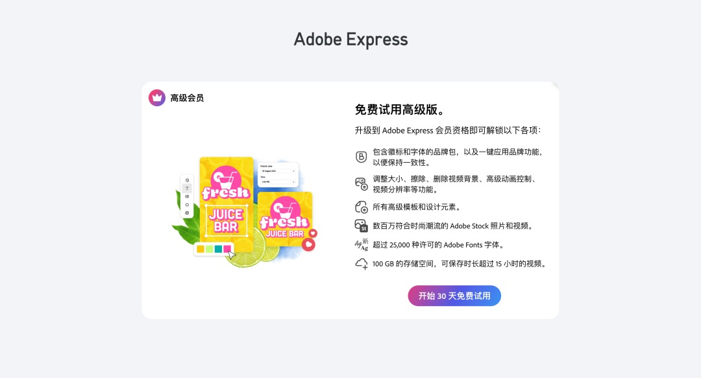
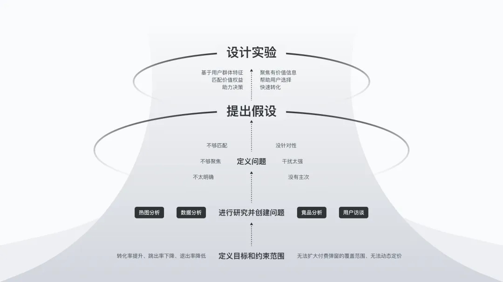
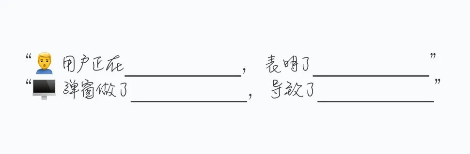
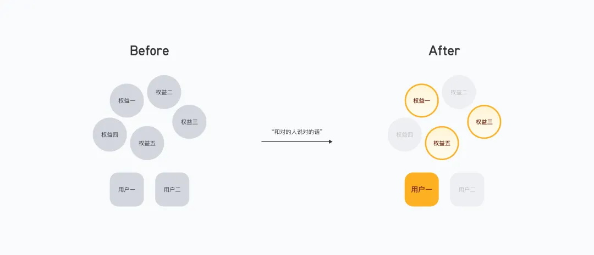
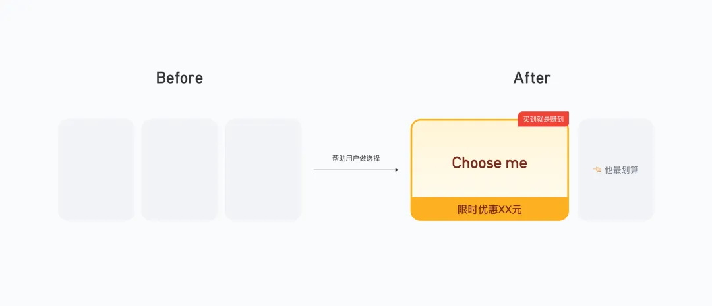
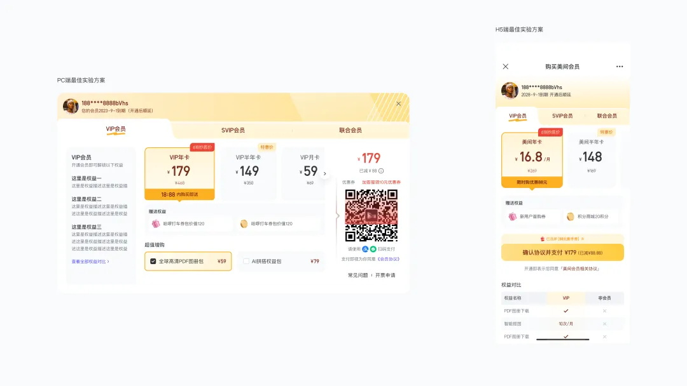
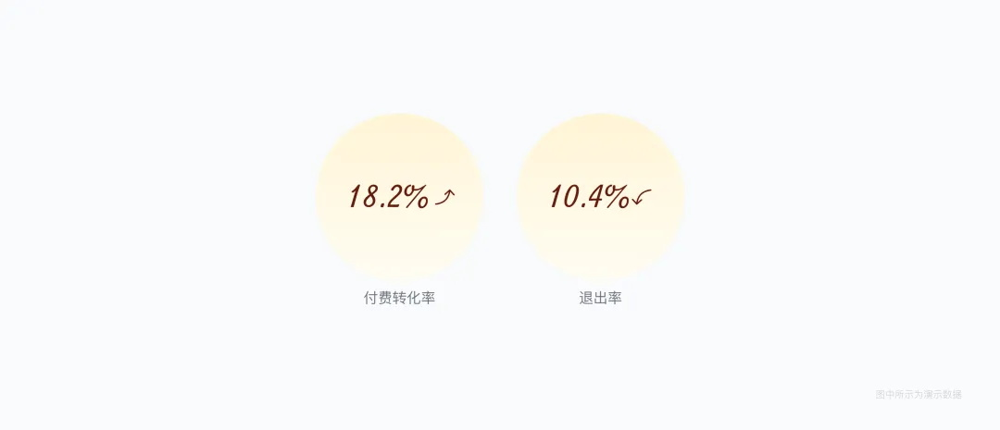
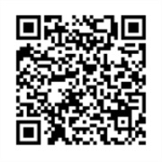

# 提高18%转化率！付费弹窗的设计优化实战复盘

> 原文链接：https://www.uisdc.com/paid-pop-up-window
> 作者/团队：群核科技用户体验设计 团队
> 日期：2024/08/02
> 标签：未提供
> 本地归档说明：为尊重原站版权，此文件不逐字转载全文；保留原文链接、图片引用、筛选理由和关键内容线索，方法沉淀见 ux-method-library。

## 筛选理由

付费弹窗转化优化，适合付费决策、挽留和弹窗信息结构

## 关键内容线索

1. 在这里我们分享一些经验，希望能够帮助大家更好的完成付费弹窗策略的优化，并带来正向的反馈。
2. 无论是传统行业还是互联网公司，赚钱盈利才能长久生存。
3. 除非用户付费或订阅服务，否则会限制用户对产品的继续访问。
4. 换句话说，付费弹窗是一种被故意设置的障碍，它在阻止用户，直到他们付费或完成其他特定操作，例如注册免费试用等。
5. 2. 负面情绪的挑战 虽然付费弹窗通常是产品获取收益的主要机制，但对于习惯了“免费”的用户而言，付费弹窗也很可能会带来挫败感。
6. 在最大化转化量和最小化对用户情绪的损害之间来回切换着实让人很头疼。
7. 一、付费弹窗的关键五要素 基于 SOLID 框架，我们总结出好的会员转化弹窗的五个关键要素。
8. 这五个关键要素帮我们在最小损害用户情绪的同时获取最大付费转化。

## 原文图片

