# 携程做的这款AI旅游产品，凭什么拿下设计大奖？

> 原文链接：https://www.uisdc.com/ai-travel-assistant
> 作者/团队：TripDesign 团队
> 日期：2025/11/10
> 标签：未提供
> 本地归档说明：为尊重原站版权，此文件不逐字转载全文；保留原文链接、图片引用、筛选理由和关键内容线索，方法沉淀见 ux-method-library。

## 筛选理由

携程 AI 旅游产品案例，适合 AI 助手、行程规划和服务闭环

## 关键内容线索

1. 携程商旅海外品牌设计全方位复盘在全球化浪潮与携程集团 G2 理念推动下，携程商旅拓展海外 B 端市场，Trip.Biz 应运而生。
2. 在这一背景下，在线旅游（OTA）行业也迎来新一轮技术升级与体验重塑的重要契机。
3. 我们开始深入思考：如何将 AI 能力与旅游服务场景深度融合，以智能化的方式提升行程规划、商品预订以及出行服务的体验？
4. 基于这一目标，我们设计并开发了内嵌于 Trip.com 的 AI 旅行助手工具——TripGenie。
5. 该工具致力于为用户提供个性化、沉浸式的旅行解决方案，覆盖目的地推荐、行程规划、旅游资讯问答等环节。
6. 接下来，让我们一同回顾 TripGenie 的设计历程。
7. 一、1.0 版本：奠定基础，抢占先机 2023 年初，Trip.com 开启了 TripGenie 1.0 版本的探索。
8. 我们快速搭建了一个基础的 AI 对话框架，来满足基本的对话需求。

## 原文图片

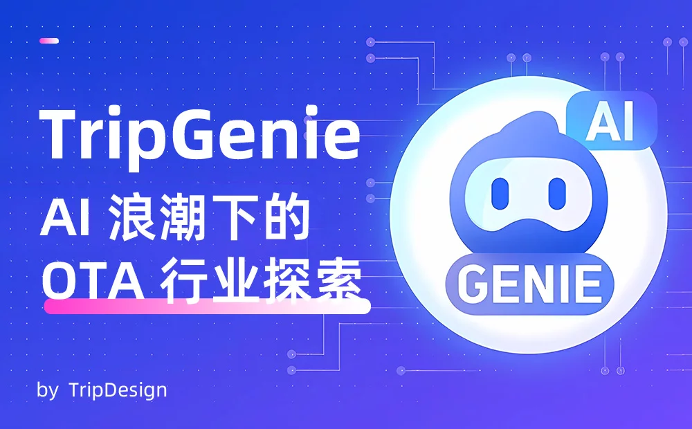

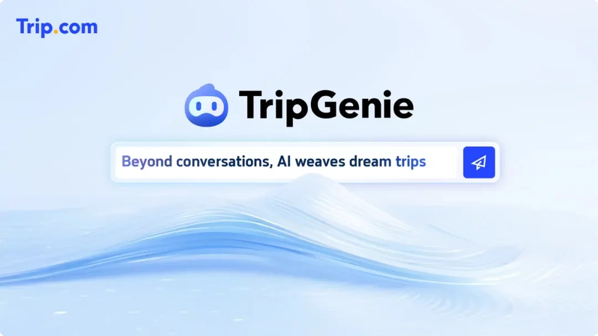

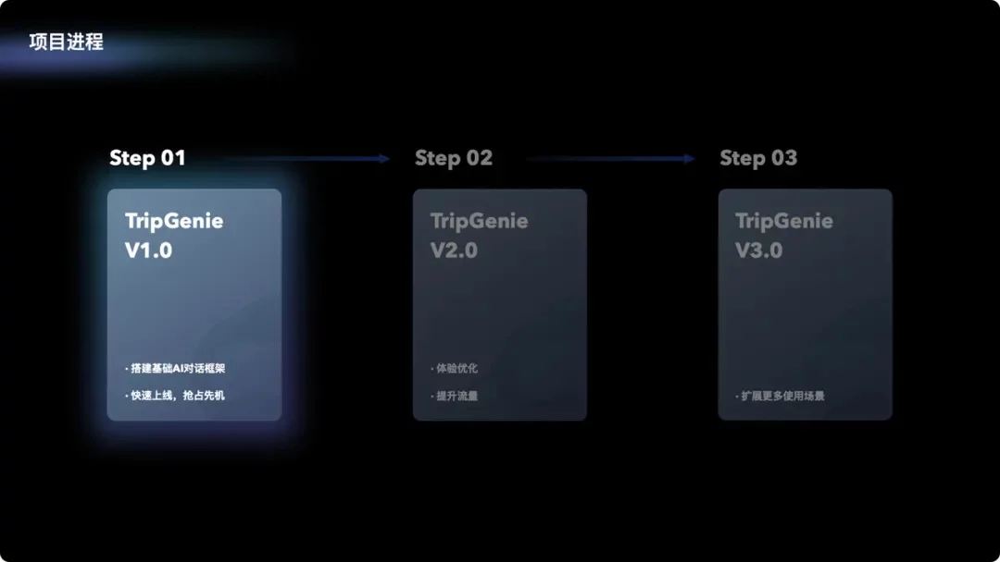

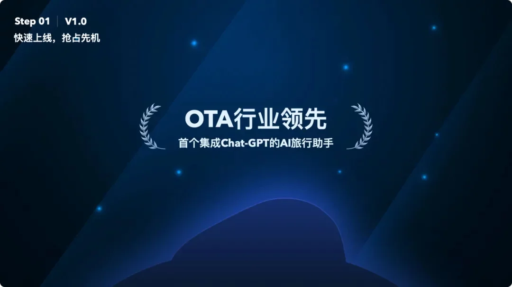

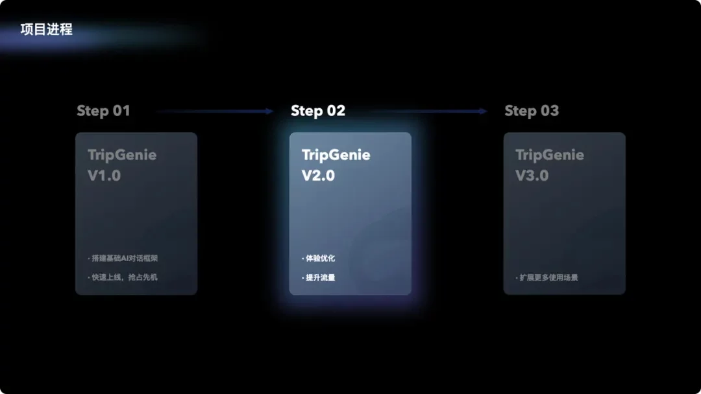

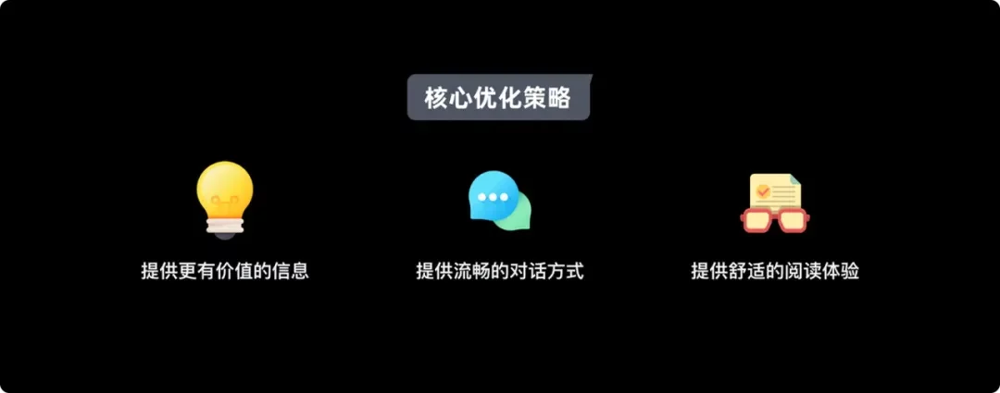

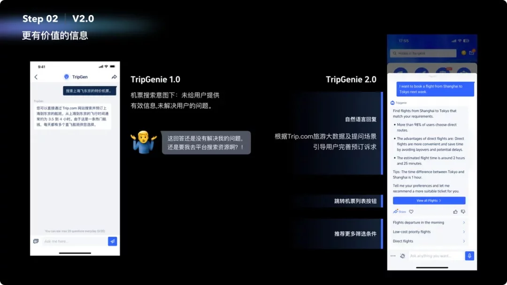

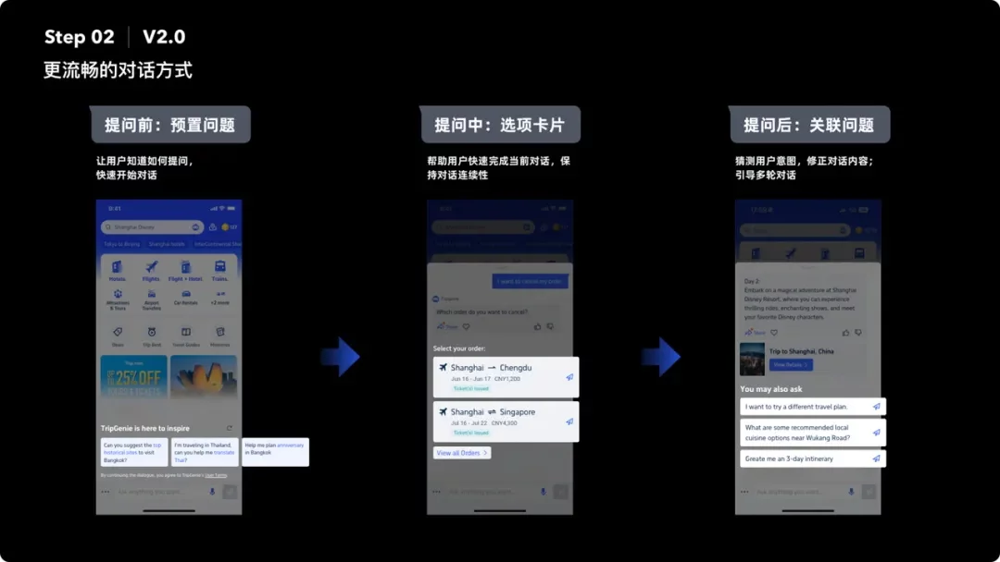

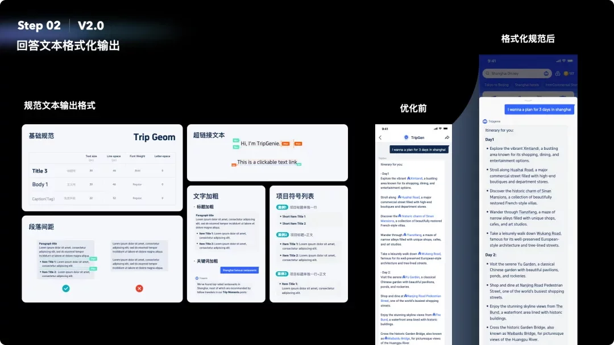

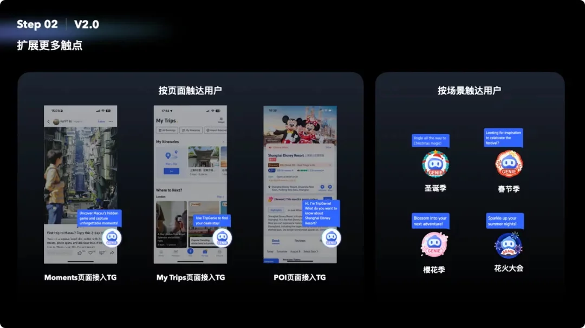

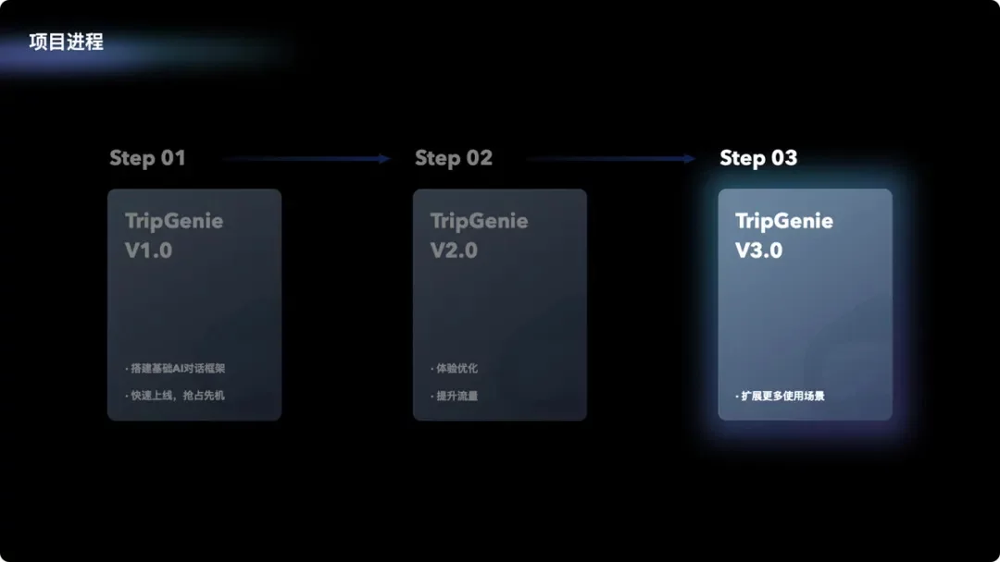

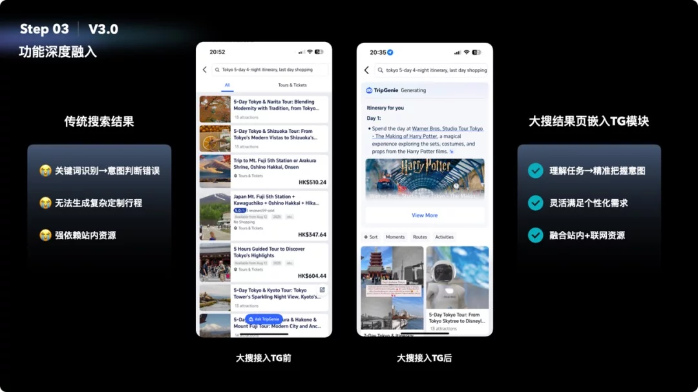

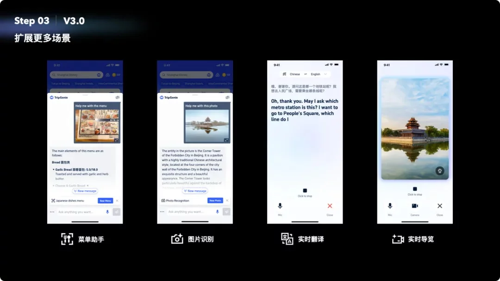

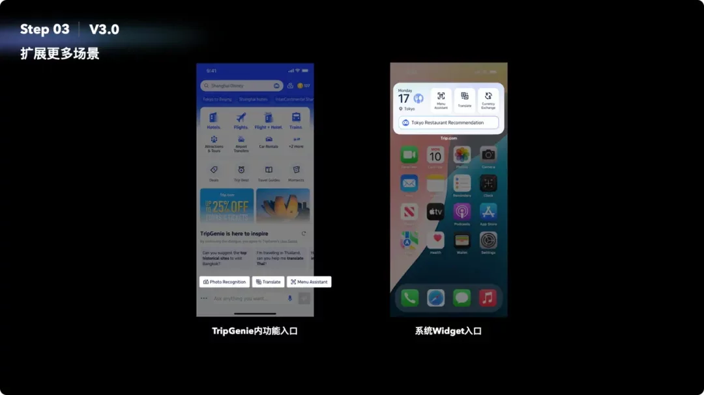

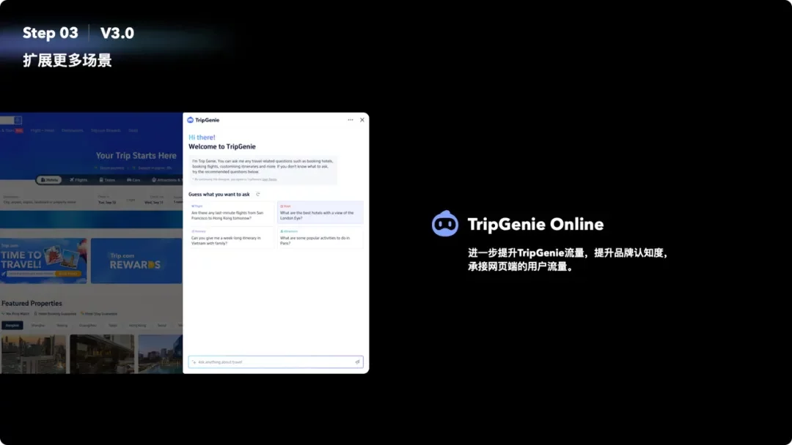

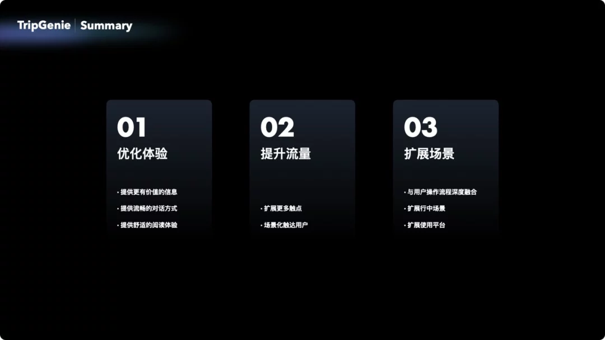

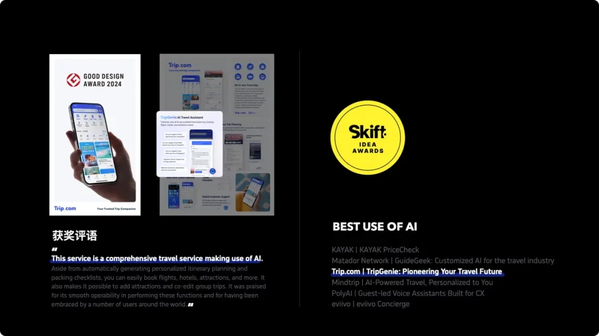

