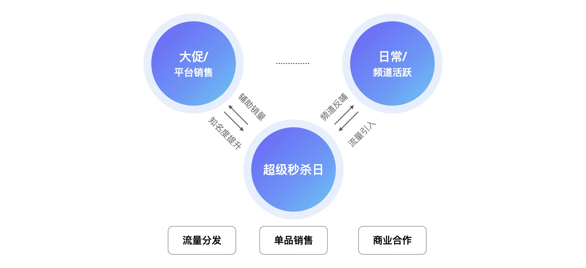
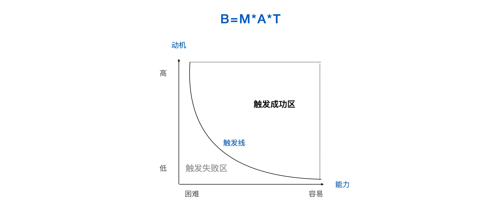
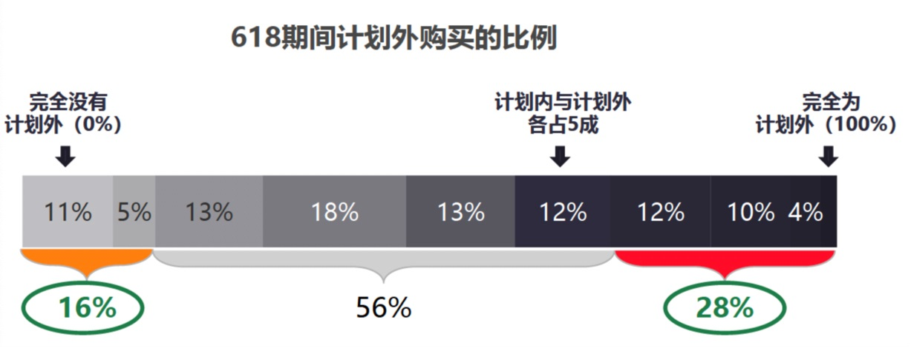
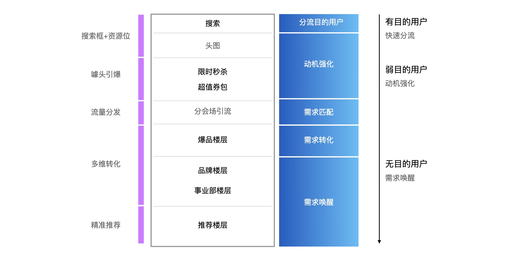
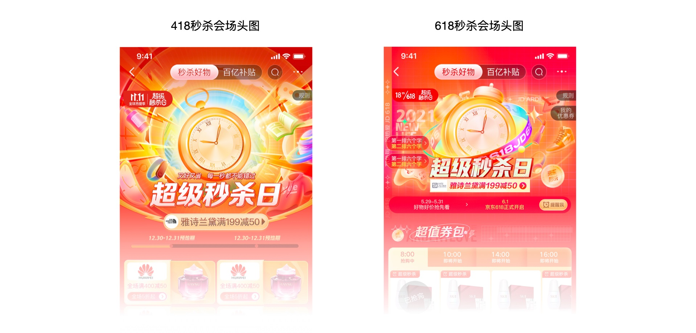
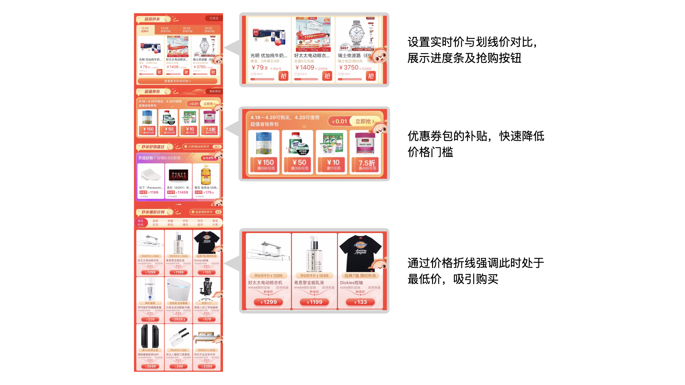
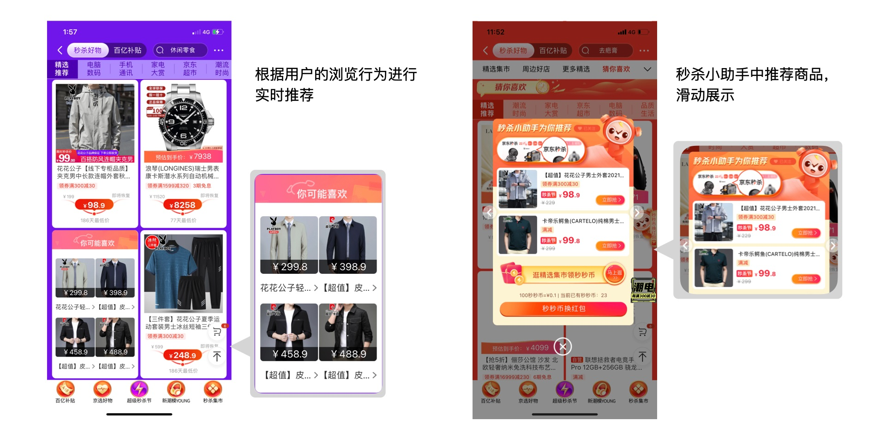
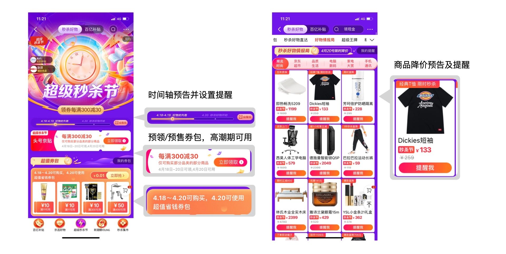
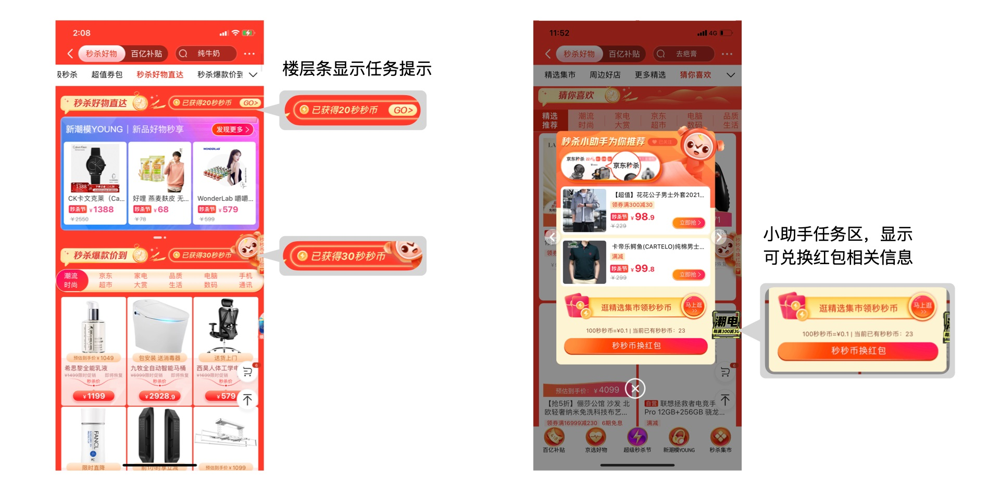

# 用秒杀会场的实战案例，帮你掌握福格模型的实际应用

> 原文链接：https://www.uisdc.com/fogg-model
> 作者/团队：京东JellyDesign 团队
> 日期：2021/07/04
> 标签：未提供
> 本地归档说明：为尊重原站版权，此文件不逐字转载全文；保留原文链接、图片引用、筛选理由和关键内容线索，方法沉淀见 ux-method-library。

## 筛选理由

福格模型实战，适合把行为模型落到 C 端活动和转化链路

## 关键内容线索

1. 虽然秒杀的商品及价格由业务侧主导，但设计师仍可以通过方法论的应用去提升会场的转化效果。
2. 本篇将会介绍如何将 fogg（福格） 模型运用到秒杀会场的设计中。
3. 1. 秒杀的特点 秒杀就是在限定时间内，通过发布一些超低价格的商品，吸引买家抢购的一种销售方式。
4. 因此秒杀具有两个核心特点，一个是限时降价，一个是限量抢购。
5. 现阶段，秒杀作为一种营销工具，已被各大电商平台广泛使用。
6. 利用秒杀的特点，平台可实现用户活跃、粘性提升、销售增长等目标。
7. 2. 超级秒杀日的定位 超级秒杀日是京东秒杀频道推出的营销活动，旨在辅助平台销售的增长，同时提升频道的知名度，带来日常流量的增长。
8. 在促销期间，会场承担着流量分发、单品销售、商业合作的作用。

## 原文图片

