# 让1.2亿人开口学英文！拆解全球最大语言学习社区Busuu

> 原文链接：https://www.uisdc.com/busuu
> 作者/团队：廖尔摩斯丨设计大侦探
> 日期：2026/01/27
> 标签：未提供
> 本地归档说明：为尊重原站版权，此文件不逐字转载全文；保留原文链接、图片引用、筛选理由和关键内容线索，方法沉淀见 ux-method-library。

## 筛选理由

语言学习社区案例，适合 C 端学习产品、社区和留存机制

## 关键内容线索

1. 深度拆解成人语言学习应用Babbel新年好，各位朋友！
2. 1. 产品简介 Busuu 是全球最大的语言学习社区之一，拥有 1.2 亿学习者。
3. 这款应用创建于 2008 年，品牌名称源自喀麦隆的一种濒危语言——博树语，目前仅有少数人仍在使用。
4. 平台提供 14 种语言课程，涵盖从初学者到高级的各个水平：英语、西班牙语、法语、德语、意大利语、葡萄牙语、中文、日语、波兰语、土耳其语、俄语、阿拉伯语、韩语和荷兰语。
5. Busuu 的核心价值是帮助用户学习真实世界所需的语言技能。
6. 平台提供精心设计的课程，帮助用户学习语法并掌握文化技能。
7. 此外，Busuu 还打造了一个高活跃度的互助社区，用户可以跟随母语使用者学习日常语言表达，真正做到学以致用。
8. 以下是我从 Busuu 官网搜集的部分产品荣誉，帮助大家更全面了解这款产品： 2021 年，《独立报》评选 Busuu 为"最佳购买"语言学习应用。

## 原文图片

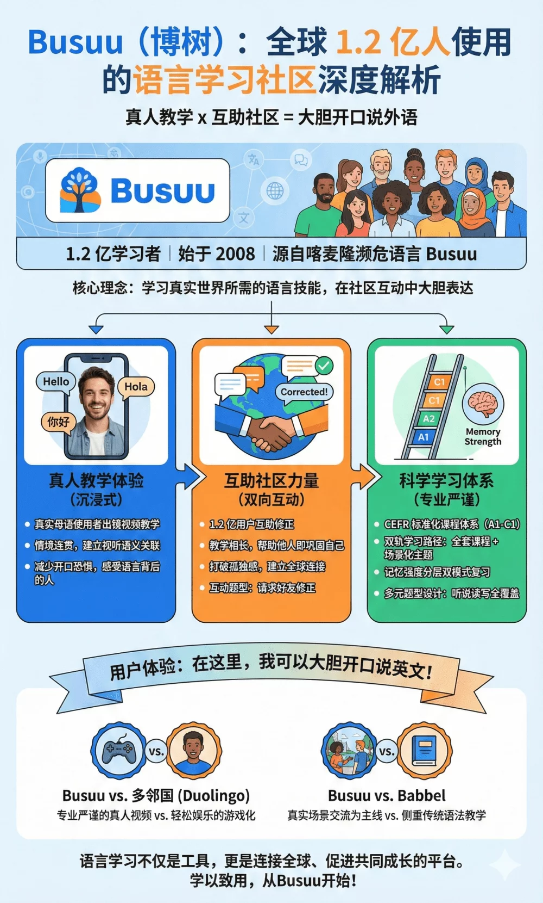

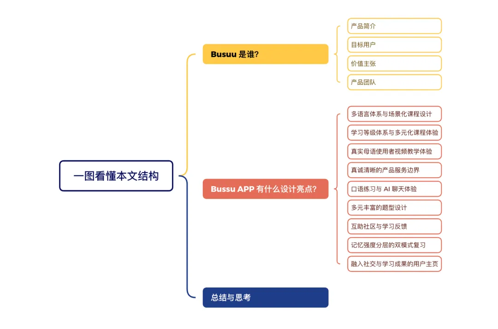

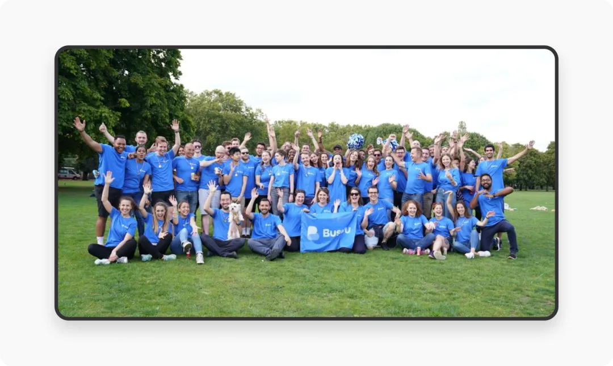

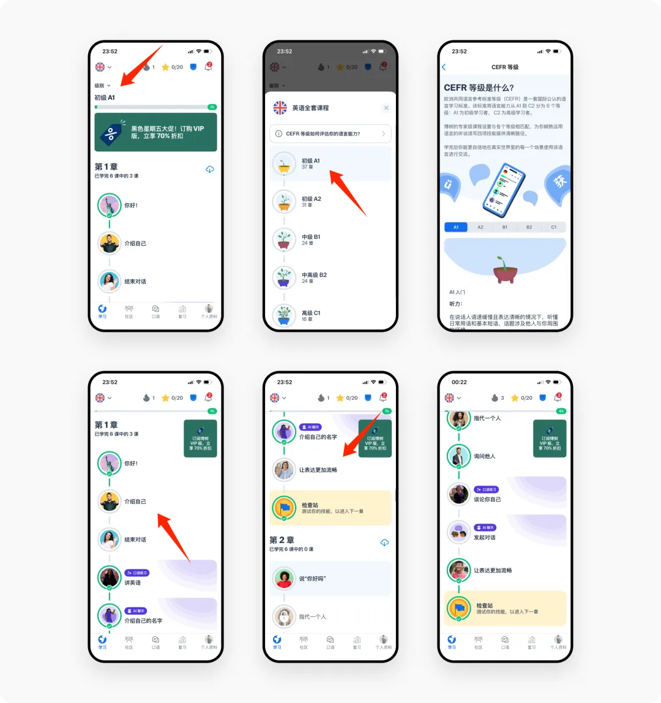

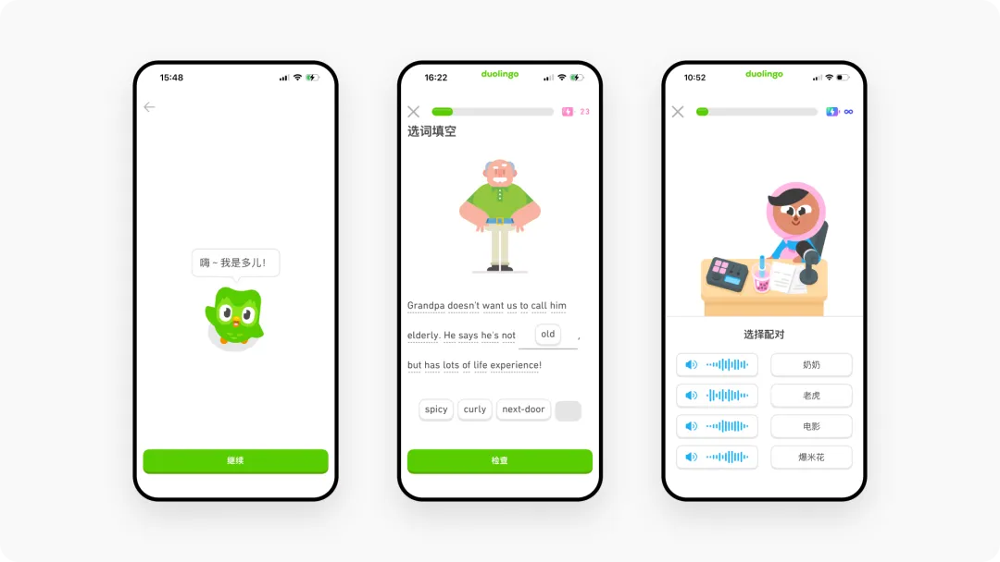

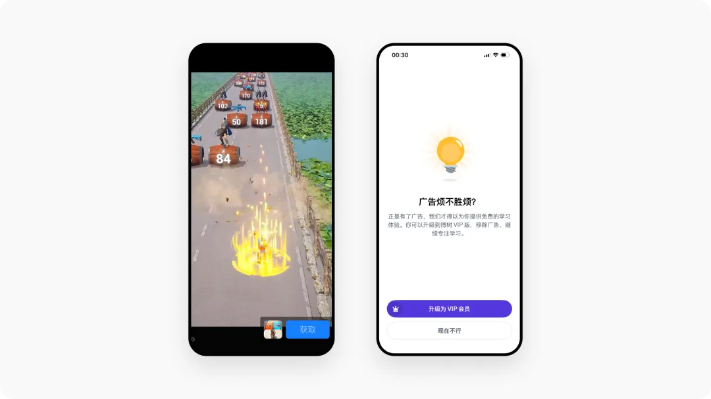

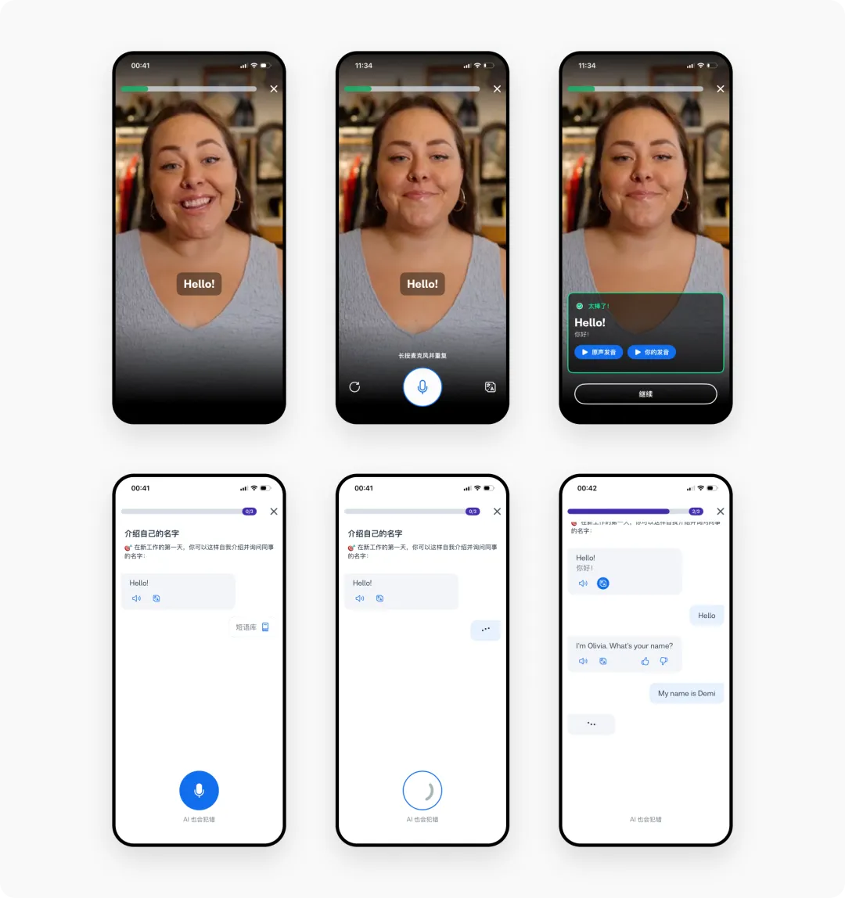

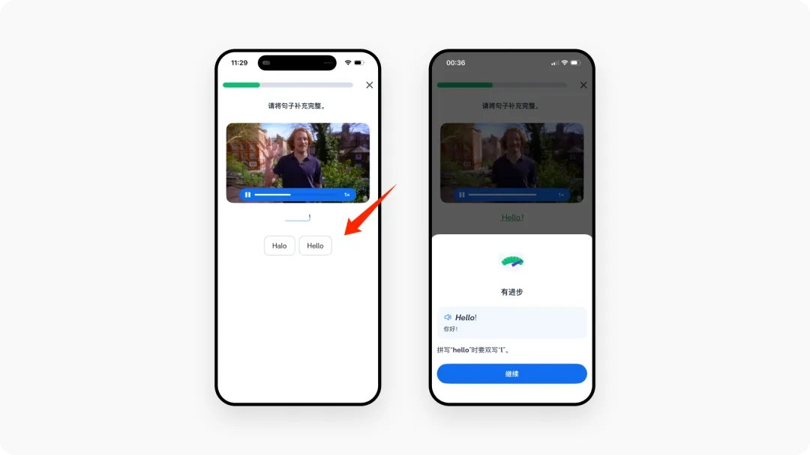

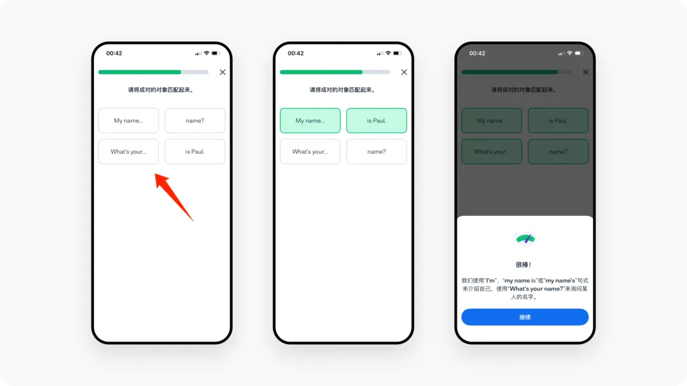

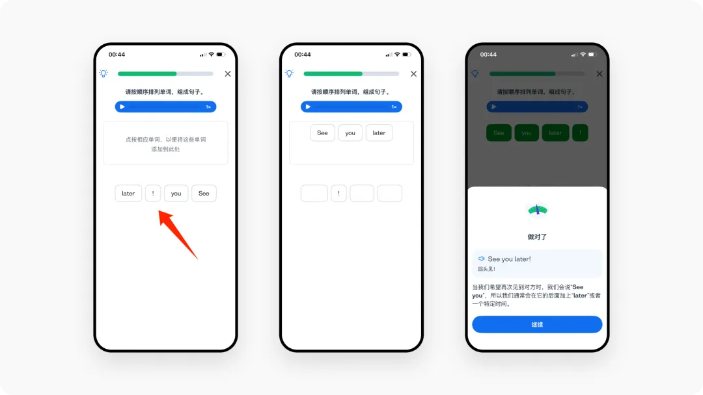

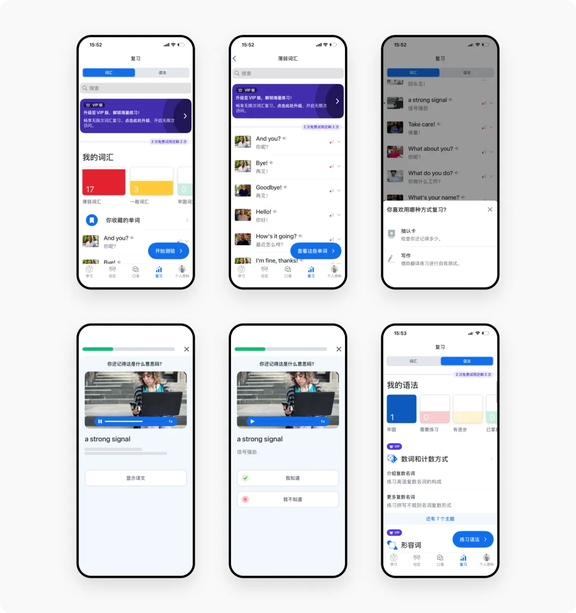

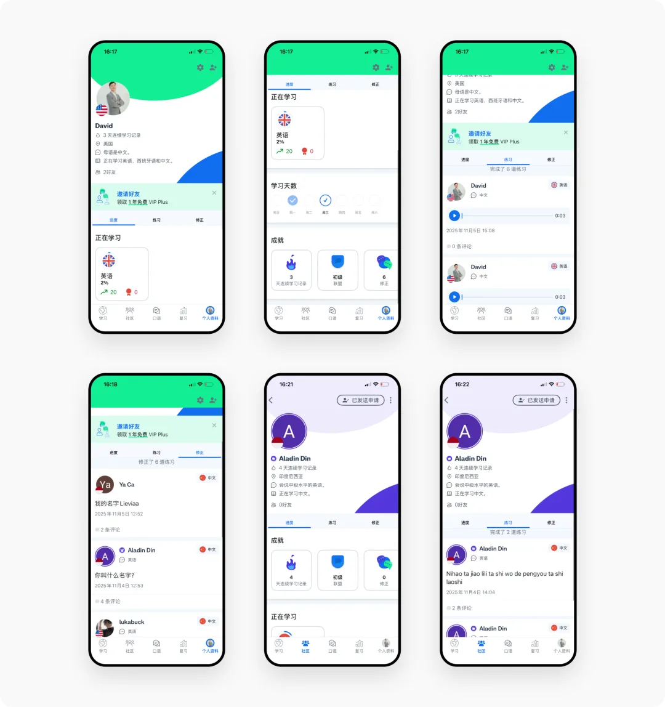

