# 超多案例！3个设计策略让你的AI产品更加人性化！

> 原文链接：https://www.uisdc.com/human-centric-ai-design
> 作者/团队：Ant Design 元尧
> 日期：2026/01/13
> 标签：未提供
> 本地归档说明：为尊重原站版权，此文件不逐字转载全文；保留原文链接、图片引用、筛选理由和关键内容线索，方法沉淀见 ux-method-library。

## 筛选理由

人本 AI 产品策略，适合 AI 功能边界、反馈与信任

## 关键内容线索

1. 本文会介绍以下三个设计策略和典型案例： 个性化定制 多产品互通 低操作门槛 希望会为你带来更多的设计灵感。
2. 前言 行业内持续探索 AI 内容生成与创作工具，由 AI 驱动的创作方式正逐步成为主流。
3. 同时强化图标、主题与深色模式的个性化表达，你可以自由改变图标形状，让桌面更符合自己的风格： 二、多产品互通 AI 智能体能够调动其他产品互动，协调和控制多个不同产品或设备，实现它们之间的交互与协同工作，从而为用户提供更便捷、高效和智能的服务体验。
4. 在 AI 浪潮中，工具的形态会随算法不断进化，但用户对尊重、高效与情感连接的需求从未改变。

## 原文图片

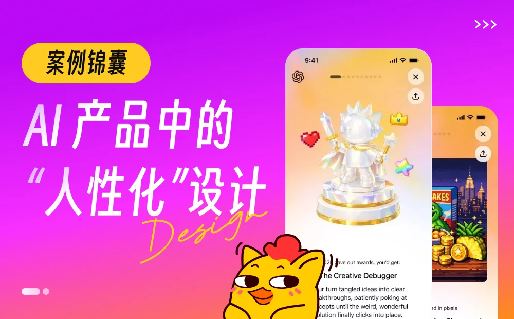

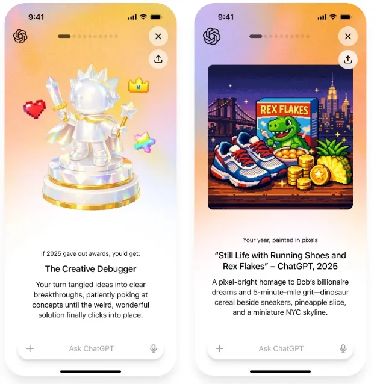

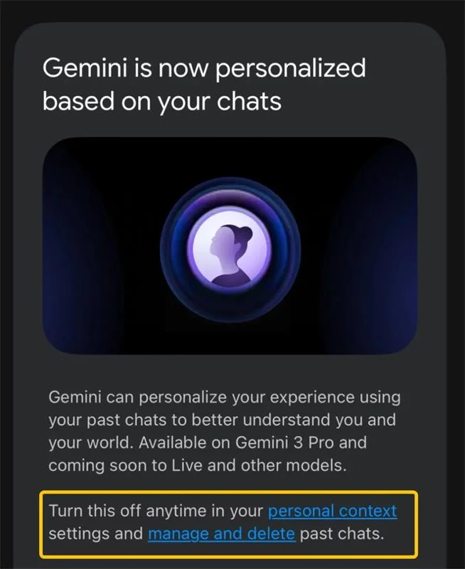

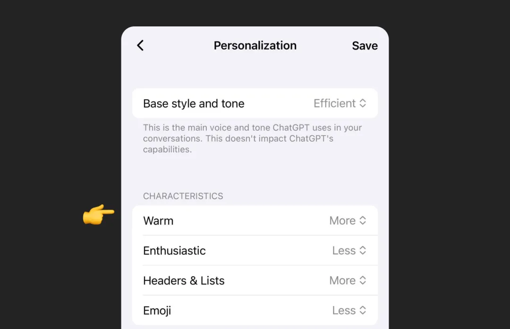

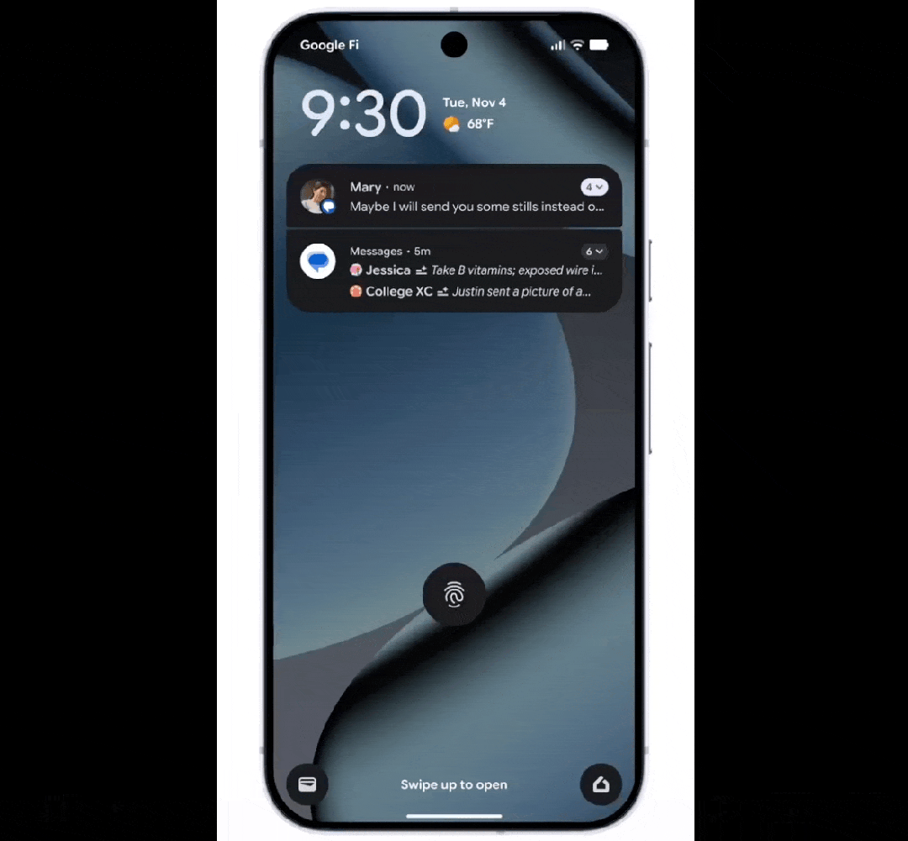

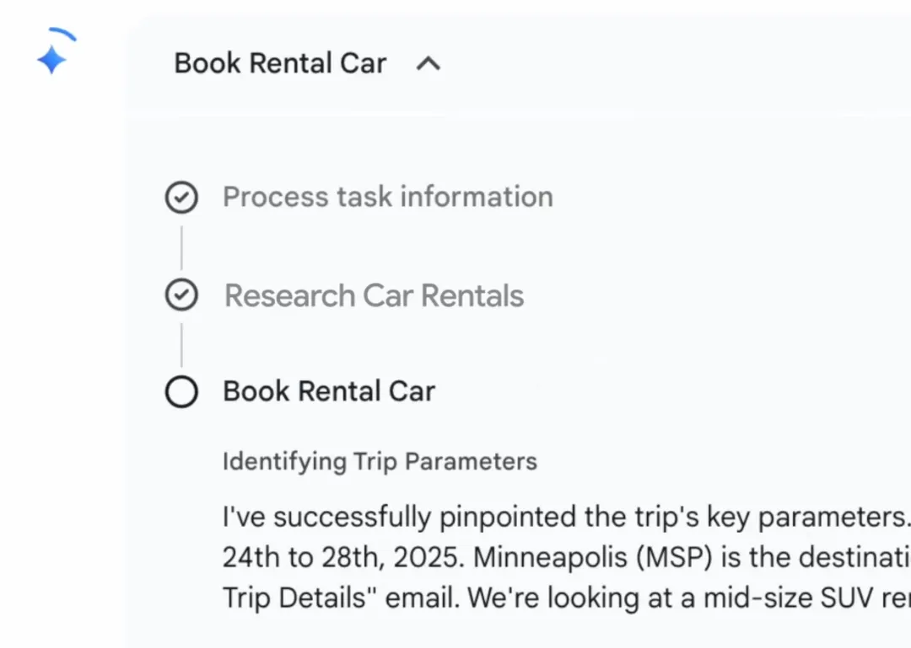

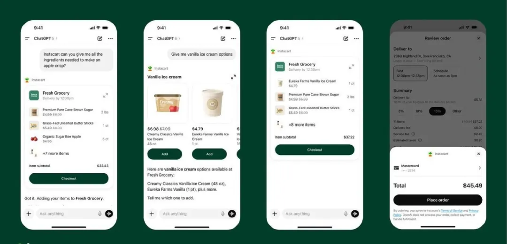

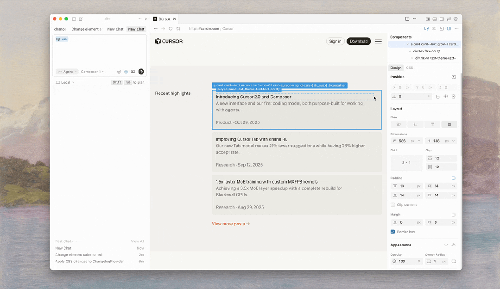

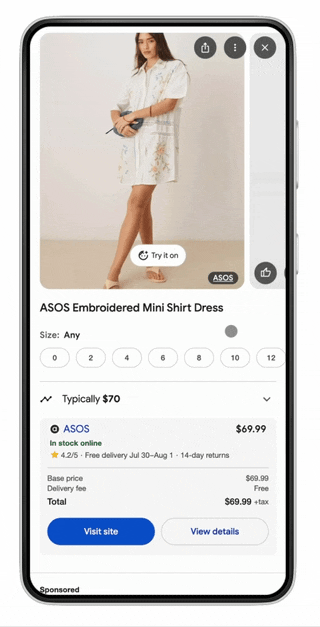

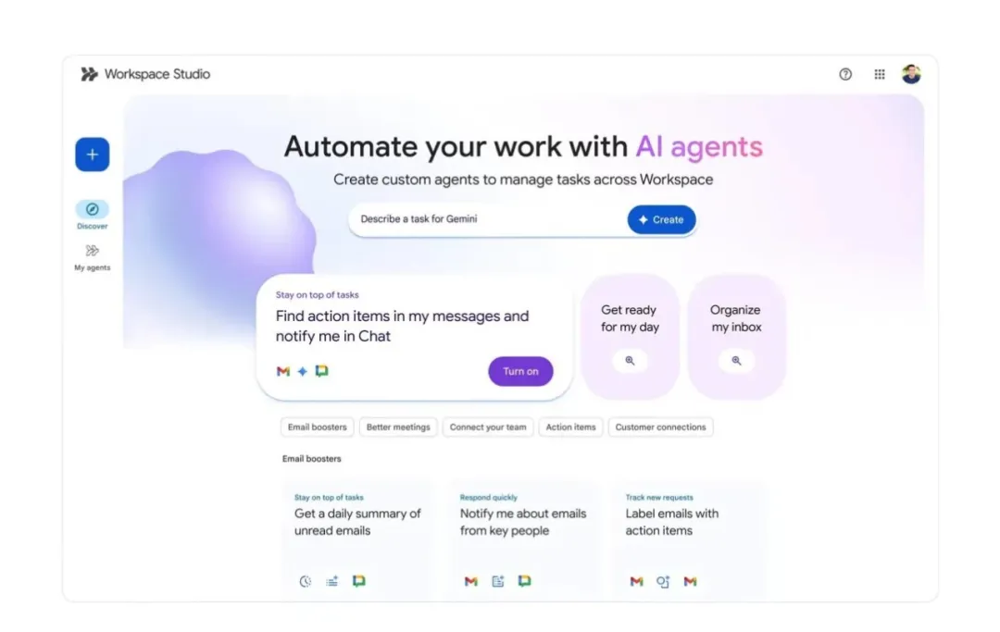

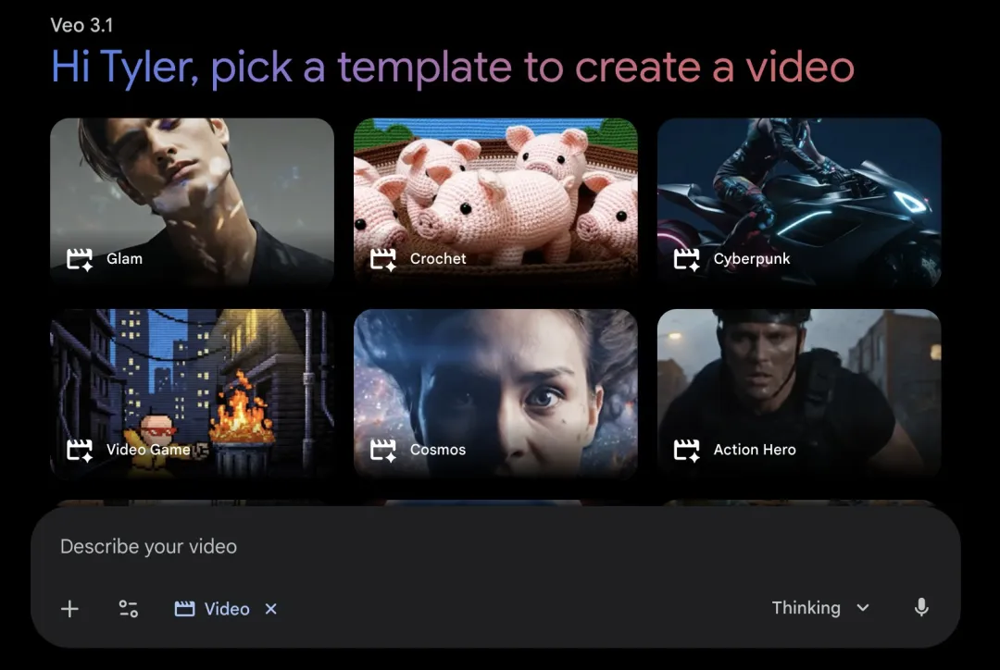

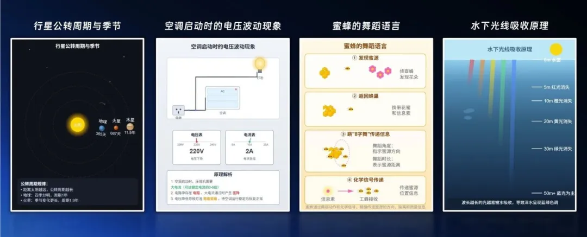

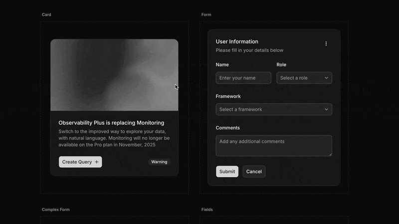

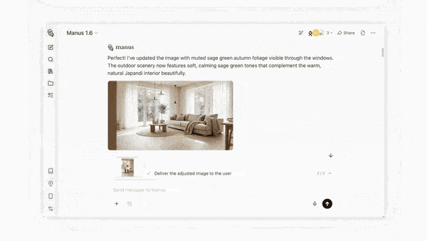

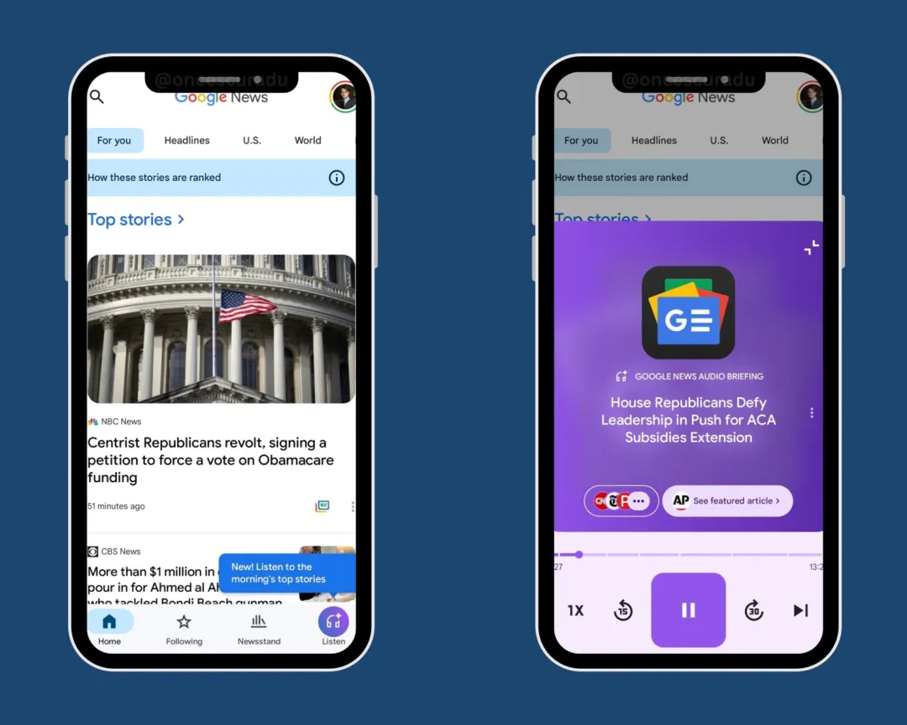

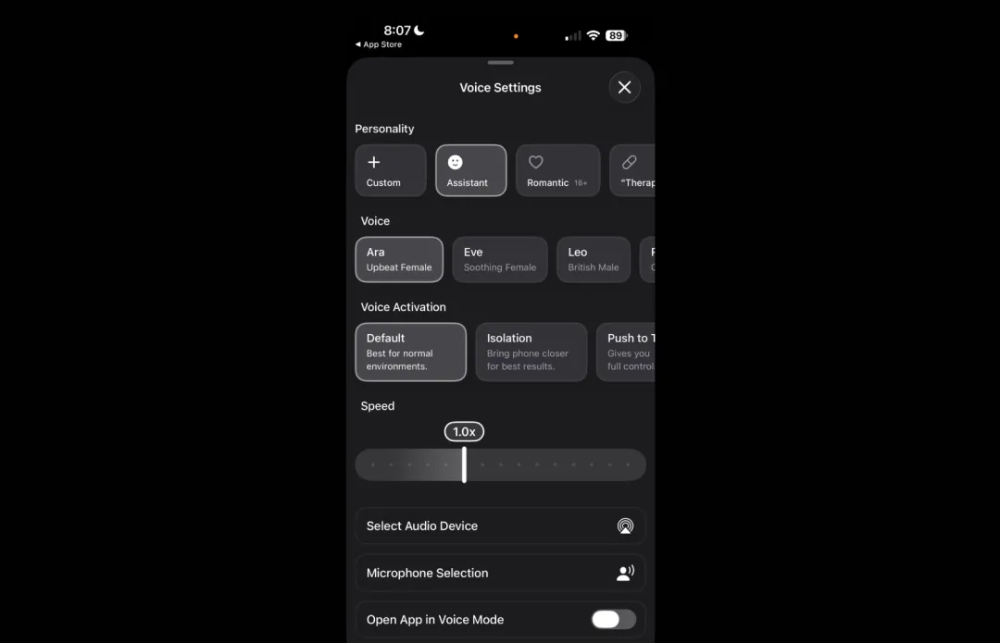

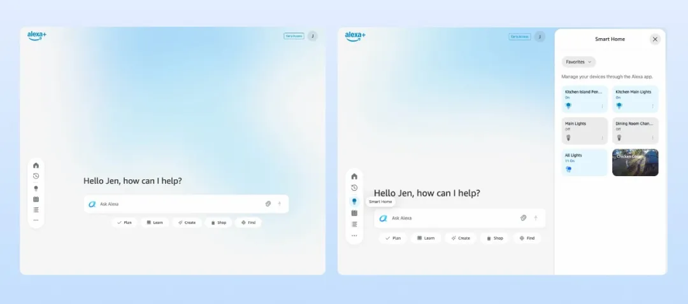

