# 百度APP度会员焕新升级

MEUX 百度MEUX 2025年10月15日 18:31 北京

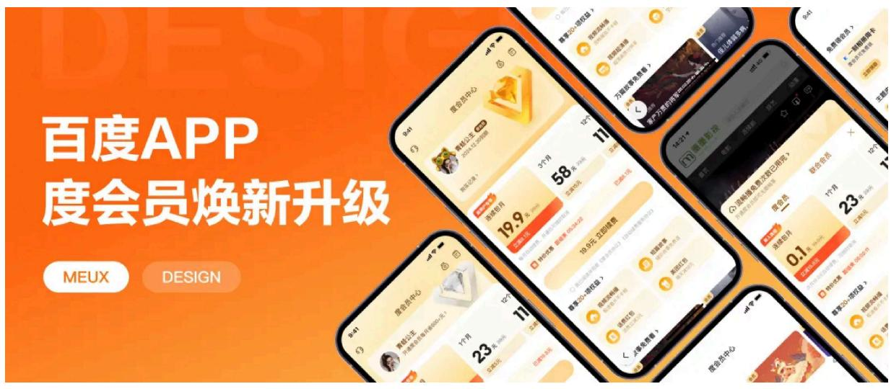

# 前言

为深化会员服务、契合会员价值与用户需求，本次围绕“转化提效”“权益升级”两大战略变化焕新升级，一方面简化支付链路，让用户便捷感知会员价值、顺畅完成转化；另一方面引入短篇故事等权益，丰富会员体验。为会员体系的长效运营及业务增长注入新动能。

# 一、设计背景

当前会员价格链路深，优惠信息感知弱，转化力不足；权益项分布平均给用户带来“什么是核心权益”的感知不明确。以及旧版的ICON色彩鲜亮跳脱，带来整体界面的尊享感和品质感缺失，不符合产品泛用户群体的喜好。

# 二、设计目标：更聚焦、更尊享

基于以上的问题，首先重组结构，聚焦内容：打破原有信息密集、堆叠展示的方式，围绕转化提效和核心权益进行结构重组。其次，品牌升级，提尊享感：通过视觉系统传递“尊享感、品质感”，提升会员身份的仪式感。

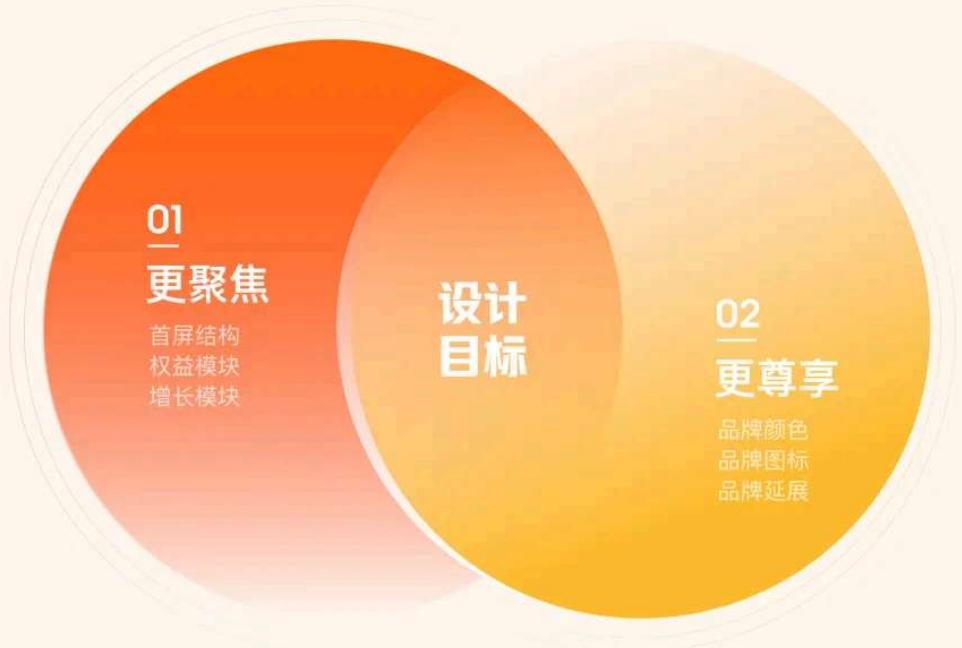

# 三、更聚焦：重组结构，聚焦内容

# 1. 首屏结构调整

# 1）简化操作流程

价格和优惠信息直接展示，减少了用户的操作步骤，简化了决策路径，通过倒计时等设计元素，制造紧迫感。

# 2）视觉层次调优

核心信息（如价格、按钮）加大位置和大小的对比，引导用户注意力。权益说明通过模块化设计、简洁的图标与文字配合、以及适当的功能说明，使用户集中注意力在关键的信息上。次要权益通过横滑功能隐藏，减轻了视觉负担。

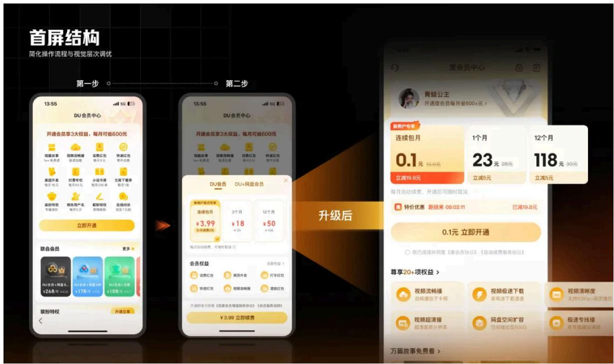

# 2. 权益模块升级

根据会员福利前置与信息对比增强，整合模块顺序与层级优化。

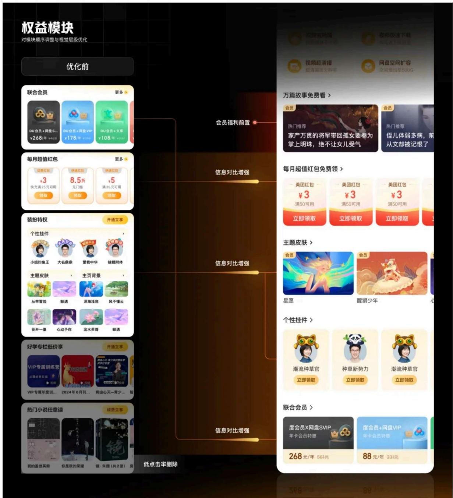

# 1）会员福利前置

引入高价值短篇故事权益，置于首屏位。故事模块的设计上通过标题突出使用户快速理解内容的主题，图像作为背景在不干扰用户阅读的基础上配合适当的颜色进行辅助理解和增强吸引力。

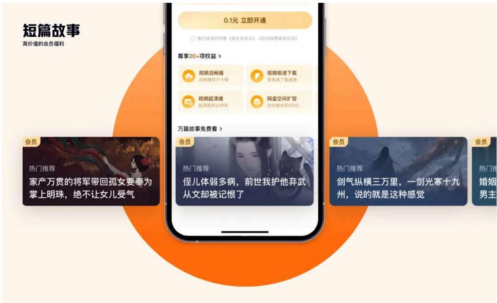

# 2）信息对比增强

红包模块根据点击率调优视觉层级，增大按钮的占比和视觉吸引力，提高用户对重要信息的获取效率。装饰模块增大显示面积，让每个功能模块看起来更加独立且整洁。

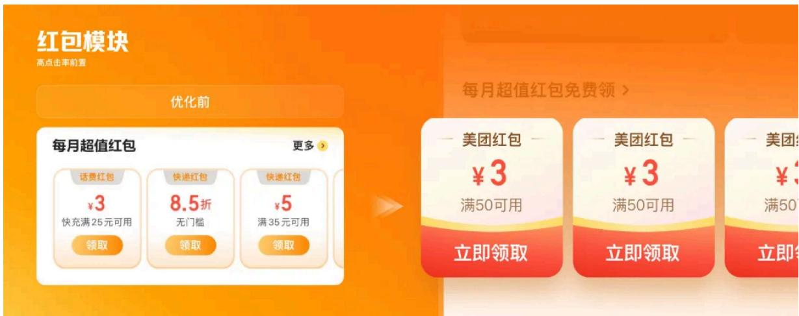

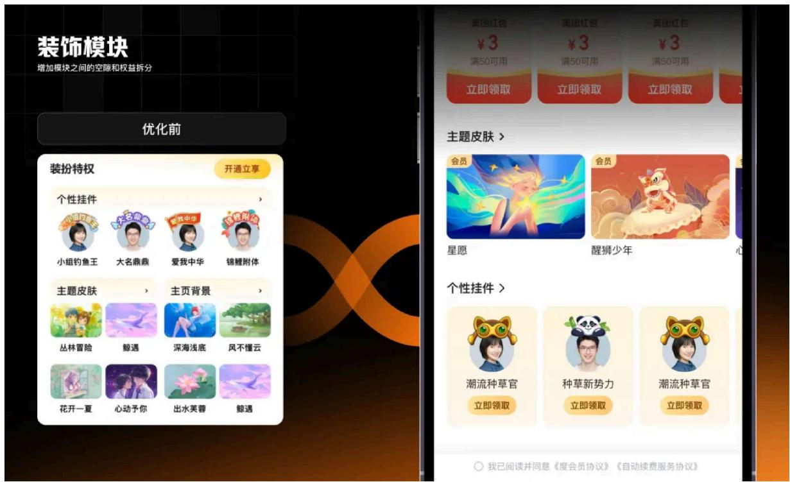

# 3）收益分流后置

低点击率模块进行删减和收益分流进行后置。新版联合会员模块通过将文案放在左上角，使用户能够快速找到最直观的联合会员类型描述，通过将价格信息单独隔离，并明确标出折扣信息，帮助用户更快做出选择。

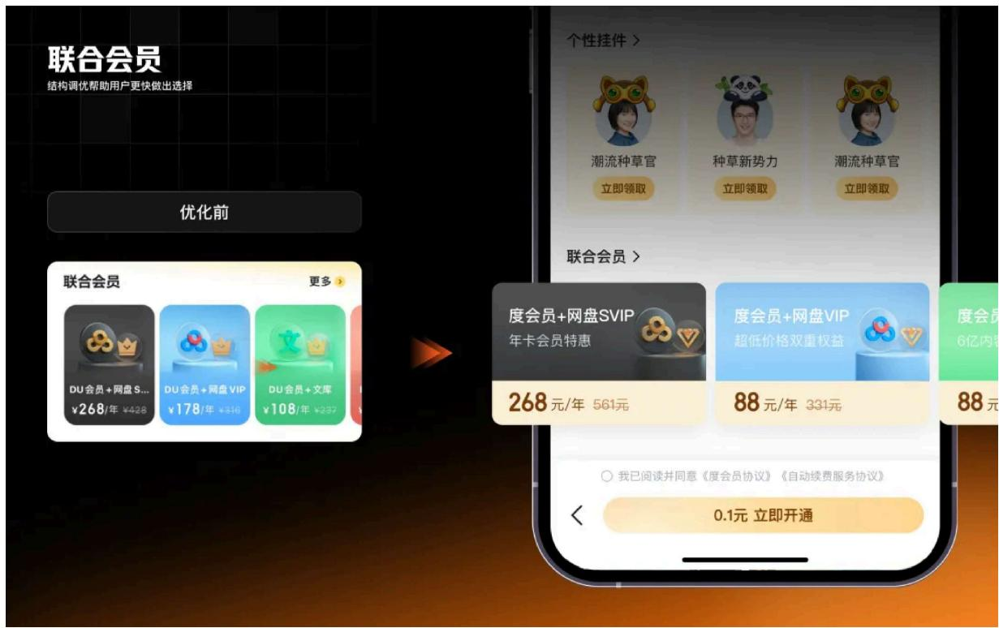

# 3. 增长模块重构

# 1）运营板块

旧版本运营板块位于顶端、色彩跳脱，易被用户视为“广告”，产生盲视。新版本把Banner融入“价格区”，既增强氛围感又让视觉焦点更突出。

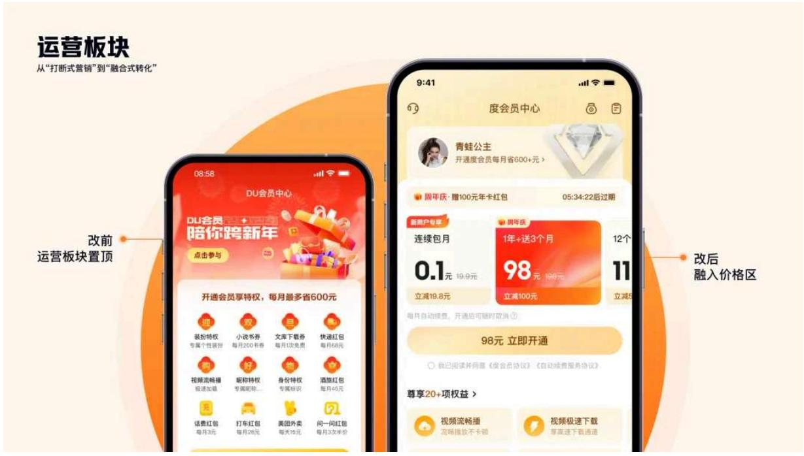

# 2) 活动Banner

对于强价格关联的运营位，我们将价格相关信息置于“价格套餐下方”，让用户快速获知优惠信息。至于无价格关联的运营位，以营销Banner的形式呈现，吸引“非会员用户”或“浏览型用户”转化。

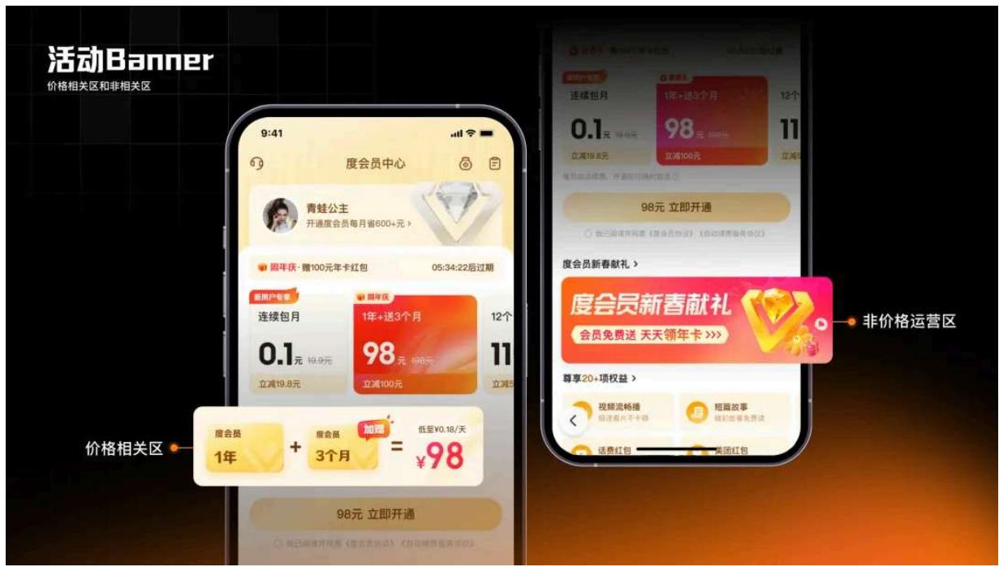

# 3）支付面板

支付面板通过减弱顶部 Banner 的层级，突出价格信息层级，确保了用户快速抓住核心内容，减少了无关内容的干扰。

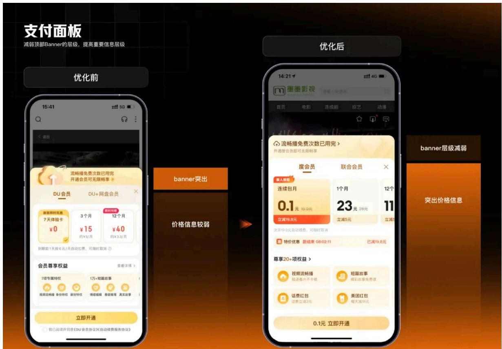

# 4）挽留弹窗

挽留弹窗将“现价和优惠价”核心利益点，以对比的方式呈现给用户（如优惠后现价98元），强调了优惠的力度；倒计时信息置于优惠信息下方，强化提升紧迫感刺激用户消费。

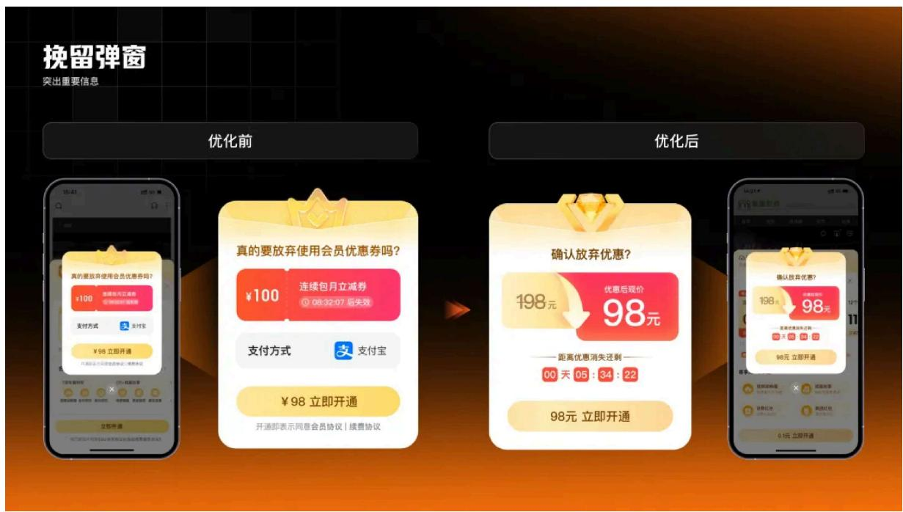

# 四、更尊享：品牌升级，提尊享感

本次名称由“DU会员”变更为“度会员”，完成从“模糊缩写”向“百度品牌联名”的认知迁移，增强品牌背书力。

# DU会员 度会员

# 1. 品牌色彩

本次视觉焕新在配色策略上，以“泛大众用户”为出发点，重塑度会员视觉颜色体系，增强色调的柔和度、统一性和对比度，背景色减少粉色，前景色和文字色的对比加大，增强可读性，营销色和横向色彩统一。

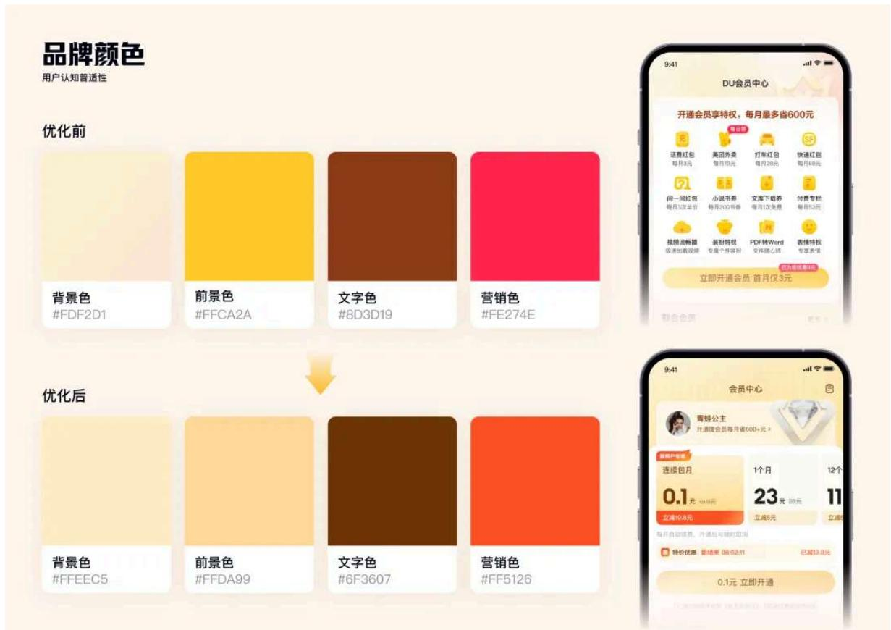

# 2. 品牌LOGO

从权益角度出发，在造型上选用硬朗的钻石，和会员专属身份的VIP标识“V”结合，提供尊贵的品质和优质的服务，并强化会员专享的身份感知。

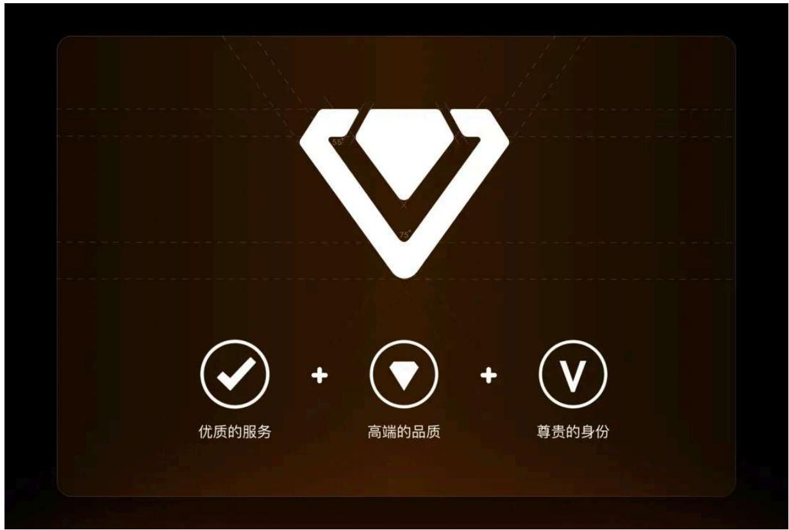

顶部钻石增加动态旋转动效，以及背景纹理采用柔光直线柱状条纹，营造开通会员界面更享尊贵感。

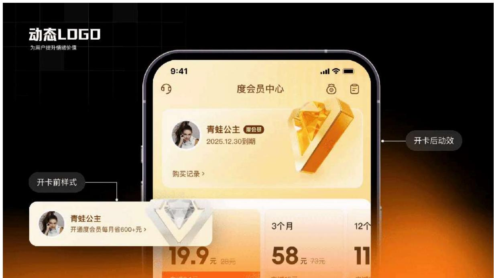

# 3. 品牌延展

会员中心和会员弹窗是会员权益的核心场景，需强化“尊享感、焦点性”，因此采用3D质感大尺寸LOGO为视觉锚点强化品牌识别。挂件商城个人中心偏工具属性强、信息密度高的场景，采用“扁

平化图标”的方式呈现，避免打断用户浏览。

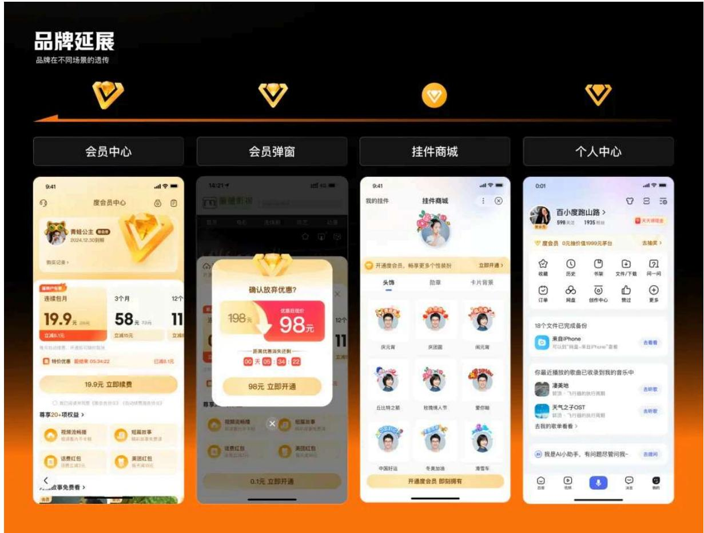

# 结语

本次度会员焕新，紧扣“转化提效”“权益升级”破局，以结构重组简化转化链路、聚焦核心权益，借品牌升级强化尊享感，精准解决旧版价格链路深、权益感知弱、品质感不足等痛点，提升用户体验与转化效率，为业务增长注入动力。

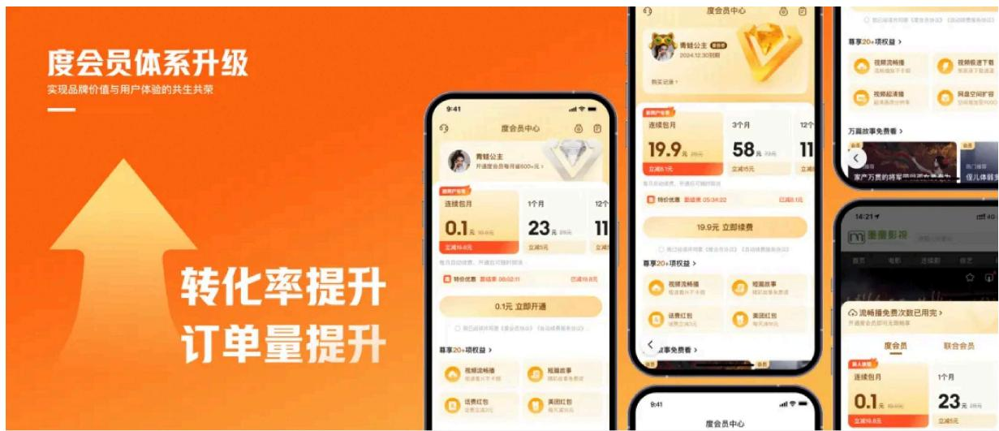

转载请注明出处，违者必究，谢谢您的合作。申请转载授权后台回复【转载】。

MEUX招聘进行中，交互/视觉/用研

可投简历至meux-talent@baidu.com

(请在邮件中务必明确标注信息来源，例如：来自MEUX微信公众号)

# 以下文章，你可能也感兴趣↓

MEUX「九月」AI设计观察

目为什么你的创作卡在一半？我们用AI重构了一条「更容易」的流程

目百度超级舟-解码龙舟非遗与数字体验的创新融合

目 2026百度MEUX校招 全面启动

MEUX「八月」AI设计观察