# 百度频道场景化焕新升级

原创 百度MEUX 百度MEUX 2024年12月11日 18:30 北京

# 前言

随着移动互联网的普及，百度APP深入人们的日常生活，成为了不可或缺的资讯与服务平台。频道作为百度APP的一个重要场景，不仅涵盖时事快报、本地生活、国际资讯等广泛领域，还涉及美食、旅行、美容等多个品类，为用户提供丰富多样的选择，更是凭借其多元化的内容吸引了大量用户。

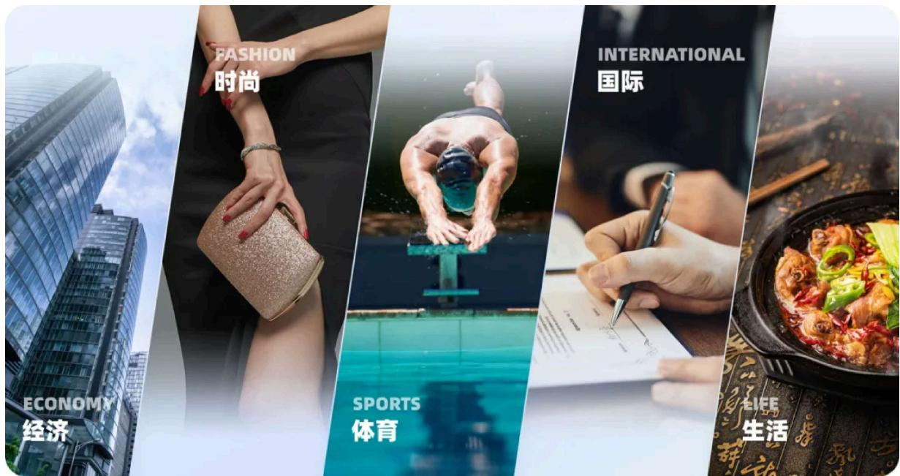

为了进一步提升用户体验，我们围绕“内容品质”与“精品战略”两大核心契机，全面发起频道整体升级计划。在视觉语言的构建中，通过统一、平衡、丰富的色彩体系，为用户打造一个舒适便捷的资讯获取环境。

# 设计策略

频道作为百度APP传播信息的重要场景之一，我们深知用户的需求不仅仅是信息获取，更是对于一种独特氛围和体验的追求。因此，我们致力于定制频道场景氛围的专属感受。

如何打造一个全新氛围感受的频道呢？下面我们将从色彩到结构设计，塑造一个精标准、新氛围、强展现且充满活力的资讯信息集合地。

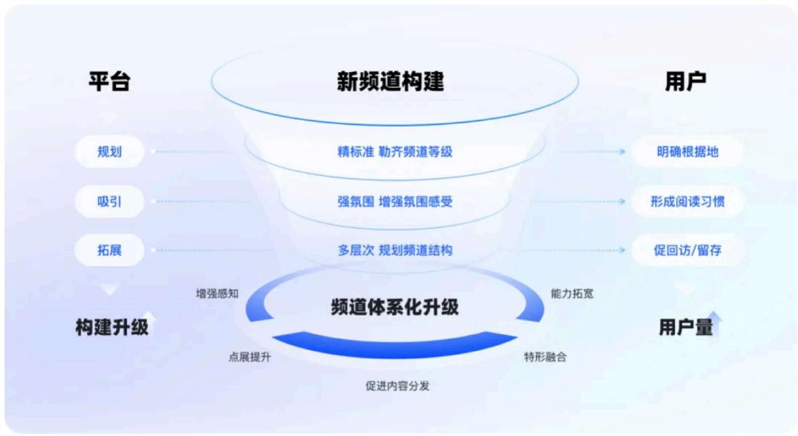

# 一、精标准

# 1. 多层分级，制定氛围标准

从用户的阅读感受出发，我们将频道细分为「普通」「新热」「重点」三层等级，以满足不同用户的需求和偏好，同时紧密结合业务目标，为用户提供有价值的内容。

- 普通频道：提供价值内容，清晰展示易获取

以内容信息传达为主，为用户提供丰富的工具、应用或服务合集，还有行业新闻、市场动态等内容。这些频道强调信息的清晰展示和易获取，让用户能够快速定位所需信息。

- 新热频道：轻松浏览，烘托信息专属性

注重用户的轻松浏览和新热内容的快速传达。视觉设计简洁明了，氛围营造相对轻松，主要作为内容展示的辅助。

- 重点频道：强化独特性，提升用户归属感

频道内容围绕特定主题或领域进行深入，氛围营造较强。既满足用户快速获取信息的需求，又在一定程度上强化频道的特色感知。

# 划分等级，制定氛围标准

等级

普通内容页

推荐/动态等频道页，普通聚合页

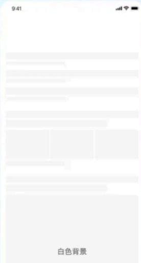

新热内容页

轻氛围频道页、新热事件聚合页

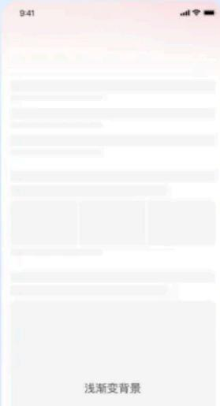

重点内容页

热搜/本地等频道页，重要类形聚合页

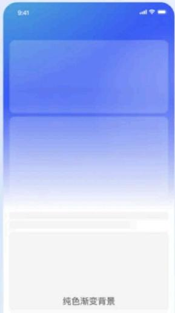

# 二、新氛围

通过分析频道的展现能力，形成色彩、光影、空间感多维度的视觉标准，以提升用户认可度。下面我们将从色、光、境三方面展开介绍：

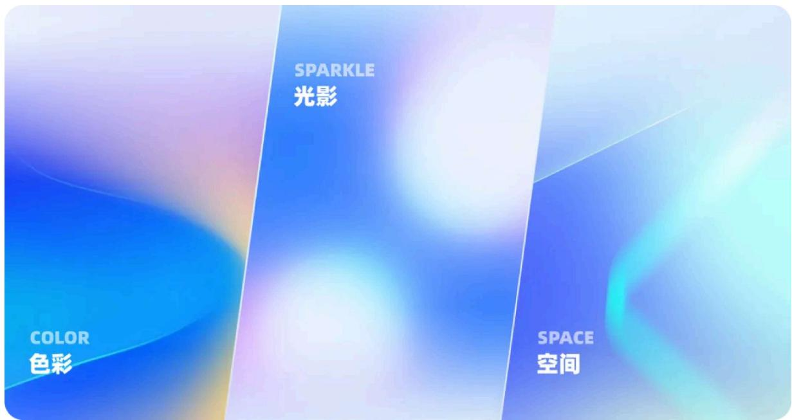

# 1. 色—情感调色板

我们希望根据频道内容和目标受众特性选择适合的颜色，对于轻松愉快的频道，采用明亮温暖的色相，如橙色、黄色等，营造积极向上的氛围；对于需要深度思考和探讨的频道，选择更为沉稳内敛的色彩，如深蓝、紫色等，引导用户进入冷静专注的状态。我们首先针对想要的色相进行了情绪上的推演。

# 基础色彩推演

MEUX 

DESIGNER WORKS 

不同的色相基于人类对事物的已有认知，会对其情绪产生不同的影响，通过色彩心理学我们各色相所带来的情绪反馈，筛选统计如下：

<table><tr><td>基础色相</td><td>正反馈(诉求)</td><td>负反馈(规避)</td></tr><tr><td>红色</td><td>兴奋、激情、吉祥、奋进</td><td>暴力、危险</td></tr><tr><td>橙色</td><td>温暖、亲切、美好、活力</td><td>虚伪、妒忌</td></tr><tr><td>黄色</td><td>愉悦、友好、希望、阳光</td><td>猜疑、警惕</td></tr><tr><td>绿色</td><td>积极、青春、自然、放松</td><td>惊悚、邪恶</td></tr><tr><td>蓝色</td><td>平静、理智、智慧、权威</td><td>忧郁、恐怖</td></tr><tr><td>紫色</td><td>优雅、神秘、高贵、温柔</td><td>紧张、消极</td></tr></table>

*基于情绪传递推演需要的基础色相

# 1）色相定义

我们依据多类频道内容的构成，进行了情绪渗透分析，避免颜色感知过剩，筛选出标准九色相。

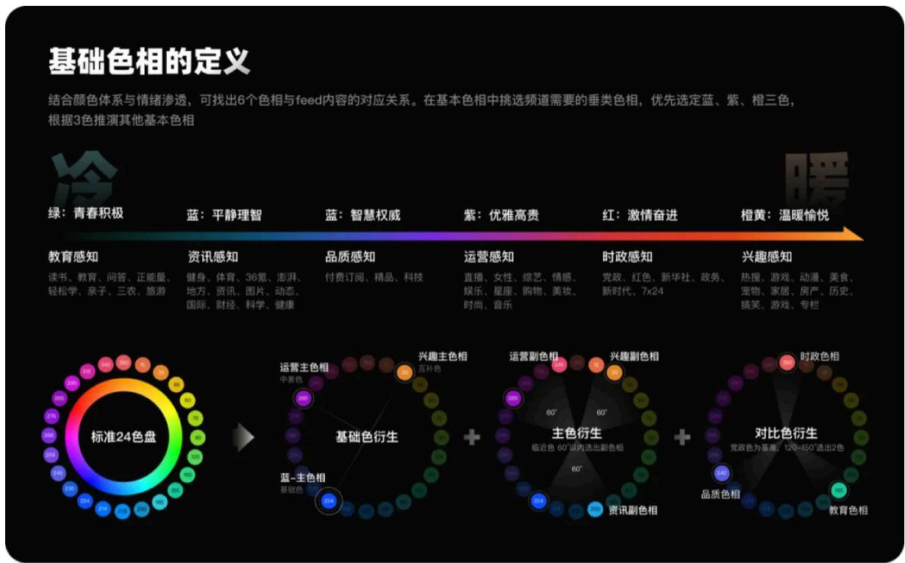

# 2）饱和度和明度定义

依据饱和度和明度影响情绪的规律，最终得到基础九色板。

# 饱和度/明度情绪色板

饱和度与明度都可大致分为三个基调，将两者体系结合和得出七大色调。在这个基础上，保障颜色纯净度，同时降低负向情绪影响，确认最终取色区域，并在基础区间微调，得出以下情绪色板

饱和度 (S)

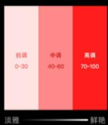

明度 (B)

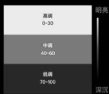

频道基础九色板

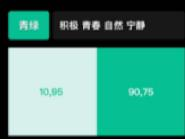

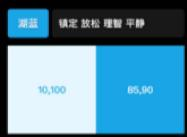

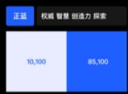

七大色调

七大色调在色板中的分布

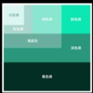

情绪反馈

选择频道需要的情绪倾向

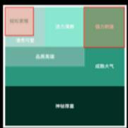

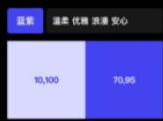

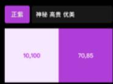

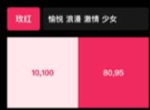

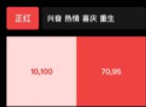

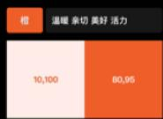

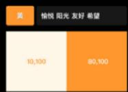

# 2. 光—内容聚焦点

得到色板后，我们基于基础九色相，通过色彩的渐变形式营造光影，光的感受可以为视觉氛围增添层次感和目标感。在亮部和暗部的对比中，注重细节的处理，规划了左上角主光感受，使得背景氛围聚焦内容，达成一致的视觉感受。同时结合光影、弥散等手法，与我们对色彩的规划相结合，使背景的层次得到丰富。

# 1）光源的推演

由色彩推演光影规则，根据内容位置选择聚光范围。

# 光源色彩推演

MEUX 

DESIGNER WORKS 

各光源色相与整体颜色规范保持一致，在浅色场景下需保证颜色纯净度与明亮度，故采用低饱和高亮度颜色方向应用于光源。取色需保证主光源效果强于辅光，故主光S值均高于辅光。

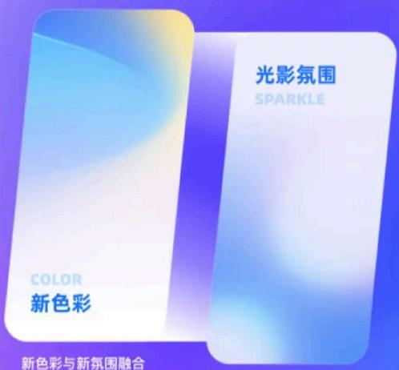

选取主色与辅色：

主色确定后，辅光引入第二色相与主光呼应，选择临近色相作为辅光色

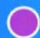

辅光色

主光色

辅光色

第一辅光色：饱和度变化（S）

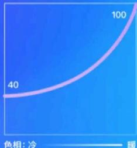

第二辅光色：明度变化（B）

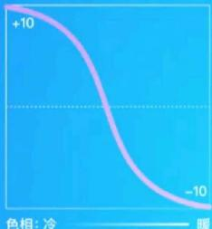

# 聚光弥散，营造氛围层级

轻氛围-深色场景：顶部聚光

根据所烘托的内容配置光源范围与程度，应用在视频频道页等场景

重氛围：对角聚光

根据的第一条内容位置配置光源范围，应用在榜单或FEED频道页等场景

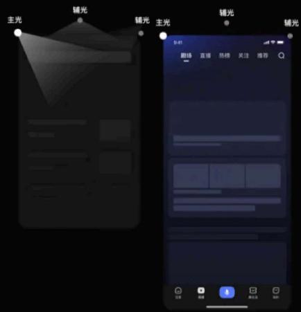

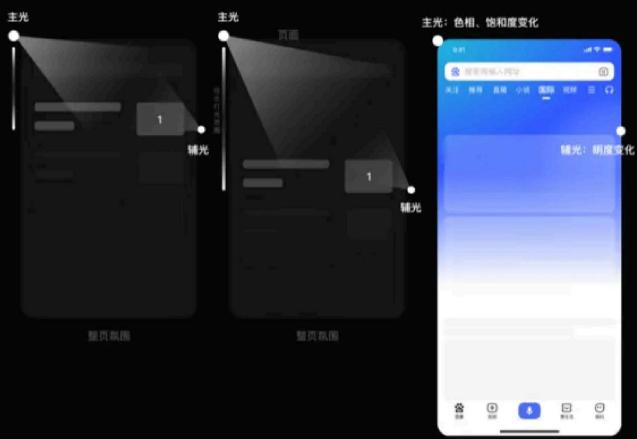

# 2）覆盖多类资源，形成标准色卡

随着各类媒体和内容类型的不断涌现，如何确保品牌形象的统一性成为了一个亟待解决的问题。为了应对这一挑战，我们结合前者色彩本身与表现形式的分析，最终形成了覆盖多类资源的全面标准色卡体系。

# 形成标准色卡，确定氛围基调

设计师可选择标准色卡，做到频道快速搭建，提效的同时，也为频道场景的氛围定下基调。

氛围频道样例

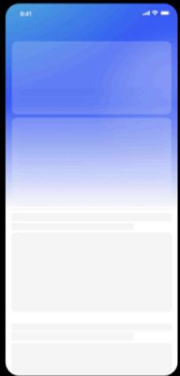

浅色氛围色

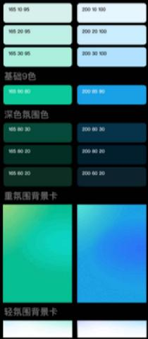

▼

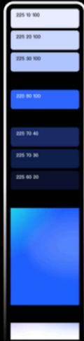

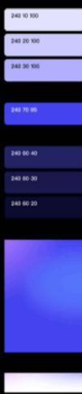

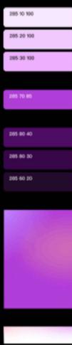

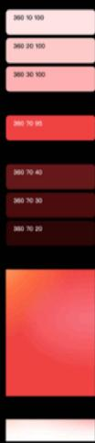

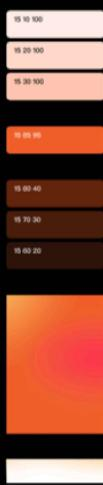

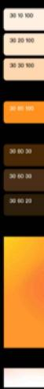

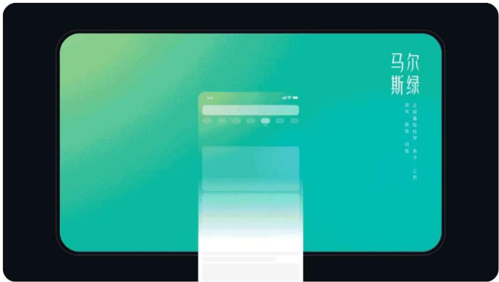

在新规则整体覆盖前，我们针对线上频道进行了换色实验。换色后频道氛围更为活泼、清透。以本地频道为例，通过实验观察，留存正向增长，获得了数据上的支撑。

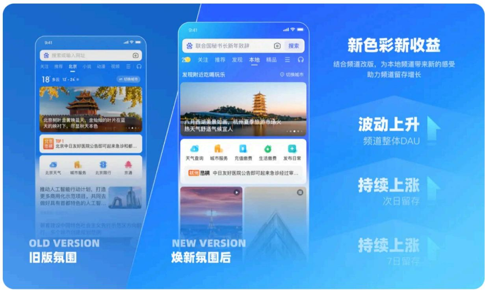

# 3.境—场景空间感

为全面提升频道场景的创新性和表现力，我们首要建设规划了频道的通顶能力，制定元素层、背景层、底色层的页面层次，定下频道场景空间感的基调，并预置底色无痕切换与动效能力，为频道的创新展现做好充分铺垫。

# - 元素层：视觉焦点、主题核心

元素层作为视觉核心内容的主要载体，承载动效能力，当有运营频道时，元素层便直接承担起突出主题、吸引用户目光的重任。

- 背景层：营造独特氛围的关键

背景层作为大氛围的载体，承载与主题相契合的背景图案和渐变色彩，营造独特的氛围。

- 底色层：频道场景的基础色调

底色层则是频道场景的基础色调，我们根据频道特点选择合适的底色，确保整体效果和谐统一。在频道切换过程中，依靠色值之间的转化实现无痕过渡，给观众带来流畅体验。

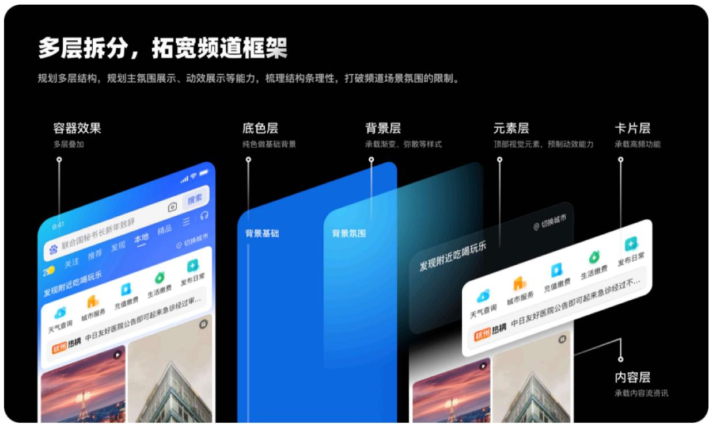

通过色、光、境三个维度的规划，构建了全新的频道体系，同时结合业务诉求，上线了一批批丰富多元的新频道。

新规则整体覆盖后，频道DAU呈波动上升趋势，次日、7日留存均正向增长。在满意度调查当中，获得90%以上的正向反馈。整体提升了视觉体验，为用户带来了更加个性化、情境化的使用感受。

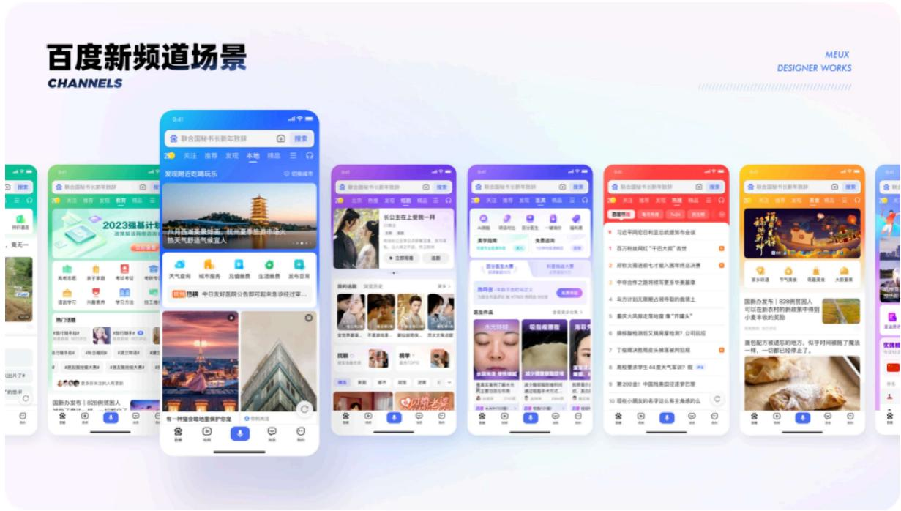

# 三、强展现

通过对频道的整体规划，令场景的展现层次变得丰富，全面打开氛围升级大门。立意构建一个具有个性且自身展现强烈感知的阅读场景，吸引并留住更多用户。

# 1.承接大事件频道

百度APP在全年的特定时间会上线运营或定制类型的大事件频道，如节日、赛事、考试、定制等题材。大事件频道不仅是为了吸引用户，更是为了让用户能够深刻感受到品牌IP和活动的热烈氛围。品牌、活动的氛围与内容相辅相成，从而进一步增强用户的感知体验。

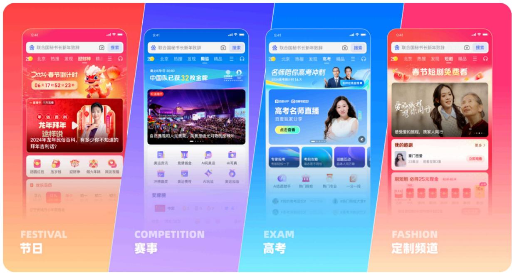

# 2. 新结构重塑新标准

围绕大事件频道的头部效果，结合新频道的展示能力，制定了“前中后景”的布局标准。这一策略旨在强化频道围绕大事件的核心氛围，还通过精细化的规则，为设计师提供了既遵循规则又充满创意表达的空间。

# 围绕头部氛围，制定“前中后景”新标准

后景奠定主题基调的背景氛围；中景承载主视觉设计的核心区域，作为主要的视觉表达；前景强化主题的点睛之笔，承载标题、按钮等元素。整体聚焦于主体之上，形成一条清晰的视觉路径。

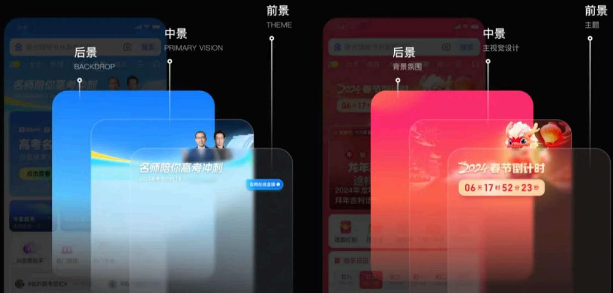

# 3. 新频道迸发新感知

新基调、新规则、新结构给予了频道更优的视觉基调与发挥空间，运营、定制的频道在大事件活动中大放异彩。主视觉与频道场景恰到好处的融合，光影与动效能力的结合，让频道氛围进一步增强。

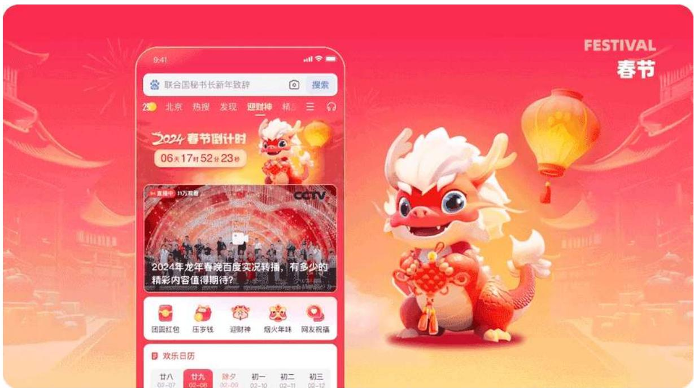

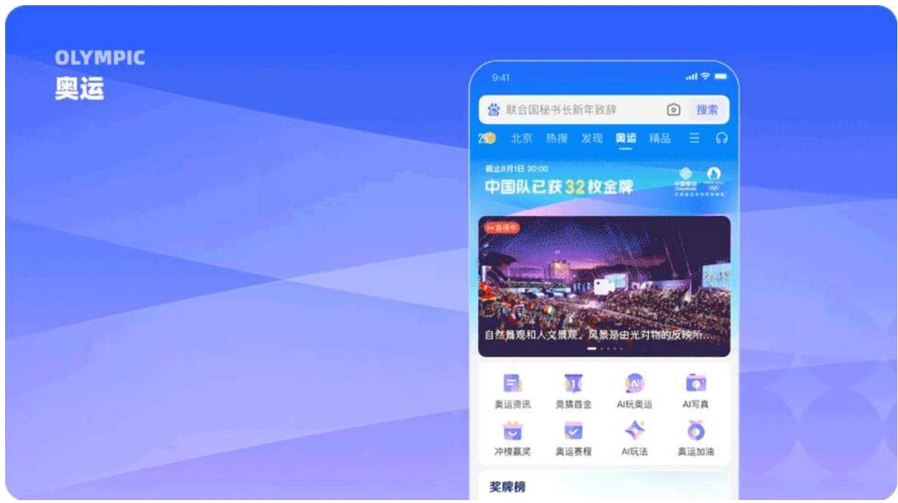

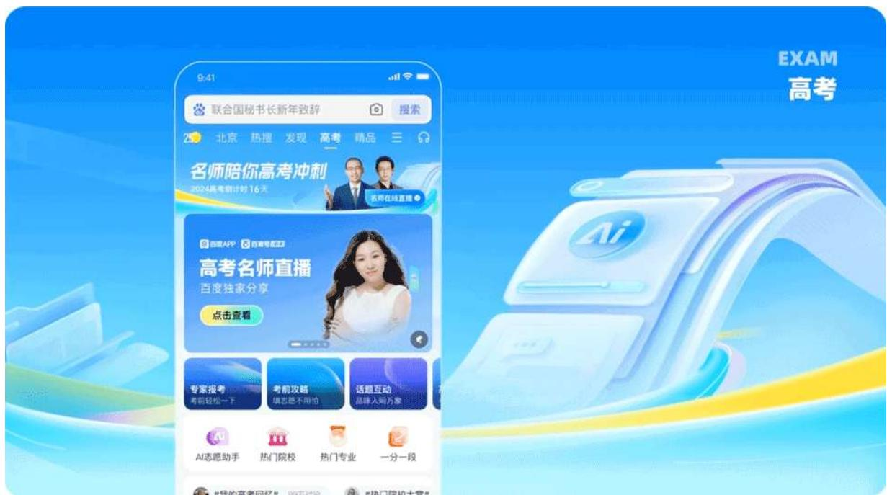

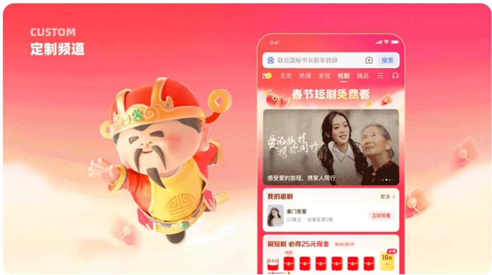

# 总结

频道的场景构建是一项复杂且长期的任务，并非一朝一夕就能完成。这需要团队持续创新，不断考证数据，并深度洞察用户需求，才能打造一个既符合标准又能服务好多种用户的频道。希望可以通过我们的持续努力，为百度的用户提供一个更加舒适、便捷、有价值的信息获取平台。我们将继续秉持“用户至上”的理念，让每一个用户都能在这里找到舒适的体验感受。

感谢阅读，以上内容均由百度MEUX团队原创设计，以及百度MEUX版权所有，转载请注明出处，违者必究，谢谢您的合作。申请转载授权后台回复【转载】。

也欢迎加入MEUX,交互/视觉/用研

可投简历至meux-talent@baidu.com

(注明信息获取来源如：公众号)

以下文章，你可能也感兴趣

# ↓

全星体验一度加APP积分系统升级

MEUX 「十一月」 AI设计观察

高效、智能、权威的智能体设计—让法律咨询体验超简单

精彩不间断，百度搜索带你共赴奥运盛宴

精准触达，定制盛宴：细分用户下的玩法与视觉运营策略