## 全星体验一度加APP积分系统升级

原创 MEUX 百度MEUX 2024年12月4日 17:30 日本

## 前言

度加剪辑是百度推出的全流程AI创作工具，旨在通过AI技术赋能，提升用户的创作效率和体验。积分系统作为核心功能之一，既可以帮助团队有效管理AI算力成本，也通过任务引导用户，促进产品数据提升。本次的目标是提高积分中心的使用渗透率，引导用户完成积分任务，体验关键功能如剪辑、导出和发布等，从而增强用户留存、黏性及投稿量。为实现这一目标，我们通过积分系统的视觉优化和链路升级，全面提升用户体验。

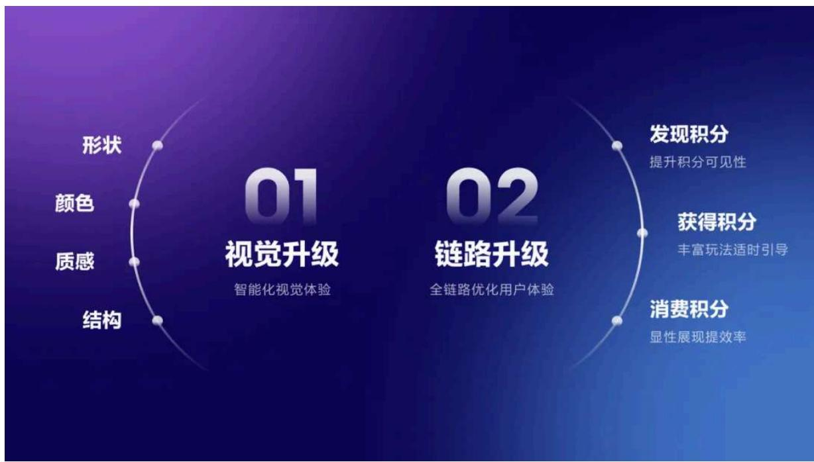

## 一、智能化视觉体验升级

为符合AI智能化产品品牌定位，我们从颜色、形状、质感和结构四个维度对积分中心进行全面升级，力求传达智能灵动、简洁易懂的视觉效果。

## 1. 强化品牌色彩突出重点

积分中心的主体颜色选用了与品牌色彩相呼应的蓝紫色调，使用渐变色和高光效果提升页面的层次感和视觉冲击力，利用富有光感的背景衬托出积分符号的智能感。头部使用高对比的颜色打造强烈的视觉感受，页面部分用品牌蓝紫色和紫色作为重点色，突出利益点和按钮，使页面兼具神秘的美感和主次分明的功能性。

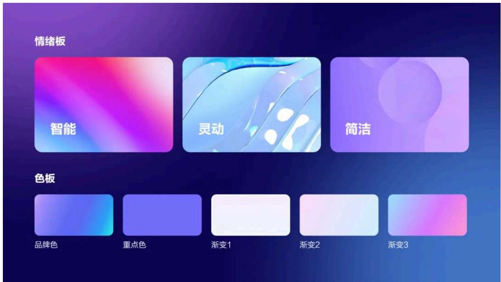

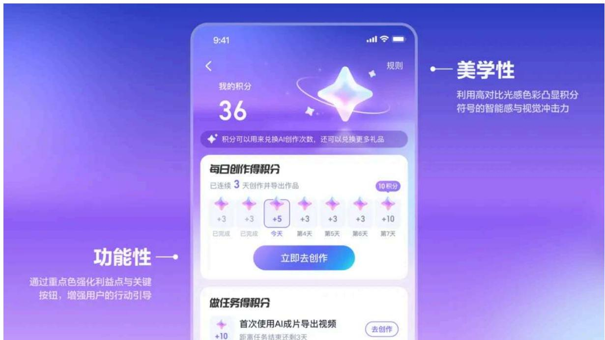

## 2. 创意符号打造品牌辨识度

通过头脑风暴和多次方案尝试，结合度加AI视频创作工具的产品属性，我们选择了星星、钻石、闪电和豆子四个符号进行创意设计。星星象征产品的智能属性，钻石代表积分的高价值，闪电象征创作灵感的闪现，豆子则代表创作的收获。

星星

智能产品符号

钻石

积分具有高价值

闪电

创作灵感闪现

豆子

种下种子收获希望

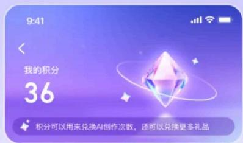

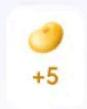

最终，确定以星星作为设计方向，采用四角星符号作为积分的新形象。四角星源自度加的智能工具icon，也是AI成片、AI数字人等智能场景的统一符号，象征用户通过积分收集可以解锁更多智能功能，提升智能体验。多面切割的造型增加了积分符号的细节和体量感。针对小积分图形，我们进行了细节简化，保证小图形在缩小后也有较好的辨识度。

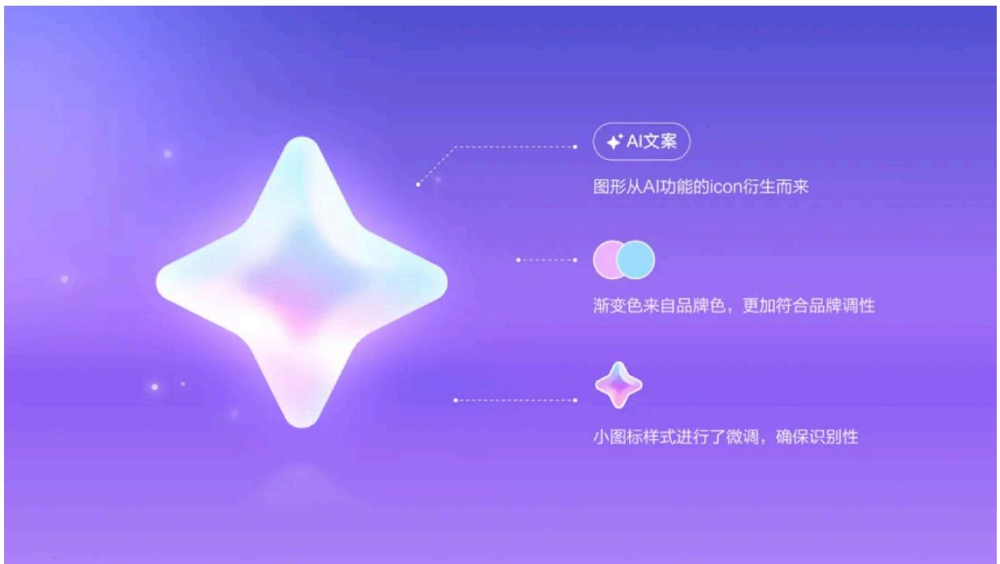

## 3.独特质感传达智能灵动感

积分采用类似在手办中常用的水晶磨砂滴胶质感，在星星内部设计颜色和透光度不同的内核，增强趣味感和细节感的同时，通过内核和边缘透光性的差异对比，打造通透的光感，传达智能灵动的感受，使其更契合度加AI智能产品的气质。

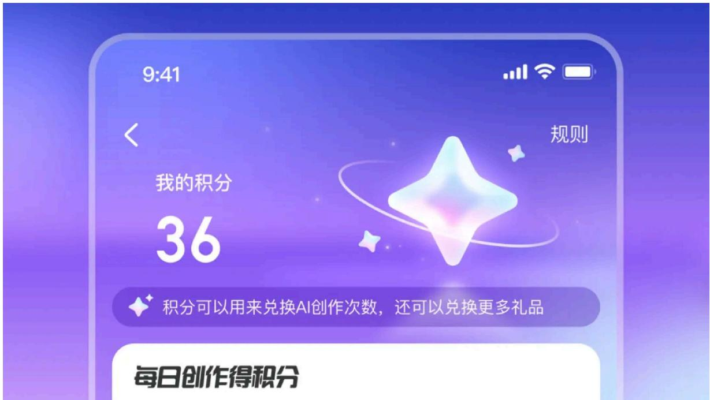

## 4.信息布局整合提升参与体验

为提升用户的参与感和操作体验，我们全新布局了积分中心的页面结构，将页面分为积分形象展示区、任务区和兑换区，使用户可以轻松直观地理解各个区域的功能。在任务区增加了积分玩法，扩展积分获得场景，用积分引导用户更深入地使用度加。底部外露可兑换的奖品，在操作上减少步长，同时可以有效刺激用户参与积分任务。

Before

After

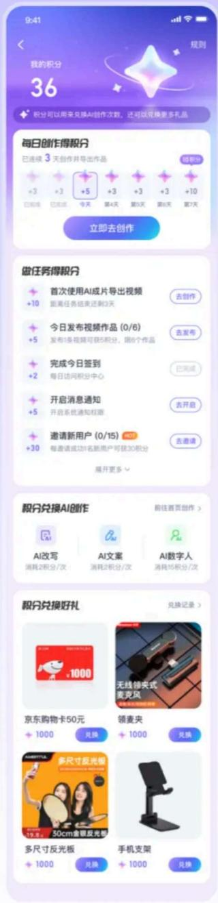

## 形象展示区

全新的积分形象，提升用户好感

## 任务区

丰富任务玩法，扩展积分获得的场景

## 兑换区

外露奖品，减少步长，刺激参与

## 二、全链路优化用户体验

通过分析用户的使用习惯和反馈，我们针对积分系统的各个关键环节进行全链路优化设计，包括发现积分、获得积分和消费积分，旨在为用户提供更加顺畅的使用体验。

- 发现积分环节：增加明显的入口和视觉引导，以便用户能更轻松地找到并使用积分功能；

- 获得积分环节：丰富积分获取方式，设置多样化任务和奖励机制，鼓励用户参与并提高获得感；

- 消费积分环节：提升消耗积分的透明度，使用户在进行操作时能够清晰了解所需积分，从而减少不必要的操作步骤。

## 1. 优化入口设计提升可见性

## 1）增加入口

增加首页签到入口，使用微动效吸引点击，减少用户签到步长，提升签到数据。

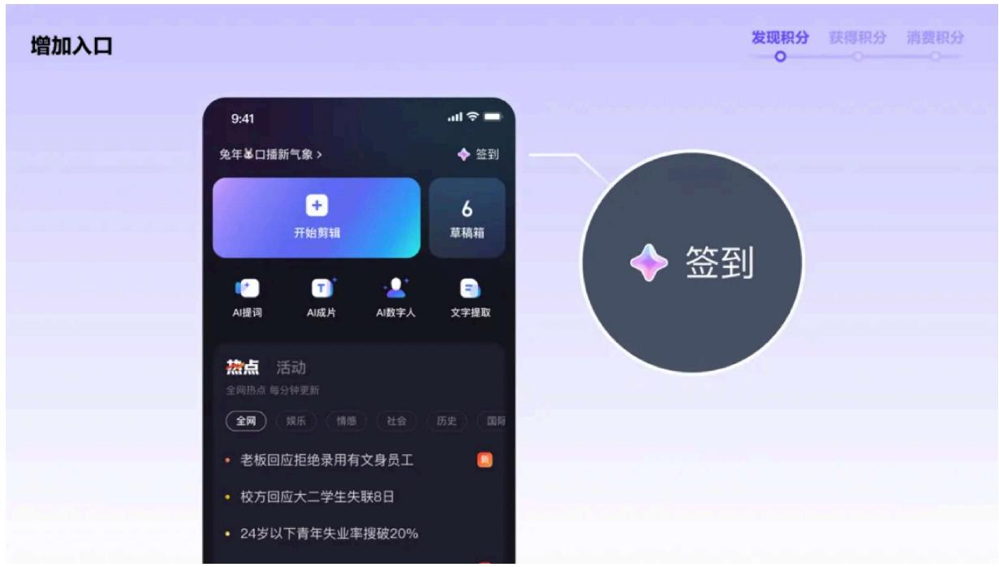

## 2）强化入口

在“我的”页面强化入口样式，使用最新积分图标，按钮采用品牌色蓝紫渐变，吸引用户注意，提升点击量。

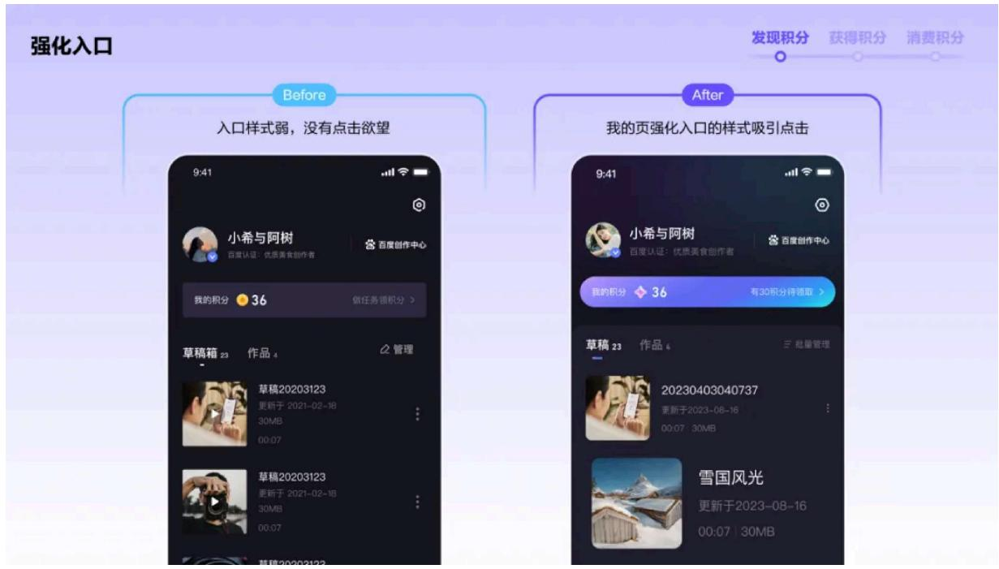

## 2. 多样化任务与适时引导提升参与度

## 1）丰富任务

增加积分任务种类让用户有更多选择，利用长期任务与日常任务的组合设置，鼓励用户持续创作，并在特定节点给予奖励。此外，AI功能也成为任务的一部分，可以增加用户对AI工具的使用频率。在展现任务内容的设计上，对积分图形和积分数量进行视觉加强，突出利益点，帮助用户快速对比任务，积极参与获得积分。

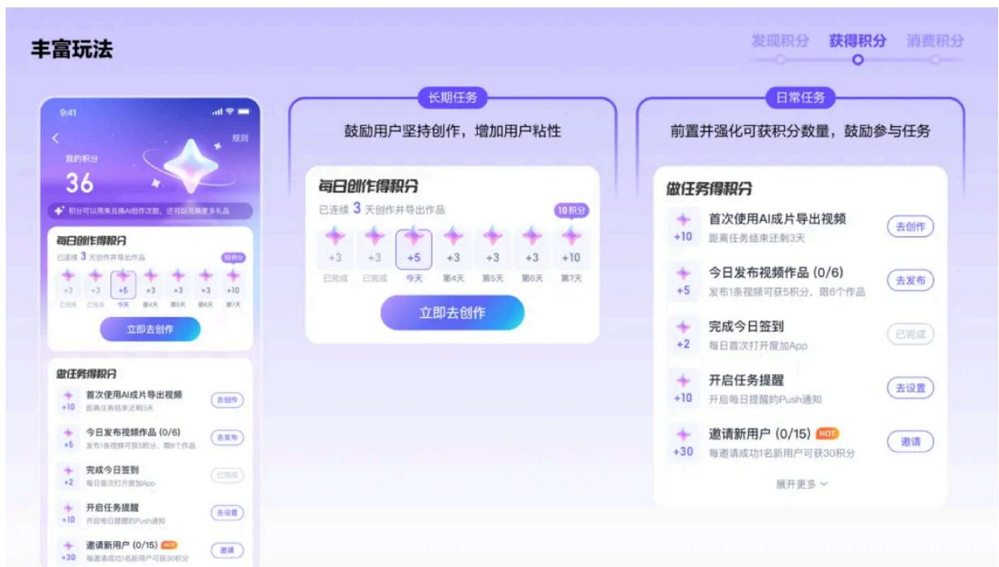

## 2）适时引导

任务完成过程中增加适时引导，刺激用户完成更多任务，如导出作品后用积分引导发布到百度，同时提醒用户再次创作获得积分，形成多创作多积分的用户心智。

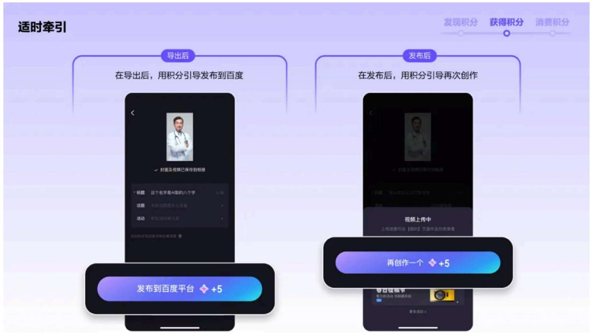

## 3）强化获得感知

在用户完成积分任务后，加强提示样式，增强获得积分的仪式感和喜悦感，使用统一的积分形象强化用户认知。

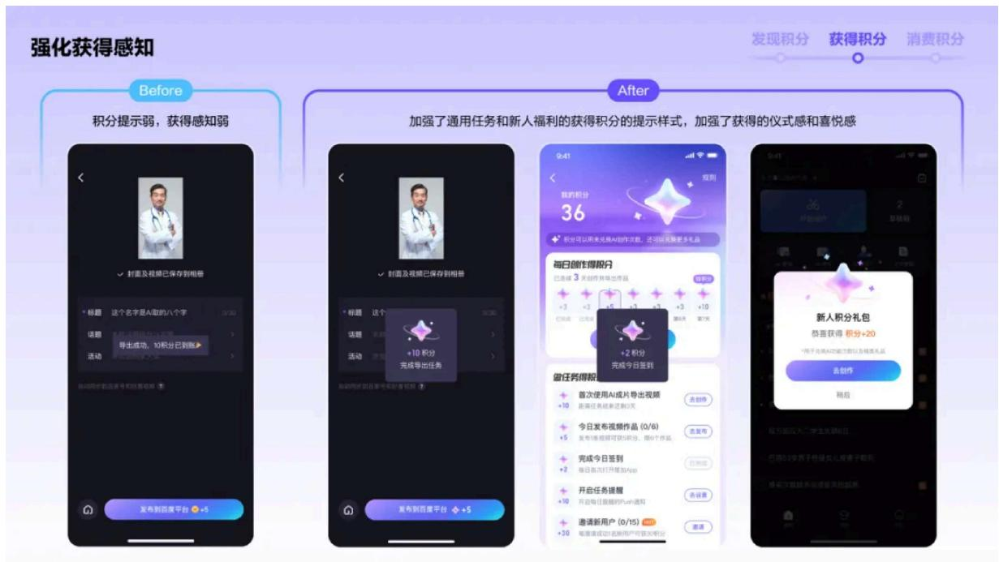

## 4）增加充值能力

用户可以根据需求进行积分充值。在信息层级上重点突出充值档位的内容，用彩色标签突出利益点，吸引用户下单，将四角星符号融入其中使画面更灵动，让用户对积分留下较强视觉印象。

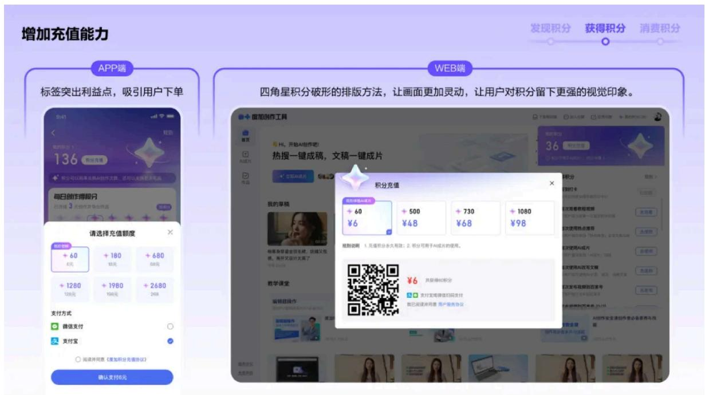

## 3.消费显性化提升使用效率

为了让用户更清晰了解功能所需的积份数量，新版在AI数字人、AI成片等五大场景中将消耗积分的信息前置显示，让用户更清晰地知道哪些功能需要使用积分，减少步长提升功能使用流畅度。

## Before

免费次数为0后，会弹窗询问用户是否使用积分兑换，部分用户会流失

## After

需要消耗时直接显示，不再弹窗减少2步步长，优化涵盖数字人、AI成片等5大场景

## 结语

积分系统的全面改版，不仅升级了积分中心的视觉效果，使其更加智能灵动、简洁易懂，还通过全链路体验优化，提升了用户在发现积分、获得积分和消费积分过程中的感知和体验。这一系列改进不仅提升了用户黏性，也为度加剪辑的持续发展奠定了坚实基础。我们希望用户在全新的积分系统中获得更加愉快高效的体验，同时也能感受到AI智能技术带来的便利与乐趣。

感谢阅读，以上内容均由百度MEUX团队原创设计，以及百度MEUX版权所有，转载请注明出处，违者必究，谢谢您的合作。申请转载授权后台回复【转载】。

也欢迎加入MEUX,交互/视觉/用研

可投简历至meux-talent@baidu.com

(注明信息获取来源如：公众号)

以下文章，你可能也感兴趣

## ↓

MEUX 「十一月」 AI设计观察

高效、智能、权威的智能体设计—让法律咨询体验超简单

精彩不间断，百度搜索带你共赴奥运盛宴

精准触达，定制盛宴：细分用户下的玩法与视觉运营策略

MEUX 「十月」 AI设计观察