# 视频便捷手势 交互设计探索

原创 百度APP用户体验 百度MEUX 2022年12月15日 18:30 北京

# 一、前言

视频播放器中承载着极其丰富的内容画面和播控功能，尤其是在寸土寸金的移动端视频播放器中，为使内容更沉浸消费，需尽可能克制界面中的功能元素/入口直接外露。基于此种场景下，合理的手势设计不但可为界面“减负”，还可帮助用户更快捷触达功能、提升操控便捷性。

视频场景中目前已有部分的常规单向手势已被用户广泛接受并形成习惯认知，如「单击→暂停」、「双击→点赞」、「长按→快进」、「横滑→导航」、「纵滑→切视频」、「双指捏合→缩放视窗」等通用手势。

单击 $\rightarrow$ 暂停

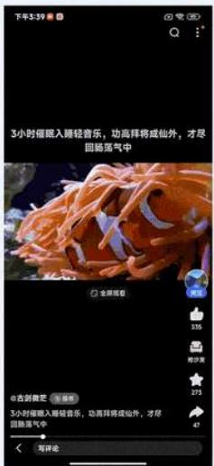

双击 $\rightarrow$ 点赞

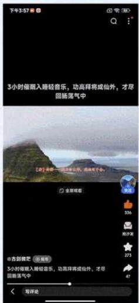

长按 -> 快进

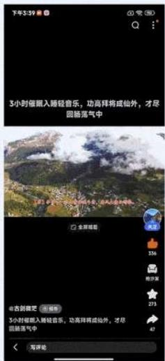

横滑 -> 导航

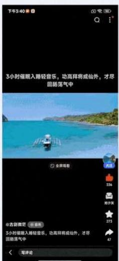

纵滑 $\rightarrow$ 切视频

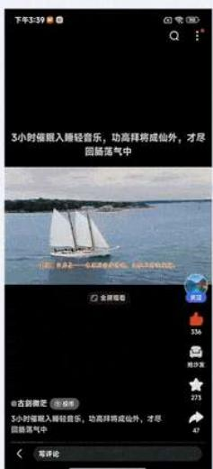

双指捏合 -> 缩放视窗

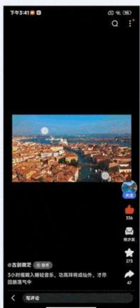

那么如何在保留用户对于常规通用手势认知的基础上，进一步对视频场景中的手势交互进行扩容升级？这也是我们接下来在手势进阶交互上的重点探索方向。

本次针对百度APP中的视频播放器场景，为提升手势操控效率，我们试图将常规的基础通用手势进行打散重组、并结合实践案例梳理出「组合手势」设计模型，以探索如何在视频场景中构建便捷高效的进阶手势体验设计。

# 二、什么是「组合手势」

「组合手势」是基于常规手势的组合扩展，其通常由两种或两种以上的常规基础手势所构成，若组合方式及使用场景得当，可助力用户更便捷的触达功能。

以前述的视频场景常规手势为例，其触发机制一般可分为两个阶段：step1交互信号→step2执行任务，即用户通过某一基础手势发出交互信号，系统收到信号确认后便可立即执行任务，但整个过程是线性的，手势扩展性十分有限且难以满足视频场景对于手势扩容的诉求。

# 常规基础手势 触发机制

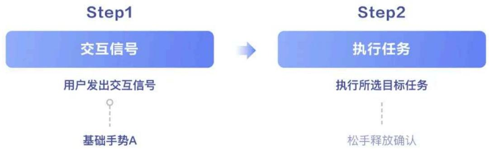

于是我们在现有常规手势两阶段触发机制的基础上，尝试引入「意图识别」环节，并梳理出「组合手势」的设计模型，以探索不同基础手势相互组合后的扩展可行性。

「组合手势」触发一般可分为三个阶段：step1交互信号→step2意图识别→step3执行任务，前两阶段均可由对应的基础分支手势构成并进行组合搭配、以寻求最高效的手势组合触发路径。

# 组合手势 设计模型

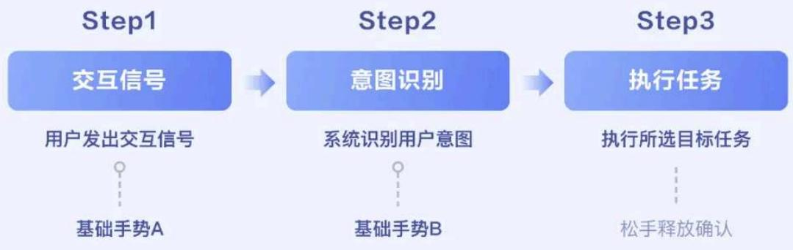

由于「组合手势」并不像常规手势那样早已被系统定义为可供直接调用的接口，因此，其差异化创新具有较大设计灵活度，尤其需根据具体的使用场景进行综合考量。

# 三、「长按组合手势」激活快捷菜单

# 1.项目背景

百度APP视频场景早期的播控功能较少，如“视频下载”等个别特色功能入口一般都融合于基础菜单之中。

随着后续视频场景的功能建设日渐完善，我们便在基础菜单面板中拓展了一行视频菜单，专门用于承载视频场景特有的播控功能。但当前播控功能已达10余项，菜单面板弹出后还需左滑才可露出后面的功能入口，因此也常收到用户反馈找不到常用功能、菜单面板功能排布无章且触发成本高。

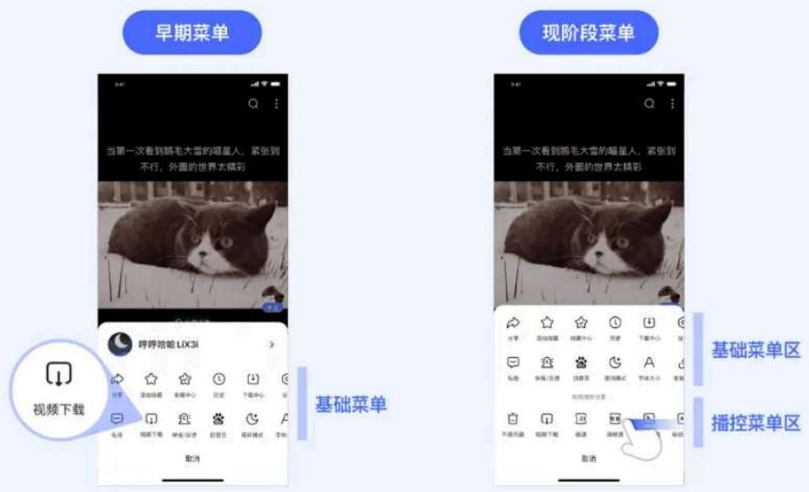

# 2.竞品调研及选型

通过对竞品进行调研，我们发现竞品均有使用长按手势作为切入口以触发相关播控功能、并归纳出“视频播控触发”目前主流的三种长按交互选型，分别为：长按触发独立播控面板、长按触发浮层播控选项、长按触发特定播控功能。

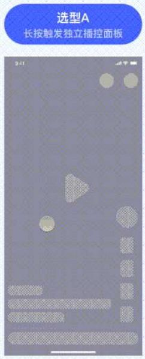

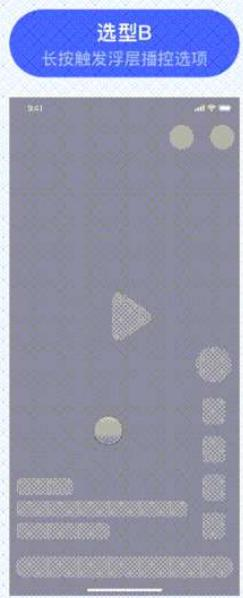

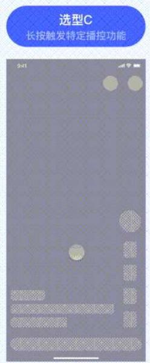

# 选型A

「长按触发独立播控面板」：通过长按手势可激活从屏幕底部弹出的独立播控面板，此方案扩展性较强，但对视频沉浸观感体验有一定的打断感；

# 选型B

「长按触发浮层播控选项」：通过长按手势可触发置于视窗上层的浮层选项入口，一定程度上可延续视频观看的沉浸体验，但浮层扩展性有限；

# 选型C

「长按触发特定播控功能」：通过长按手势触发特定的某个播控功能（如长按“快进”），一定程度上可满足此功能的重度用户，但对于长按手势的使用效率较低；

# 3.设计方案

# 1）长按手势交互扩容

针对目前视频播控菜单存在的问题，经过和业务对上述三种长按交互选型方案进行综合考量，最终决定聚焦于以方案“选型B”的「长按触发浮层播控选项」作为设计切入点。我们意图将部分高频播控功能从基础菜单中拿出进行前置，并探索一套更便捷的触发机制，以此对视频场景中的播控菜单进行设计升级。

但随之而来的难点是我们目前播放器中的长按手势已被“快进”功能占据，用户对此功能的使用频率高、并已形成较深的操控认知，若直接下线“快进”功能则会对用户使用习惯产生较大影响，尤其是视频场景的重度用户。

那么如何在兼容用户已有长按操作习惯的基础上再拓展“快捷菜单”呢？是否有可能将“快进”和“快捷菜单”进行融合？这也是本次项目对于便捷手势体验的重要设计探索点。

基于此，我们决定尝试使用「组合手势」设计模型来对视频播放器中的长按手势进行重新定义，通过「长按+滑选」的机制触发快捷菜单功能项，以缩短视频常用功能路径。对应到设计模型的三个阶段分别为：

step1：以“长按手势”创建一个新模式，即发出交互信号并唤出浮层菜单；

step2：若用户未松开手指，则系统默认开始识别用户意图，是否有以“拖拽手势”滑选至目标功能项以选择功能；

step3：用户滑选锚定至目标功能后，松手释放即可完成最后的功能执行确认。

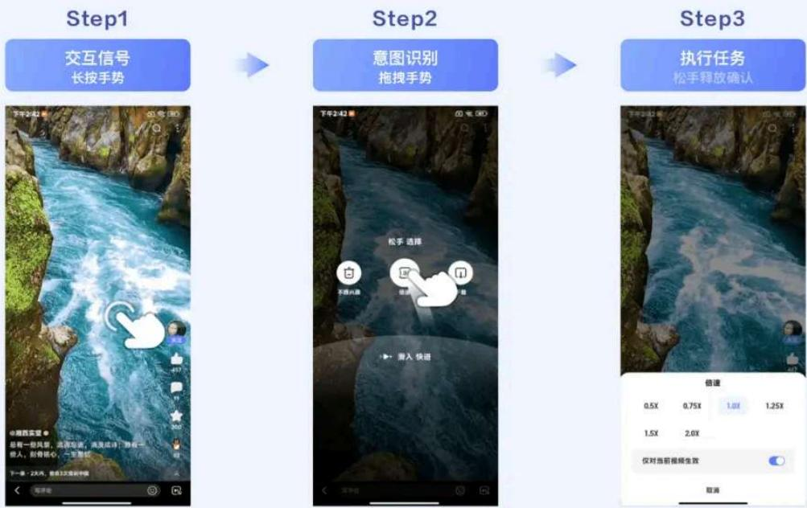

「长按+向上滑选」快捷触发对应功能项；

「长按+向下滑选」快捷触发“快进”（一定程度上兼容老用户对于此功能的使用习惯）。

「长按+向上滑选」快捷触发对应功能项

「长按+向下滑选」快捷触发“快进播放”

# 2）容错性兼容

在设定「长按+滑选」组合手势的同时，考虑到兼容主流的长按习惯、以及对于滑选手势需要有一定的适应过程，我们同时也支持点选的操作模式，即用户长按后若未产生滑选行为便松手，则松手后依然可通过点选的方式触发对应播控功能项。

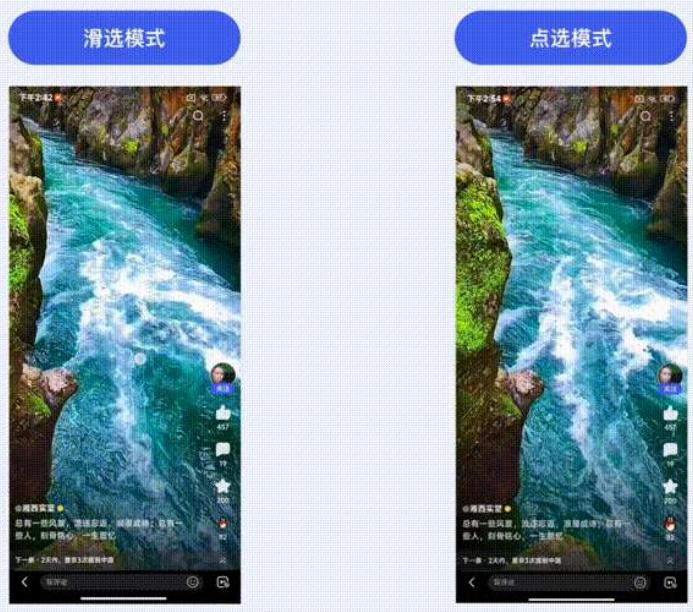

# 3）易用性打磨

差异化的创新设计形式在前期总会面临质疑和挑战，本次项目也不例外。我们担心用户能否接受并认知「长按+滑选」组合手势的操作形式，于是在DEMO开发完成后便进行了一次小范围内的定性可用性测试，以预期在上线前可先收集一波体验问题进行快速打磨优化。

我们根据测试目标、用户类别、测试前序准备及测试步骤等环节提前拟好必要的测试脚本，并邀请了10+名不同年龄段的目标用户进行访谈测试。

# 测试脚本拟定

TEST SCRIPT PREPARATION 

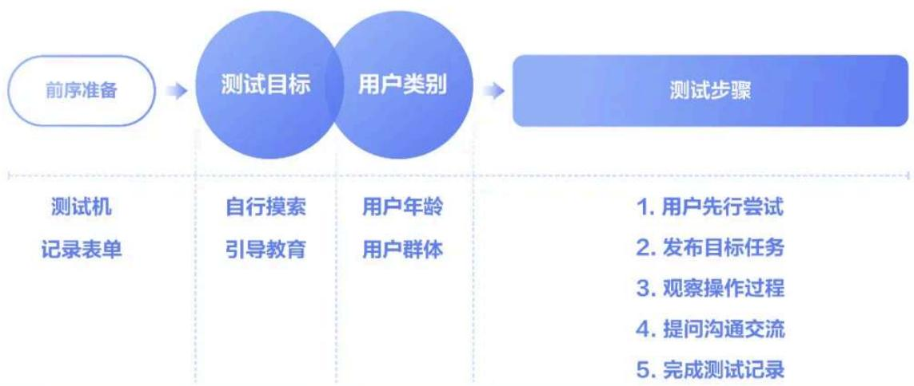

需注意事项：

1. 若用户为互联网从业人员，尽量在体验时让测试者以使用者的角色带入，若用户一直在以产品/设计/研发的视角评价功能，该测试样本建议作废；

2. 若用户为普通小白用户，需询问是否有刷视频的习惯，若无刷视频的习惯，该测试样本建议作废（不建议测试纯小白用户）

3. 目前的文字引导仅展现3次，每测试一个用户引导都会消失。每测试完一个用户都需恢复初始化（debugMode->常用功能->一键删除所有数据）；

测试访谈的过程中，被测用户在进行1至2次尝试操作之后，均可掌握如何使用「长按+滑选」的组合手势，这也为我们增添了不少信心。

同时，我们通过观察用户操作行为及用户主动反馈，发现仍有部分易用性细节可进一步打磨优化。

# 3.1）扩展触发热区：

考虑到单手握持手机的使用场景，可尽可能扩大定义长按手势的触发热区，屏幕中除顶/底bar框架区以及本身就自带长按事件的按钮入口之外，其它大面积区域热区均可支持长按触发快捷菜单，以降低触发难度、提升易用性。

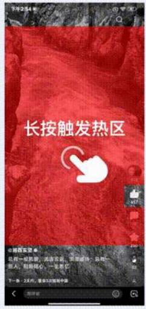

# 3.2）支持跟手触发：

长按后浮出的快捷功能项，其浮出位置支持跟随手指的纵向触发位置而浮出，可减少手指在屏幕上的位移距离、操控更便捷。

# 3.3）实时提示及响应反馈：

灵活判断当前手势触控状态（如滑入选择 / 松手触发），在界面中即时给出相对应的引导提示或振感反馈，以帮助用户快速适应新的手势触发机制。

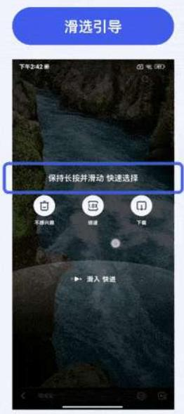

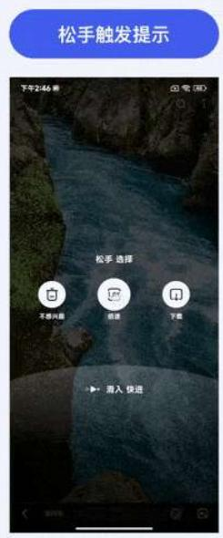

# - 方案上线及验证

以AB实验对本次设计方案进行定量测试验证：

「对照组」效果：长按触发“快进”（各播控功能入口仍归置于基础菜单面板之中）；

「实验组」效果：长按触发“快捷菜单”选项（支持滑选和点选模式）；

小流量实验上线后，经过近半个月的观察，大盘指标稳定、播放完成率等满意度指标稳步提升。

「实验组」长按快捷菜单中的功能使用率相对「对照组」均有大幅提升，说明用户对部分高频功能的确有很强的快捷触发诉求。

「实验组」的“快进”虽多了一步触发步长，实验前期“快进”使用率不及「对照组」，但随着用户对于「长按+滑选」手势整体的使用占比持续走高，通过滑选触发“快进”的操作习惯也快速被培养起来，对于用户来说，长按快捷菜单带来的整体收益是大于折损的。

# - 二期扩展方案

随着长按快捷菜单的上线推全，长按手势的渗透率也持续走高，用户逐渐对视频场景更多的播控功能有了长按触发的诉求，于是我们对长按菜单进行了二期的设计升级，在长按浮层最右侧新增“更多”快捷入口以承接视频场景所有的播控功能，用户通过长按后的可选播控项增多，播控功能整体的使用量得到进一步提升。

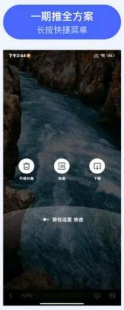

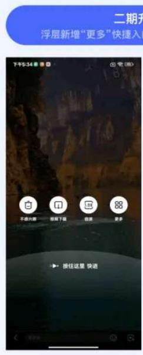

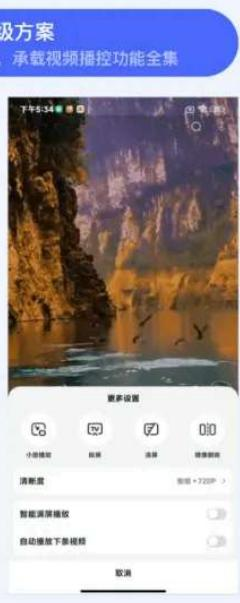

# 四、「组合手势」拓展探索

手势交互是用户在现实世界行为的映射，无论是基础手势还是组合类高级手势，都须符合用户认知习惯、并融入具体的使用场景中进行设计。

以「组合手势」设计模型为指导基础、并结合具体的项目实践，我们进一步对视频播放器中更多功能场景进行了便捷手势的设计扩容探索。

# 1. 「右滑返回手势」激活“小窗播放”

“小窗播放”旨在退出当前视频落地页、并可将当前视频切换成以悬浮视窗的形式进行延续消费。

基于用户的此种操控意图，我们以“右滑返回手势”发出交互信号而触发浮出小窗入口，随后系统根据用户“纵向拖拽手势”的行为来判断其是否有激活小窗的意图，若有短距上滑拖拽行为，松手释放即可快捷激活视频小窗，以提升观看体验的连续性。

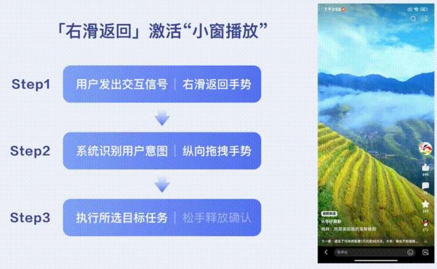

# 2. 「双指手势」激活“满屏播放”

“双指拖拽手势”可拖拽并清屏视窗画面，以此手势发出交互信号，若在“双指拖拽手势”基础上有识别到“双指扩张手势”行为，则松手释放即可快捷激活“满屏播放”，以满足更沉浸视频浏览体验。

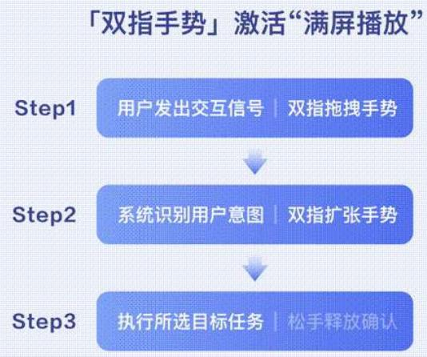

# 五、结语

便捷手势的设计出发点是为提升操控效率、缩减功能触发路径，从而使视频内容更沉浸消费。希望本次基于视频播放器场景的手势体验设计实践能给大家带来帮助和启发，后续我们也将持续深耕视频领域、并进一步探索更贴合用户使用场景的手势交互体验。

感谢阅读，以上内容均由百度MEUX团队原创设计，以及百度MEUX版权所有，转载请注明出处，违者必究，谢谢您的合作。申请转载授权后台回复【转载】。

也欢迎加入MEUX,视觉/交互/运营设计师

可投简历至MEUX@BAIDU.COM

(注明信息获取来源如：公众号)

以下文章，你可能也感兴趣

书香四溢-百度小说运营活动视觉升级

实战案例！虚拟人空降语音搜索，探索情感沉浸新体验

“老字号”互联网产品的年轻化之路

清华美院 X 百度MEUX构建全链路设计创新思维课程回顾

B端设计愁？掌握这三步，XYZ轴为你解忧

# 百度MEUX

MEUX，百度移动生态用户体验设计中心，负责百度移动生态体系的用户/商业产品的全链... >229篇原创内容

公众号

关于我们：

MEUX,百度移动生态用户体验设计中心，负责百度移动生态体系的用户/商业产品的全链路体验设计。服务的产品包括百度APP、百度搜索、百度百科、百度贴吧、百度商业产品等。

MEUX以「简单极致」为设计理念，创造极致用户体验的同时赋能商业，推动设计行业的价值和影响力，让生活因设计而更美好。

你“在看”我吗？