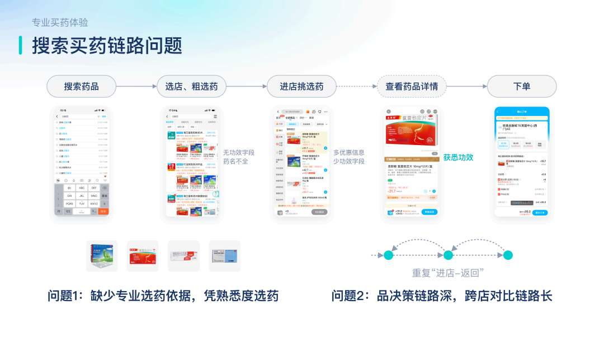
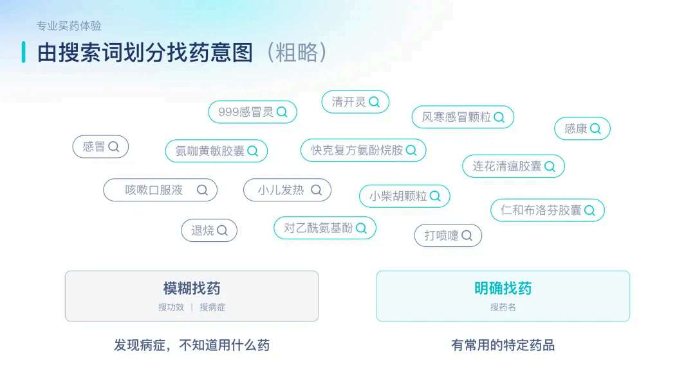
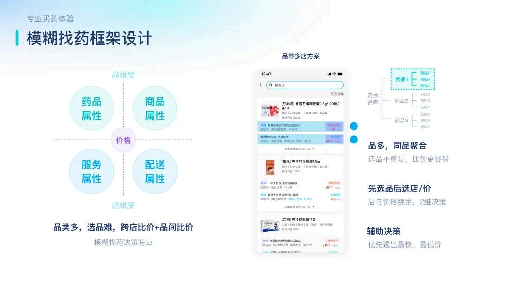
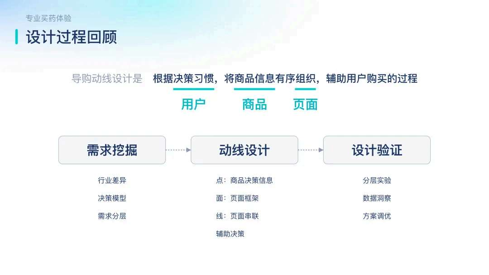

# 如何重构导购动线，打造专业的买药体验？

> 来源：淘宝闪购设计 / 阿里健康设计复盘
> 核心目标：从“货架式电商”向“专业医疗服务”转型，构建安全、专业、确定的购药体验。

## 一、 背景与痛点：买药不是买衣服
购药场景具有高度的特殊性：
- **高决策成本**：用户怕买错、怕吃错。
- **信息不对称**：用户往往只知“不舒服”，不知“买什么药”。
- **强即时性**：病痛不等人，需求往往发生于深夜或突发状况。

传统的“搜索 -> 列表 -> 详情 -> 支付”货架式动线无法解决“对症下药”的问题。

## 二、 核心重构：从“找药”到“对症”的动线升级

### 1. 导购入口：模糊需求的精准转化
- **按症状引导**：在搜索入口和首页强化“感冒”、“咳嗽”、“过敏”等症状词，而非仅靠药名搜索。
- **AI 医药 Agent**：引入问诊式交互。用户描述症状后，AI 主动追问（如“痰是什么颜色？”），模拟医生问诊过程。

### 2. 决策增强：建立“专业心智”
- **信息结构化重组**：详情页不再突出促销大促氛围，而是将**适用症、用法用量、禁忌**等安全信息前置且结构化展示。
- **视觉权威感**：采用“阿里健康蓝/绿”色调，排版风格严谨权威。
- **专业背书集成**：集成“自营标签”、“溯源码”以及“在线药师咨询”入口。

## 三、 合规与安全：极简的处方药链路

### 1. 电子处方流转
- **极简复诊流程**：针对处方药（RX），通过 AI 辅助自动预填病历，用户最快可在一分钟内完成在线复诊并获取电子处方。
- **安全拦截**：针对特定人群（如孕妇、儿童）进行自动风险提示或拦截。

## 四、 履约体验：打造“确定性”
- **24小时药房**：针对深夜急用场景，提供专属的“夜间守护”界面和 24 小时配送服务。
- **19分钟极速达**：在动线全链路强化履约时效的感知。

## 五、 服务延伸：全生命周期的健康管理
- **云药箱**：购药后自动加入，提供过期提醒、用药闹钟。
- **慢病管理**：针对长期用药用户提供复购提醒和随访服务。

---

## 总结
专业的买药体验重构，本质上是**利用 AI 技术补齐用户医学知识短板**，通过**信息重组建立信任**，并依托**极速履约解决应急痛点**。设计不再是驱动消费，而是守护安全。

