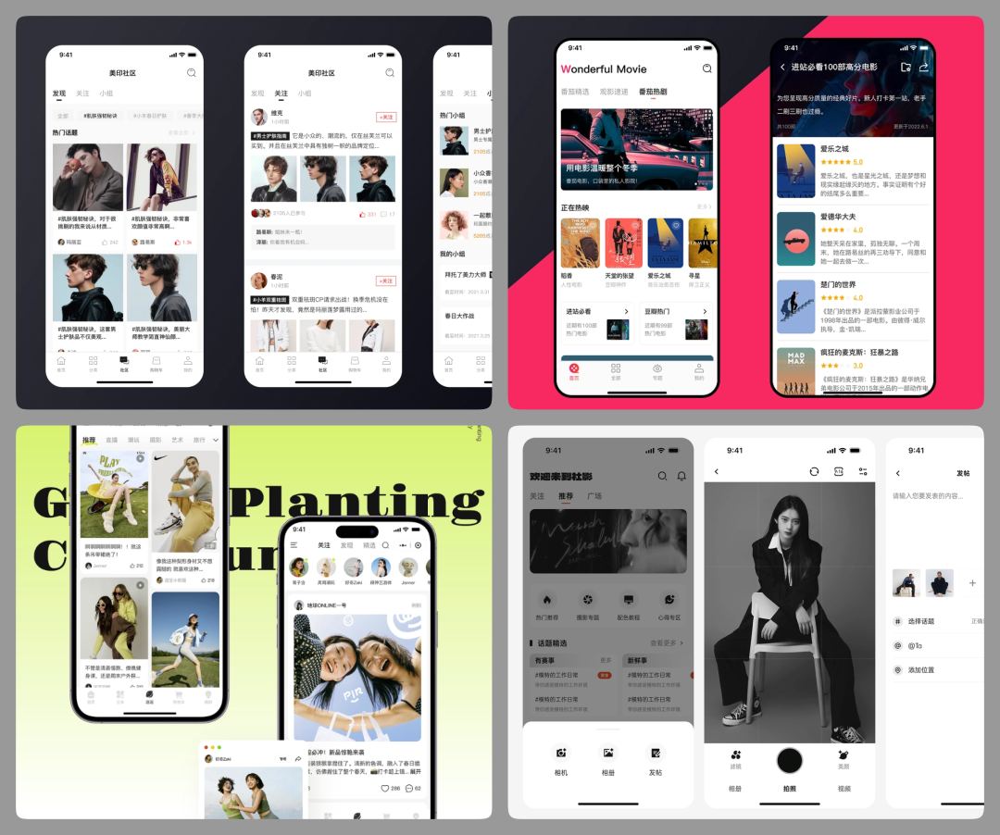
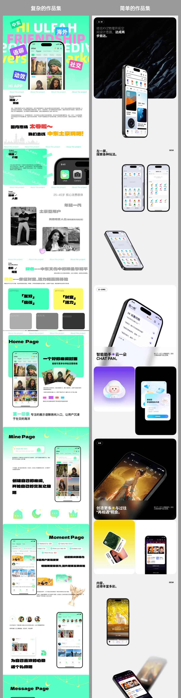

纬度1：项目视觉的输出水平

第三级就比较特殊，属于用专业的角度挑不出毛病，但也说不上设计的有多好…而这种设计分两种情况，一种是设计师基础掌握得很好但目前上限就在这里，做不出其它更高层次的创意和发挥。另一种则是真实项目的设计需求求稳，不需要复杂的视觉样式，比如微信、Notion、Deepseek 之类。在这一级就不能只看界面判断设计能力，必须结合项目类型和设计分析来考量
第四级就是在视觉表现上有让人眼前一亮、印象深刻的视觉输出。即有很强的风格、品牌特征，又能保证专业性和原创性，不是跟风做的设计。

纬度3：设计的综合审美水平
最能反应这种差异的情况，就是有的作品集使用了非常复杂的技巧将画面填的满满当当，但效果并不理想，而有的作品集内容很少，看似简陋但观感甚佳。

好好提升平面、版式相关的审美，对那些视觉非常繁琐的包装案例祛魅，**学会空间的管理和留白**，才能输出更具可看性的作品集，也可以节省你们更多的时间。