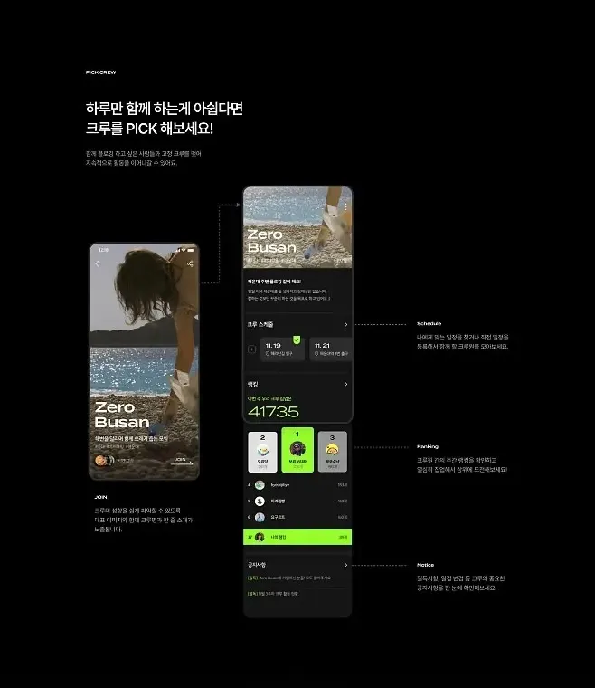

# 1. 关联页面展示

第一种做法，就是结合首页外的其它次要页面进行混合展示，通过更多页面的结合来丰富页面的视觉效果。

# 2. 组件状态说明

第二种模式就是虽然只展示首页，但会在旁边对首页的不同组件进行介绍，以及展示组件的不同状态和设计样式。

# 3. 页面细节展示

第三种是对页面细节进行不同程度的展示，也就是说不是把首页一张长图直接贴出来，而是先展示单屏或部分页面，然后通过一些其它模块布局展示重要细节或隐藏部分。
这类展示方式需要页面本身有优质的细节内容可以选择，比如组件、LOGO、图标、形象等，如果设计本身很中规中矩，再去凸显细节会起到反效果。

# 4. 页面框架说明

第四种是对页面框架层进行说明，解释页面结构的布局、排序、占比背后的逻辑。这类解释通常是基于体验或是数据的导向发现，用于实现更高层次的目标或解决原有的问题。

# 5. 优化前后对比