# 4000字干货！超多案例的B端设计指南：导航（一）

> 原文链接：https://www.uisdc.com/navigation-design-4
> 作者/团队：CE青年
> 日期：2023/07/07
> 标签：未提供
> 本地归档说明：为尊重原站版权，此文件不逐字转载全文；保留原文链接、图片引用、筛选理由和关键内容线索，方法沉淀见 ux-method-library。

## 筛选理由

导航设计指南，适合沉淀复杂产品的信息分层和路径稳定性。

## 关键内容线索

1. 这篇文章帮助到了很多同学进入 B 端领域。
2. 然而，两年过去了，行业在不断发展，文章中的很多观点都不太适用于目前的 B 端环境。
3. 因此，最近我计划将之前不太过时的文章内容进行深挖。
4. 帮你快速全面掌握导航组件的使用和设计精心设计的导航可以帮助用户更快地学习你的产品，知道该做什么，去哪里。
5. 在现实世界中，我们在寻找东西时会有许多“导航”的指引。
6. 比如你在商场中寻找洗手间，那你就会去查看商场中的道路指引；你要在超市寻找一瓶旺仔牛奶，那你就会先找到饮料分区，然后根据内容划分再进行寻找；你要在图书馆寻找一本书，同样可以根据楼层、类别、书架编号一步一步跟随着指引进行寻找，这其实就是生活中的“导航”。
7. 而在屏幕世界中，我们对导航也有着同样的需求，因此可以将导航定义为 “起到页面信息引导作用的组件”，都叫做导航。
8. 但是你会发现，在日常的沟通中，我们对于导航的理解还是会存在偏差，这里把同学们最常犯的几个问题进行汇总，来和大家进行讲解。
9. 1. 导航定义常见的问题 ①导航与导航菜单的关系？
10. 其实在日常的工作当中，我们经常就会把 导航菜单与导航进行混淆。

## 原文图片

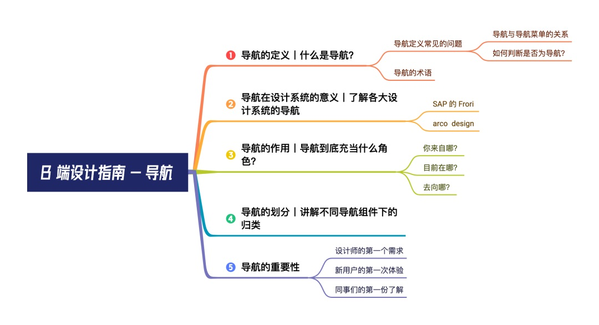

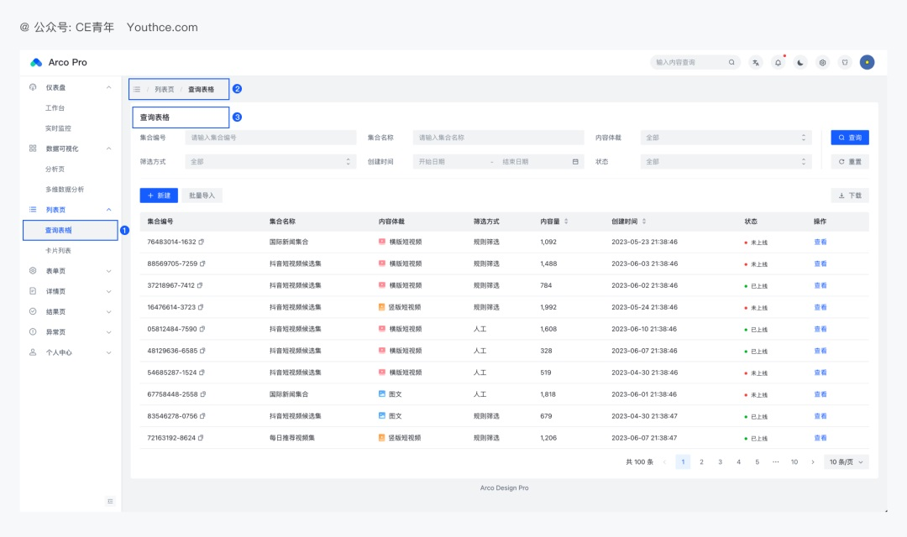

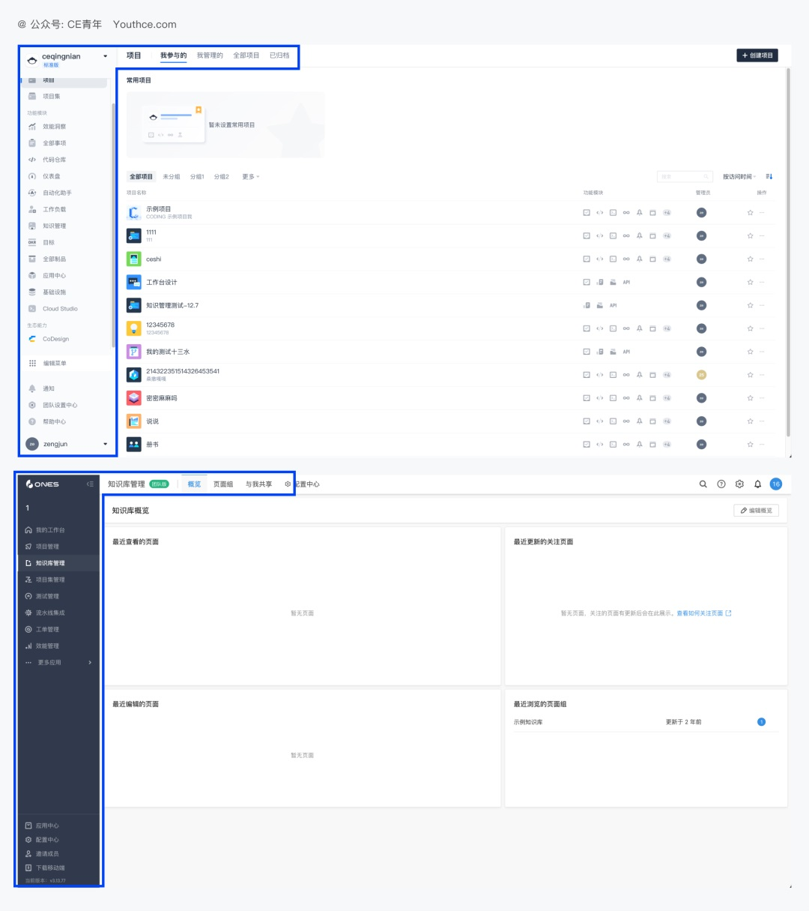

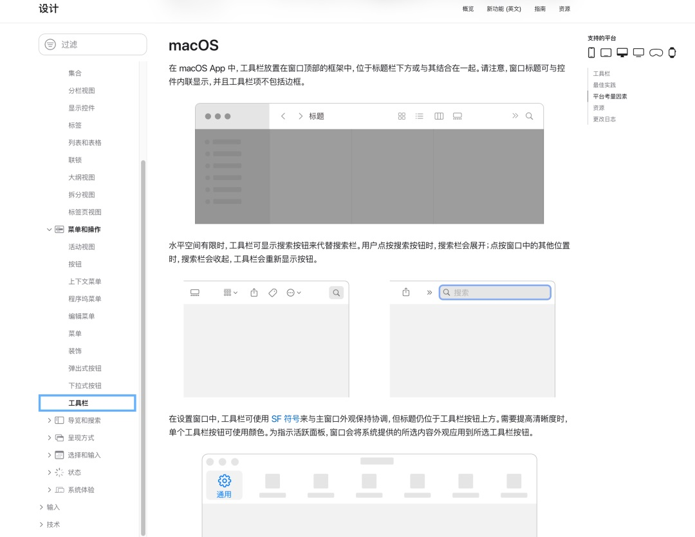

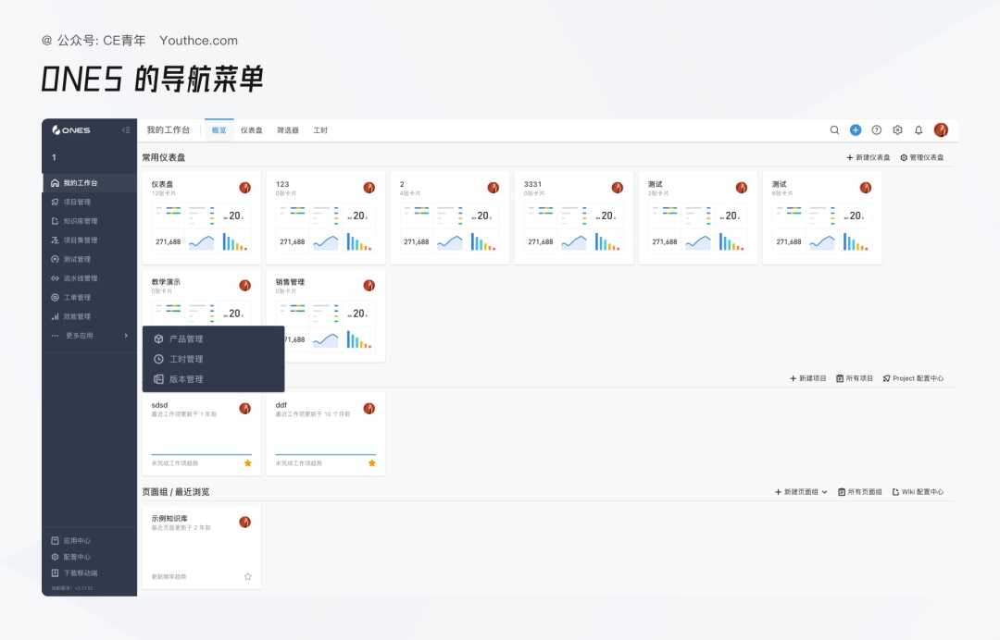

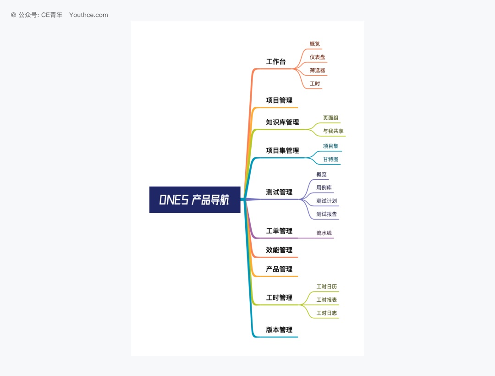

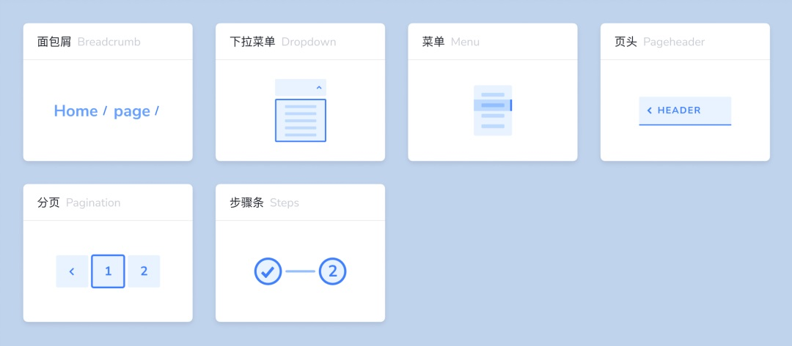

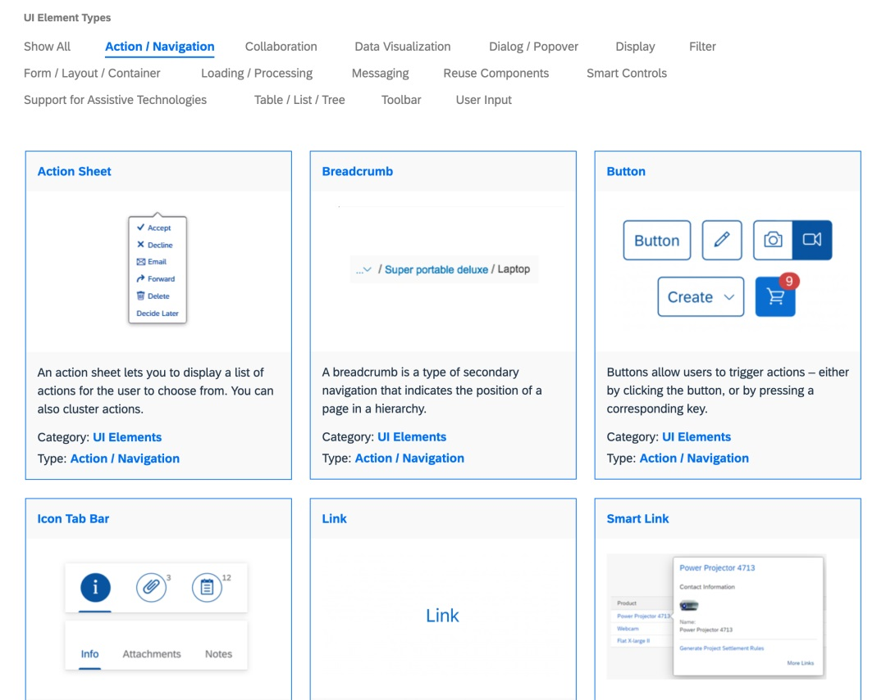

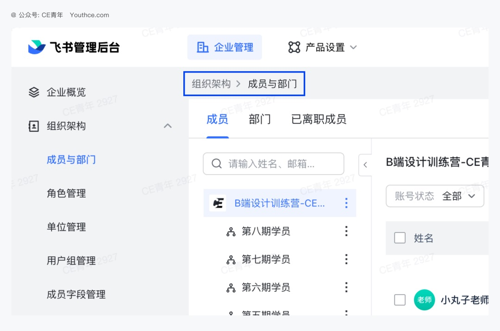

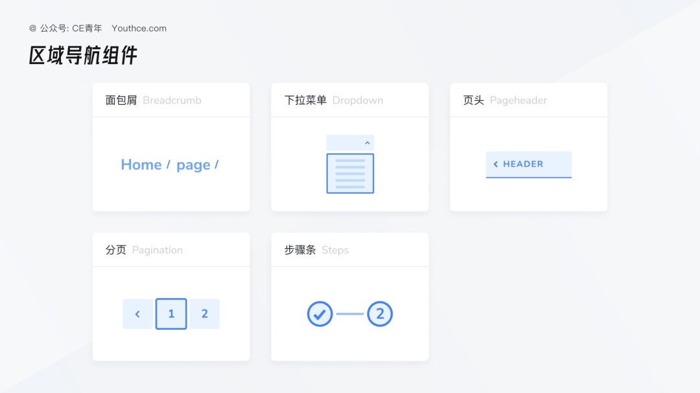

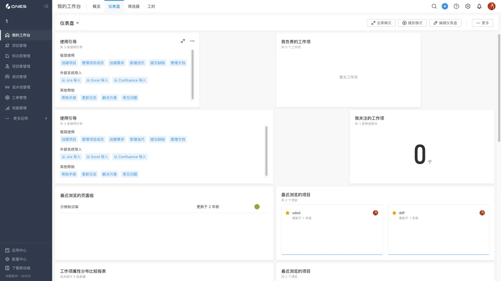

