# 万字干货！11个章节深度思考人工智能体验设计

> 原文链接：https://www.uisdc.com/beyond-conversational-interfaces
> 作者/团队：未提供
> 日期：2024/06/23
> 标签：未提供
> 本地归档说明：为尊重原站版权，此文件不逐字转载全文；保留原文链接、图片引用、筛选理由和关键内容线索，方法沉淀见 ux-method-library。

## 筛选理由

人工智能体验设计长文，适合补充从聊天框走向任务型 AI 体验的结构化方法。

## 关键内容线索

1. 人工智能对用户体验设计的影响分析随着 ChatGPT 在 23 年初的火热，AI 热潮已经开始席卷各行各业，人们对于 AI 的热情就像是看着第一款 iPhone 发布或者蒸汽机的发明，期待着它带来一场信息时代的工业革命。
2. 人工智能的不断发展给设计师打造更直观的用户界面创造了机会。
3. 基于文本的大型语言模型解锁了许多新的可能性，因此许多人认为从图形界面转向诸如聊天机器人之类的对话界面是一种必然。
4. 然而，有大量证据表明，对许多交互模式来说，对话界面并不理想。
5. Maximillian Piras 探讨了最新的人工智能能力如何在不局限于”对话”的情况下重塑人机交互的未来。
6. 很少有技术创新能彻底改变我们与计算机的交互方式。
7. 幸运的是，我们已经获得了亲眼目睹下一次范式(paradigm)转变的机会。
8. 这些转变往往会开启一个新的抽象层(abstraction layer)，以隐藏子系统的运作细节。
9. 细节的泛化使我们的复杂系统看起来更简单、更直观。
10. 这不仅简化了计算机程序的编码，也简化了交互界面的设计。

## 原文图片

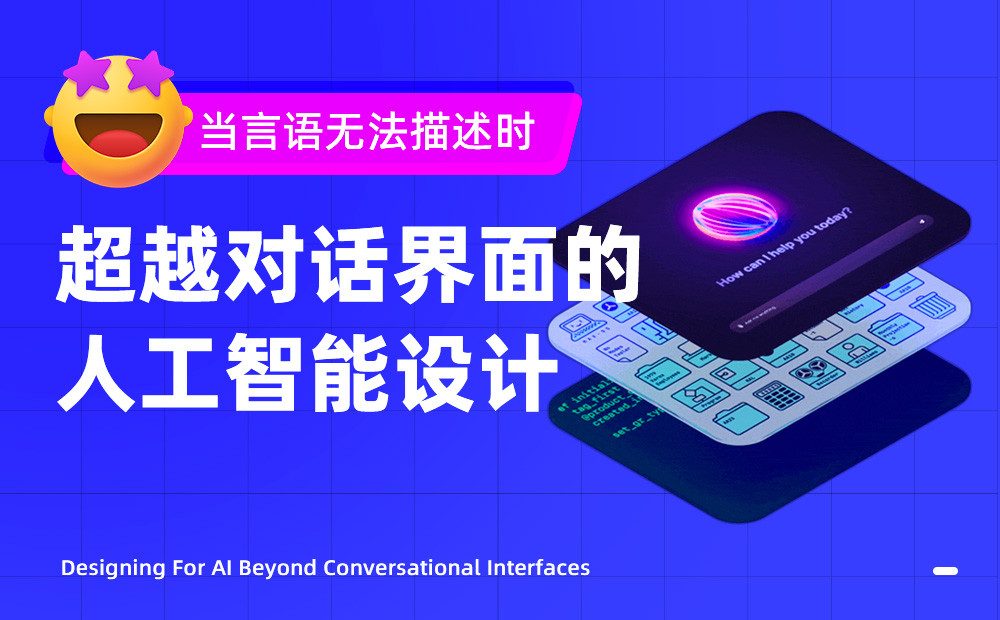

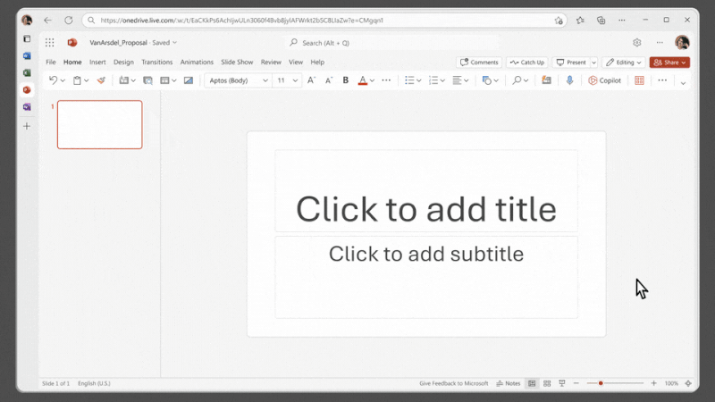

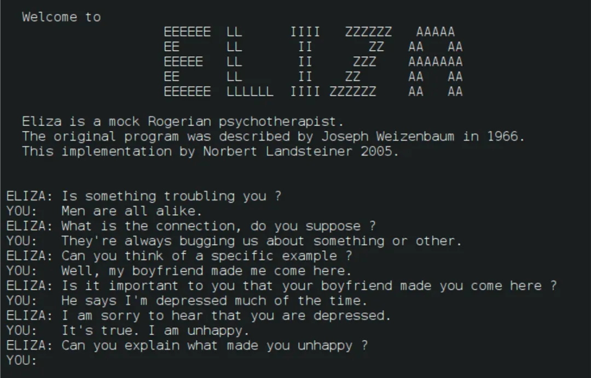

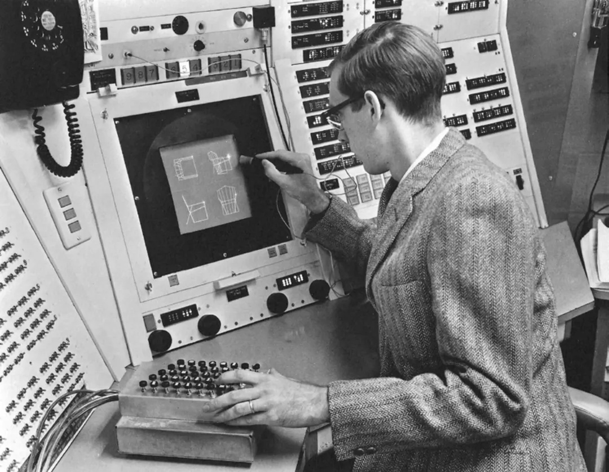

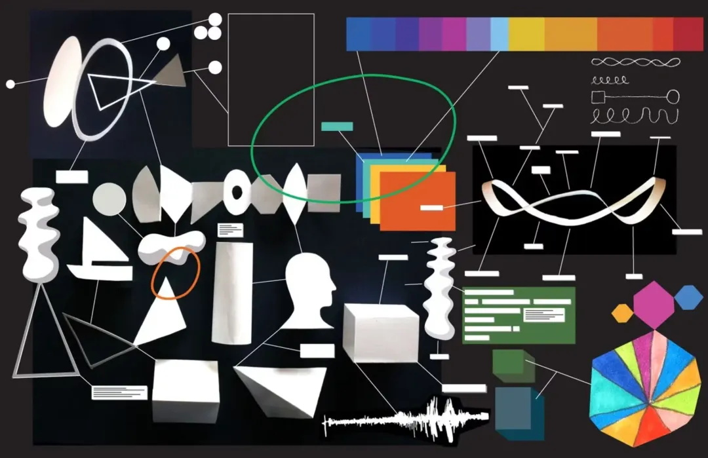

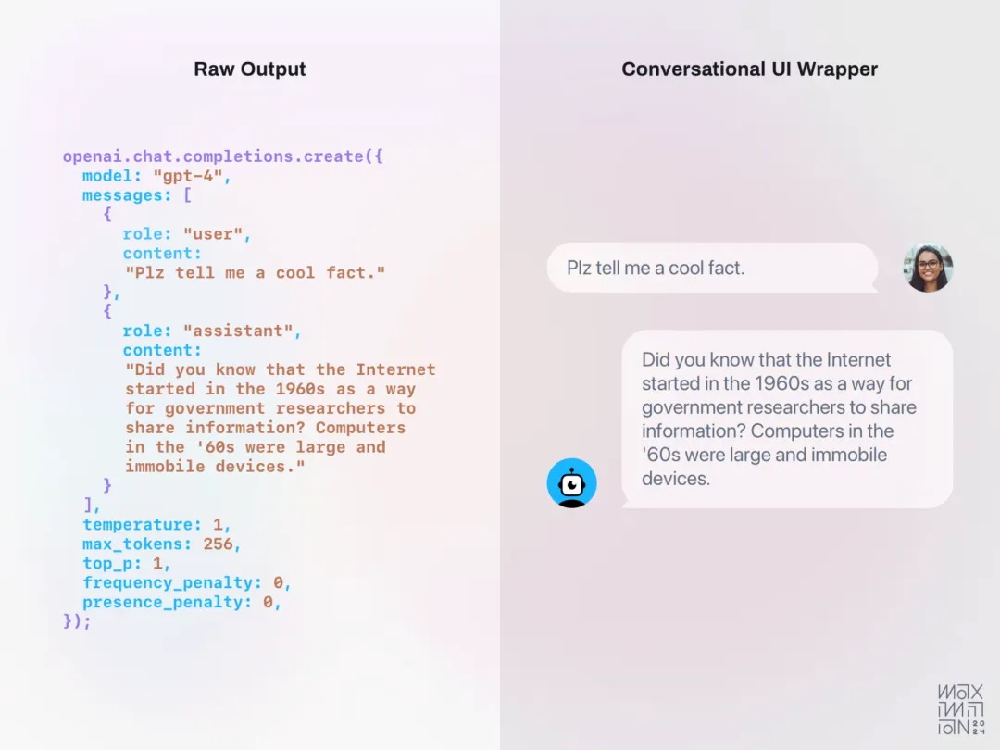

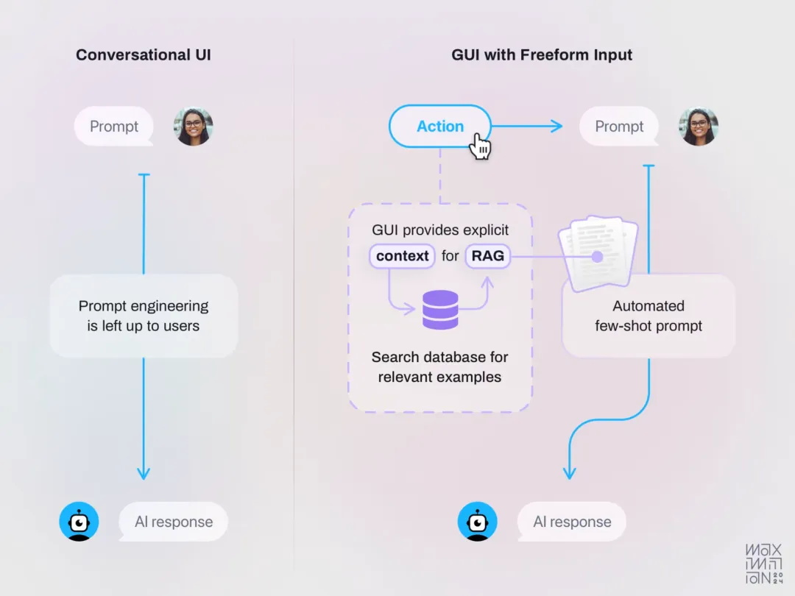

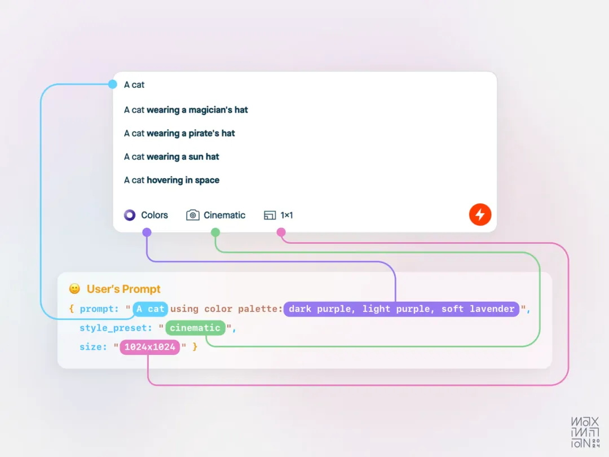

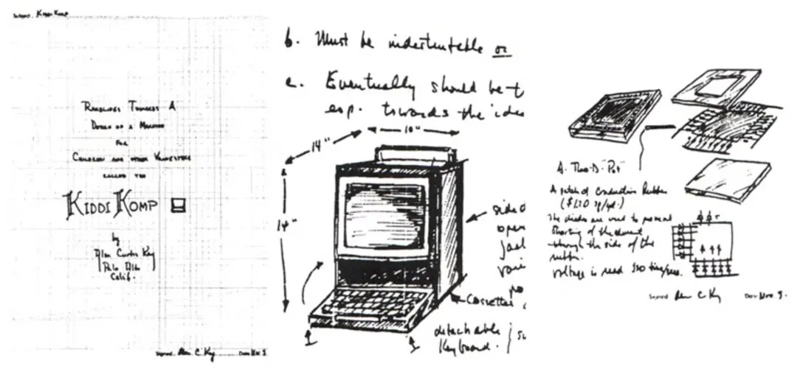

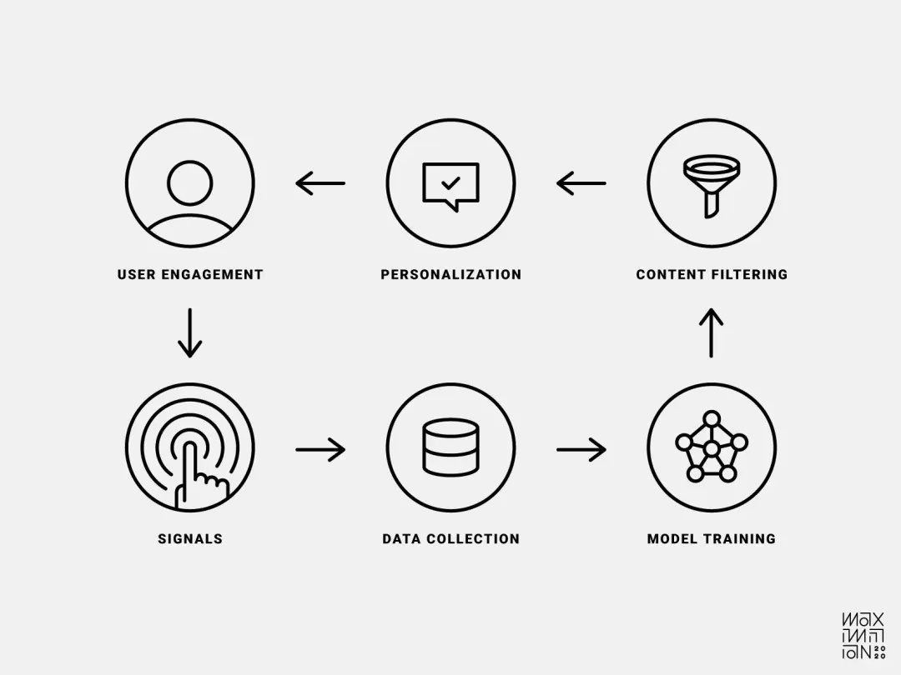

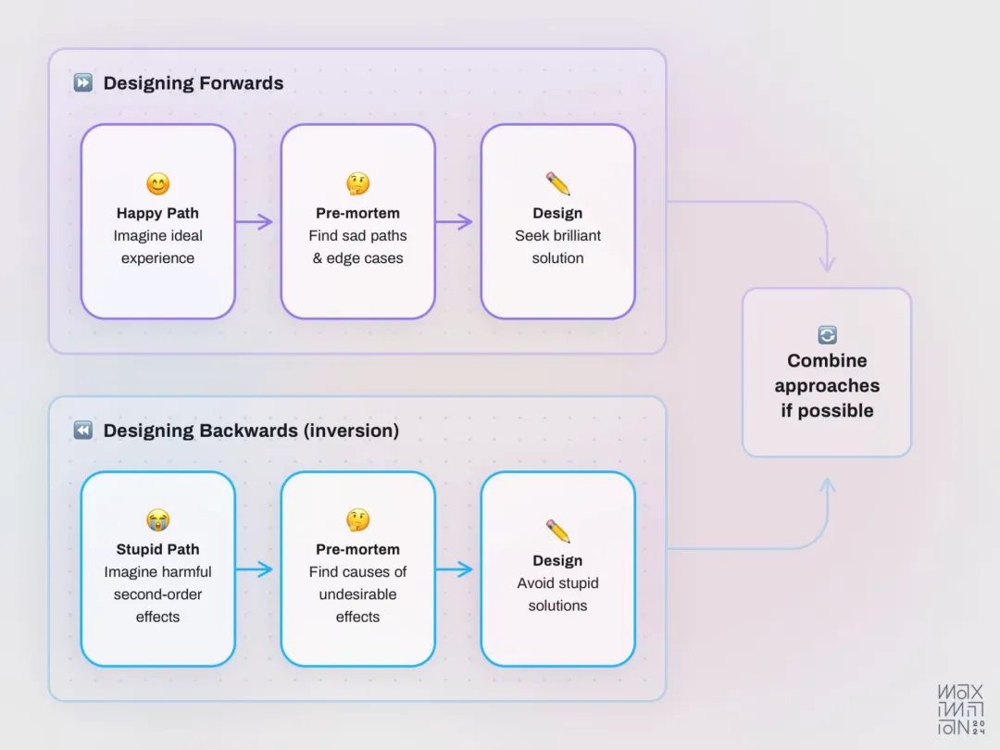

