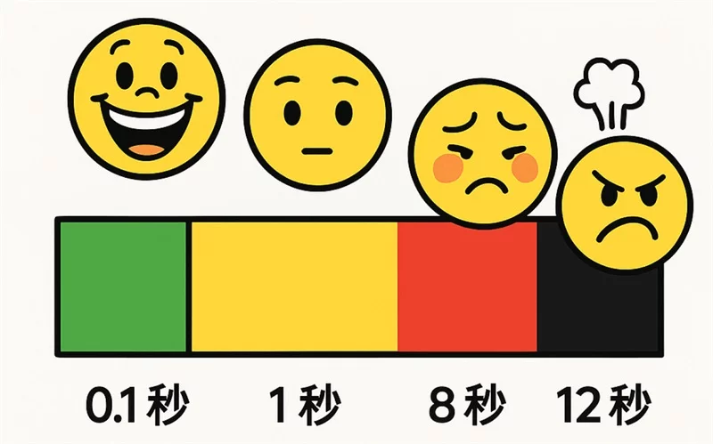
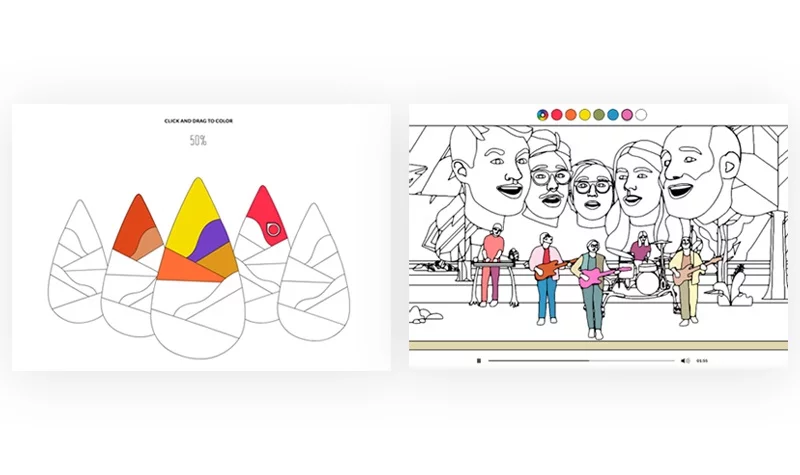
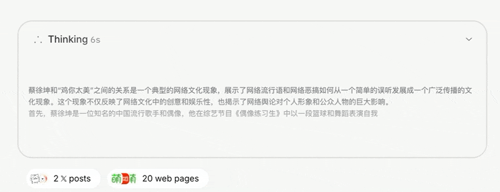

# 为何加载动画是AI产品必不可少的设计？这7个案例告诉你！

> 原文链接：https://www.uisdc.com/load-animation
> 作者/团队：龙爪槐守望者
> 日期：2025/05/28
> 标签：未提供
> 本地归档说明：为尊重原站版权，此文件不逐字转载全文；保留原文链接、图片引用、筛选理由和关键内容线索，方法沉淀见 ux-method-library。

## 筛选理由

AI 产品加载动画案例，适合沉淀等待期预期管理、进度反馈和不确定性安抚。

## 关键内容线索

1. 当用户遇到长时间的加载等待，如果没有任何提示，他们可能会误以为网站或应用程序已经崩溃或卡死，最终选择放弃使用产品。
2. 为了缓解用户等待的焦虑感，设计师们在加载界面设计上展开了百家争鸣。
3. 有些平台会使用自家 IP 形象来加强品牌特色，比如哔哩哔哩选用看板娘 2233 作为加载动画，完美契合平台"萌即正义"的定位。
4. 动物森友会是如何利用Loading设计提升游戏体验的？
5. 以摇滚乐队 Real Estate 的新专辑《Stained Glass》音乐动画 MV 网站为例，呼应"彩绘玻璃"这个专辑名称，加载页面被设计成了一个填色小游戏。
6. 用户需要为所有线描图案上色后，加载过程才会完成。
7. 通过精心设计的 Loading 界面，不仅提升了视觉吸引力，还成功匹配了品牌调性，有效缓解了用户的等待焦虑。
8. 加载出现的本质原因是网络速度慢或设备性能不足，导致必须让用户等待。
9. 我之前工作中就遇到过一个有趣的案例：明明网络很快、手机也很流畅，却要刻意增加延迟，让用户必须等待加载。
10. 背景是这样的——当时我们设计了一款婴儿发育测试产品。

## 原文图片

