# 从6个方面，详细拆解运营弹窗的设计要点

> 原文链接：https://www.uisdc.com/run-popover-design
> 作者/团队：设计师doo
> 日期：2022/01/10
> 标签：未提供
> 本地归档说明：为尊重原站版权，此文件不逐字转载全文；保留原文链接、图片引用、筛选理由和关键内容线索，方法沉淀见 ux-method-library。

## 筛选理由

运营弹窗设计要点，适合沉淀触达时机、打扰控制和转化信息结构。

## 关键内容线索

1. 分类并拆解设计细节，是画好运营弹窗的先决条件。
2. 大纲： 弹窗属性介绍 运营弹窗的作用 运营弹窗在用户行为路径中的出现节点 运营弹窗的 8 种细分 运营弹窗的设计逻辑拆解 运营弹窗的视觉分析 弹窗属性介绍 弹窗是一种典型的模态视图，所谓“模态”是指，暂时中断用户操作，以确保用户接收到重要通知，或专注做出某项决策，半透明蒙版起到隔绝内容层与浮出层的效果。
3. 当用户点击弹窗中的按钮时，才能退出模态视图。
4. 由于弹窗的阻断感极强，弹窗的出现必然伴随体验的牺牲，因此，除非有足够的理由，不然慎用弹窗。
5. 弹窗大分类： 基础弹窗：通知类、决策类 运营弹窗 基础类型弹窗承载着重要功能，且与流程紧密相关，不容易引起用户抵触，而运营类弹窗，往往背负着明确的运营指标，以商业为导向，需要合理布局和策划，提供足够的利益点或趣味性，才能避免引起用户反感。
6. 运营弹窗的作用 运营弹窗的出现势必对应着一个明确而关键的目的，不同的运营目标影响视觉呈现的方式。
7. 运营弹窗的目标有 3 大类： 为了转化：刺激用户消费，不管是发放折价券或者联合会员，都是用利益引导用户购买，从而实现转化。
8. 为了活跃：引导签到或参与时效性活动，以利益为驱动，增加用户打开产品的动力。
9. 为了拉新：以拼多多为代表，用现金的形式吸引用户大量分享，依附微信强大的社交网络，力求达到指数型裂变。
10. 运营弹窗在用户行为路径中的出现节点 弹窗本身带有一定的强迫性，用户没有办法禁止弹窗出现。

## 原文图片

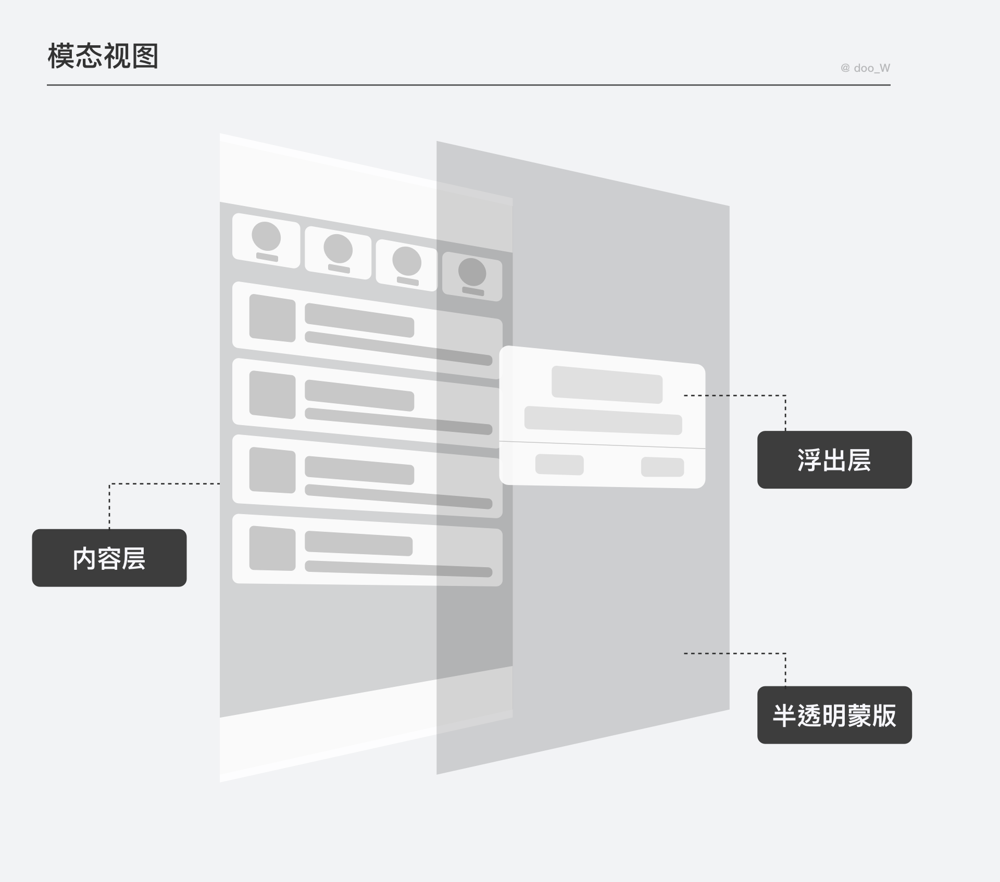

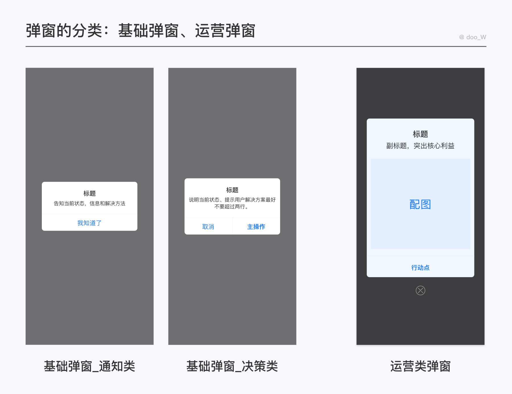

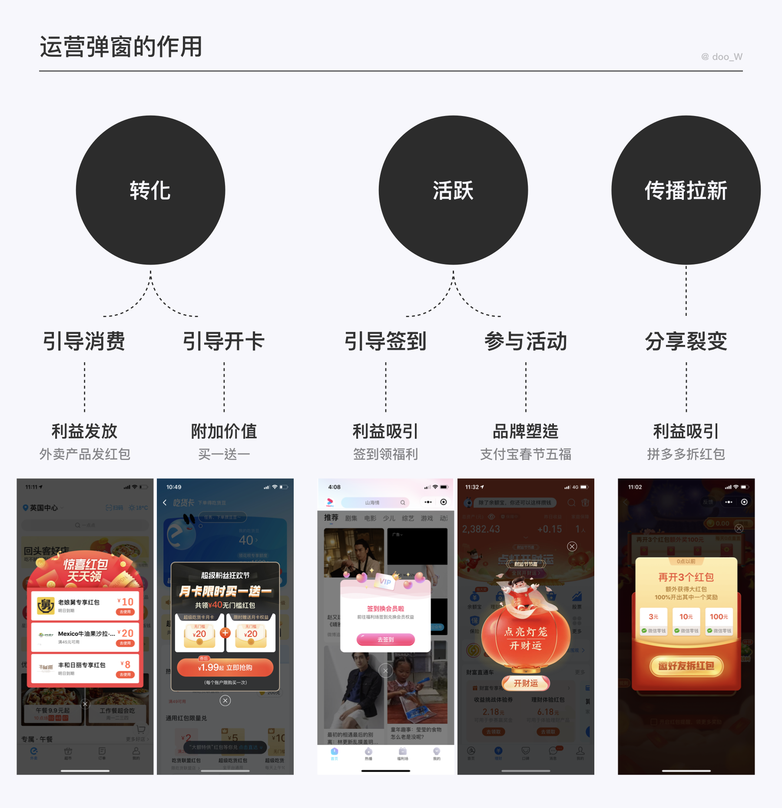

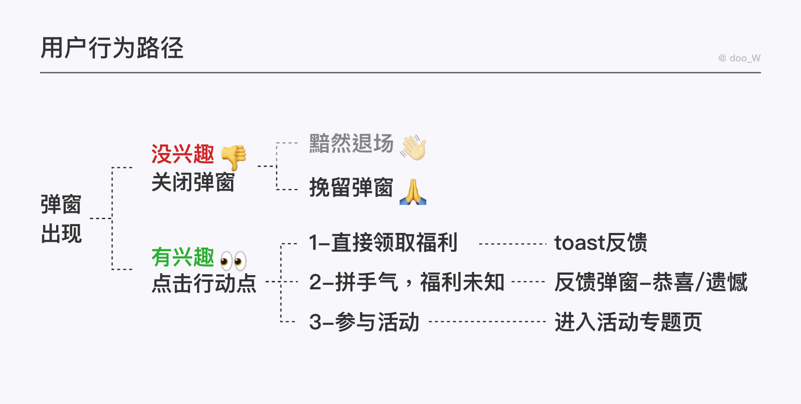

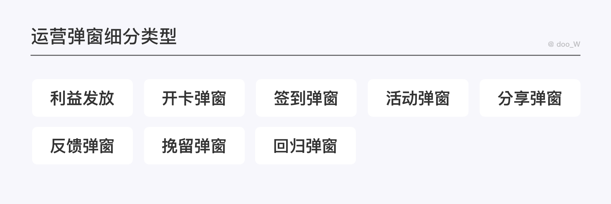

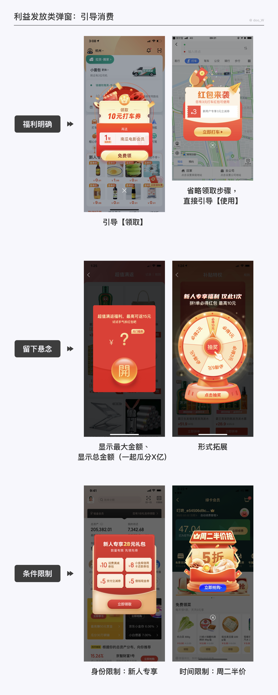

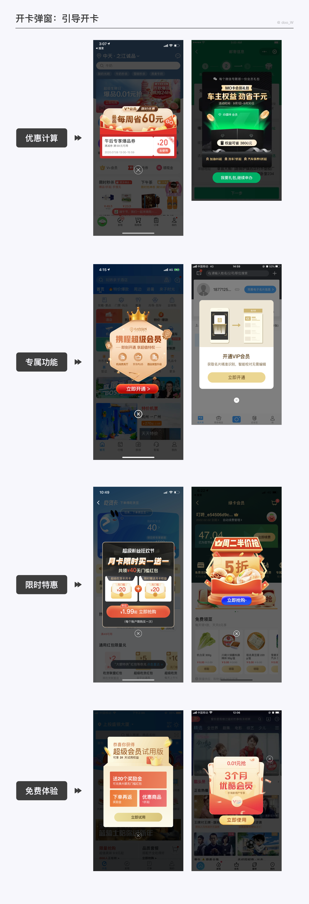

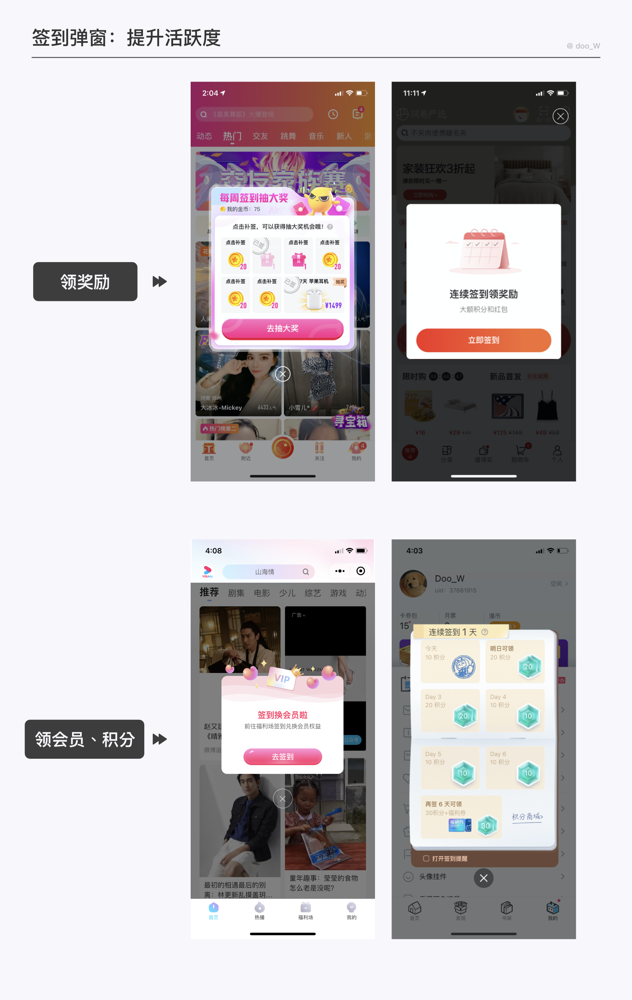

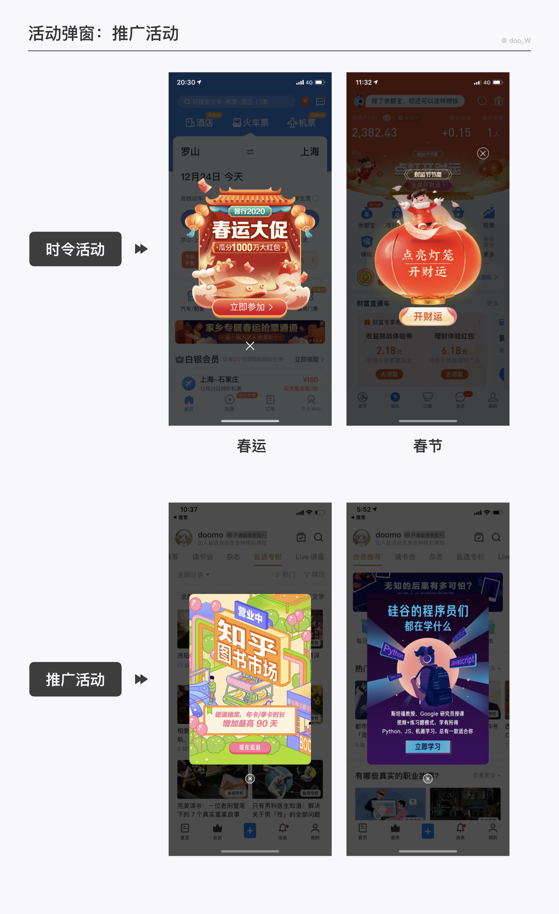

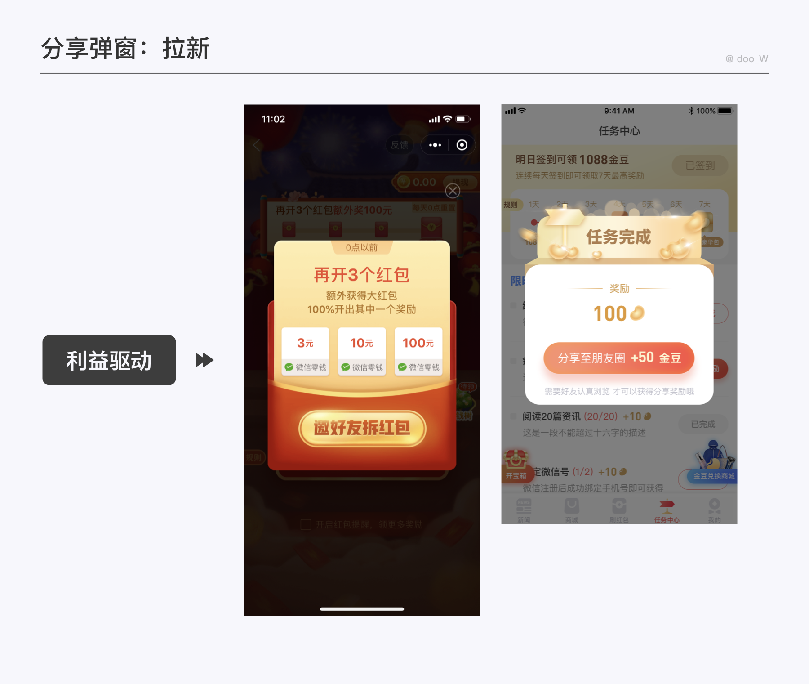

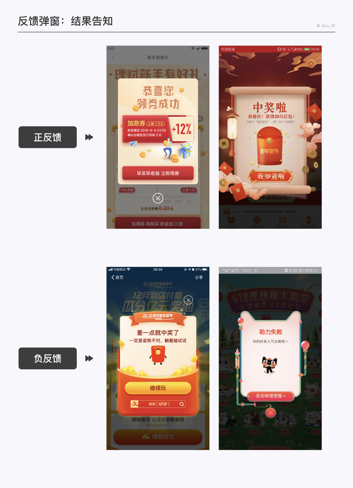

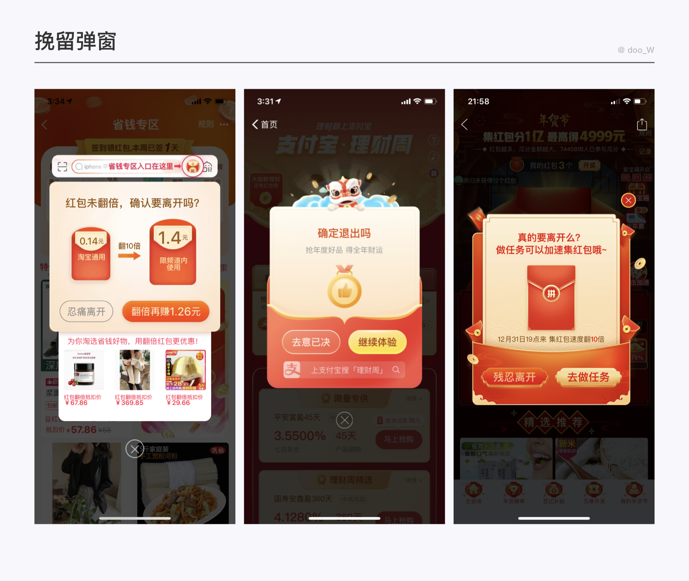

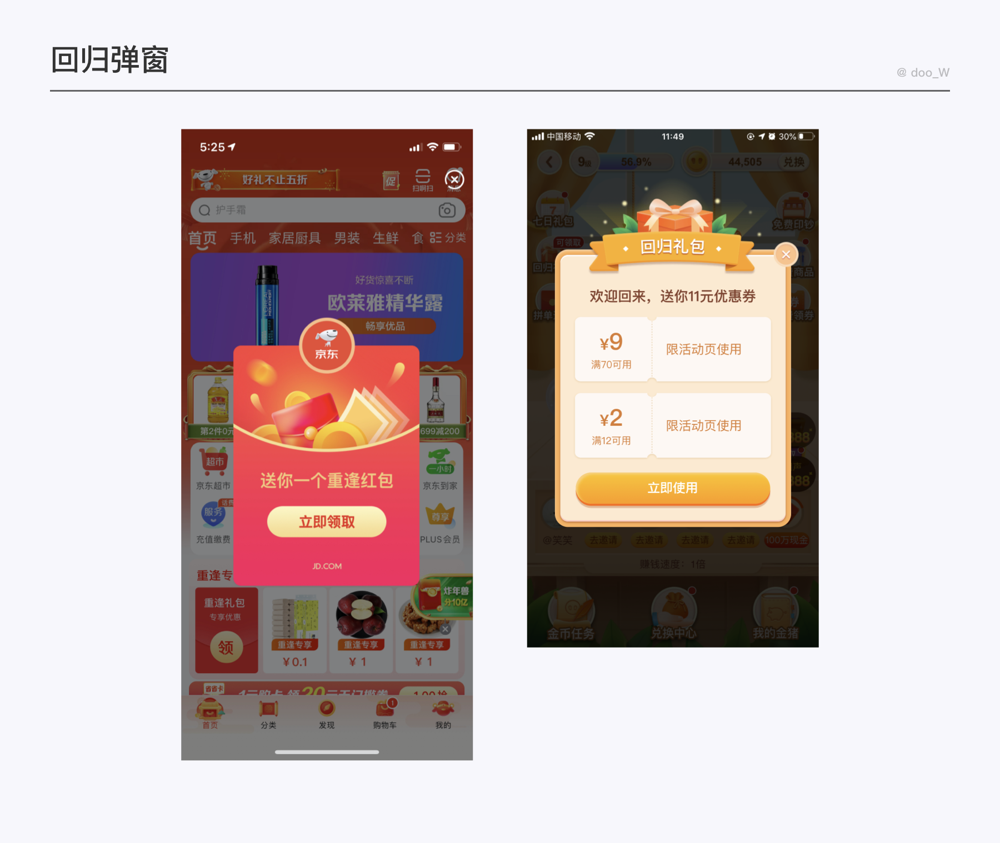

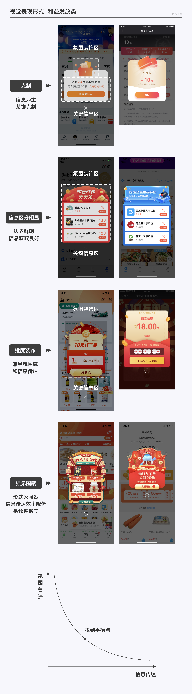

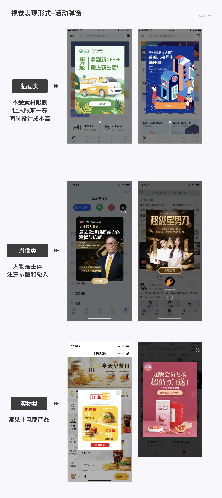

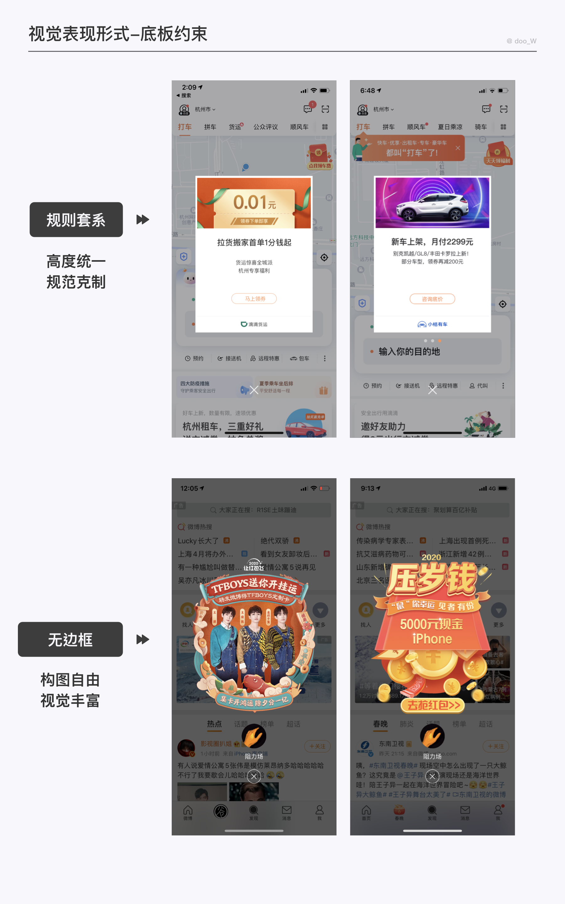

