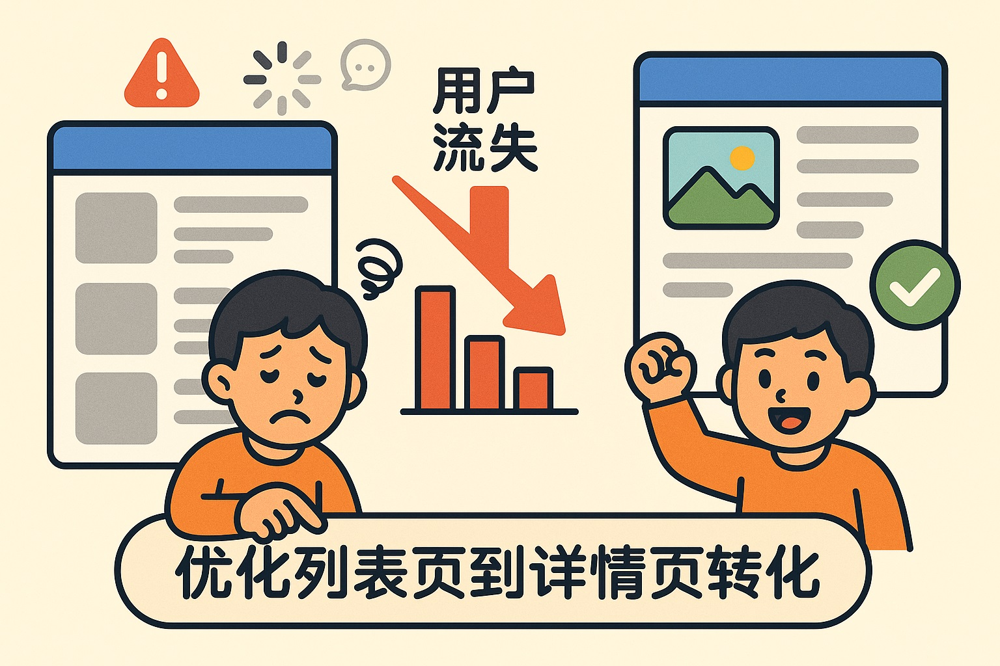
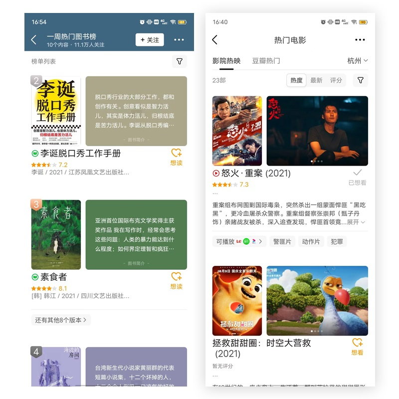
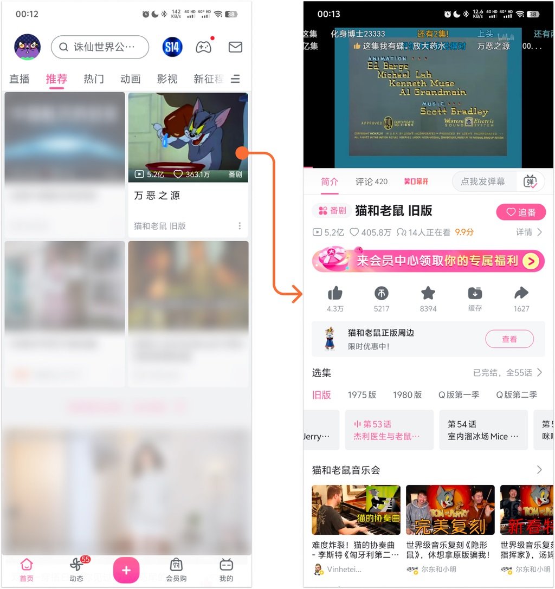
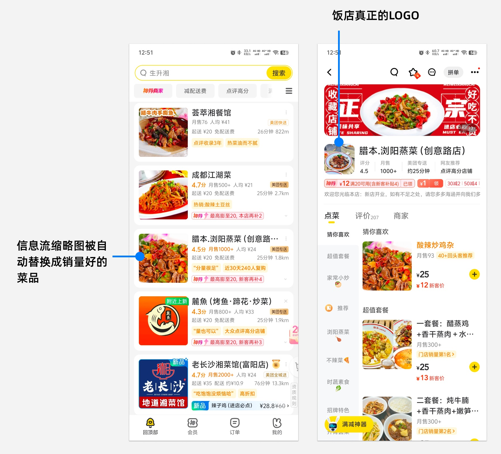
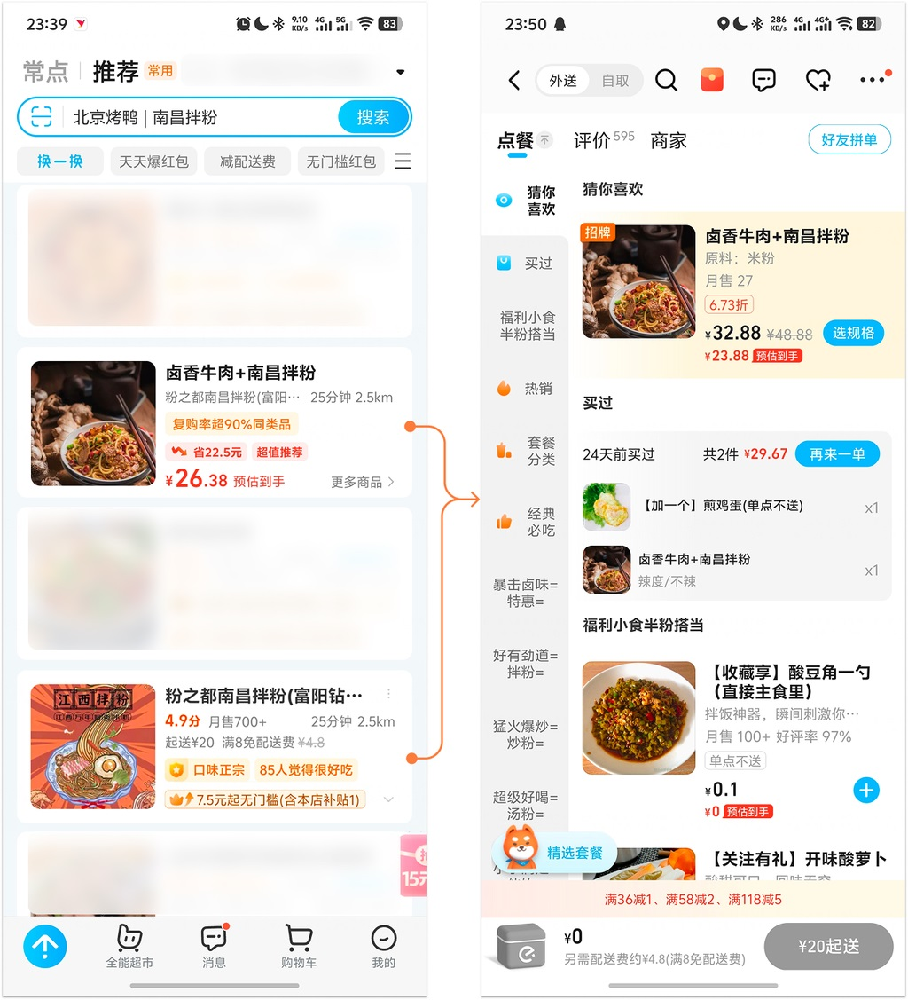
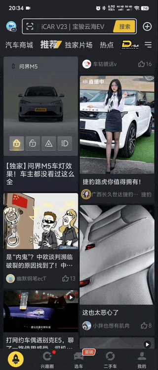
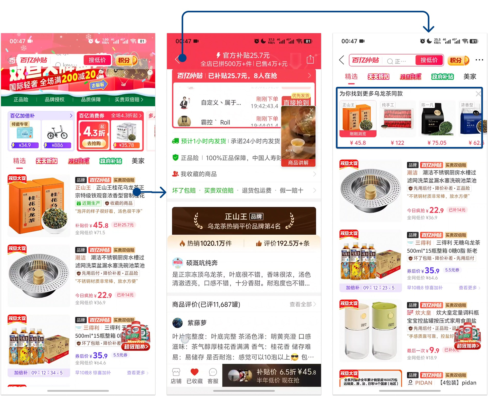

# 从列表到详情：提升用户转化的7种方法

> 原文链接：https://www.uisdc.com/list-to-detail
> 作者/团队：龙爪槐守望者
> 日期：2025/05/07
> 标签：未提供
> 本地归档说明：为尊重原站版权，此文件不逐字转载全文；保留原文链接、图片引用、筛选理由和关键内容线索，方法沉淀见 ux-method-library。

## 筛选理由

列表到详情转化方法，适合沉淀列表页、详情页之间的信息承接与行动引导。

## 关键内容线索

1. 因此，需要采用逐层展开的结构来平衡信息密度与操作效率。
2. 这就催生了界面设计中最经典的「列表到详情」界面设计模式。
3. 这种模式在列表呈现内容摘要降低认知负荷，同时为深度探索提供入口，完美契合人类「先大概再具体」的认知路径。
4. 但另一方面，每次用户从列表页点击进入详情页时都存在转化率的损失。
5. 每增加一次点击跳转，用户就可能因为兴趣不足、加载延迟或其他干扰因素而放弃继续浏览。
6. 这种流失不仅影响用户体验，还直接影响产品的核心转化指标。
7. 因此，优化列表页的信息呈现方式，提升列表到详情页的转化，成为提升用户留存的关键策略。
8. 到底有什么设计策略和成功案例能提升列表到详情页的转化？
9. 就让一直在收集整理相关的设计方法和案例的 [[细节猎人]] 带领大家一起来探秘吧！
10. 大厂都在用的LIFT模型6大黄金法则设计方法论是能够不断复用、贴近真理的一般性规律，帮助分析和解决问题即从经验中总结出科学的规律，然后把这个规律用在该条件的具体事项上的过程，学习和应用设计方法论可以提升团队设计效率和专业性、以及团队影响力，全系列一共 12 篇，欢迎持续关注。

## 原文图片

