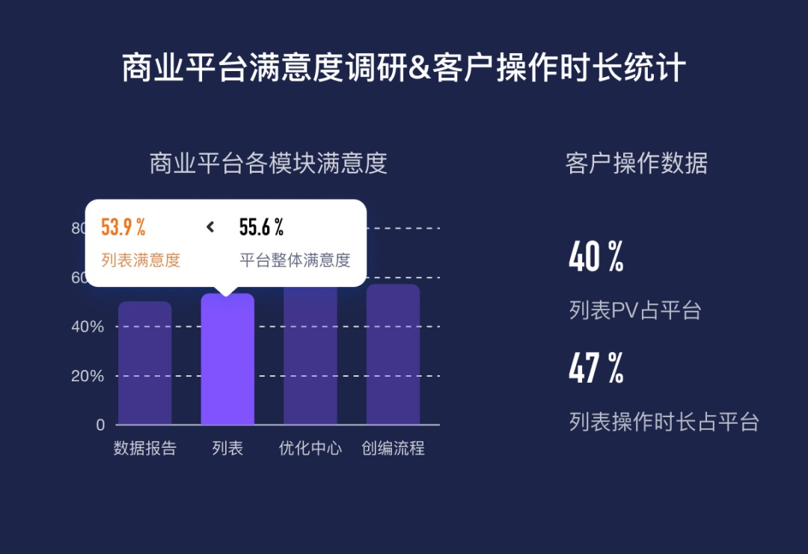
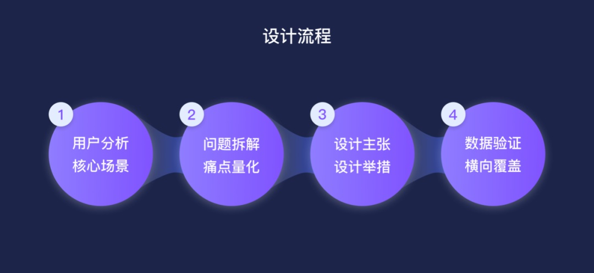
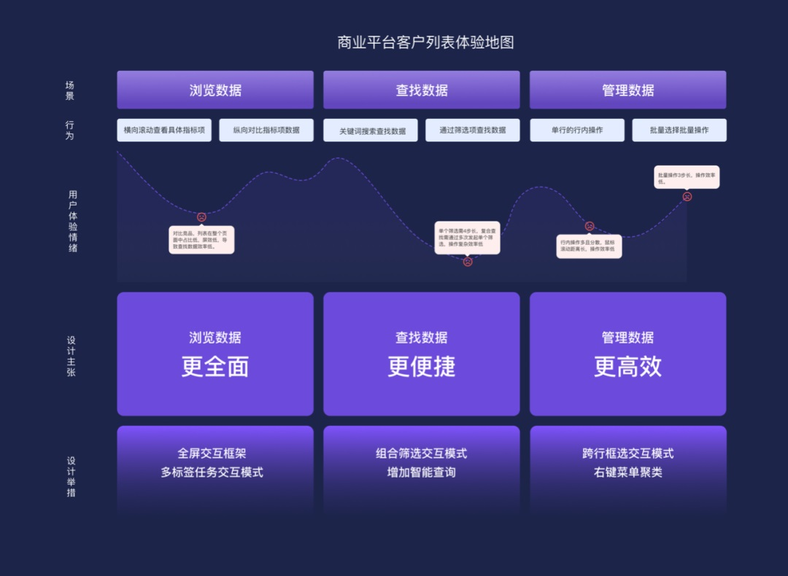
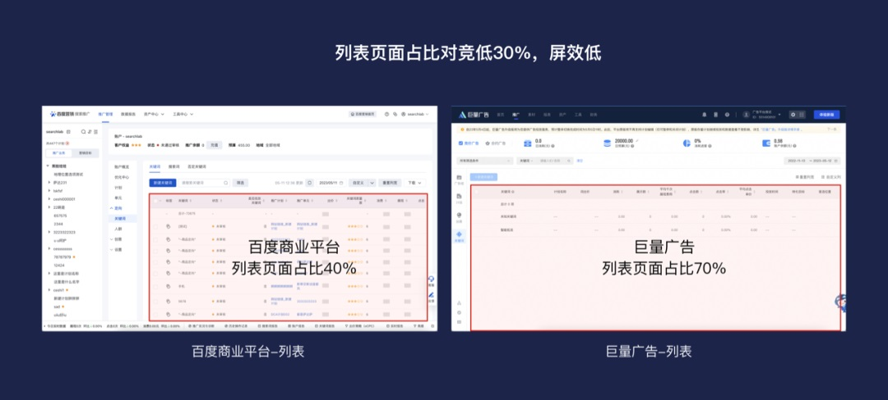
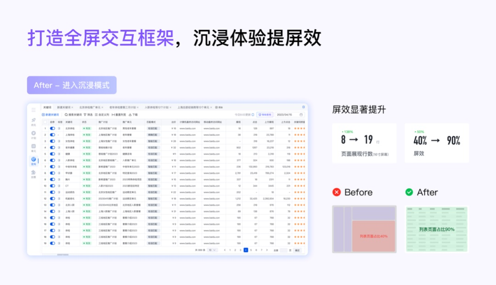
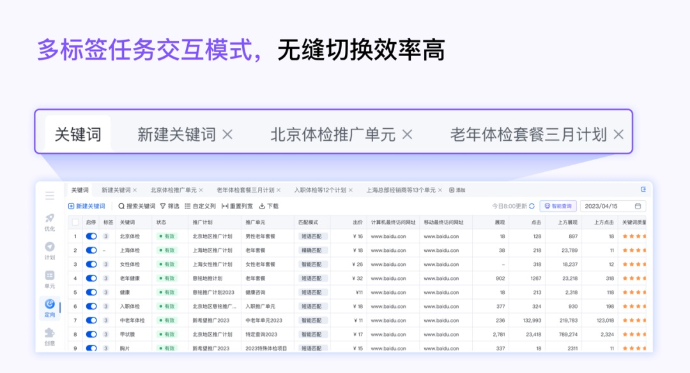
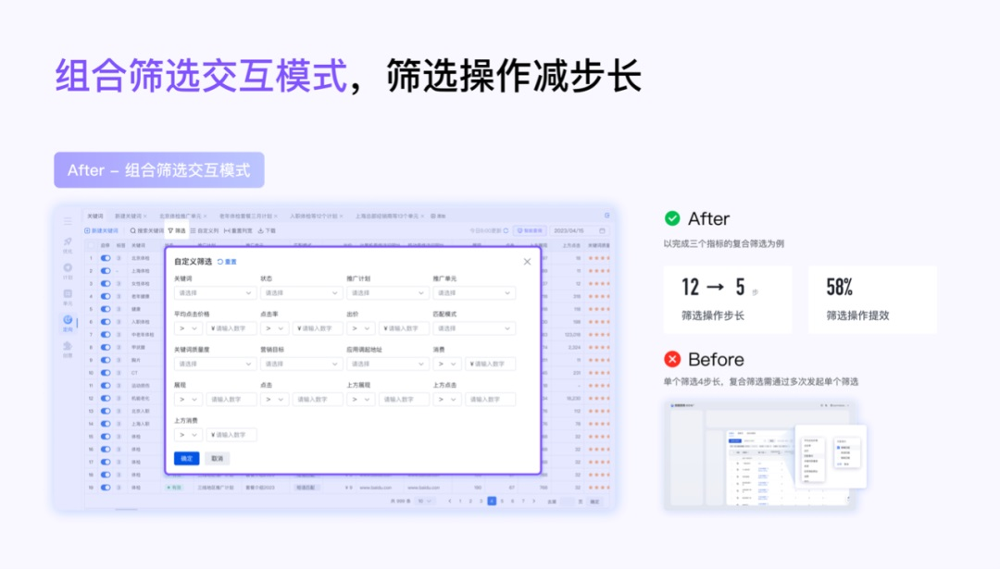
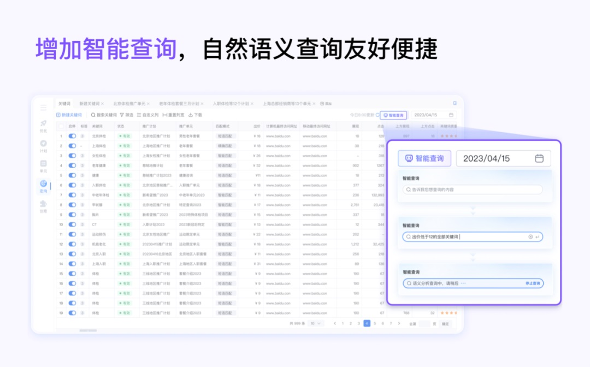
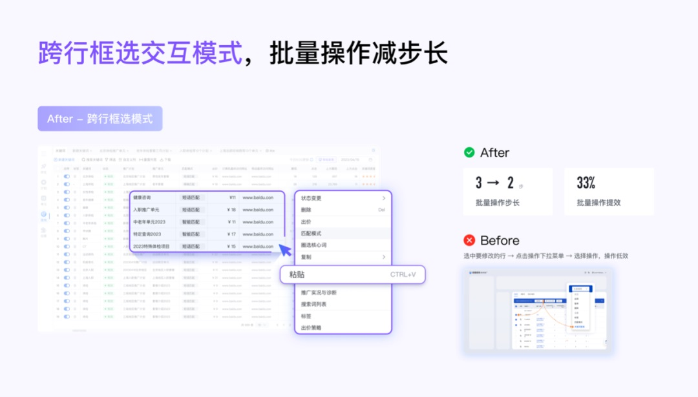
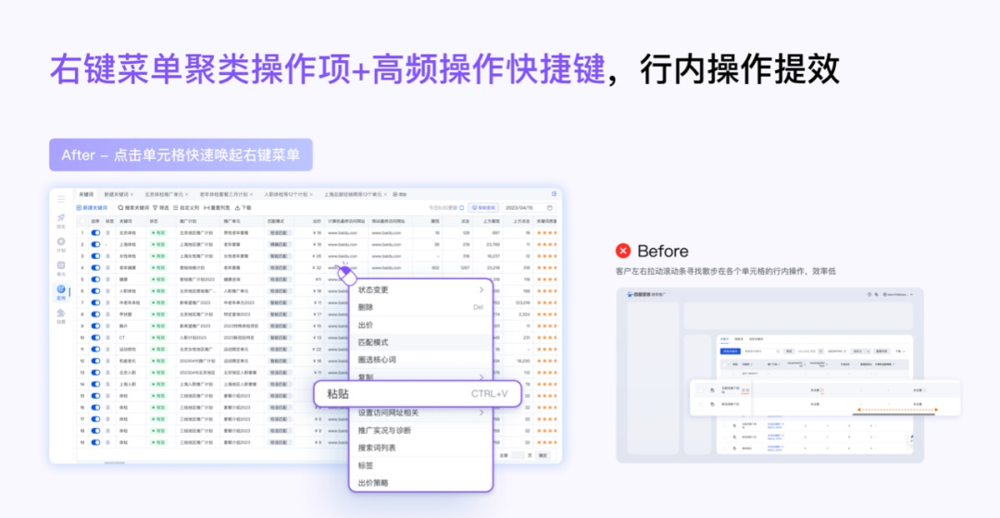

# 大厂B端实战！提效90%的列表是如何设计的？

> 原文链接：https://www.uisdc.com/list-design-3
> 作者/团队：百度MEUX 团队
> 日期：2023/11/28
> 标签：未提供
> 本地归档说明：为尊重原站版权，此文件不逐字转载全文；保留原文链接、图片引用、筛选理由和关键内容线索，方法沉淀见 ux-method-library。

## 筛选理由

列表提效案例，适合沉淀列表密度、优先级、筛选操作和批量处理方法。

## 关键内容线索

1. 项目背景 智行 App 的“智慧出行”功能，作为一种全新的出行方案查询方式，致力于提供用户全面的出行方案推荐。
2. 列表承载了客户浏览数据、查找数据、管理数据的重要功能，是客户重点使用和关注的区域。
3. 然而据百度商业平台体验监测报告显示，平台列表模块满意度 53.9%，低于平台平均满意度分值（55.6%），不满意归因主要集中在性能卡顿、交互操作效率低两方面。
4. 基于以上两方面的原因，我们从客户视角出发，设定设计目标为列表体验创新升级， 提升列表核心场景操作效率以及客户满意度。
5. 针对「浏览数据」「查找数据」「管理数据」三大核心场景分析量化客户体验痛点，通过打造全屏交互框架、创新设计 4 个交互模式、增加智能查询等举措，给客户带来「更全面」「更便捷」「更高效」的列表使用体验，提升客户满意度，助力业务达成目标。
6. 一、浏览数据 更全面 在百度商业平台中，列表在整个页面中占比仅 40%左右。
7. 同样是广告投放平台的竞品巨量广告其列表页面占比为 70%左右，对竞低 30%，可见我们的列表区域屏效是很低的。
8. 屏效低直接影响到客户浏览效率，以百度商业平台优化师小王浏览推广计划列表的场景为例来说明： 「某个大客户一早就很焦虑的在如流上告诉小王一个在投的广告计划数据表现很差，希望他帮忙查找原因。
9. 小王打开 16 寸的笔记本在推广计划列表中搜索定位到该计划名称，横向扫视了这个计划的所有关键数据指标，心里对数据表现有了数。
10. 这时他想通过纵向对比其它同类表现优异的计划来尝试定位问题进而做出优化。

## 原文图片

