# 大厂实战案例！京东物流AI问答助手体验设计完整复盘

> 原文链接：https://www.uisdc.com/ai-q-a-assistant
> 作者/团队：京东JellyDesign 团队
> 日期：2024/04/16
> 标签：未提供
> 本地归档说明：为尊重原站版权，此文件不逐字转载全文；保留原文链接、图片引用、筛选理由和关键内容线索，方法沉淀见 ux-method-library。

## 筛选理由

京东物流 AI 问答助手复盘，适合沉淀服务型 AI 助手的问题识别、答案组织和信任反馈。

## 关键内容线索

1. AI 在项目中主要有两大作用，一是作为技术支撑，在产品实现功能时借助 AI 技术提供预测数据、推荐数据，从而帮助企业预测/预警风险发生，提前实现调度工作，减少重复劳动，帮助企业实现降本增收。
2. 另一个则是用户通过键盘或者语音输入，对系统发出指令，AI 通过对语言识别去回答用户问题，这类主要用于客服或者知识问答，利用 AI 技术减少人工成本，减少重复劳动力，同时能将知识类文档进行收口，形成企业知识库。
3. 本文主要围绕设计师如何利用 AI 技术赋能物流行业。
4. 2. 当代人机对话的主要形态与特点 AI 智能问答主要通过人机对话实现，其核心本质是自然语言与计算机进行交互，人机对话主要分为 3 种形态：闲聊型、问答型、以及任务型。
5. 物流行业的知识问答更多专业领域问答，偏向于问答型以及任务型，因此对于准确率要求非常高，其次是情感要求。
6. 所以在给出答案时需遵守一个答案原则“宁可无答案、不可有错误答案”，其次在用户问题不清晰时，话术上进行二次引导，方便用户补充信息内容。
7. 二、物流场景下 AI 智能问答的重要性 1. 物流行业的特点 ①业务复杂性： 在物流行业中，B 端业务场景复杂多变，涉及大量的业务操作指导文档。
8. 然而，当前缺乏统一的知识整合与呈现机制，使得用户在获取和使用信息时面临诸多不便，增加了业务操作的难度和成本。
9. ②信息传递会产生缺失： 由于业务属性和特殊需求的多样性，用户遇到疑问时往往依赖于线下一对一或拉群沟通。
10. 这些解答方案多基于个人经验而非专业准确的业务知识，导致问题解答时间长且准确性存在偏差。

## 原文图片

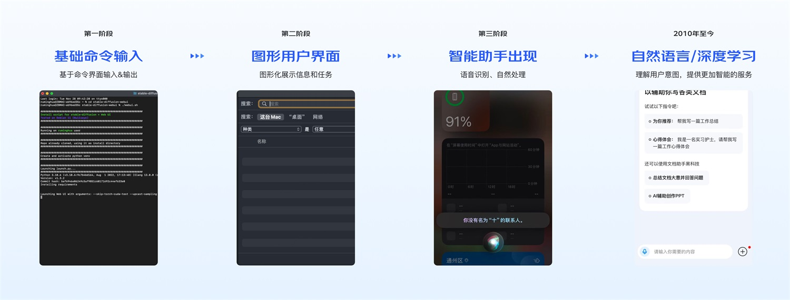

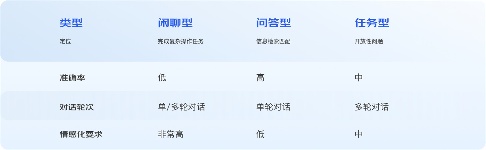

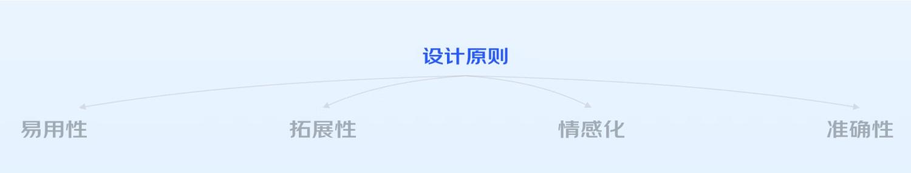

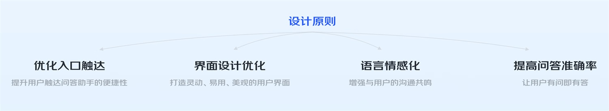

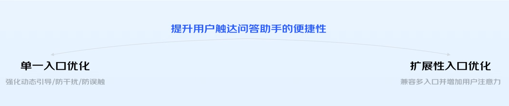

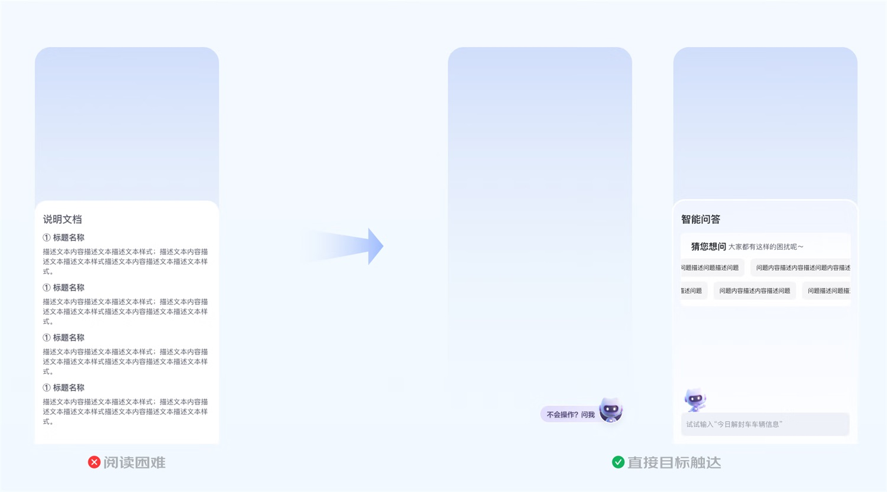

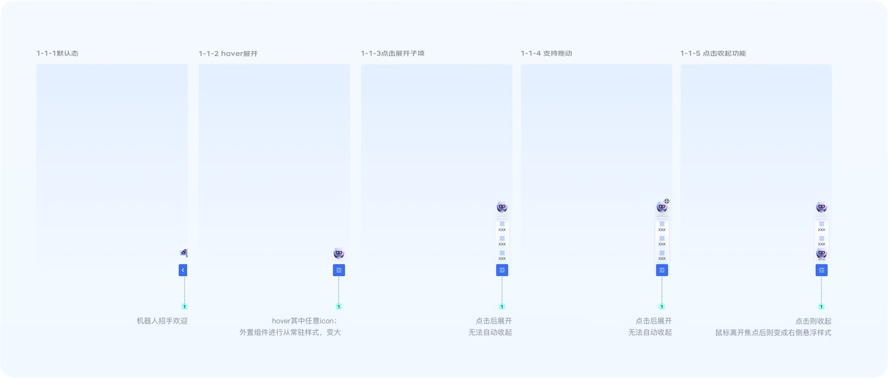

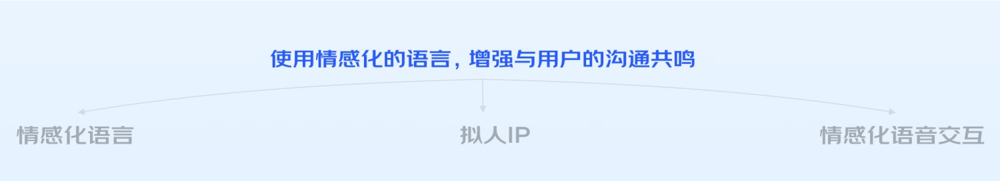

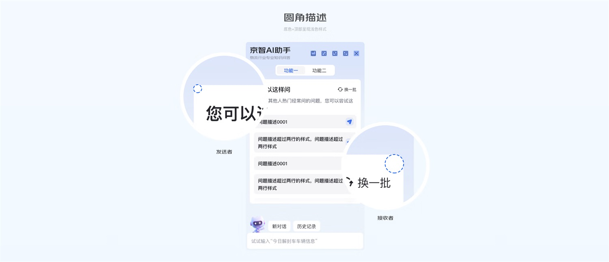

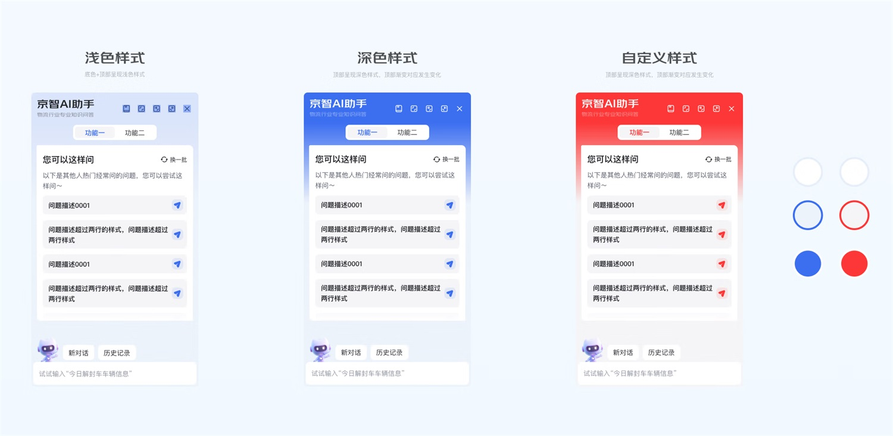

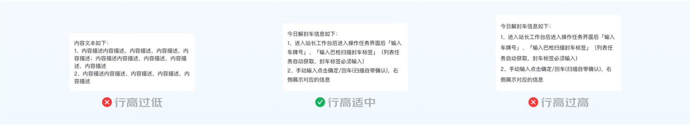

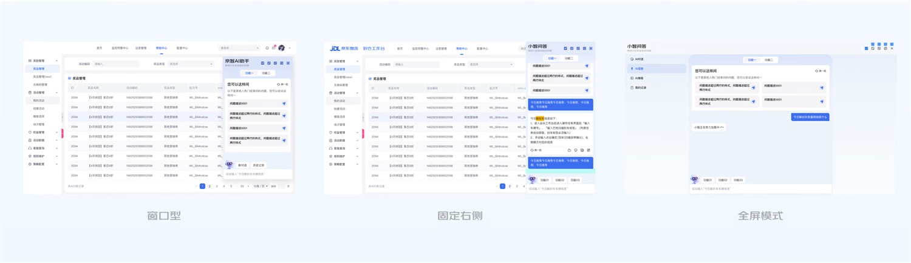

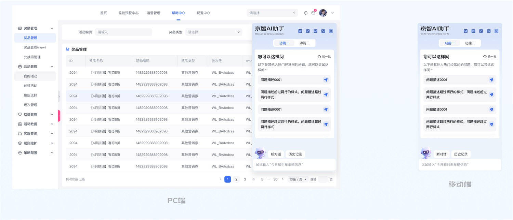

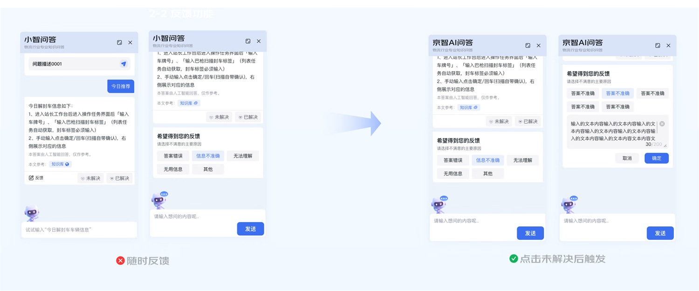

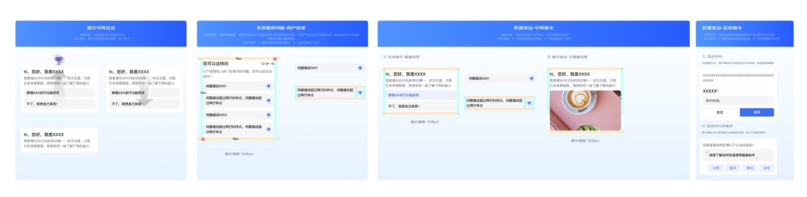

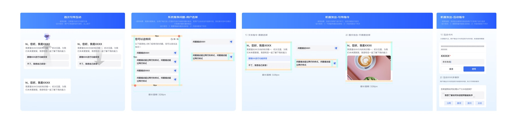

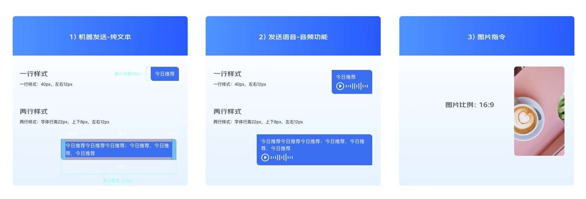

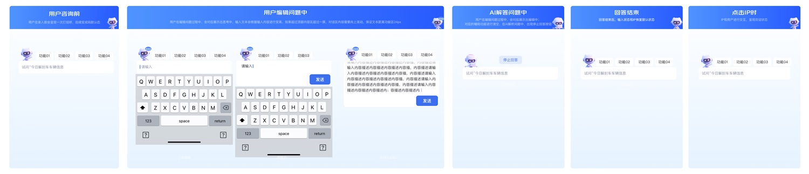

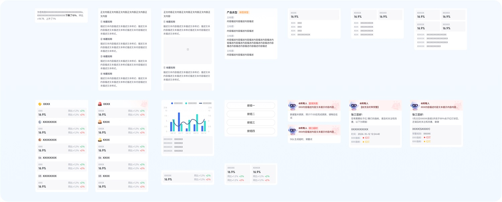

