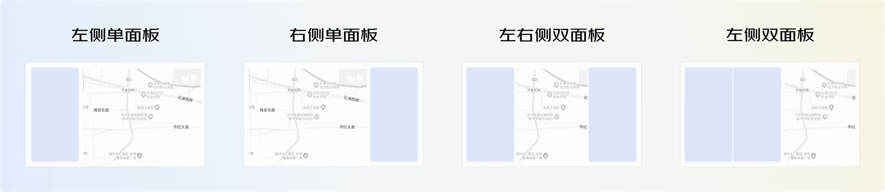
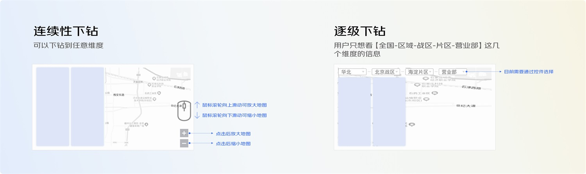
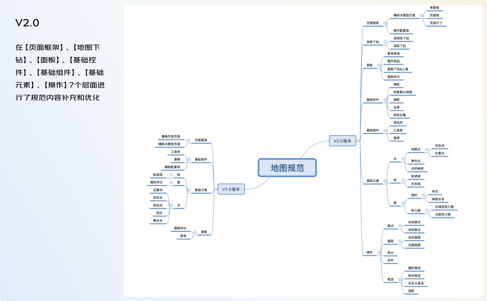
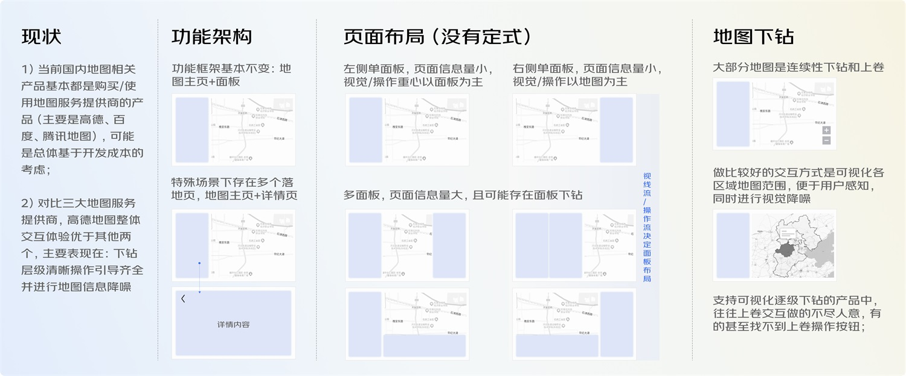
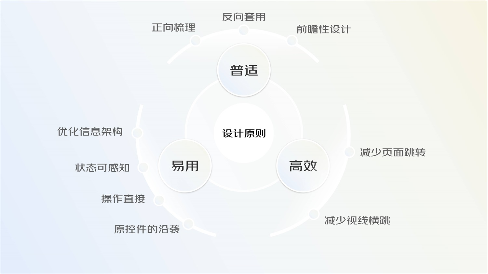
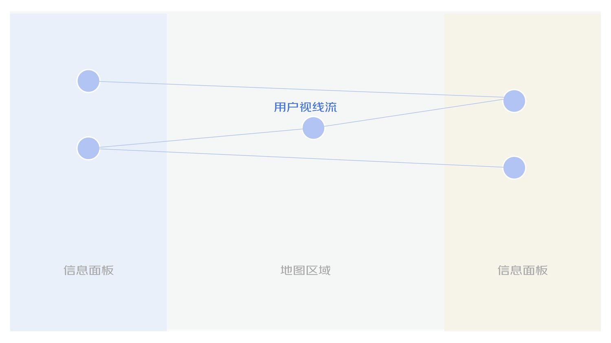
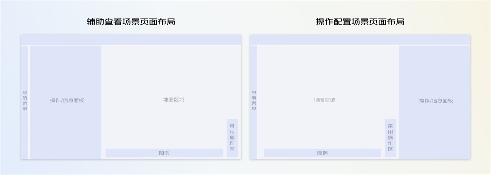
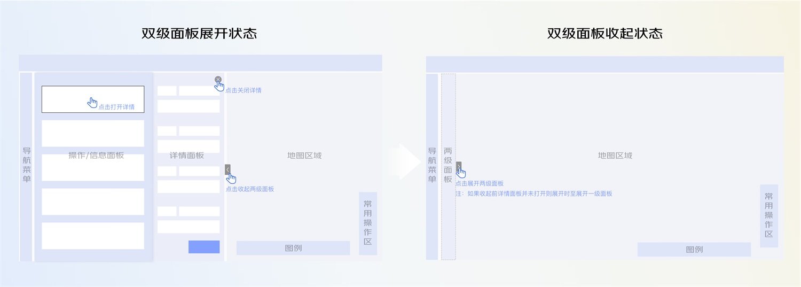
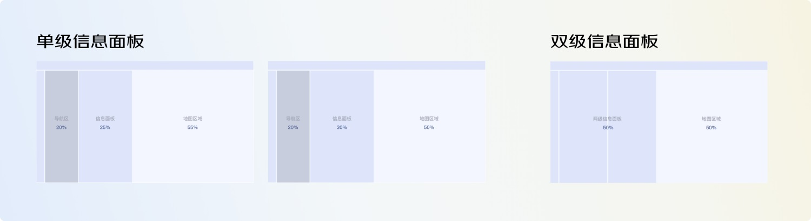
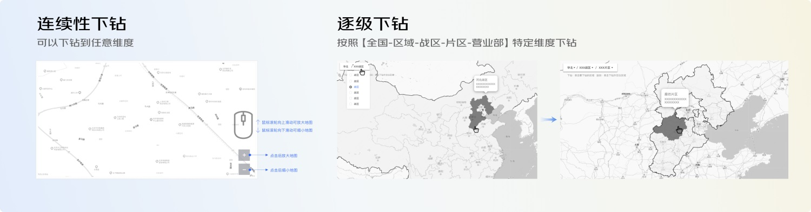

# 大厂案例！PC端地图页面交互设计规范复盘

> 原文链接：https://www.uisdc.com/pc-maps
> 作者/团队：京东JellyDesign 团队
> 日期：2023/07/14
> 标签：未提供
> 本地归档说明：为尊重原站版权，此文件不逐字转载全文；保留原文链接、图片引用、筛选理由和关键内容线索，方法沉淀见 ux-method-library。

## 筛选理由

PC 地图交互规范复盘，适合迁移到地址选择、空间信息和地图类服务页面。

## 关键内容线索

1. 随着物流业务场景的多样变化，便于用户更可视化获取和操作信息的地图页面变得复杂多样，本文基于新衍生出的物流业务场景，对地图交互规范升级进行了分析总结与反思，以期实现设计提效和保证产品一致性。
2. 文案用得好，也会对产品的用户体验提升起到不少帮助。
3. 这意味着地图的设计形式越来越多样化，地图交互规范的 1.0 版本已经无法覆盖大部分用户场景，因此需要结合新衍生出的物流业务场景对地图交互规范进行升级。
4. 本次升级将对产品设计、研发开发和用户使用上都产生积极作用： 产品设计：保障产品内不同模块的设计一致性，同时提高不同设计师间的设计、协作效率 研发开发：通过定义的标准规范，提高流程、组件的复用率，提高整体开发效率 用户使用：让用户能够在产品全局感受到统一且完整的体验，降低使用成本和学习难度 二、洞察与分析 设计规范与产品相似，会有不同的发展阶段，不同阶段下的规范覆盖内容不尽相同。
5. 我们要搭建合理的设计规范，需要观内视外，以原子设计理论为指导原则，通过回溯过往设计内容，定义规范分类，明确内容优先级(覆盖面广、复用率高)，沉淀优化成完整的交互规范，然后再根据规范统一产品体验，进一步优化流程和效率。
6. 1. 现状及业务场景特殊性分析 通过收集整理业务场景下不同页面流程，与先前 1.0 版本进行差异性对比，我们明确了需要增加或优化升级的核心模块： （1）地图页面布局 随着 B 端场景演变的多样化复杂化，我们发现，地图页面布局愈发呈现不定式，目前已经衍生有“左侧面板+地图底图、右侧面板+地图底图、左右两侧双面板+地图底图、左侧双面板+地图底图”等多重布局样式，这影响着地图页面的一致性，对于开发资源来说也是一种浪费。
7. （2）页面要素尺寸 当前用户使用设备屏幕的分辨率不一，小屏用户占比依旧不少，甚至有的用户系统页面默认按照 150%显示，这就要求我们在设计地图页面中关注小屏分辨率，既要保证用户可以看清页面面板中的信息，也要保证地图区域足够大以支撑在地图区域中的交互操作。
8. 因此，对于地图页面要素的尺寸规定具有必要性。
9. （3）地图底图下钻 最常见的地图下钻场景是“连续性下钻”，即通过鼠标滚轮、触控面板手势、放大缩小按钮等方式实现地图底图的连续放大缩小，但此种下钻交互只能覆盖一部分常规业务场景，对于我司的多级业务区域划分“区域-战区-片区-营业部”来说不具有操作便捷性，当前需要配合地址选择器交互来实现到特定某一层级的下钻。
10. （4）基础控件与组件 场景的多样化带来了基础控件与组件的升级，如点元素中重合点新场景以及点与面板联动交互、线元素中飞线关系场景、面元素中的多重热力图等。

## 原文图片

