# 大屏手机单手模式如何设计？我收集了大厂常用的3个方法

> 原文链接：https://www.uisdc.com/large-screen-single-hand-mode
> 作者/团队：土拨鼠
> 日期：2020/05/10
> 标签：未提供
> 本地归档说明：为尊重原站版权，此文件不逐字转载全文；保留原文链接、图片引用、筛选理由和关键内容线索，方法沉淀见 ux-method-library。

## 筛选理由

大屏手机单手模式方法，适合沉淀移动端触达区域和高频操作布局。

## 关键内容线索

1. Steven Hoober 在其 2013 年的手机设备研究报告中指出：49% 的用户单手持机操作，36% 的用户一手拿着手机另一手进行操作，另有 15% 的用户双手持机操作。
2. 必须要承认的是，面对大屏，单手持机不那么方便了。
3. 比如想要点击顶部的发送按钮，尤其是在移动场景中，就不那么方便了。
4. △ iOS_短信发送&网易云音乐 这种情况下，我们可以用手机指环帮助自己稳定地进行操作；也有能人异士自创了一套「反弹琵琶」的技能，通过反弹的方式用另外四只手指自如操作手机。
5. 设计思路 通过分析用户的操作习惯可以划分出难易区域，下图呈现的是左右利手的操作区域难度划分，绿色为最易，红色为最难。
6. 用一篇深度长文，帮你彻底掌握「手势交互」的知识点@Daidai丶呆 ：业内有很多人觉得手势交互没必要拿出来深究，觉得用户使用产品的过程中，自然而然就会去使用拇指，进行手势操作。
7. 相机界面，三星在相机中之前尝试过将一些操作下移，而苹果是在最新一代相机中将顶部的功能下移，需要下滑特定区域才能显现。
8. 第三方应用的处理：比如高德地图，进入界面后，可以选择界面布局方式，其中一种将搜索条下移，上方保留可视区域，还有许多典型的应用也是此种布局，比如滴滴、音乐类 app 等。
9. 方法二：半屏状态（一般用于一些临时状态） iOS 系统在双击 home 键（全面屏手机为下滑导航条）可实现半屏效果，页面内容只显示一半。
10. 并且如果操作之后是跳转到新的页面，则会自动变为全屏，如果还在页面内就依然保持半屏状态，非常全面的考虑。

## 原文图片

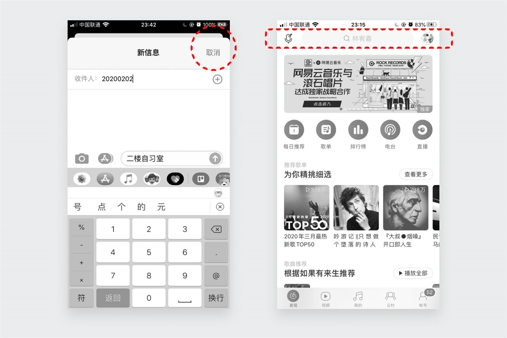

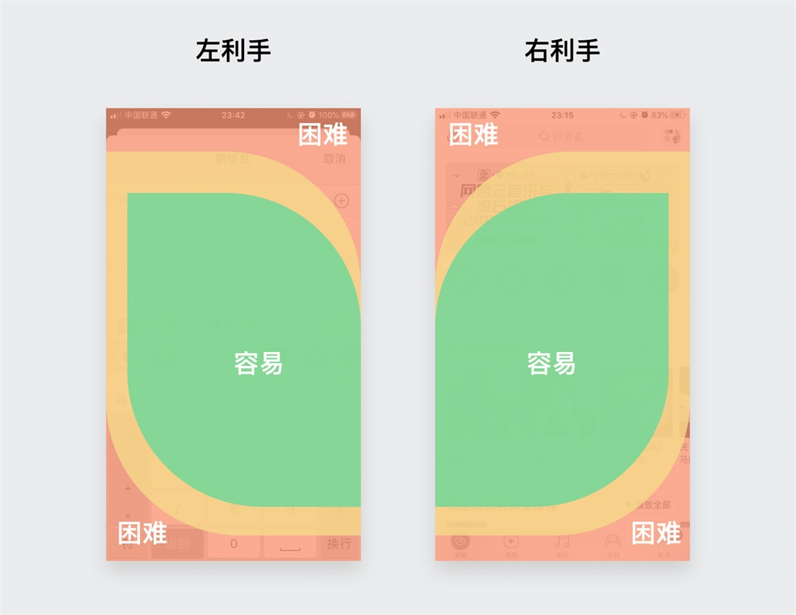

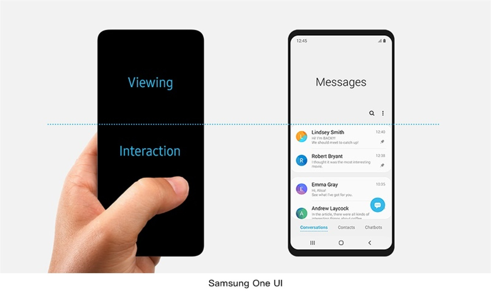

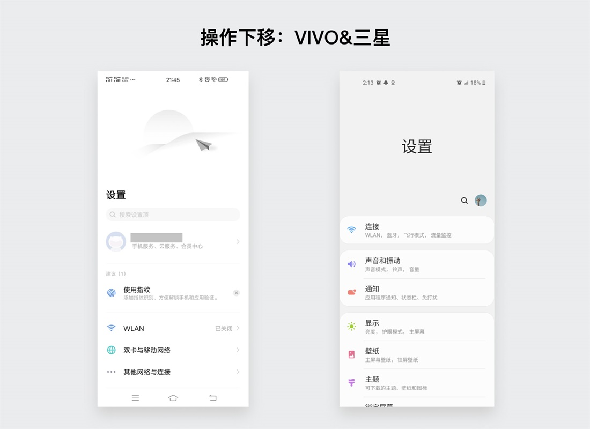

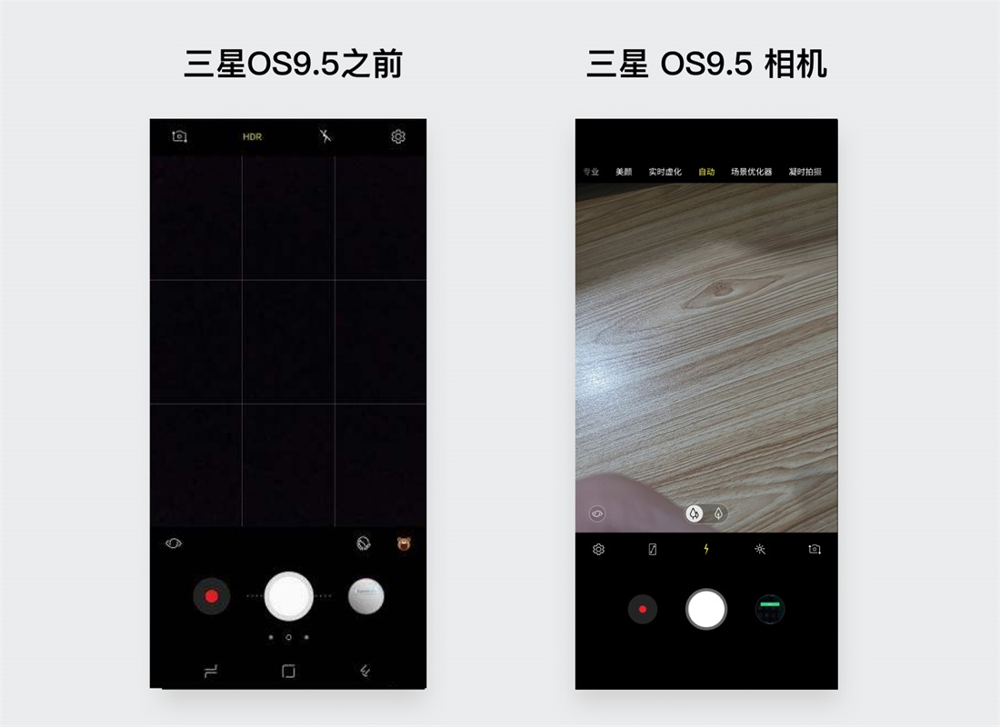

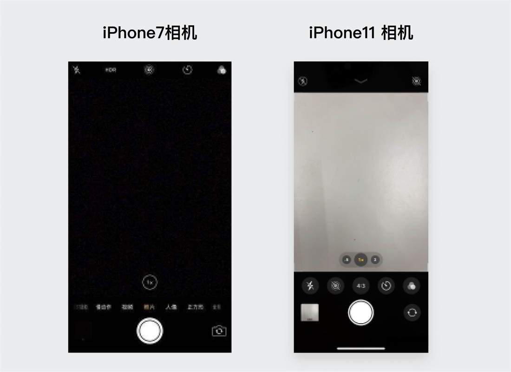

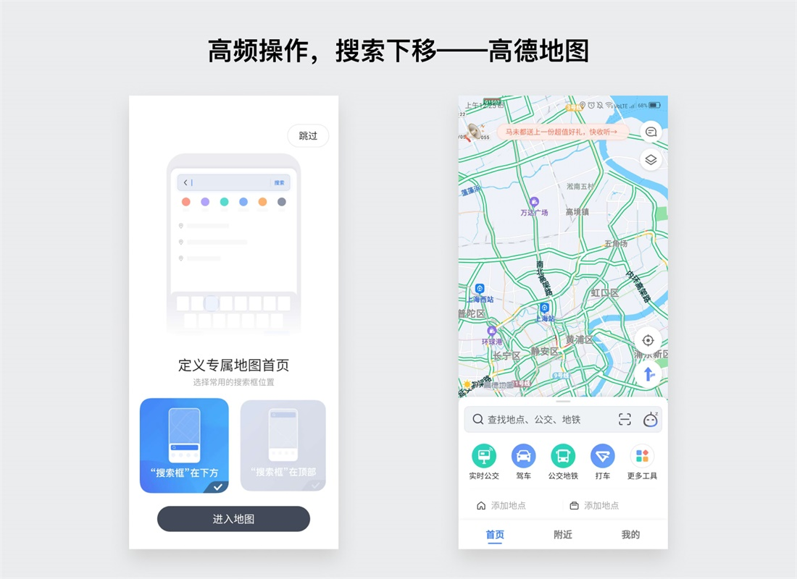

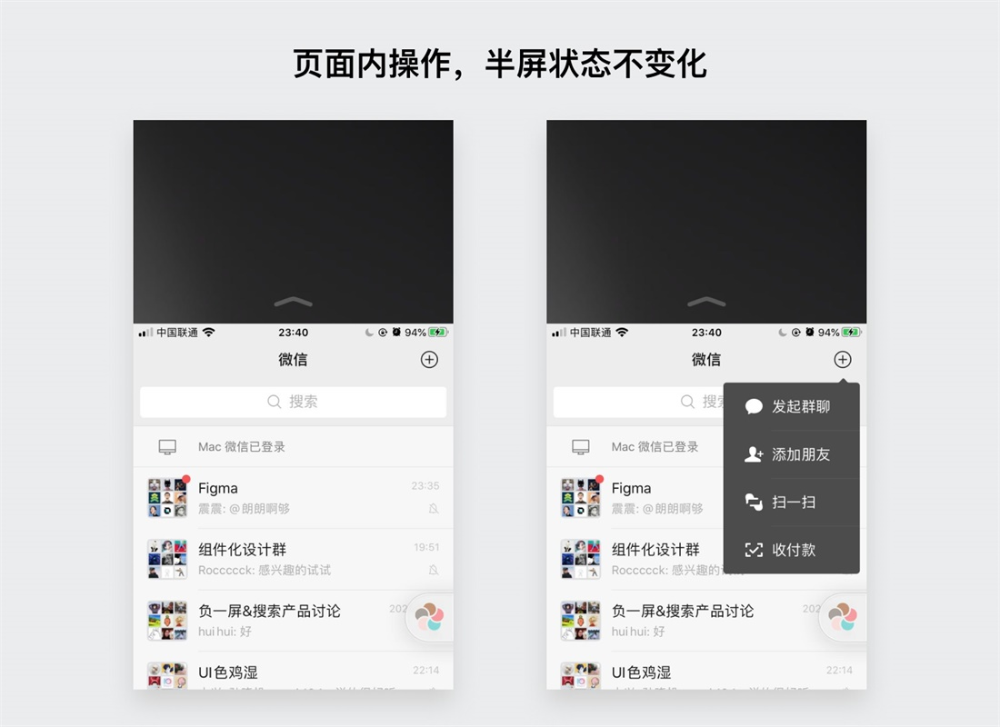

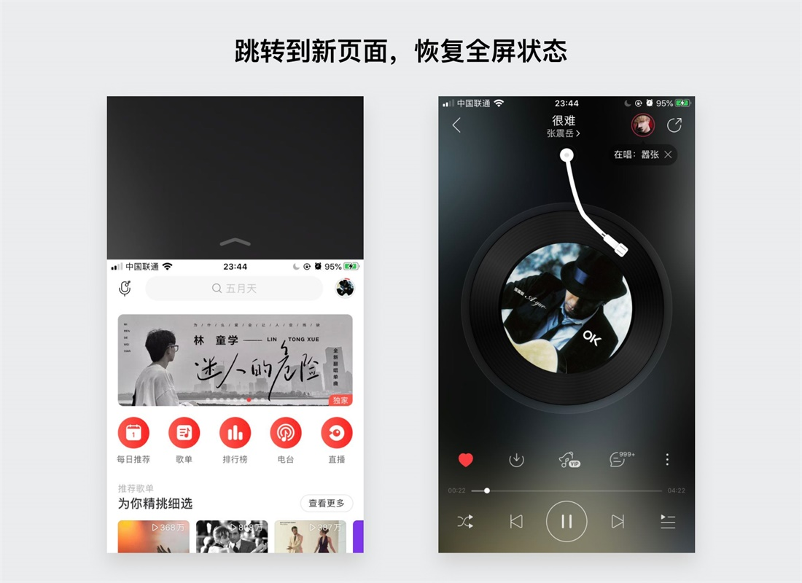

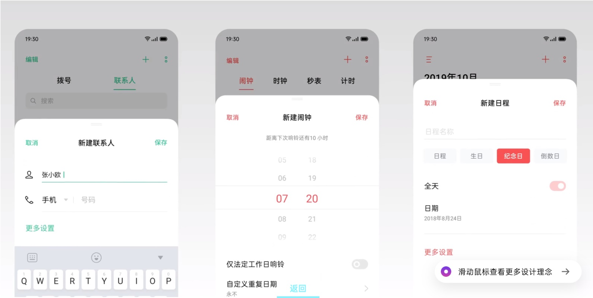

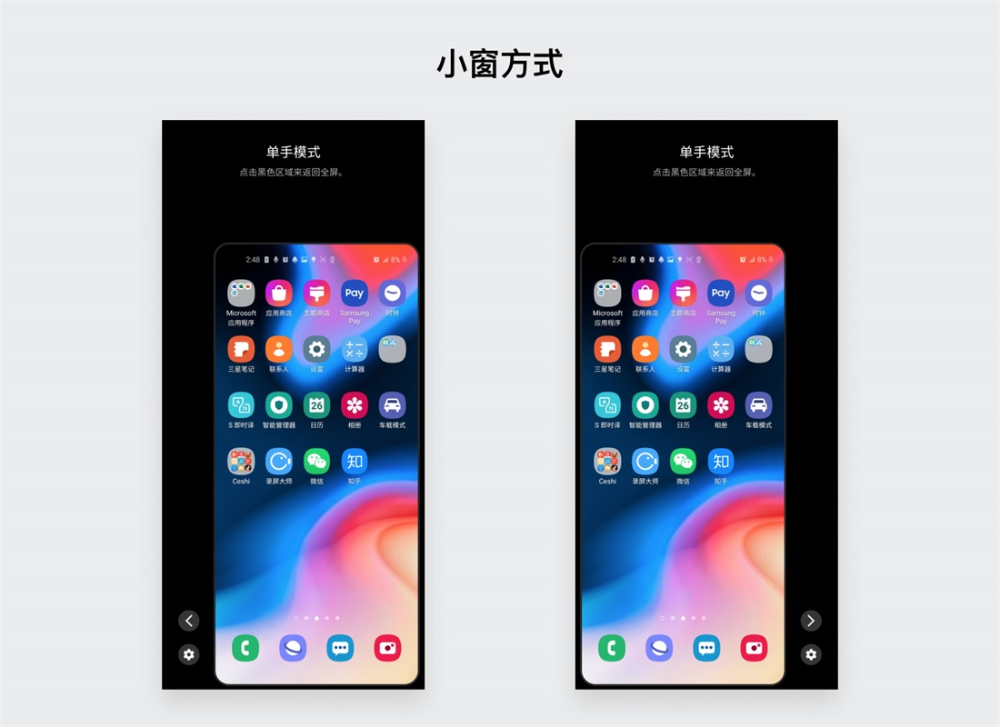

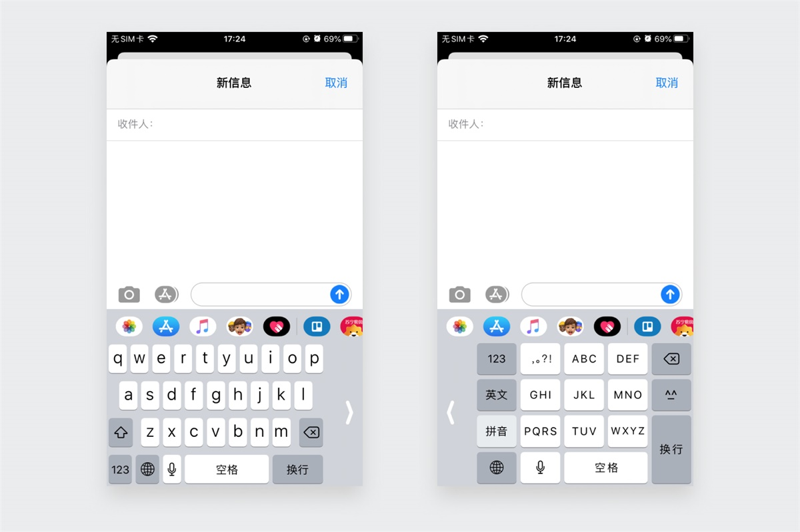

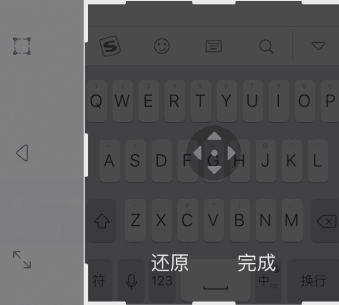

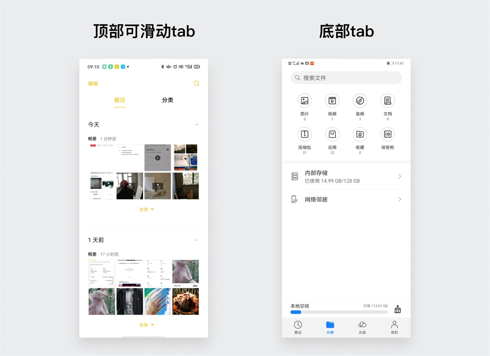

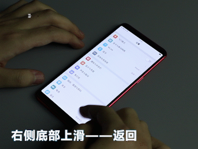

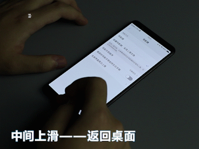

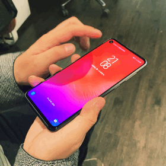

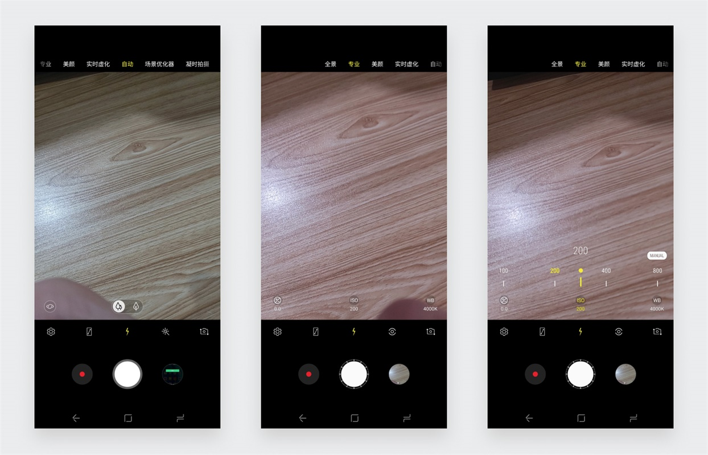

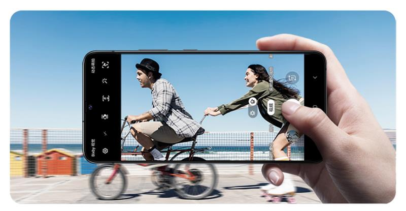

