# 如何选择筛选控件？5000字+3个落地案例详细拆解

> 原文链接：https://www.uisdc.com/filter-control-2
> 作者/团队：未提供
> 日期：2022/08/30
> 标签：未提供
> 本地归档说明：为尊重原站版权，此文件不逐字转载全文；保留原文链接、图片引用、筛选理由和关键内容线索，方法沉淀见 ux-method-library。

## 筛选理由

筛选控件选择拆解，适合沉淀筛选条件、结果反馈和复杂条件组合。

## 关键内容线索

1. 五个方面帮你完整掌握筛选功能设计前言 “少即是多”是经常挂在嘴边的话题，在设计过程中，设计师们都会想尽一切办法去简化交互流程、组件元素及各种设计属性，让用户使用起来更简单。
2. 所以我每次分享的内容不仅仅有执行层的方法和工具，还有做事的底层逻辑和规则。
3. 只有掌握的方法才能举一反三，因为不同事物之间的规则往往有其相似之处。
4. 下面的文章我将从移动端的选择器入手，分享一些解决问题的思路，具体会涉及到在遇到需要使用选择器时如何判断哪种方案更优以及遇到现实阻力时（开发时间不够、研发水平有限等）如何做取舍。
5. 先说明一下，下文的选择器没有包含非常基础的选择器，比如这种 这样的选择器一般用于简单的时间选择，使用最广泛也最基础，对于这类选择器的应用都比较熟悉，我就不做赘述了。
6. 分析思路 我们遇到需要使用筛选功能的地方，首先应该先思考，而不是即刻动手，磨刀不误砍柴工，先思考再动手能有效避免后期返工。
7. 我建议从三个方面入手：用户场景、数据量、业务需求。
8. ① 用户场景 使用用户故事模拟用户的使用过程（为什么是模拟？
9. 因为有些时候我们无法就页面的每个功能向用户求证，更多的时候我们会先做一定的用户调研，然后出一个 demo 后再做用户测试），当我们模拟完成后就能对用户的心理有大概的了解，知道他每一步的想法和操作，这时我们再依靠这个用户心理模型去选择选择器组件。
10. 那么有人可能会说，靠自己想象的用户心理模型能符合真实的用户心理吗？

## 原文图片

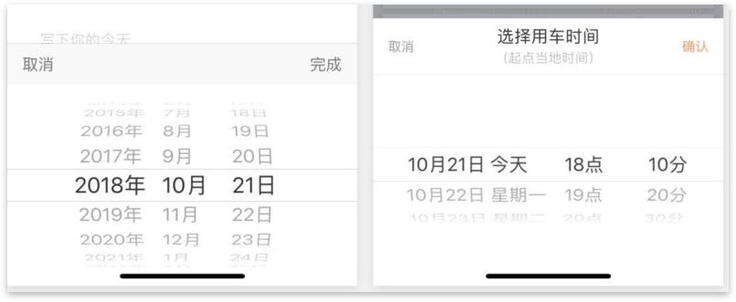

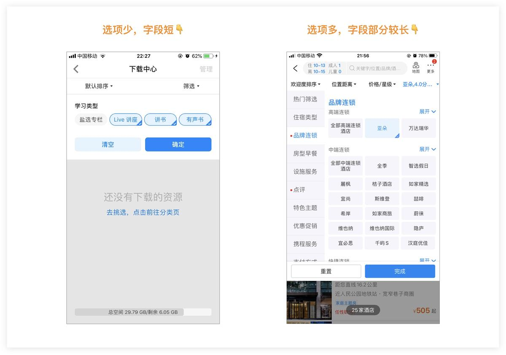

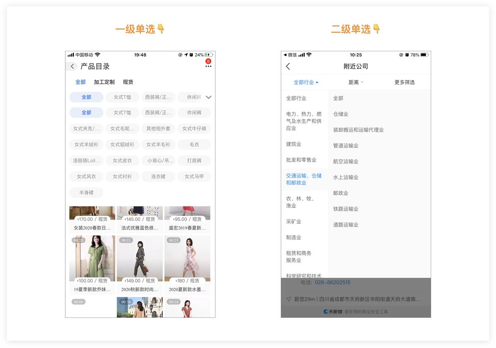

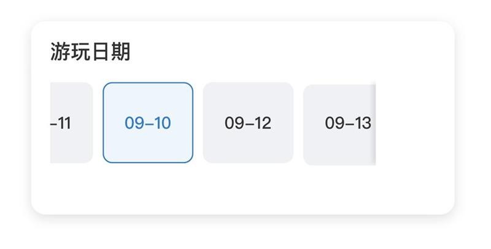

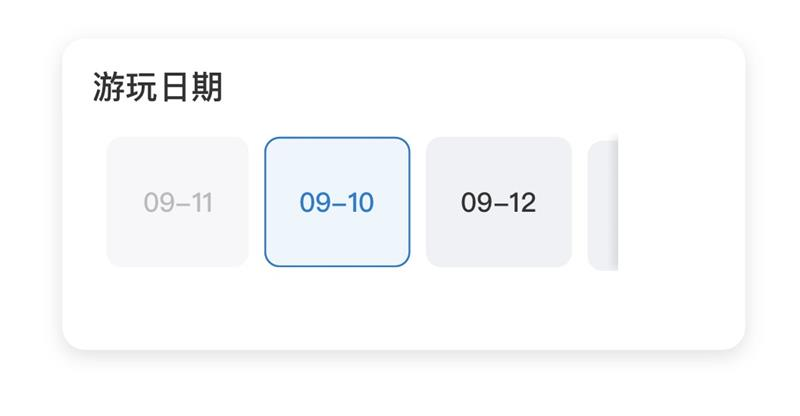

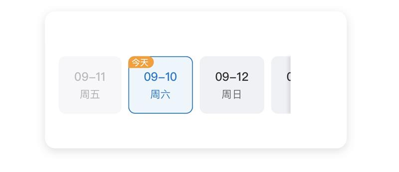

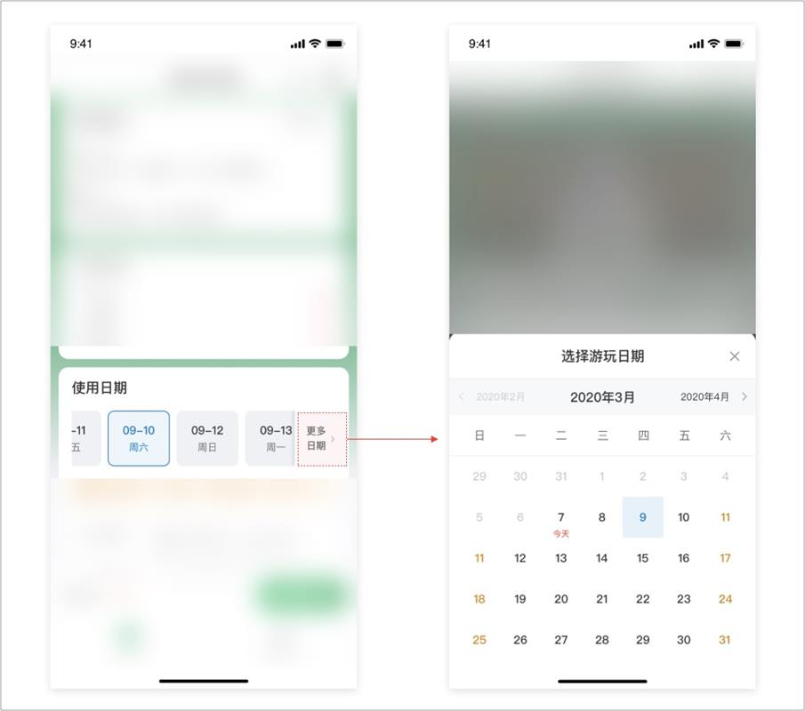

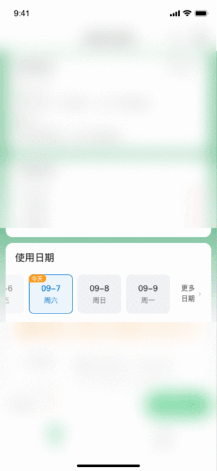

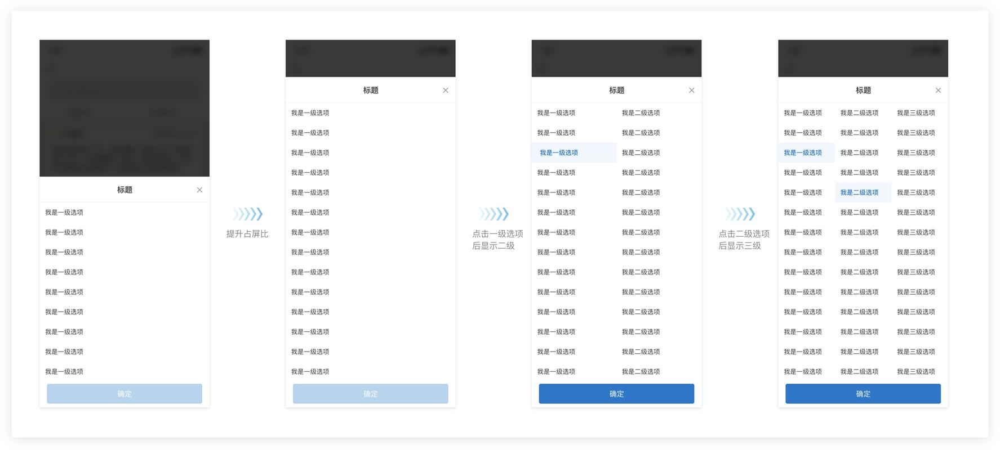

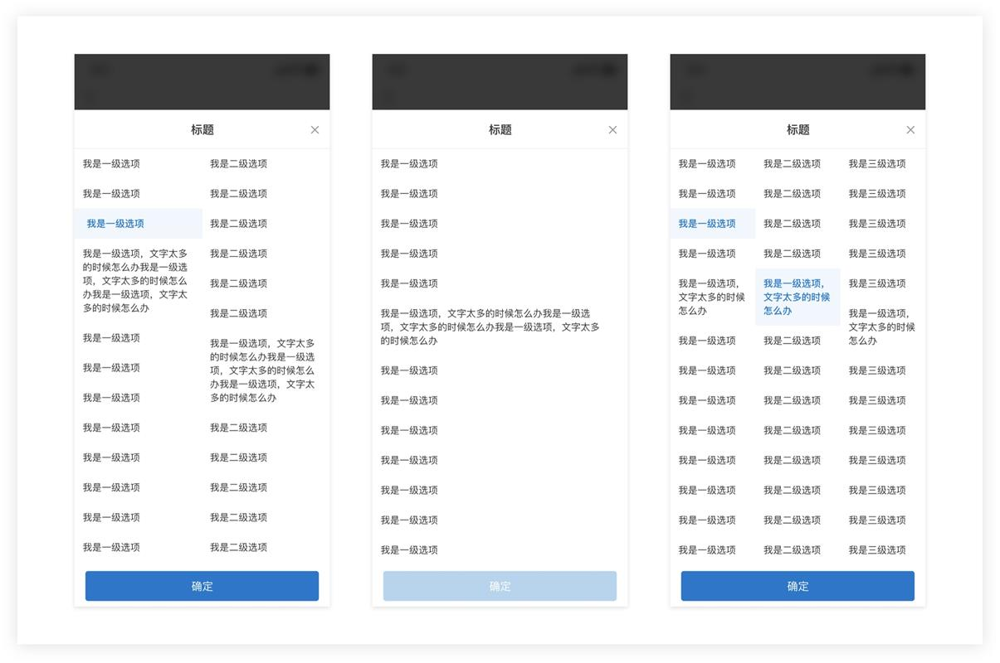

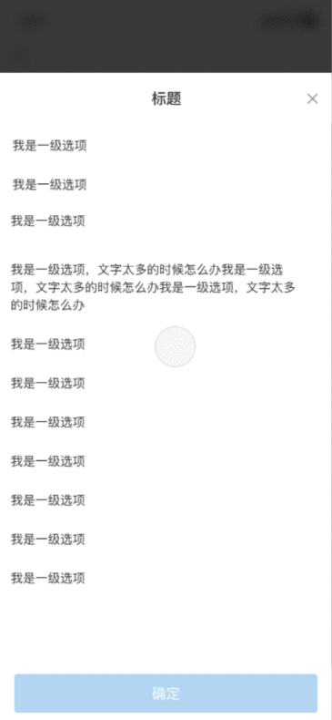

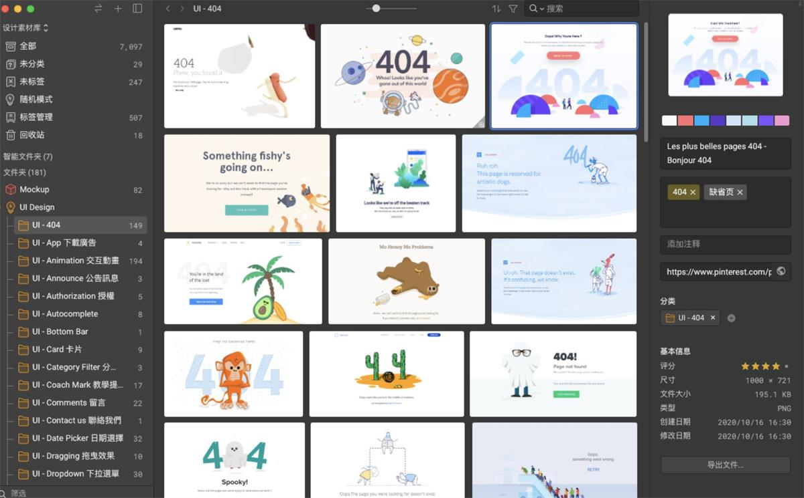

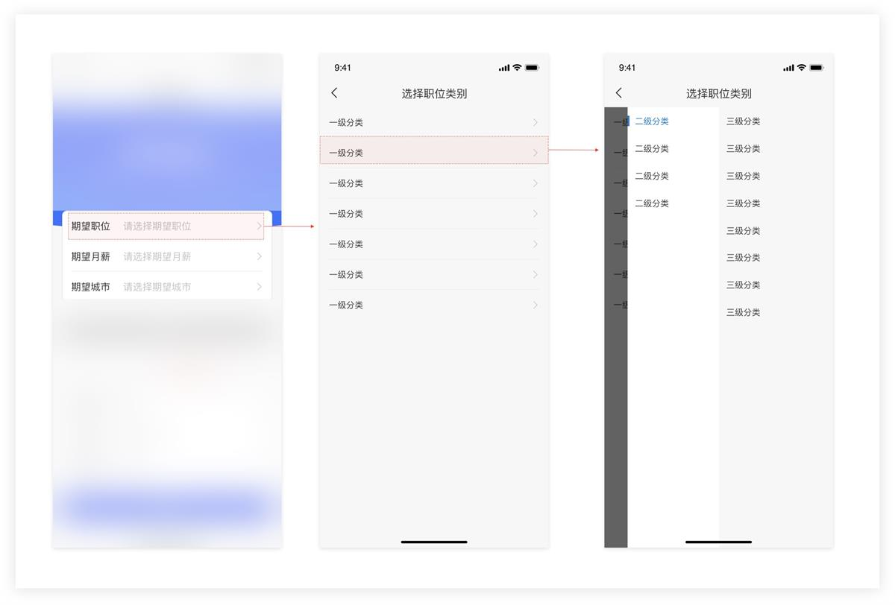

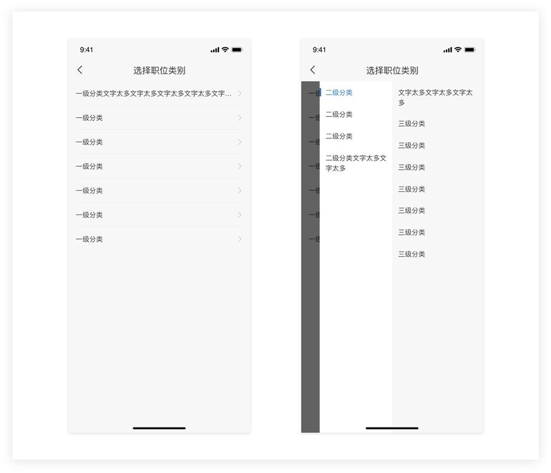

