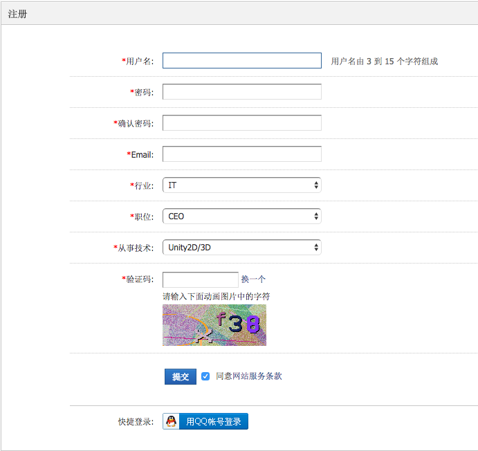
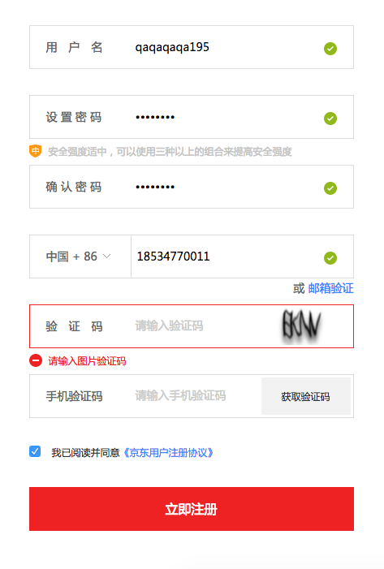
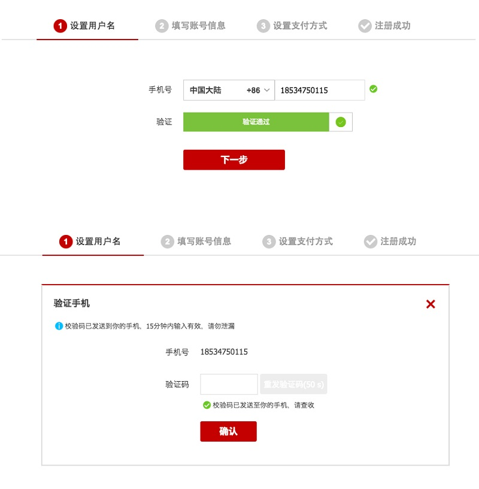
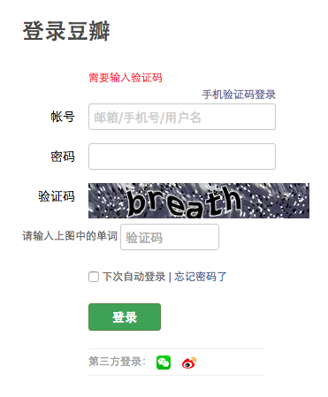

# 案例实战！验证码的应用场景和交互流程超全面总结

> 原文链接：https://www.uisdc.com/verification-code-interaction-design
> 作者/团队：程远
> 日期：2016/10/12
> 标签：未提供
> 本地归档说明：为尊重原站版权，此文件不逐字转载全文；保留原文链接、图片引用、筛选理由和关键内容线索，方法沉淀见 ux-method-library。

## 筛选理由

验证码场景和流程总结，适合沉淀安全校验、等待和重试设计。

## 关键内容线索

1. 欢迎关注点融设计中心DDC微信公众号（微信ID：DR_DDC） 在一个产品中，会有多个设计师分工协作，也会由不同的设计师做设计迭代，验证码这个“不起眼”的存在很可能会被忽略，导致它在每个场景的显示逻辑不尽相同。
2. 下面，我们就来聊一聊不同应用场景下的验证码。
3. 网上一查验证码，出来的相关词都是“反人类”，尤其是“反人类”的新高度12306的验证码。
4. △ 图1 12306验证码 验证码的存在如此反用户体验，为什么还是不能缺少的呢？
5. 简而言之，就是为了证明你是个人而不是机器，我们所知的许多网络恶意攻击都是机器恶意刷导致的，为了安全就必须设个门槛将机器拒之门外。
6. 验证码通过人可以识别而机器无法识别这样的逻辑来设计，无论它以什么形式出现，都是个必要的门槛。
7. 大多数网站注册页面选择一页填写完所有信息，一键提交注册完成。
8. 在绑定手机号不在主流程内时，验证码多数情况出现在最后一步填写内容。
9. △ 图2 某游戏开发者论坛注册页 当绑定手机号在注册流程里时，下面一定会跟随短信验证环节。
10. 这个时候图形验证码和短信验证同时存在的设计就有几种情况了。

## 原文图片

