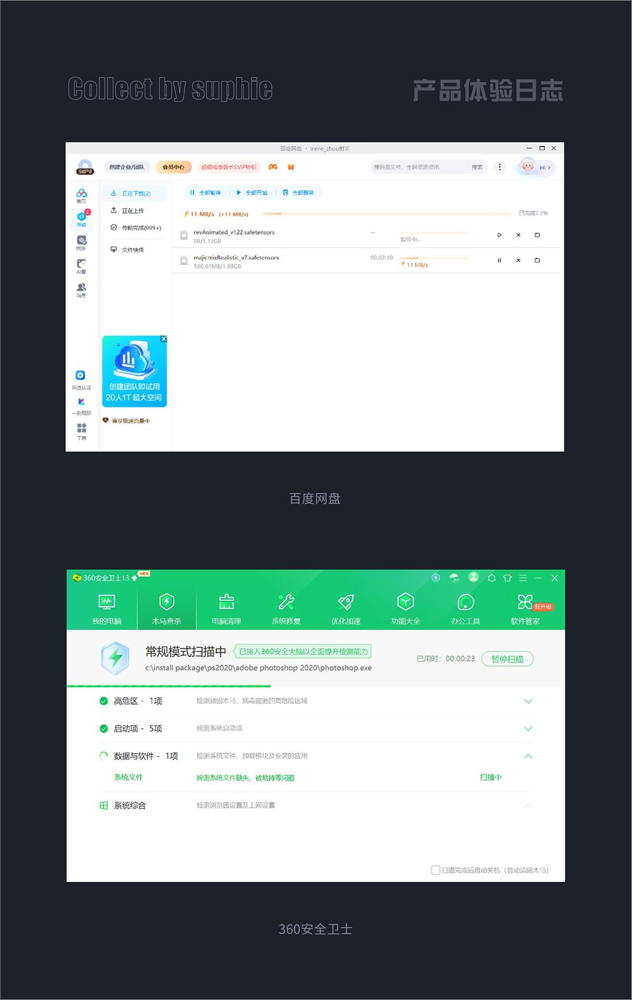
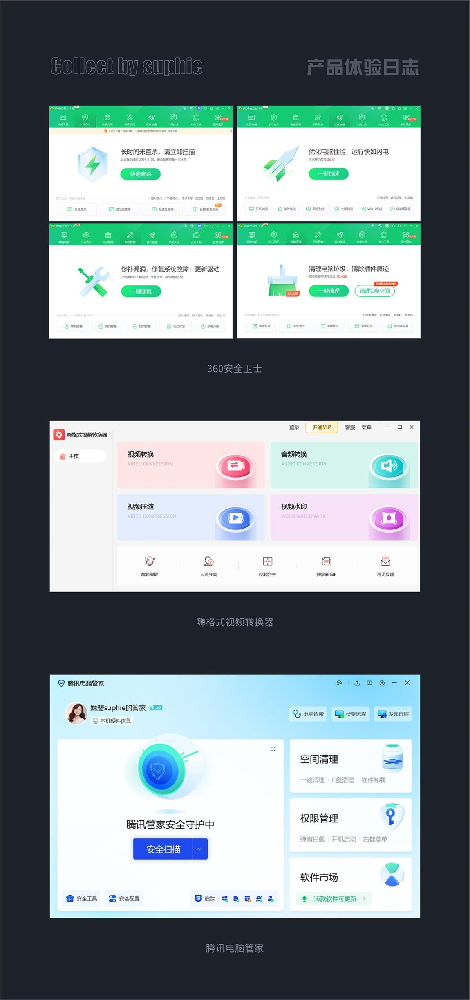
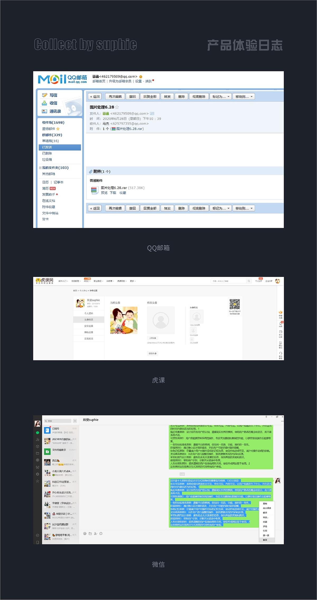
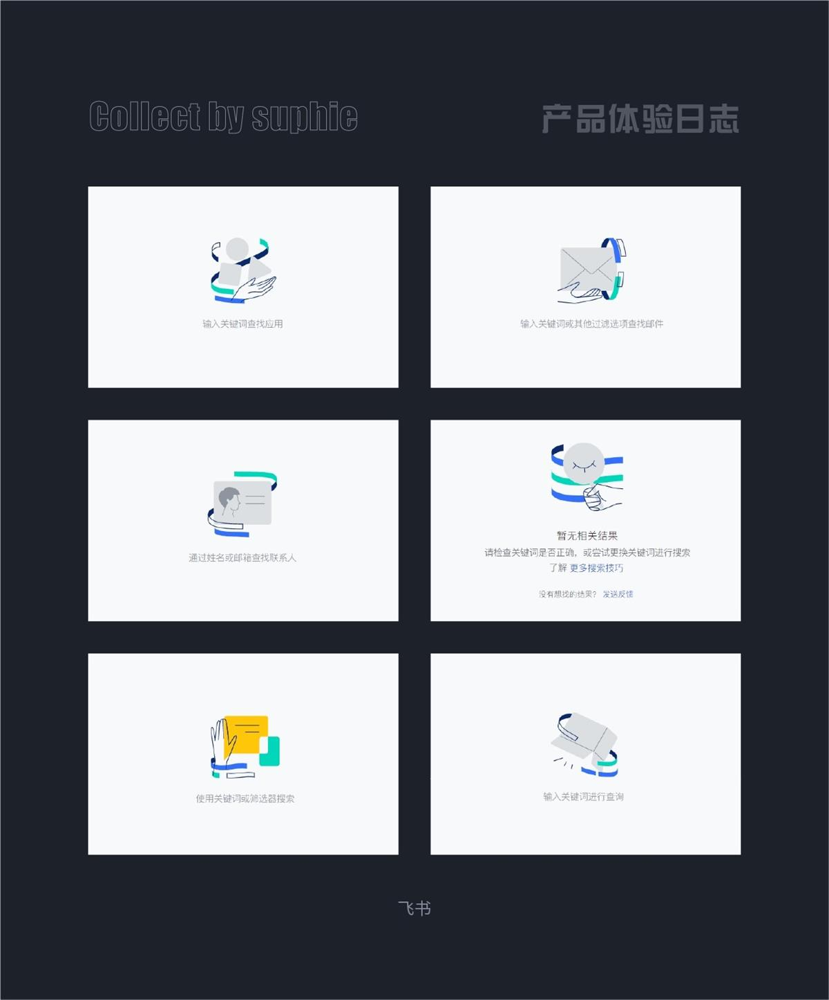
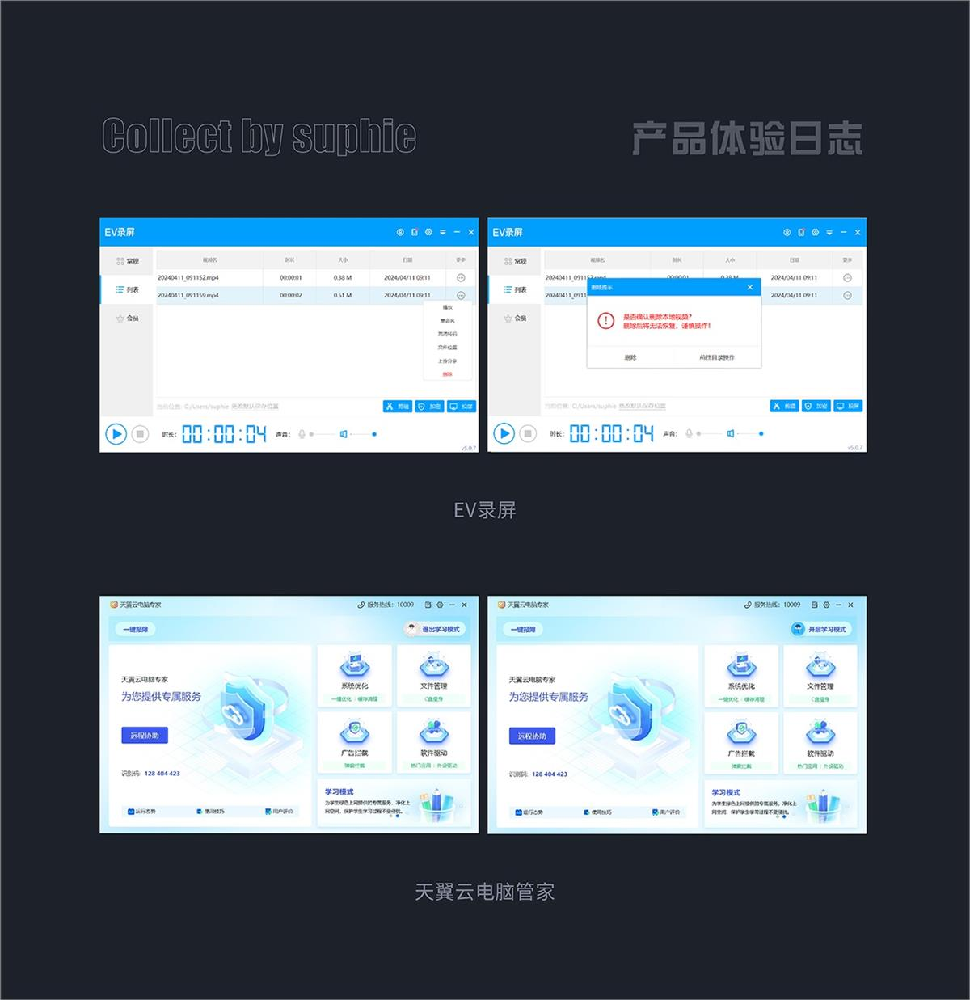
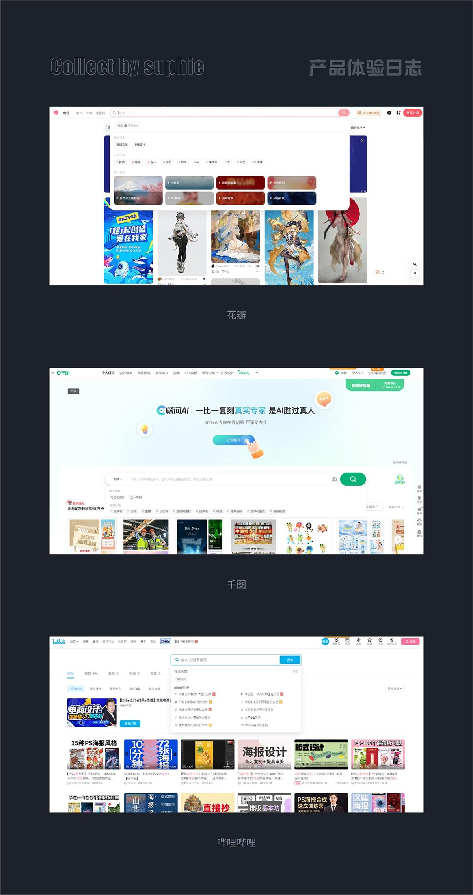
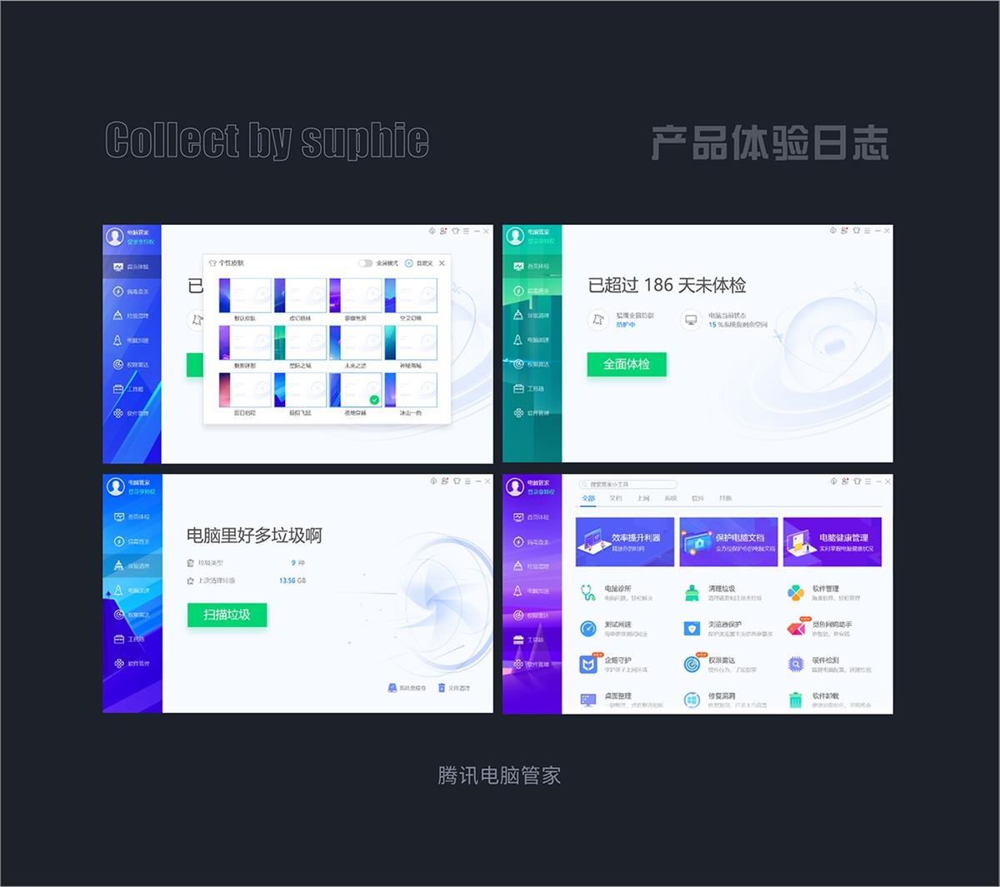
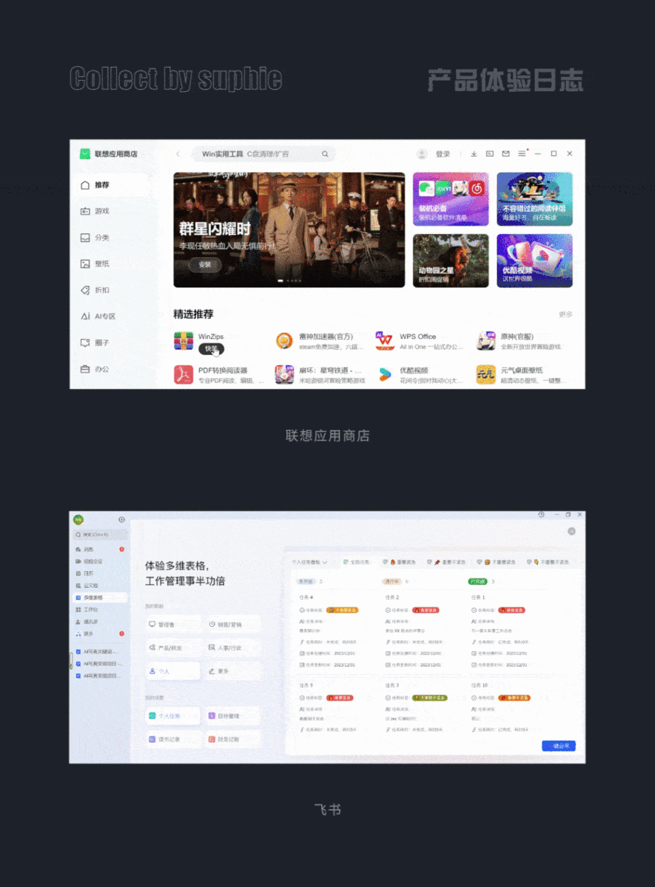
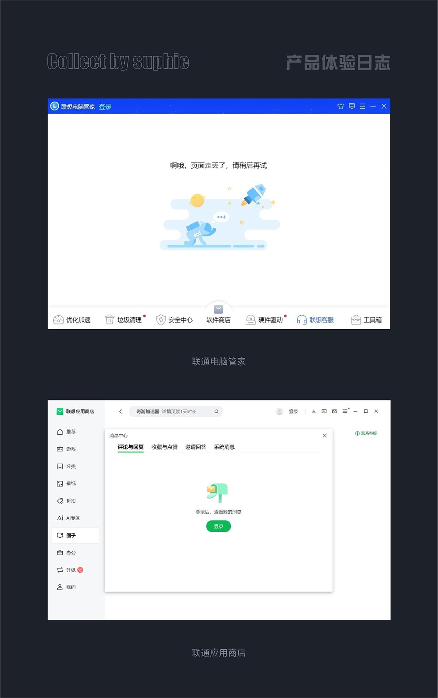
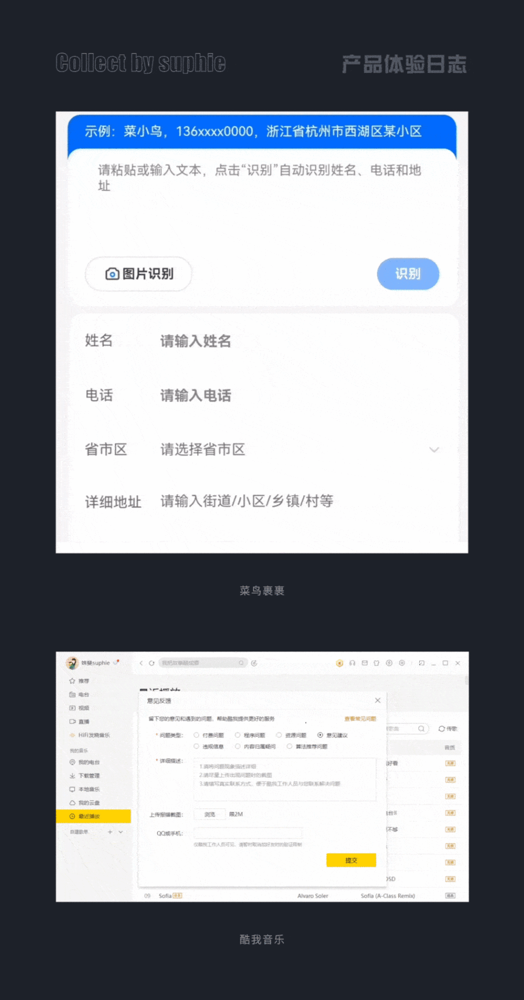

# 用超多案例，帮你掌握10大可用性设计原则

> 原文链接：https://www.uisdc.com/10-design-principles
> 作者/团队：姝斐suphie
> 日期：2024/04/26
> 标签：未提供
> 本地归档说明：为尊重原站版权，此文件不逐字转载全文；保留原文链接、图片引用、筛选理由和关键内容线索，方法沉淀见 ux-method-library。

## 筛选理由

可用性原则案例，适合补充交互方案自查和问题归因方法。

## 关键内容线索

1. 这个理论在我们日常的产品设计中提供了很好的指导意义，下面来聊聊他们分别运用在了日常产品的哪些地方。
2. 帮你深入掌握尼尔森十大可用性原则中国每年有 50 万的设计毕业生，相比之下，能够进入大厂的寥若晨星。
3. 这包括操作的即时响应、进度指示、错误提示等。
4. 良好的反馈机制能够让用户了解操作的结果，增强控制感，减少不确定性和焦虑感。
5. 系统应该在合理的时间、用正确的方式，向用户提示或反馈目前系统在做什么、发生了什么，反馈速度应与用户期待相符。
6. 百度网盘每次在下载文件时，都会提示当前的下载进展，完成了百分之几，当前的一个传输速率是多少，以及还需要多长时间才能下载完成，很好的缓解了用户焦虑的情绪。
7. 360 安全卫士在进行软件杀毒的时候，也会展示出对应的杀毒进程，还需要多长时间才能杀毒完成，给了用户及时的反馈和满满的确定感。
8. 二、隐喻原则 系统要采用用户熟悉的语句、短语、符号来表达意思，要遵循真实世界的认知、习惯，让信息的呈现更加自然，易于辨识和接受，减少用户的学习曲线。
9. 在人机交互设计中，程序的沟通和表达、功能的呈现，都要用最自然的、用户容易理解的方式，避免采用计算机程序语言的表达方式。
10. 设计时要采用符合真实世界认知的方式，让用户通过联想、类比等方法轻松地理解程序想表达的含义；隐喻可以是视觉的，也可以是操作的，它能帮助用户通过已知的事物来理解新的概念或功能。

## 原文图片

