# 用超多经典游戏，帮你掌握3个引导设计方法

> 原文链接：https://www.uisdc.com/guided-design-method
> 作者/团队：未提供
> 日期：2023/07/31
> 标签：未提供
> 本地归档说明：为尊重原站版权，此文件不逐字转载全文；保留原文链接、图片引用、筛选理由和关键内容线索，方法沉淀见 ux-method-library。

## 筛选理由

引导设计方法，适合沉淀新手引导、渐进披露和任务型引导。

## 关键内容线索

1. 为了让玩家走向正确的方向，作者会在游戏中加入很多的引导元素，其中有的直白如画面上常亮的 UI 指引，有的却能隐藏在流程中，让你发觉不到它的存在，两种风格各有优劣，本文章会通过一些经典案例浅析游戏设计中隐性引导的部分设计方法，探索游戏设计师是如何让你主观地选择出“正确答案”。
2. 前段时间负责一个运营活动的改版工作，该活动的设定是通过设置目标奖励，提升用户的购买力。
3. WORLD 1-1 最经典的游戏关卡之一：任天堂于 1985 年在红白机平台推出的平台游戏《超级马力欧兄弟》的首个关卡，WORLD 1-1。
4. 玩家在没有任何文字提示的情况下进入关卡，映入眼帘的是画面左侧的大叔角色，与右侧广阔的天空、砖块与水管等丰富内容。
5. 此时玩家自然会操作角色向右走去，同时也通过直觉学习到了第一个游玩知识：“向右等于前进”。
6. 向右前进的玩家立刻就遇到了游戏中的两大挑战：问号方块与敌人板栗仔。
7. 这时任天堂通过视觉设计，闪烁着金色的问号方块与皱着眉头的板栗仔，迅速给玩家建立起“奖励”与“敌人”的认知。
8. 为了前进，玩家就会选择跳起来躲避板栗仔——而这时跳起大概率会顶到问号方块，让玩家下落踩掉板栗仔，同时引出变大蘑菇。
9. 蘑菇会按一定路线朝马力欧移动，而玩家因砖块布局很难避开，就会吃到蘑菇后强化力量，身高变高。
10. 难以躲开的变大蘑菇 即使因操作没有躲掉板栗仔，玩家也能在几乎没丢进度的情况下，知道了“碰到敌人就会死”，吸取教训再度尝试。

## 原文图片

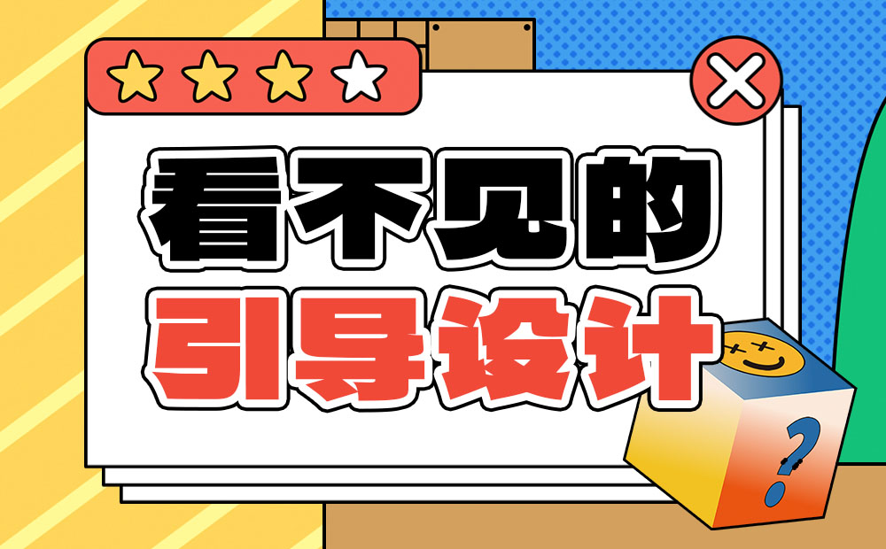

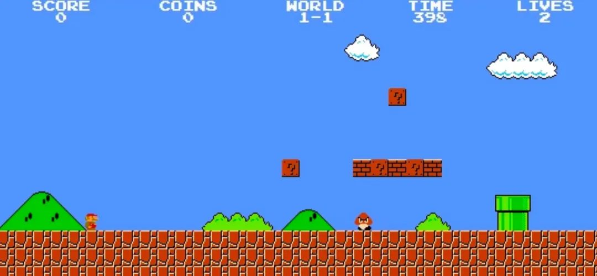

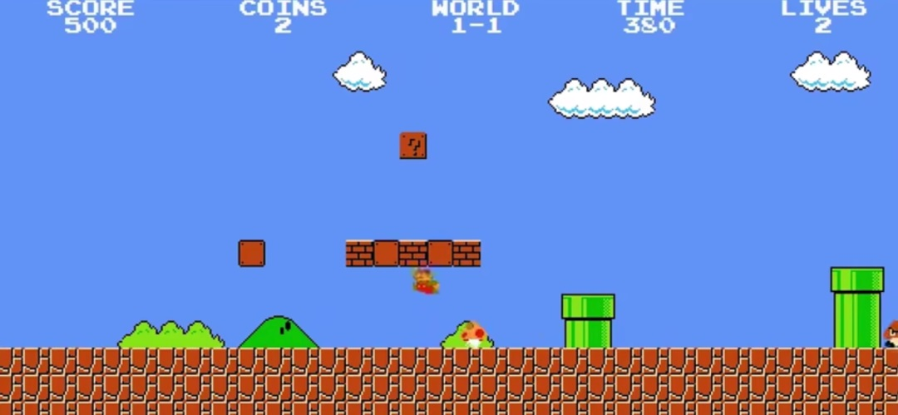

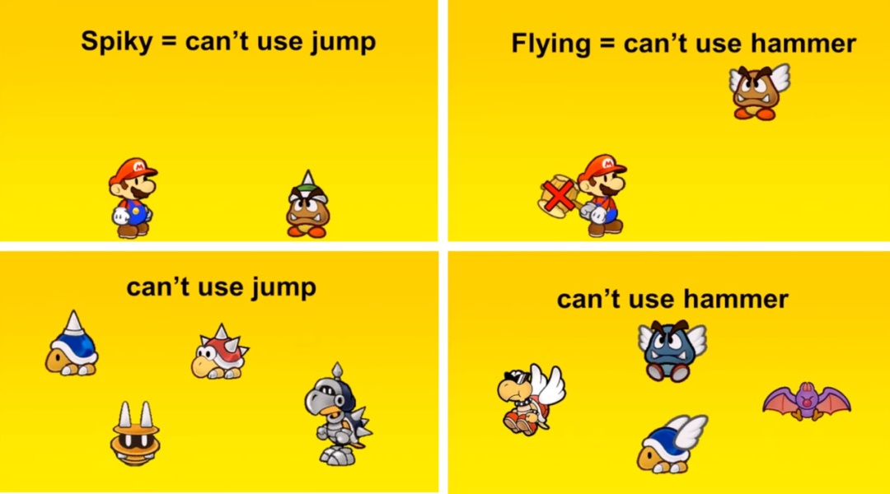

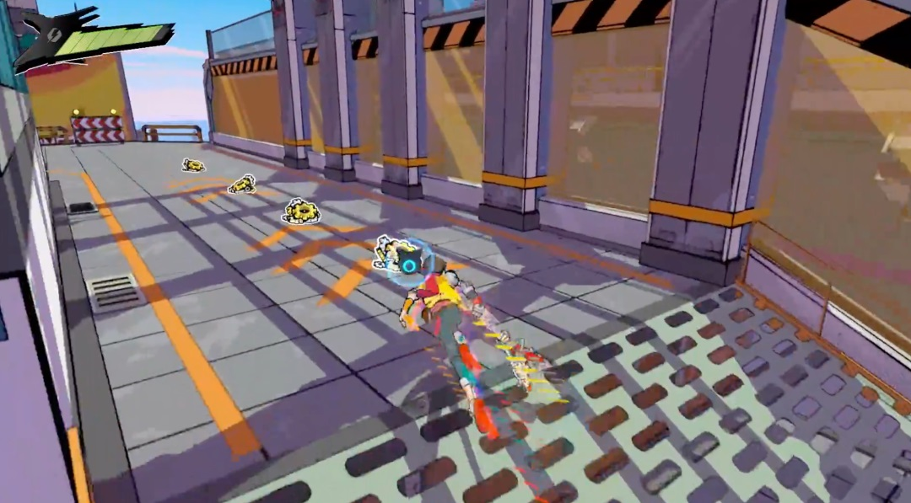

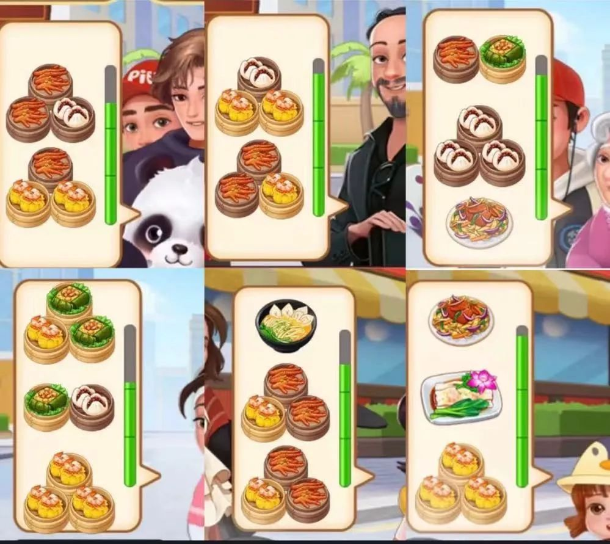

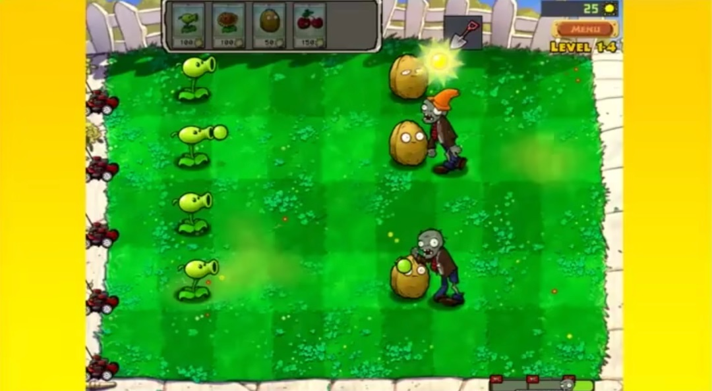

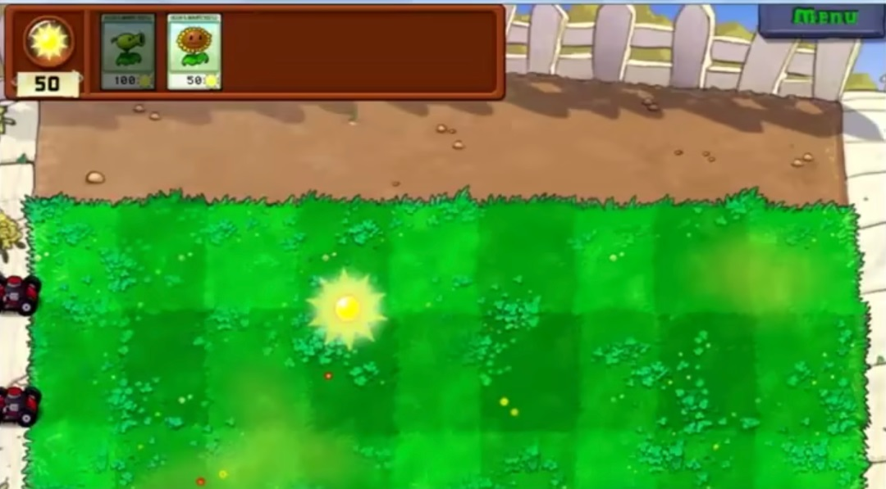

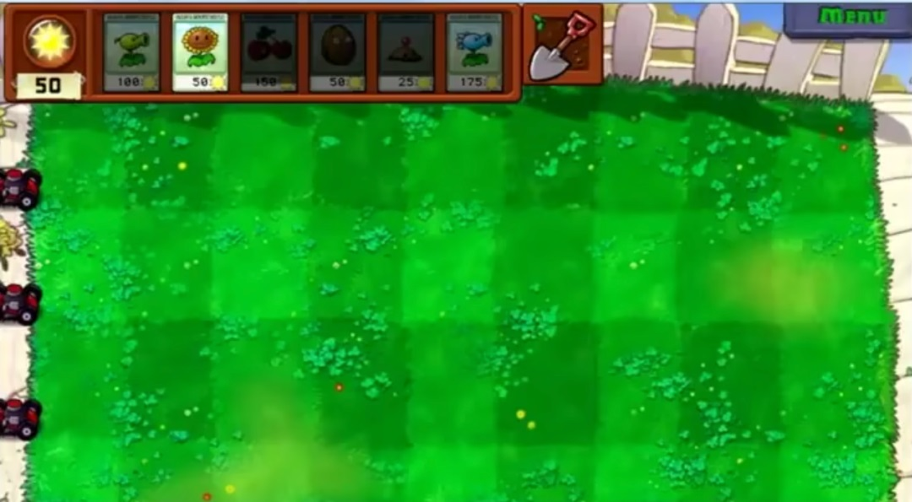

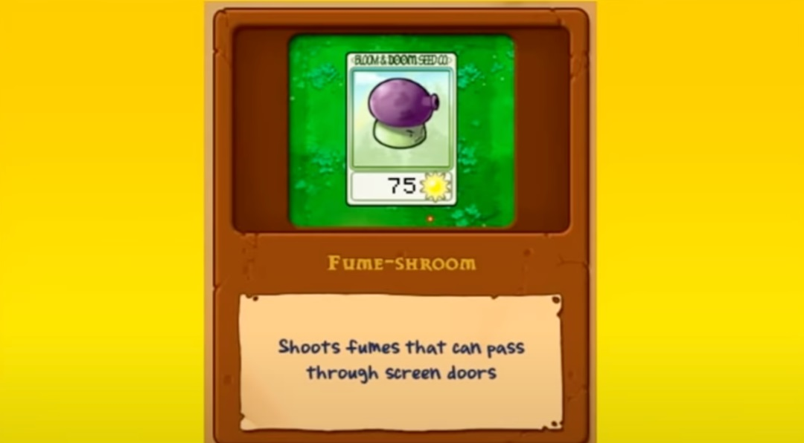

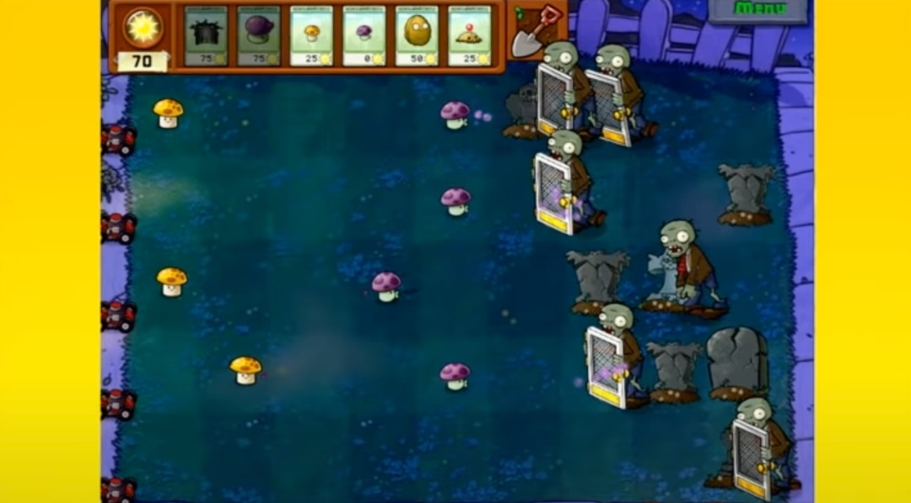

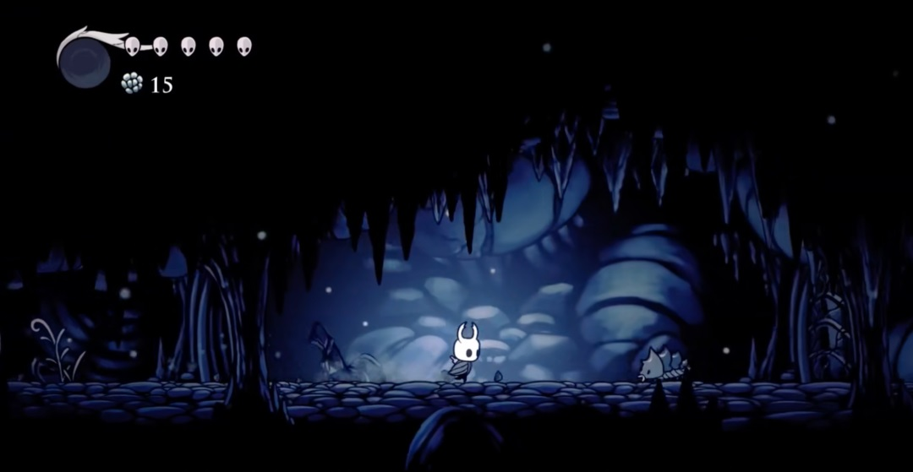

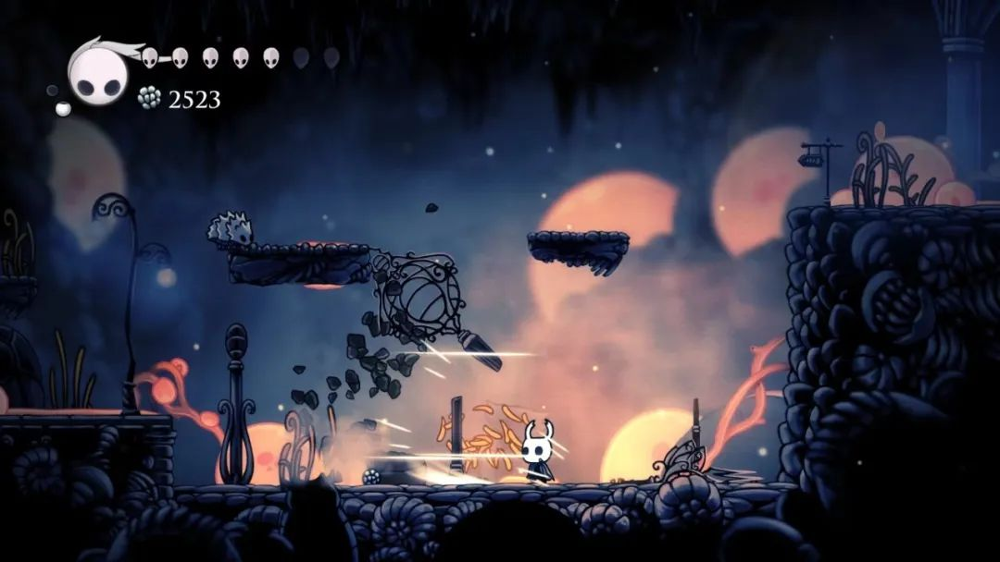

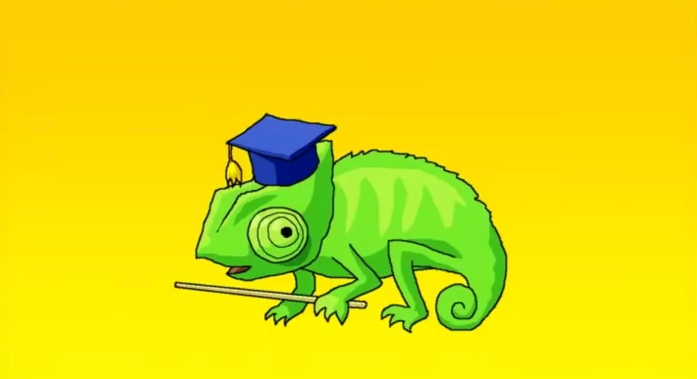

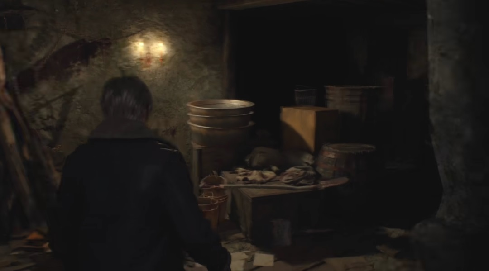

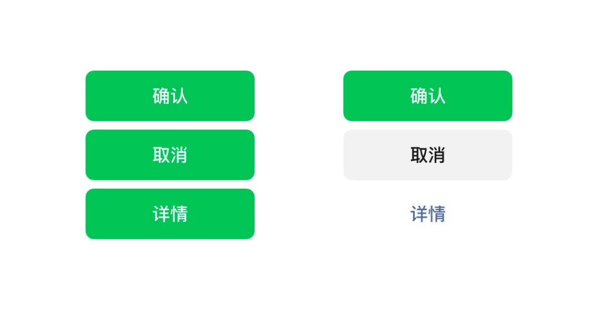

