# 资深交互设计师是如何出稿的？来看实战案例分析！

> 原文链接：https://www.uisdc.com/interaction-design-analysis
> 作者/团队：小发的设计笔记
> 日期：2022/10/29
> 标签：未提供
> 本地归档说明：为尊重原站版权，此文件不逐字转载全文；保留原文链接、图片引用、筛选理由和关键内容线索，方法沉淀见 ux-method-library。

## 筛选理由

交互出稿案例分析，适合沉淀交互稿如何表达逻辑、状态和规则。

## 关键内容线索

1. 平时做界面的时候只能说是在画图，很少会更深层次的思考！
2. 本文总结了4个引导设计的技巧和3个业务的理解。
3. 前景提要 上个月淘宝新版本订单页的改版大家对整个改版都给与了高度赞誉，今天再次体验，发现并不是所有商品的订单页都是新版样式，想来淘宝应该也在进行测试，去验证改版的有效性。
4. ”、“这个需求很简单，类似这样画出来就行”、“只要这几个页面，下午可以给到吧”...... 每次加班爆肝出的设计稿在他人眼中不过就是拼一拼，似乎对于交互设计师而言，不用完善边界场景，输出交互稿好像是放个屁一样容易。
5. 虽然从表现层来看，交互设计师产出的内容除去流程的设计，剩下的就是一页页可能没有特别好看的黑白稿了。
6. 今天就来来聊下，我在画设计稿的时候会去思考什么问题，大家看到内容后也可以说说自己画稿的时候会思考什么，多讨论多交流~ 一、有意识的注重引导设计 交互从本身的名称而言，就是用户与产品的互动，只不过我们日常更多的是放在手机、电脑、iPad 这块屏幕上进行，但是其本质就是人和某个东西的行为互动，人产生行为进行输入，机器根据人的行为做出反应而已，就是这是一个双向的过程，所以这其中便涉及到一个如何让人产生行为进行互动，以及用什么样的方式来互动的问题。
7. 所以我们在出设计稿的时候需要注重引导的设计。
8. 这里的引导设计不是指我们日常看到最多的新手引导，而是通过我们在页面上信息、结构、排布、视觉重点及动画等设计从而对用户进行引导。
9. 不知道你发现没有，微信上其实很少有新手引导的设计，据说是张小龙觉得需要新手引导的设计就没做好设计。
10. 接下来我们就从行为引导设计的角度来聊聊应该怎么做。

## 原文图片

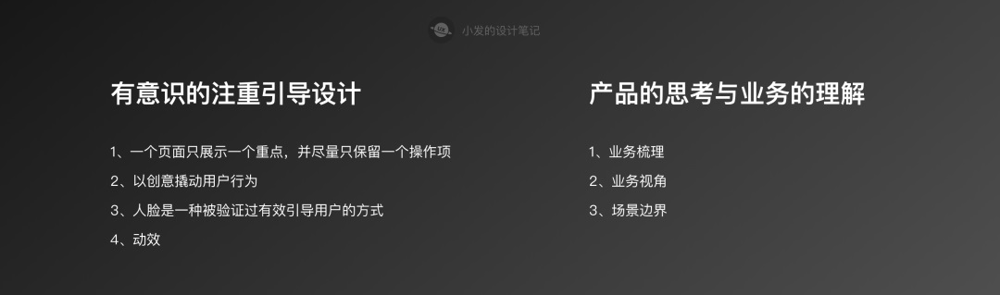

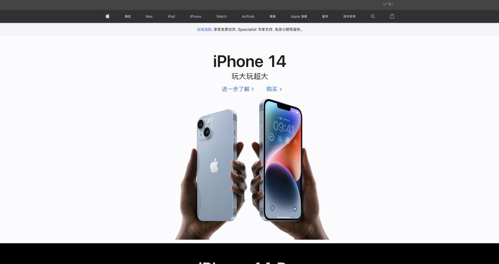

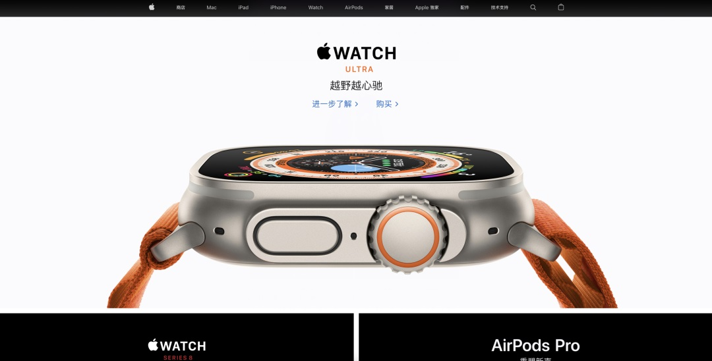

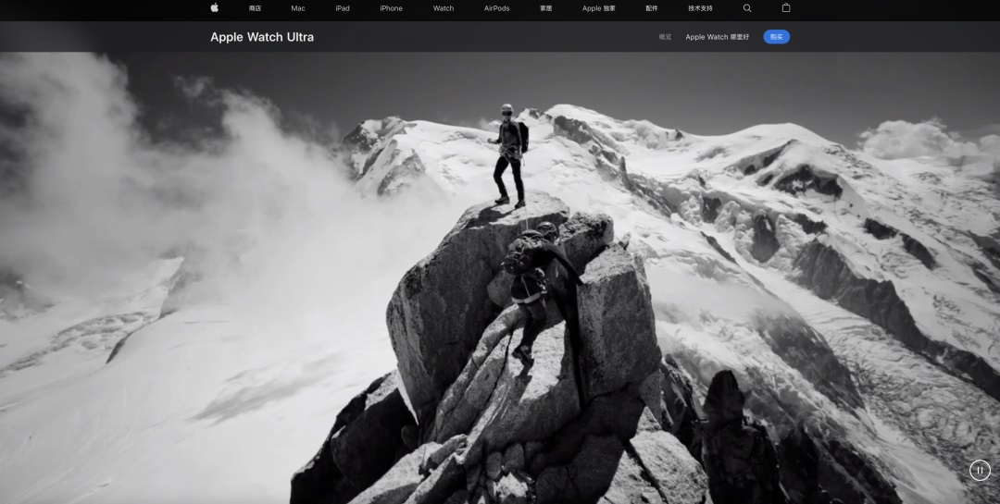

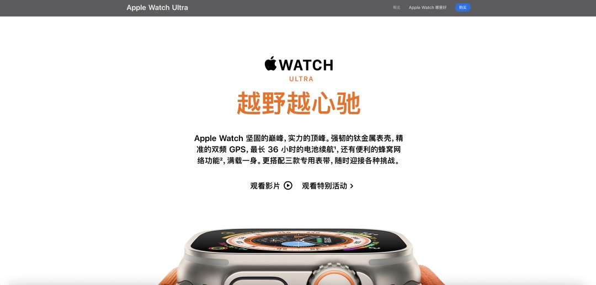

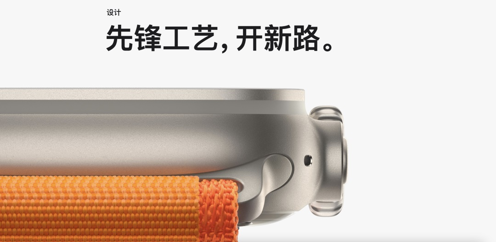

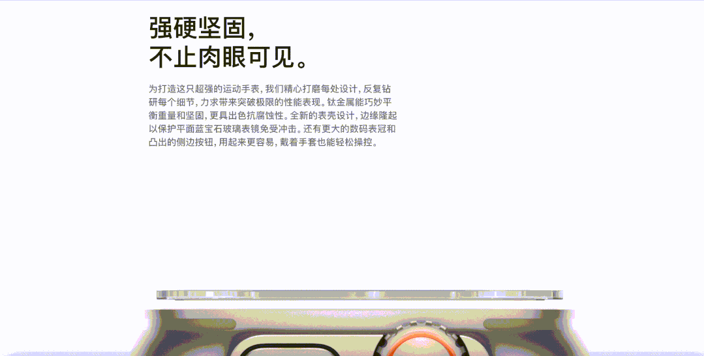

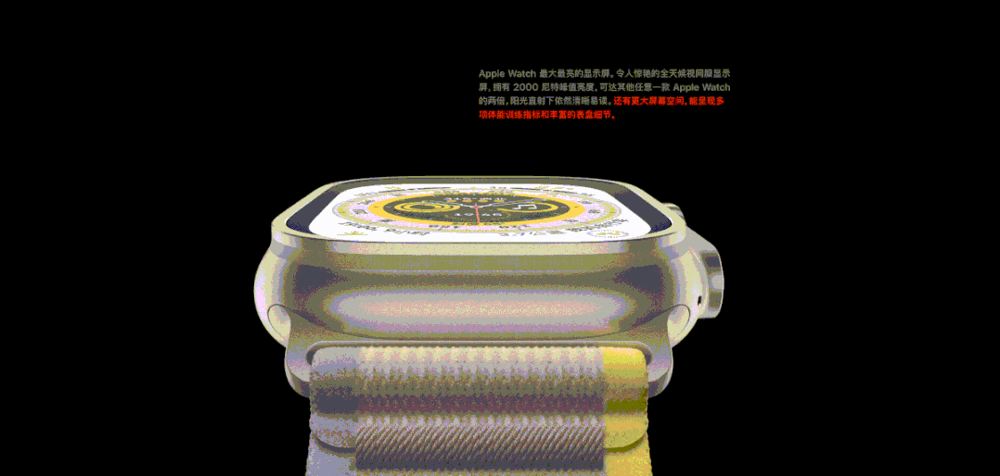

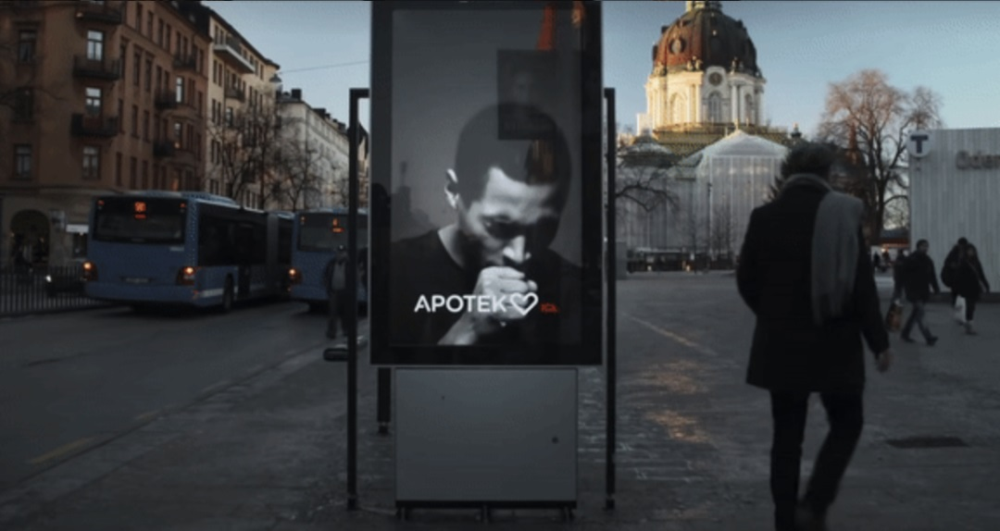

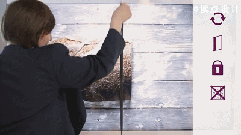

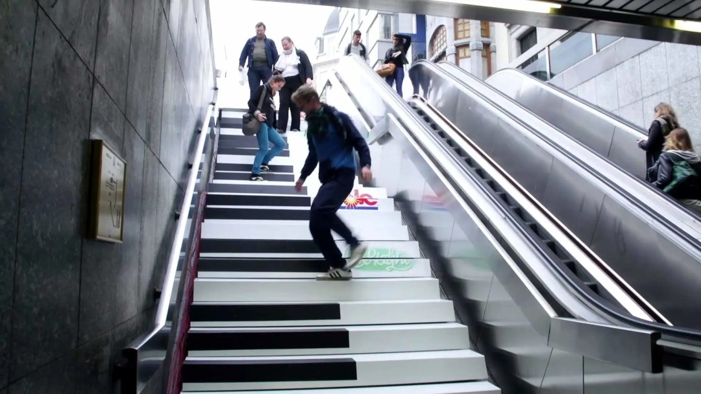

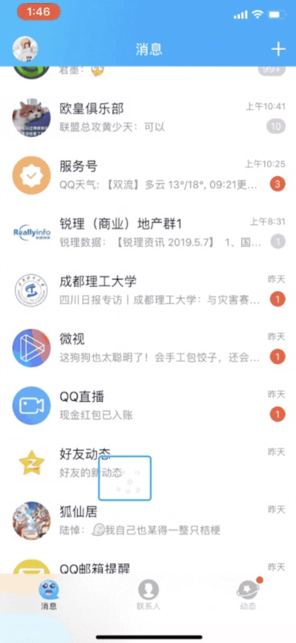

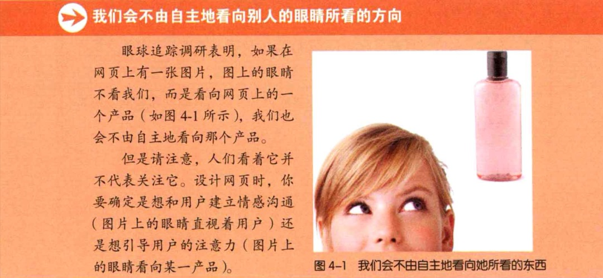

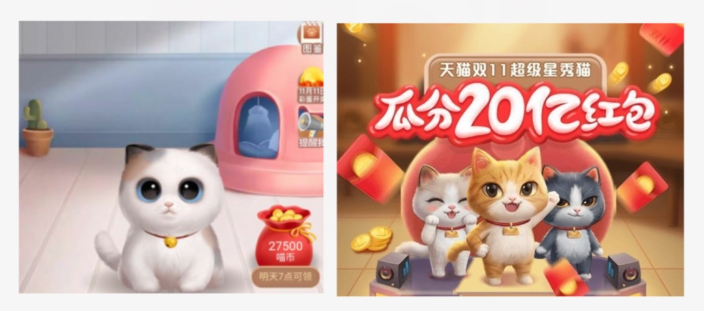

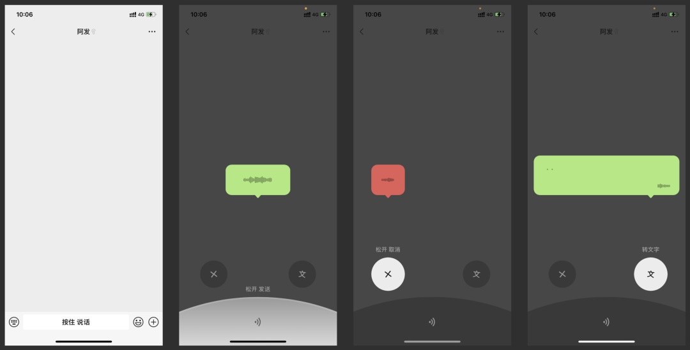

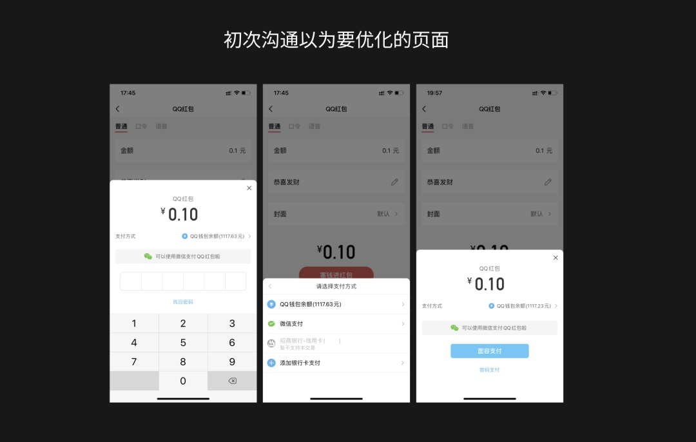

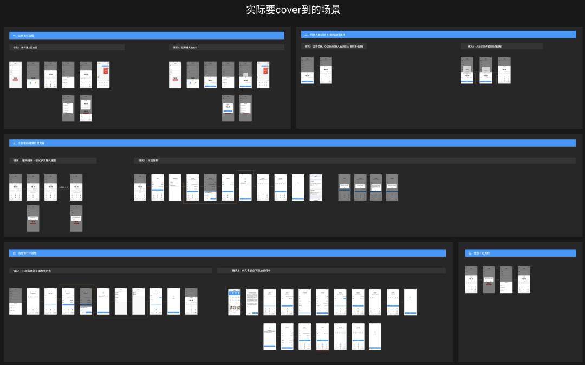

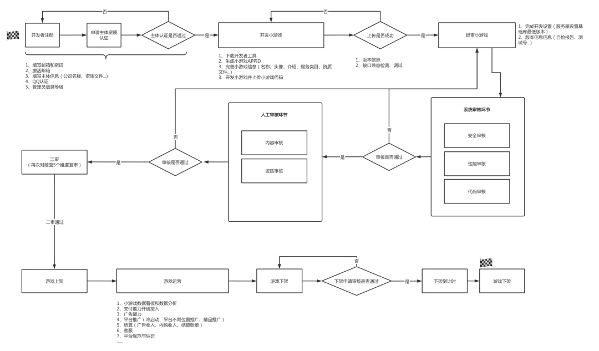

