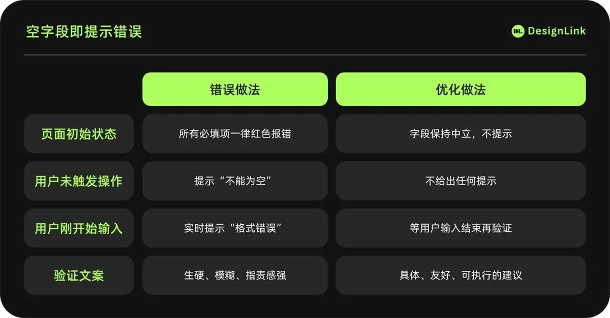

# 超全总结！4个章节教你避免实时表单验证的失败案例

> 原文链接：https://www.uisdc.com/form-design-11
> 作者/团队：DesignLink
> 日期：2025/08/18
> 标签：未提供
> 本地归档说明：为尊重原站版权，此文件不逐字转载全文；保留原文链接、图片引用、筛选理由和关键内容线索，方法沉淀见 ux-method-library。

## 筛选理由

实时表单验证失败案例，适合沉淀校验时机、错误反馈和输入安全感。

## 关键内容线索

1. 页面刚加载完，你还没来得及输入半个字，一串红色错误提示就像警报器一样跳出来：此字段为必填！
2. 这种设计让用户在还未开始操作时就收到错误提示，容易产生心理错觉，觉得被质疑，进而将问题归因于系统设计不合理，产生挫败、焦虑甚至抗拒情绪。
3. 如某银行开户表单，页面刚加载就显示所有必填项的红色错误提示，导致用户首屏退出率高达 38%，平均停留时间不到 7 秒。
4. 正确的做法是初始状态不显示任何错误，只有用户点击字段或开始输入后，根据操作节奏触发反馈，并采用温和引导型的提示文案。
5. 二、提示延迟滞后 用户根据提示修改错误后，系统若不及时取消错误提示，会给用户带来焦虑和困惑，让用户怀疑自己是否理解错了规则或遗漏了其他问题。
6. 如某 App 注册流程中，用户修正邮箱格式后，红色提示仍不消失，导致用户反复修改，操作时长远超平均。
7. 这时候的用户内心戏是这样的：“我刚刚不是按你说的改了嘛？
8. ” 系统什么都不说，用户脑内的问号却一串接一串。
9. 你可以想象成这样一个场景：你考试写完一道题，满怀期待地看着老师，结果老师眉头一皱，站你旁边沉默半天。
10. 系统如果不给用户明确反馈，用户就会陷入类似的“反馈真空区”——不是不知道怎么做，而是不知道做得对不对，这时候的焦虑，比犯错还难受。

## 原文图片

