# 超多案例！常见的B端弹窗样式设计总结

> 原文链接：https://www.uisdc.com/b-end-popup-window
> 作者/团队：西城门AIGC
> 日期：2024/04/03
> 标签：未提供
> 本地归档说明：为尊重原站版权，此文件不逐字转载全文；保留原文链接、图片引用、筛选理由和关键内容线索，方法沉淀见 ux-method-library。

## 筛选理由

弹窗样式总结，适合沉淀弹窗类型、风险等级和确认/取消结构。

## 关键内容线索

1. 今天主要聊一下 B 端产品设计中弹窗的设计。
2. APP 弹窗设计知识点全面总结这几天整理总结了弹窗设计的一些小知识，和大家分享一下，希望能对你有帮助！
3. 是系统与用户之间建立联系非常重要的组成部分。
4. 它通常在用户进行特定操作或访问特定页面功能时弹出，目的是向用户展示某些信息、提供选择或执行某些操作。
5. 弹窗使用场景 需要呈现的内容篇幅相对较少。
6. 常用于针对某些内容进行补充说明、需要用户处理关键信息、重要的警告提示等。
7. 弹窗整体高度和宽度不做绝对的标准或规定，可以根据内容篇幅的多少和视觉的平衡度来确定，整体规范保持一致即可。
8. 一、场景简单 场景简单包括：全局提示、气泡确认框、警告提示、通知提醒框，通常是操作确认和系统内部自动触发性提示时使用。
9. 1. 全局提示 以 toast 提示居多，通常在页面中间偏上的位置。
10. 2. 气泡提示 用于解释难理解的功能名词或者由于版面限制文字展示不完，利用气泡来展示。

## 原文图片

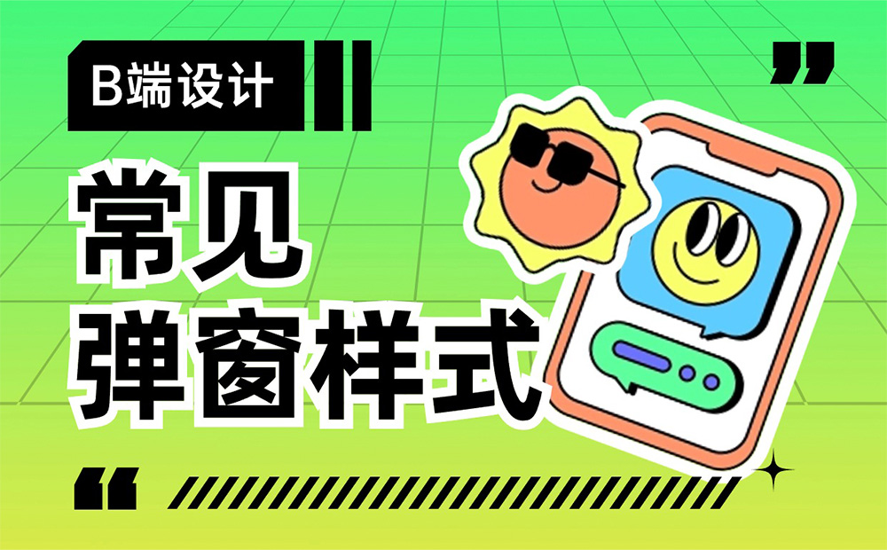

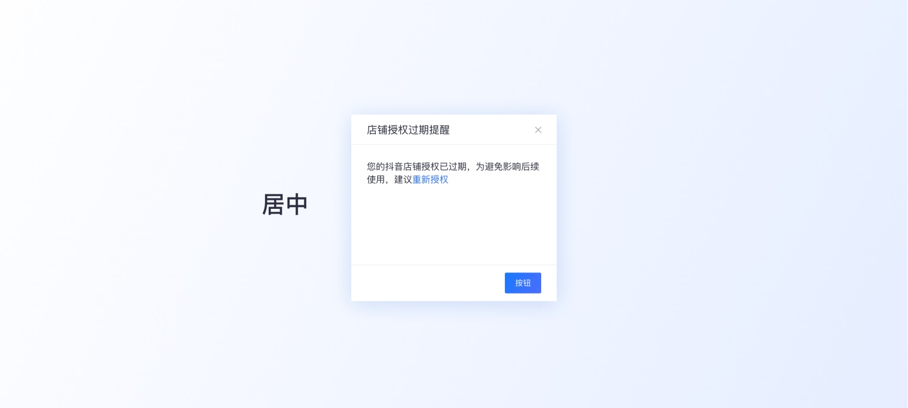

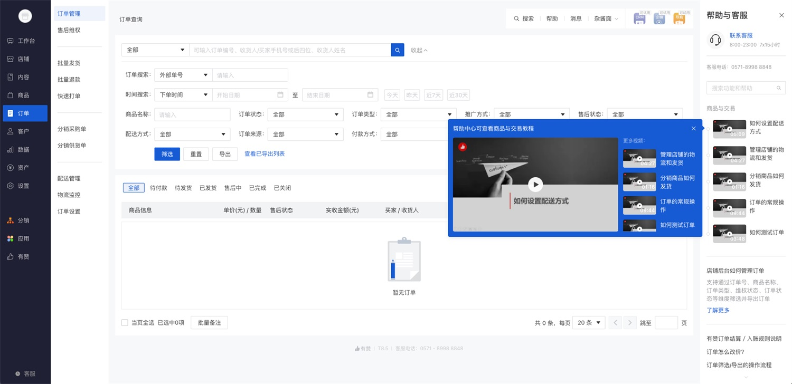

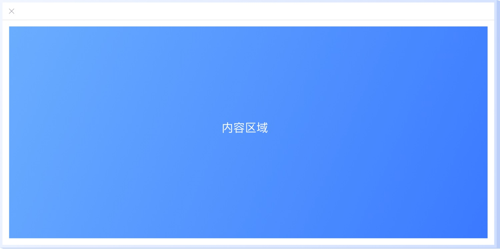

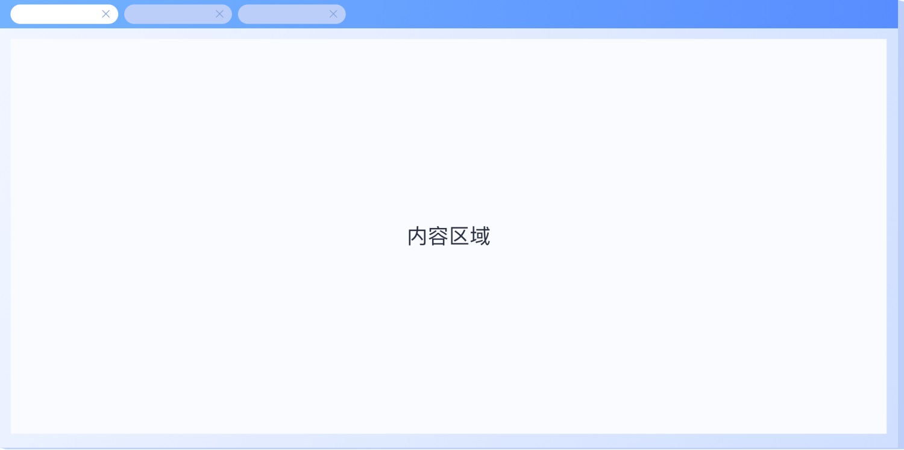

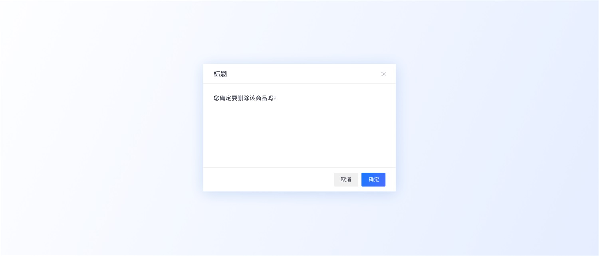

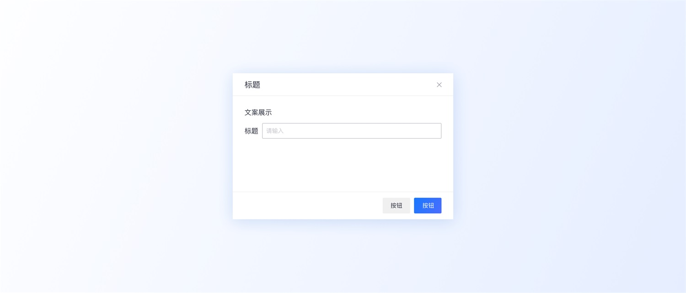

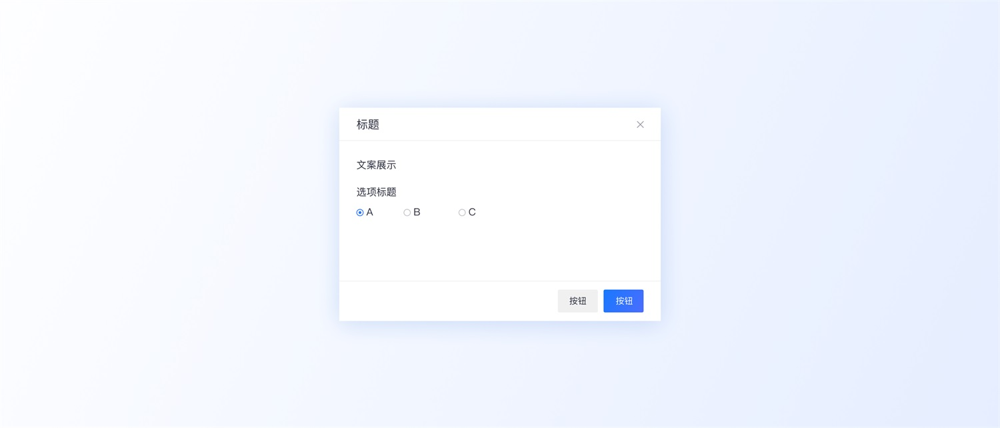

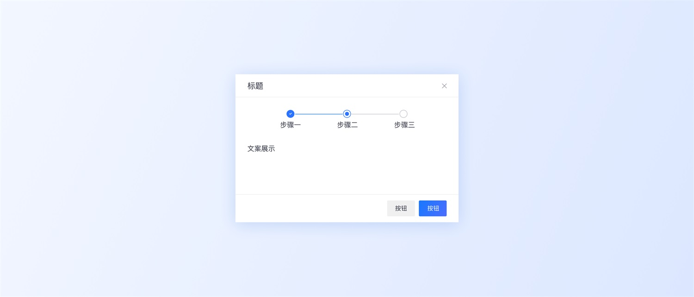

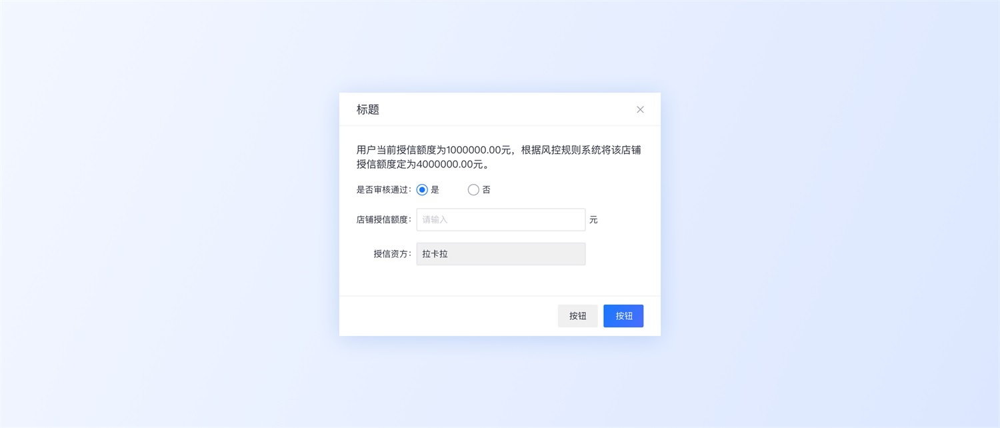

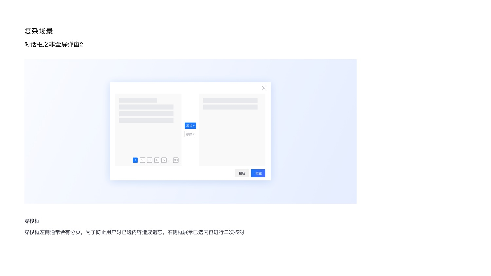

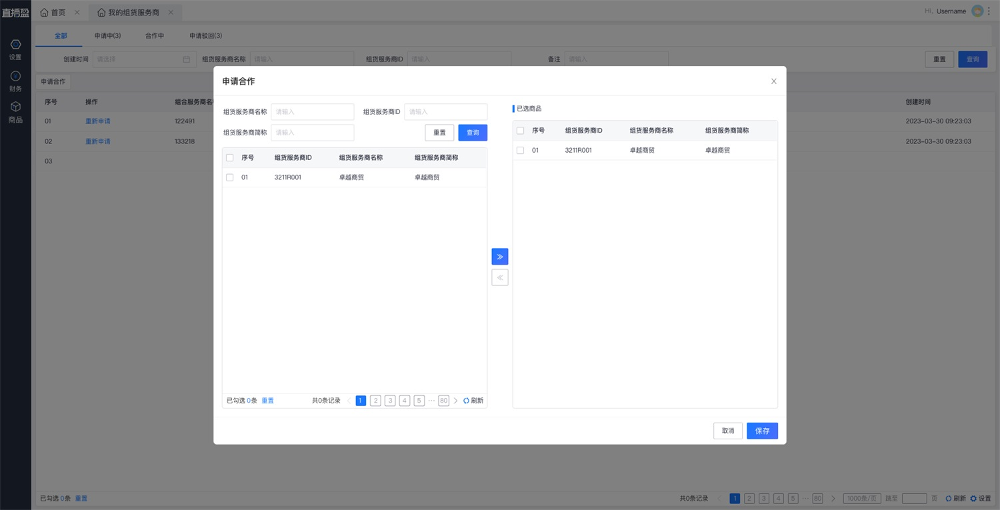

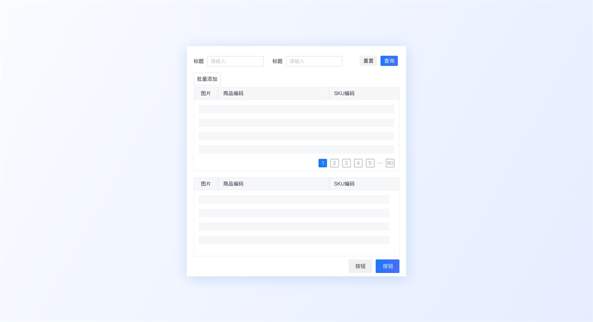

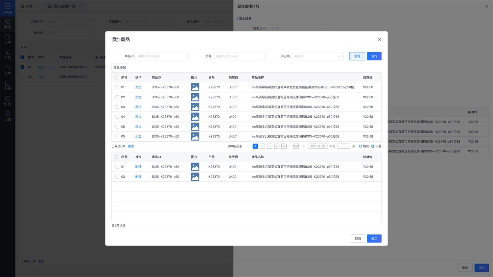

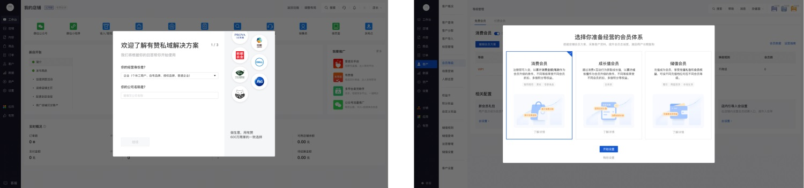

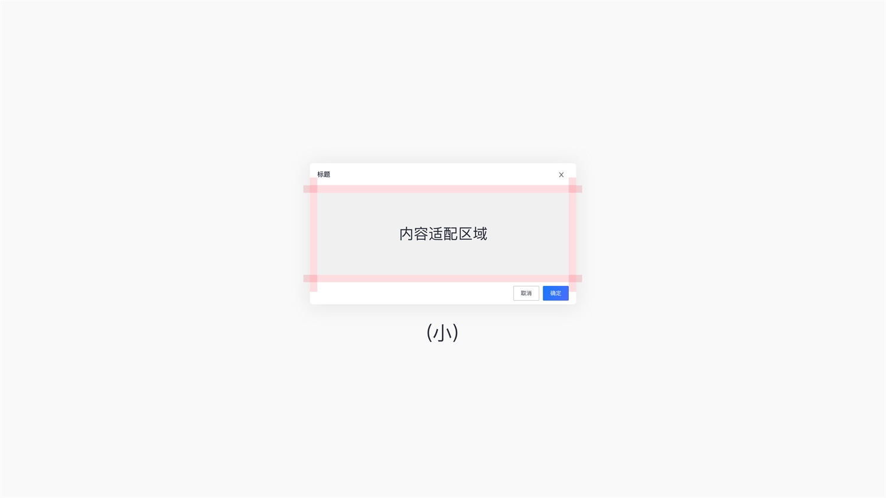

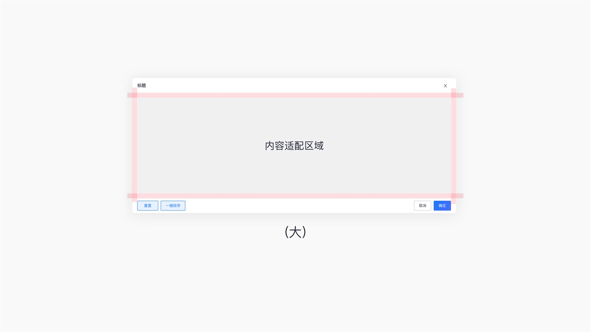

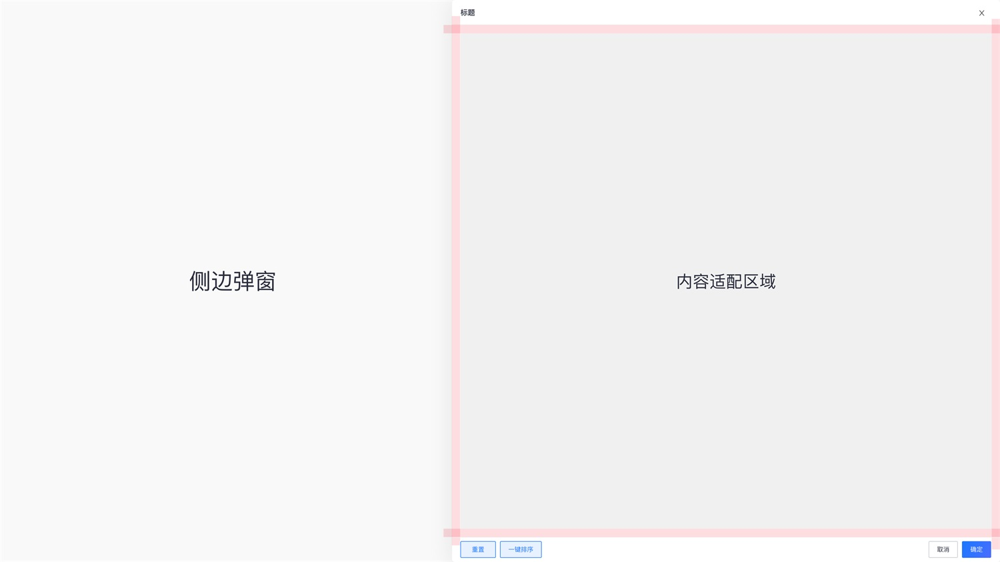

