# 这套规范超好用！交互说明文档格式优化实战案例

> 原文链接：https://www.uisdc.com/interactive-description-format-document
> 作者/团队：未提供
> 日期：2021/06/02
> 标签：未提供
> 本地归档说明：为尊重原站版权，此文件不逐字转载全文；保留原文链接、图片引用、筛选理由和关键内容线索，方法沉淀见 ux-method-library。

## 筛选理由

交互说明文档格式优化，适合沉淀交付文档结构和开发协作表达。

## 关键内容线索

1. 之前经历了一次不能拆分的复杂功能改版，从产品设计到开发上线全面翻车，苹果市场卡了 1 个月才通过审核。
2. 项目结束之后团队坐在一起复盘，除了协作流程的问题，也有交互说明文档在复杂项目中写得不够清晰的原因。
3. 基于此，我重新制定了新的交互说明文档格式，目前在团队内使用正常，在此分享给各位读者。
4. 界面和交互说明左右布局 以前我们界面和说明摆放位置是参考的大厂的文档，上方为界面，下方为对应的说明。
5. 开发测试同事和我们反馈，因为每个页面的界面都是左右摆放，所以他们习惯用横向滚动条查看同页面屏幕外的内容，根本不会注意竖向滚动条，放在界面下方的说明如果超出屏幕高度根本注意不到。
6. 由于前端/客户端开发同事习惯了 zeplin 等切图标注软件左界面右边对应参数的布局，希望我将界面和交互说明左右布局。
7. △ UI 切图标注软件界面 另外，要在交互说明找到界面对应标记的文字很累。
8. 基于以上反馈，我将界面和交互说明改为左右布局，并将交互说明按元素拆分，界面标记和交互说明左右一一对应。
9. 更清晰的交互说明 1. 交互说明专有名词标点符号规范 交互说明里经常提到某个页面、某个按钮等元素，一旦提到的元素很多，混在说明文字里看起来就特别累。
10. 因此我参考了 @叫我 vitamin 的《产品文档中，特殊标点符号的使用建议》，对说明中提到的各种术语进行规范： 当描述的内容包含某个菜单页面的时候，建议使用「」（Mac 默认输入法中文情况下 shitf+{}可以打出这个符号，第三方输入法设置下也可以打出来）或者“”，后面增加名词修饰。

## 原文图片

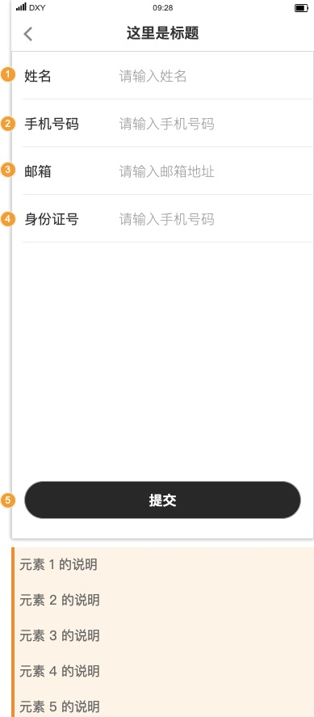

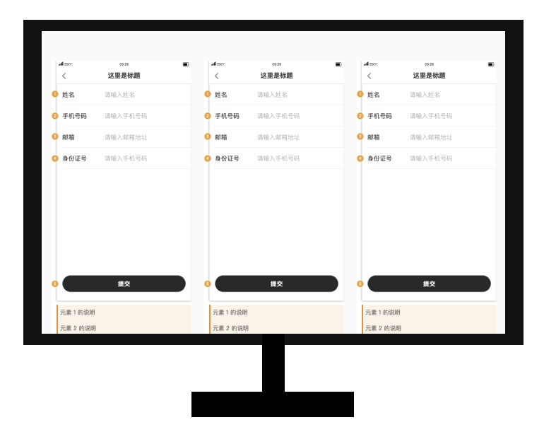

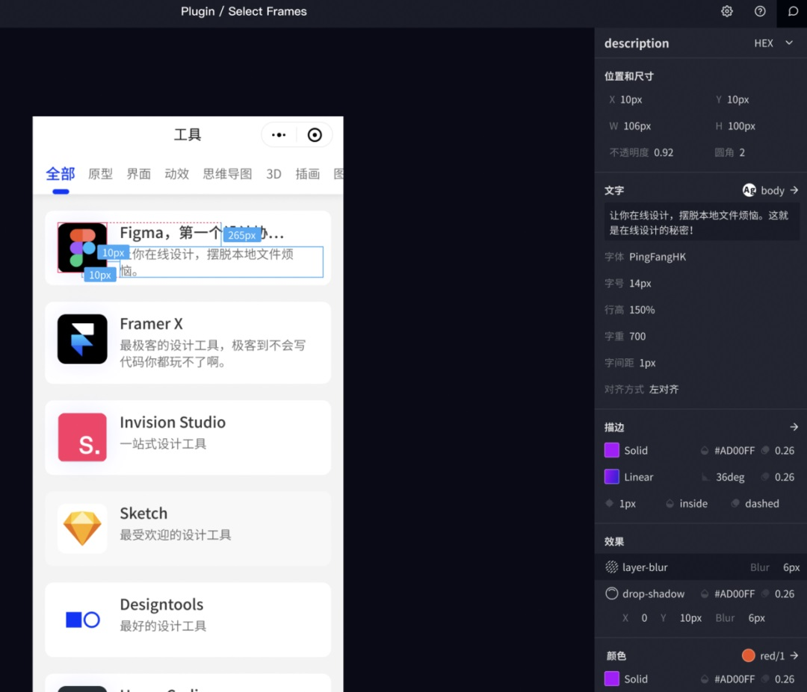

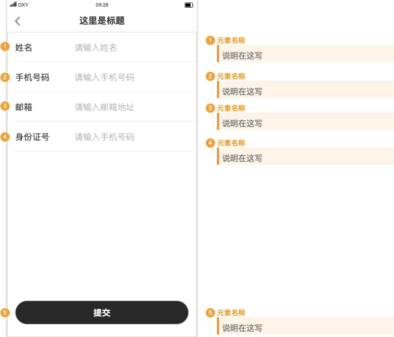

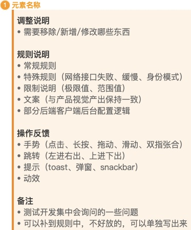

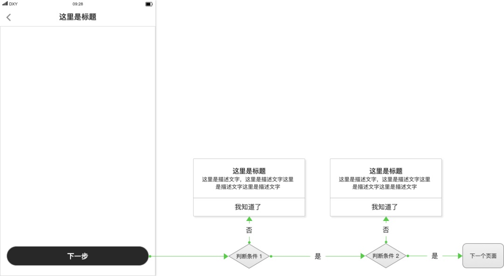

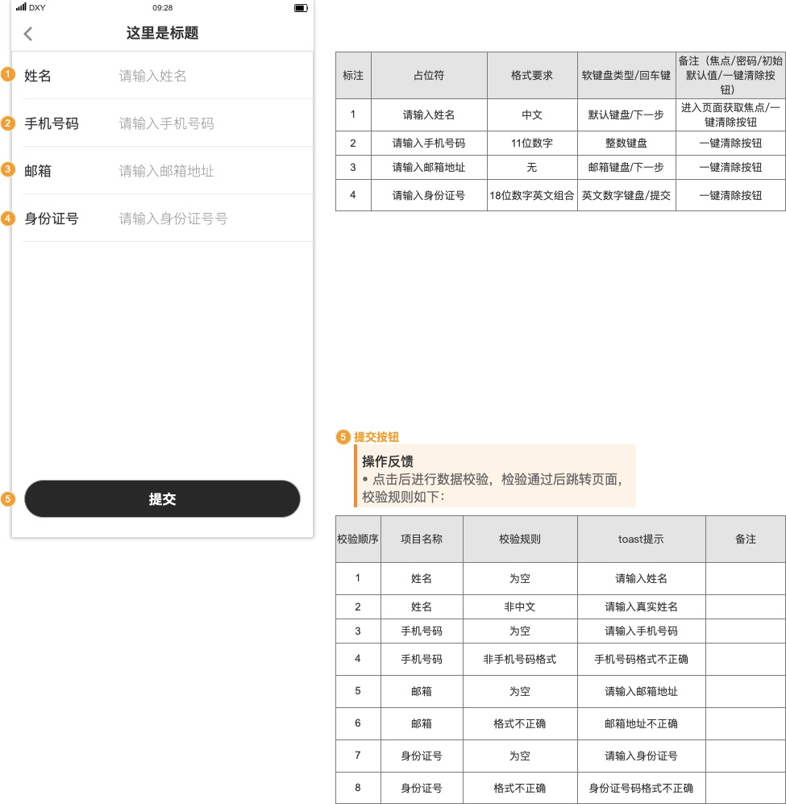

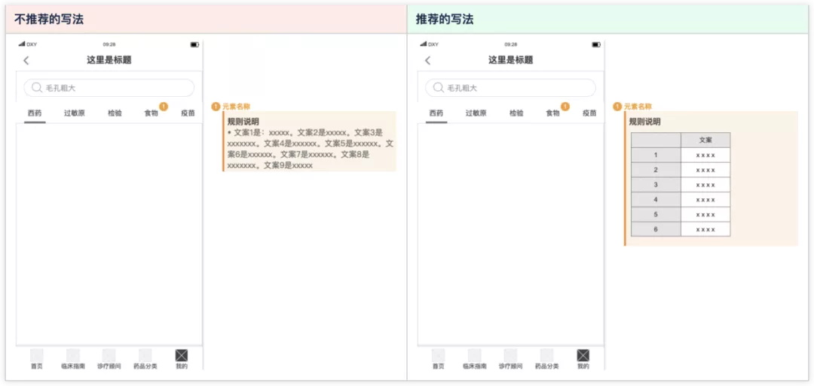

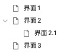

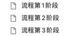

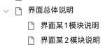

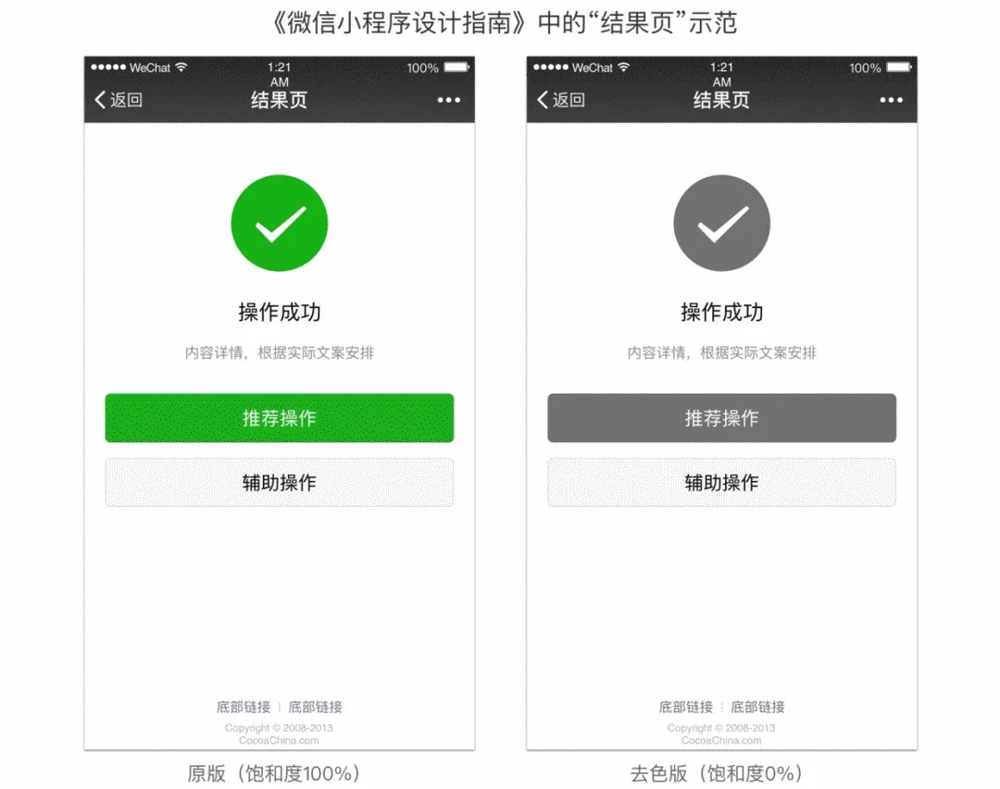

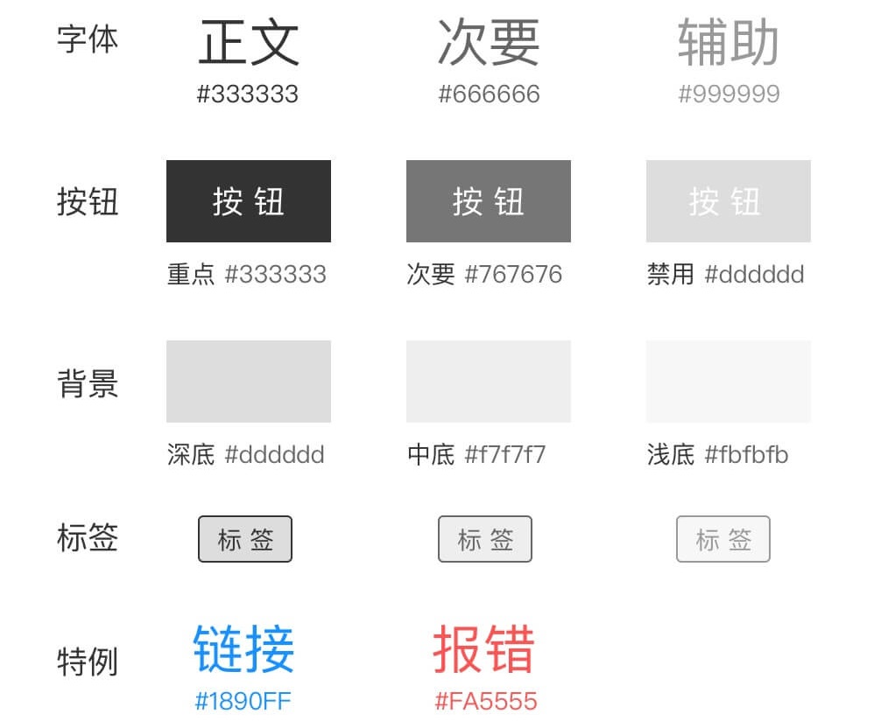

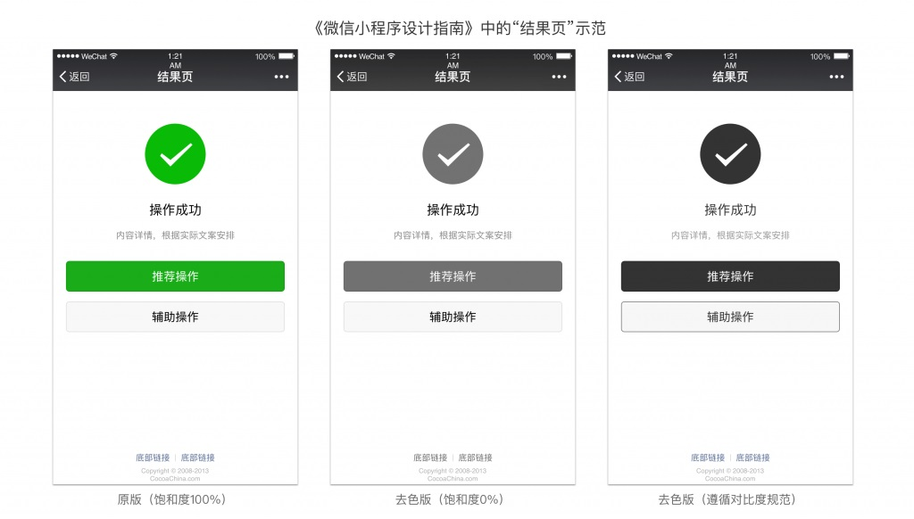

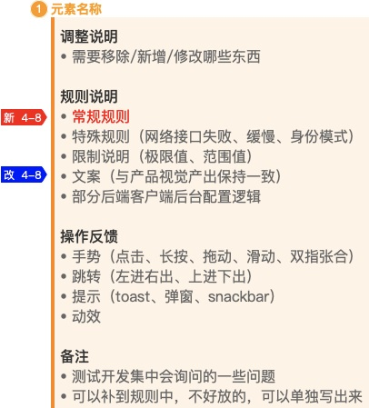

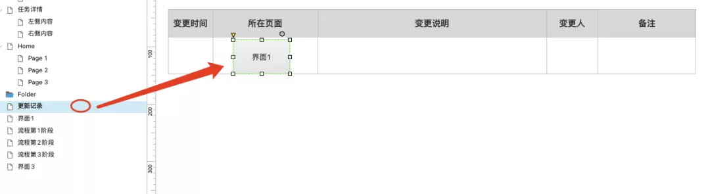

